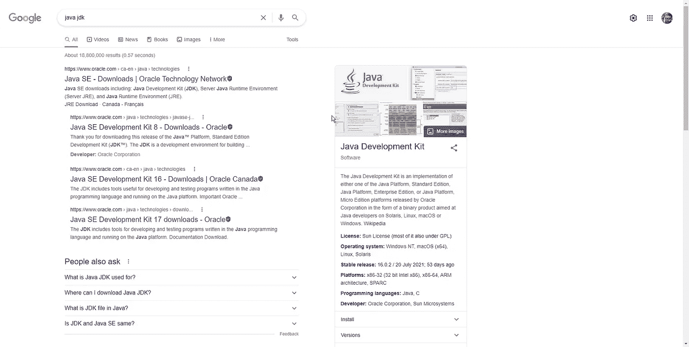
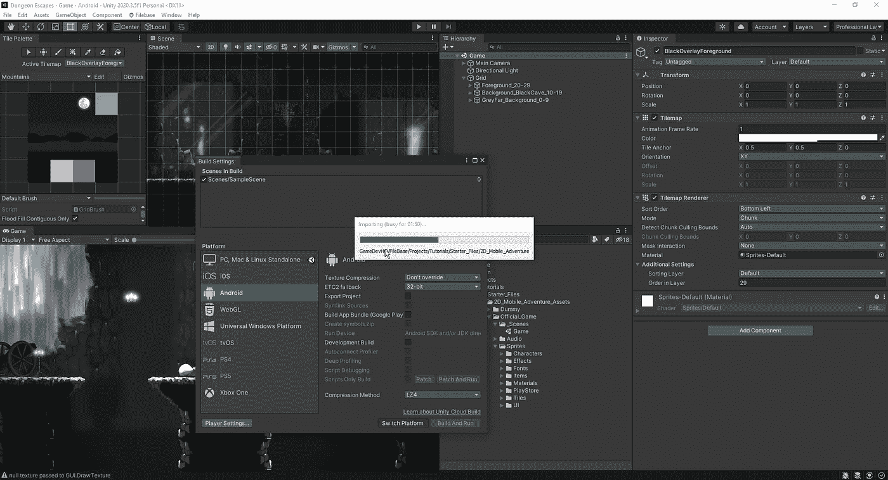
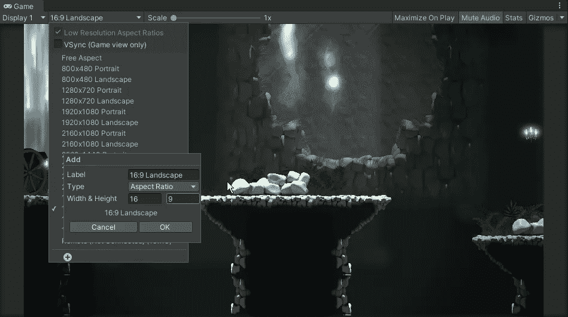
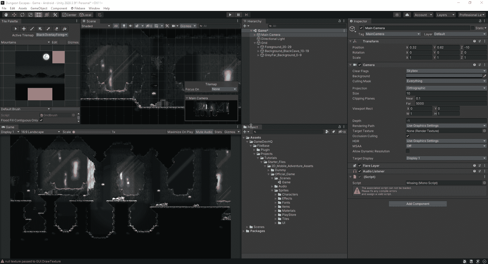
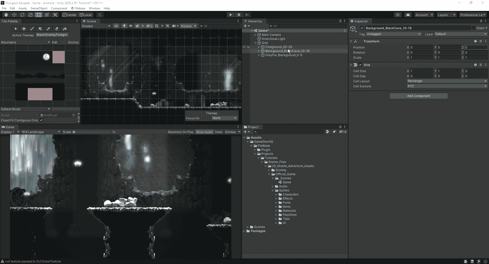
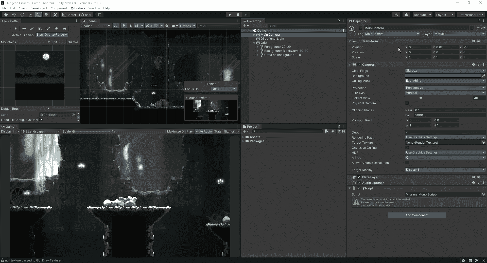

# 准备好我们的游戏 Android 和视角调整

> 原文：<https://medium.com/nerd-for-tech/getting-our-game-android-ready-perspective-adjustments-5774ec3327f8?source=collection_archive---------8----------------------->

在我们继续深入之前，让我们快速看一下我们将如何准备好我们的游戏 Android。首先，我们希望确保我们的系统上安装了 Java JDK，这样我们就能够为 Android 设备进行构建。只需去谷歌搜索一下:

从这里开始，我们将简单地为您正在使用的设备安装 JDK，然后返回 unity。从那里，我们将进入我们的构建设置，并切换到 Android 平台:

一旦这个过程完成了，下一步就是将我们的游戏纵横比更改为 16:9 的固定分辨率:

这个比率也是 4:3 的比率，并且是 HD 最常用的比率。它兼容所有高清显示器和移动设备。

接下来，我们要做的是在游戏中创建一个视差视角。首先，我们将更改摄像机的投影功能:

随着这一变化，它让我们更近距离地观察游戏，让玩家看到更多的细节，但我们仍然可以做一些调整，让它看起来更好:

正如我们在上面看到的，只要对我们的图层深度做一些快速的调整，就能让我们的游戏看起来有深度，尽管它仍然在一个平面上。现在我们已经为 android 设置好了，并快速建立了我们的视角，我们现在可以看看游戏的下一部分了。