# 拿到我们的执照

> 原文：<https://medium.com/nerd-for-tech/getting-our-license-33379d0a49d3?source=collection_archive---------5----------------------->

## 设置与 GitHub 动作的持续集成—第 2 部分

上次，我们看了什么是持续集成和持续交付，为我们的项目选择工具所涉及的一些因素，以及对 GitHub Actions 的简要介绍，GitHub Actions 是我们决定使用的工具链。今天，我们将详细介绍在 GitHub 中设置 CI/CD 管道的 CI 部分的过程。

## 设置工作流

昨天，我们通过陈述“**工作流**包含**作业**来定义**工作流**，作业包含**步骤**，这些步骤是要在虚拟化环境上运行的动作列表，为我们提供功能。”

1.  创造。项目根目录下的 github 文件夹(“.”)文件夹名称的开头很重要)
2.  在中创建一个名为 workflows 的文件夹。github 文件夹(在这里命名也很重要，因为这是 GitHub 查找文件夹的方式)
3.  在我们的文件夹 activation.yml 和 main.yml 中创建 2 个文件。这些文件将包含我们创建 Unity 许可证激活请求的工作流以及我们的主 CI/CD 工作流。

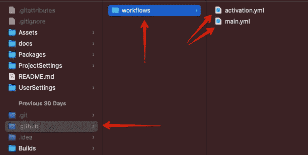

使用 GitHub 操作设置工作流程的文件和文件夹

## 工作流文件的剖析

我们的工作流程文件是在 YAML 写的。需要注意的是，制表符和空格在 YAML 中非常重要，如果使用不当，会导致结构无效。让我们快速浏览一下我们需要的结构的基本部分。

## 名字

这是工作流的名称，当工作流运行时，它将显示在 GitHub 界面中，我们正在查看进度。

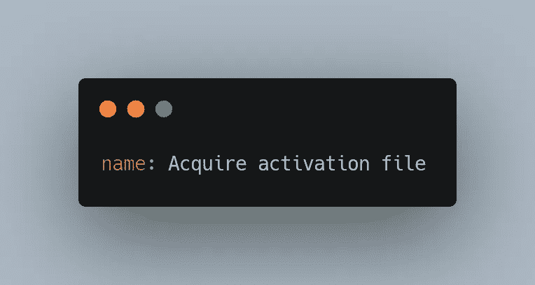

名称属性

## 在

关键字上的**是我们设置事件触发器的地方，这些触发器将导致这个工作流运行。通常我们会将工作流设置为对特定分支的推或拉请求运行，如下所示**

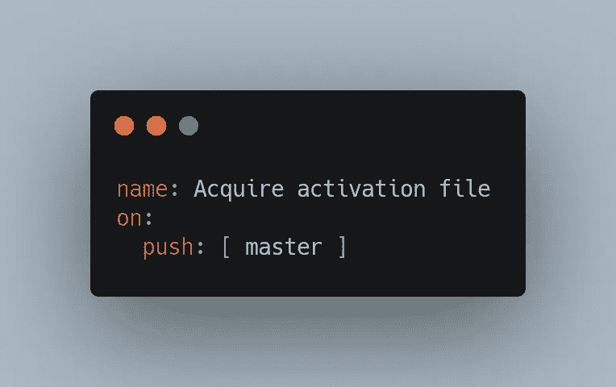

关于财产

## 工作

**jobs** 关键字表示作业列表的开始，每个作业都运行在它们自己的虚拟化环境副本上，并且通常并行运行(除非指定了依赖关系)。每个作业都有一个**标识符**(在我们的例子中，sample-job 是标识符)，您还可以指定一个**名称**(它在 GitHub 中显示为界面的一部分，就像上面的工作流名称一样)，以及一个**run-on**标识符，它允许我们指定我们希望在什么平台或映像上构建我们的虚拟化环境。这方面的一些选项是 mac-latest、windows-latest 和 ubuntu-latest，尽管这肯定不是一个详尽的列表。

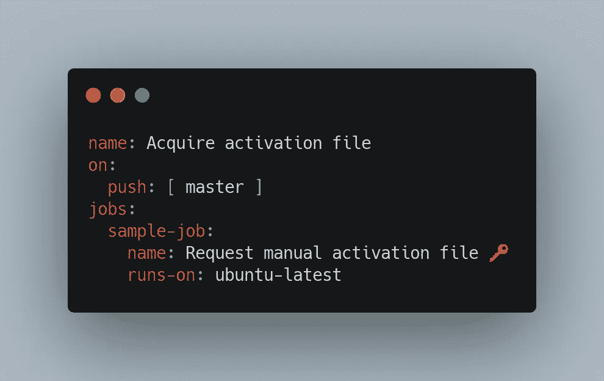

作业属性

## 步伐

作为**作业**定义的一部分，**步骤**关键字定义了大部分动作发生的起点。这是在作业运行期间执行的操作列表，包含获取最新版本的代码、构建代码和上传结果等操作。每个步骤都可以有一个名称，如**作业**和**工作流**部分。它们还可以包含一个 **id** 属性，用于步骤之间的引用，如果您正在使用 github 提供的动作之一或另一个存储库的动作，那么 **uses** 关键字会提供另一个动作文件的名称，我们将两者都使用。最后，使用键的**开始输入一个参数列表，该列表将被传递到**使用**部分指定的函数中。**

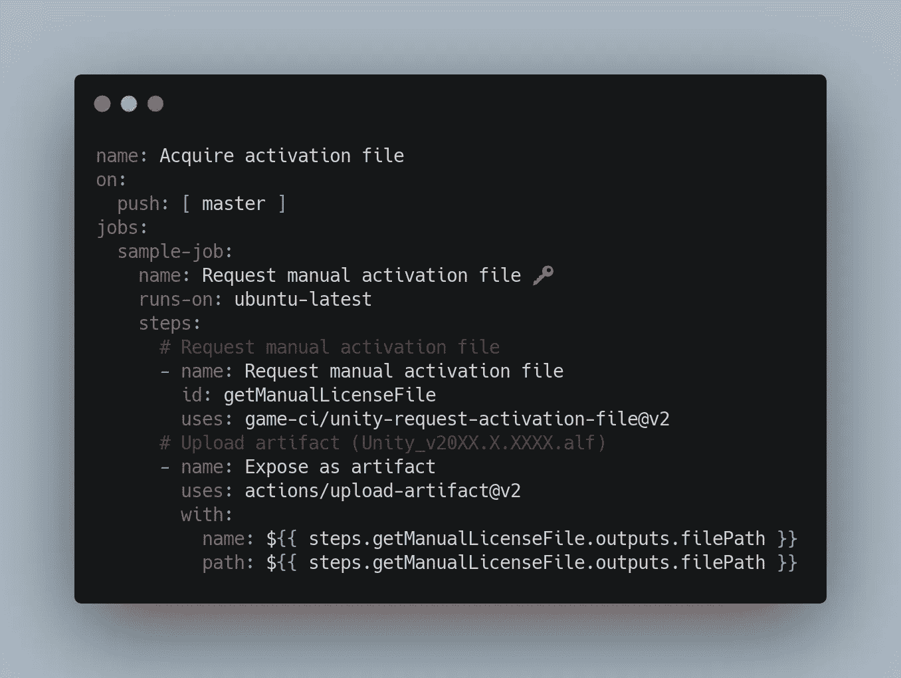

步骤属性

## 使用签出功能签出您的存储库。

我们将在工作流中使用的最常见的操作之一是将我们的存储库的副本签出到虚拟化环境中，以便我们可以像执行构建一样对其执行操作。

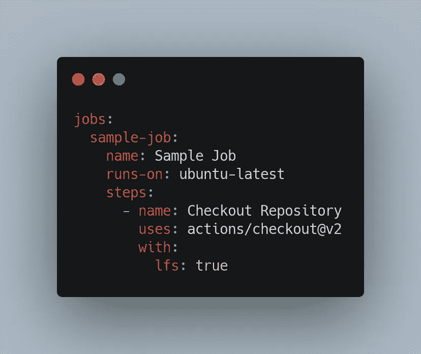

结帐动作

## 贮藏

另一个非常常见的操作，特别是对我们来说，因为我们正在进行 Unity 构建，就是缓存一些文件，以便在一个作业的多次运行中使用。在我们的例子中，我们希望缓存 Unity 中的库文件夹，因为它可能非常大，并且通常在运行中是相同的。这可以而且将会提高效率，减少后续作业运行所需的运行时间。

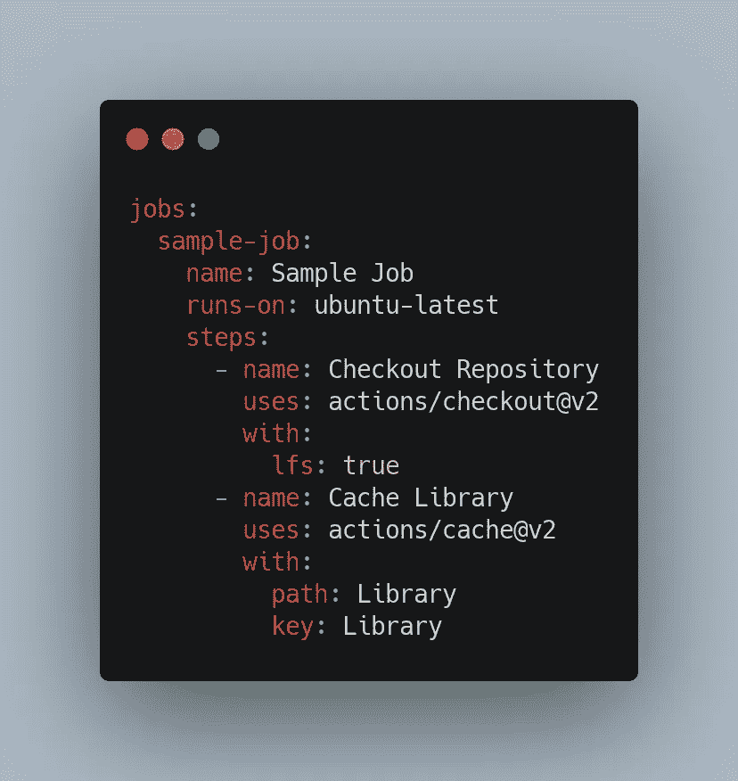

具有缓存操作的签出操作

## 激活 Unity 的个人许可证

Unity 提供两种类型的许可证，个人版和专业版，申请许可证文件以便在我们将要使用的虚拟机上使用的过程对于每一种都略有不同。我使用 Unity 的免费版本和个人许可证，所以这就是我们将在本文中介绍的过程。如果你想了解更多关于如何用职业执照做到这一点，请参阅关于[游戏的优秀文档。CI](https://game.ci/docs/github/activation#professional-license) 的网站。使用游戏构建 Unity 项目的虚拟机。CI 的 GitHub 操作安装了一个 Unity 版本，它需要许可证文件才能运行，所有 GitHub VM 发出相同的 HardwareId，就 Unity 的许可而言，本质上使它们成为同一台机器。

让我们打开在工作流文件夹中创建的 activate.yml 文件，并添加以下内容。

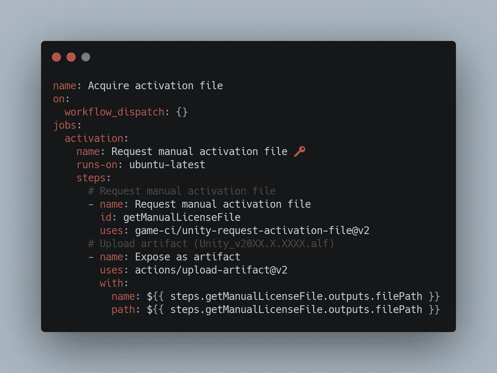

激活工作流

这个文件有一些需要注意的地方。首先， **on** 步骤中的 workflow_displatch 设置允许我们从 GitHub 界面手动触发工作流。其次，我们正在上传由[游戏提供的*游戏-ci/unity-request-activation-file @ v2*动作执行产生的文件。CI](https://game.ci) 作为工作中的工件，以便我们可以访问和下载它们用于下一步(这是手动的)。

现在，我们签入我们的更改，并将它们推送到服务器。

## 手动运行激活工作流

既然我们已经在 GitHub 存储库中建立了激活工作流文件，我们需要手动运行它。这个步骤对于每个存储库只需要一次，所以我们没有将它设置为在每次签入时运行。

**需要注意的是，GitHub 只在默认分支(对我来说是 Master)上的文件的 Actions 选项卡中选取和显示工作流。如果你正在使用一个特性/开发/主分支和合并策略，像我一样，你必须提交 yml 文件激活，直到主文件，它才会显示在 Actions 选项卡中。在其他源代码控制平台上，情况并非如此。**

在“Actions”选项卡中访问工作流后，我们可以从屏幕左侧的列表中选择我们的工作流，然后选择屏幕右侧的“Run workflow”下拉菜单，选择我们要从中运行操作的分支，并单击“Run Workflow”按钮。

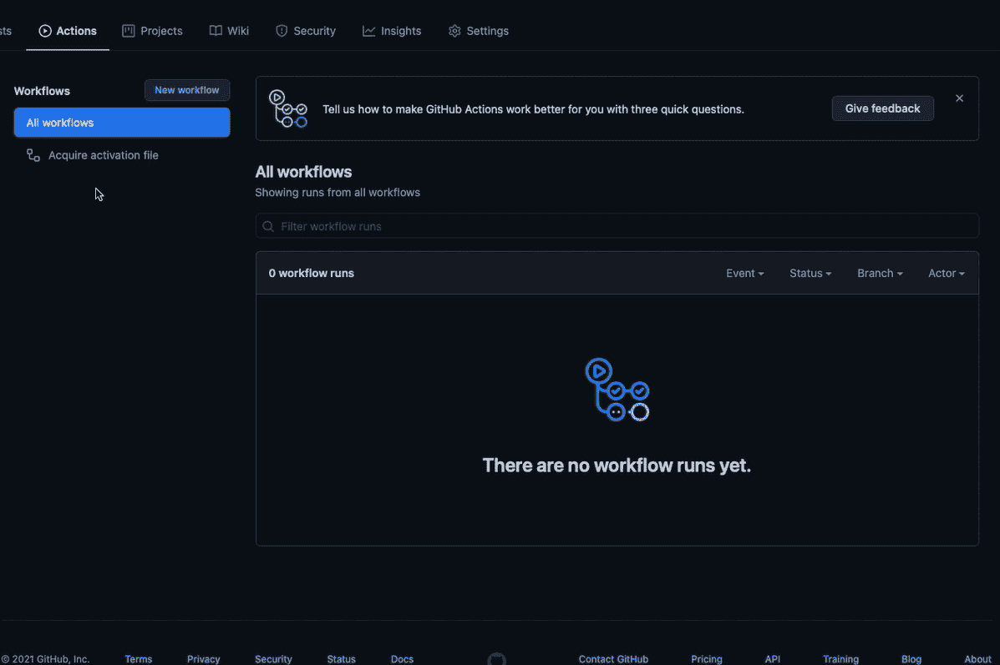

手动运行工作流

工作流运行完成后，单击工作流运行的名称以访问结果。

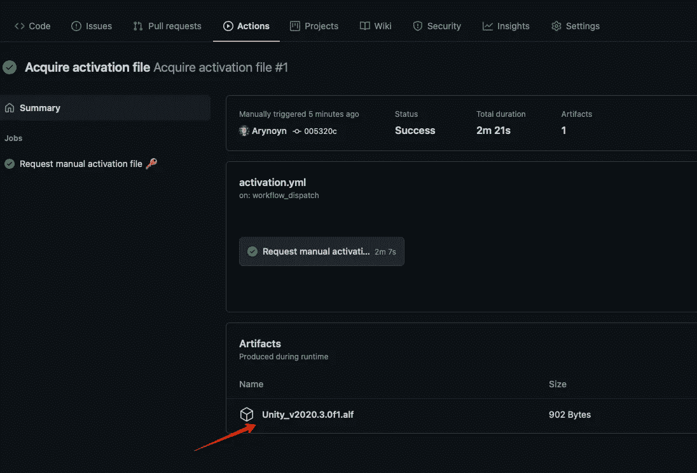

结果请求文件

我们应该有一个名为 Unity_v20XX 格式的文件。X.XXXX.alf，我们将把它上传到 Unity 网站上以请求我们的许可证文件。点击。工件部分的 alf 文件来下载它。

该流程的官方文件可在 https://game.ci/docs/github/activation[找到。](https://game.ci/docs/github/activation)

## 转换成许可证

现在我们已经有了我们的请求文件，我们可以前往[https://license.unity3d.com](https://license.unity3d.com)，点击浏览按钮并导航到我们的。alf 文件，单击上传，然后单击下一步。

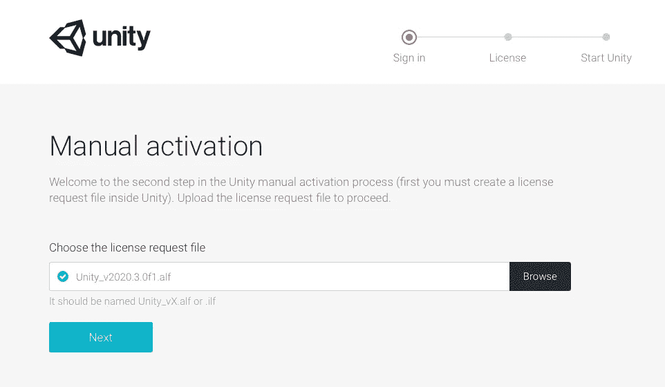

手动激活—步骤 1

在下一页选择 Unity 个人版。然后选择最适合您情况的选项。对于这个项目，我选择“我不在专业领域使用 Unity”然后单击下一步按钮。

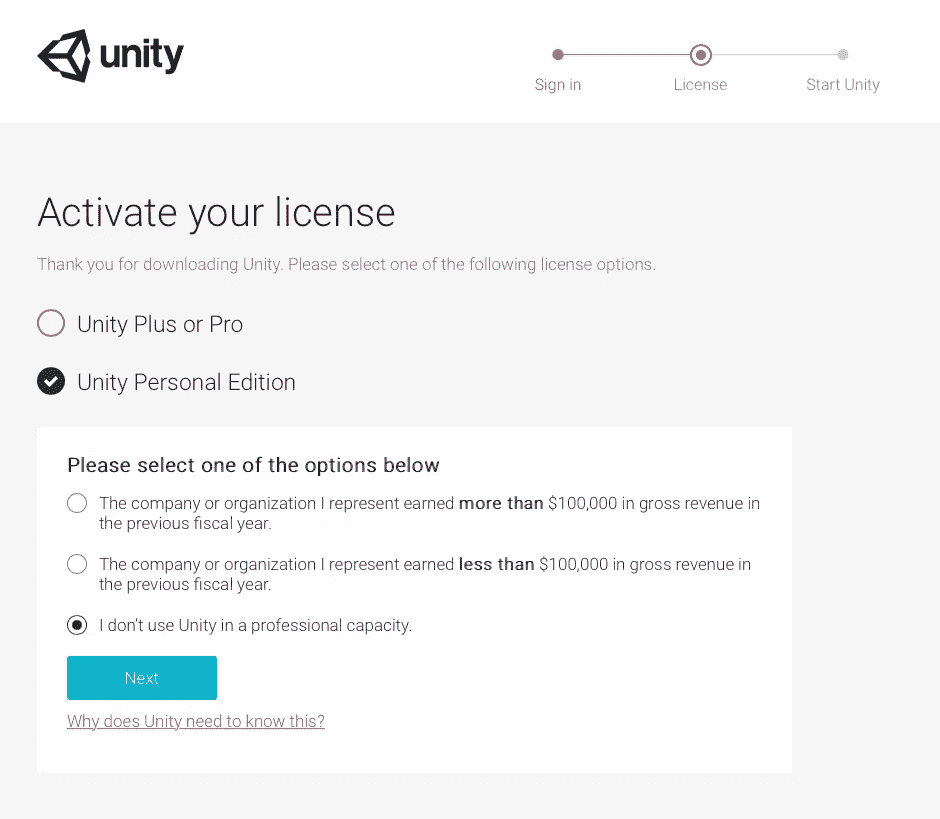

手动激活—步骤 2

单击下一页上的“下载许可证文件”按钮，接收扩展名为. ulf 的许可证文件。

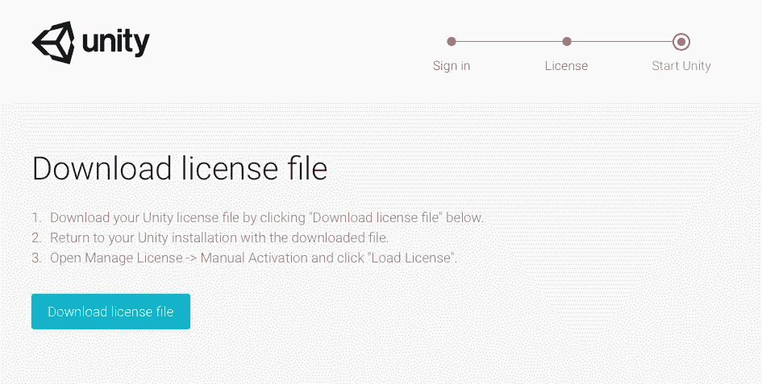

手动激活—步骤 3

## 存储我们的 Unity 许可证文件

我们不希望任何人访问我们的 Unity 许可证文件，所以我们将把它作为一个秘密存储在我们的 GitHub 存储库中。

1.  导航到 GitHub 上的存储库
2.  选择设置
3.  选择秘密
4.  点按“新存储库密码”按钮

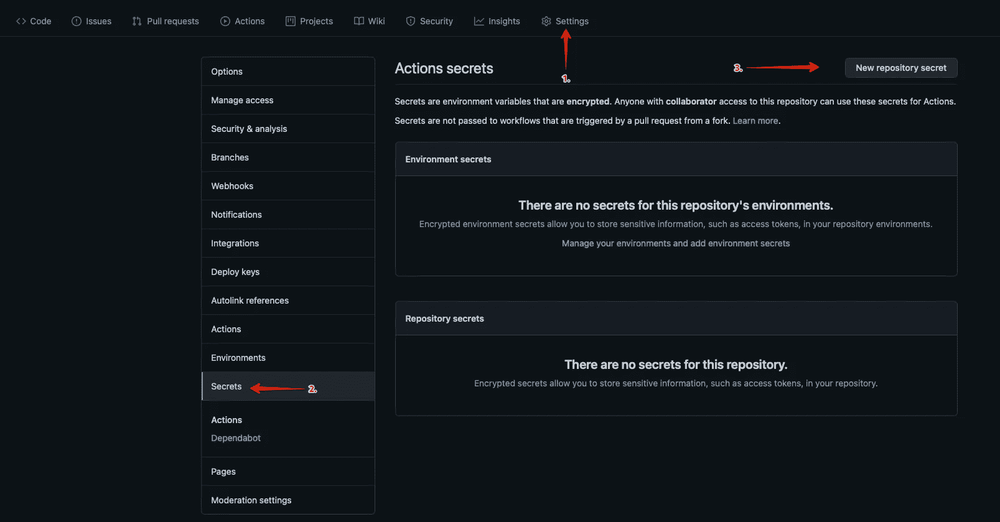

GitHub 秘密

创建一个名为 UNITY_LICENSE 的秘密，并将许可证文件的 ***内容*** 复制到其中。

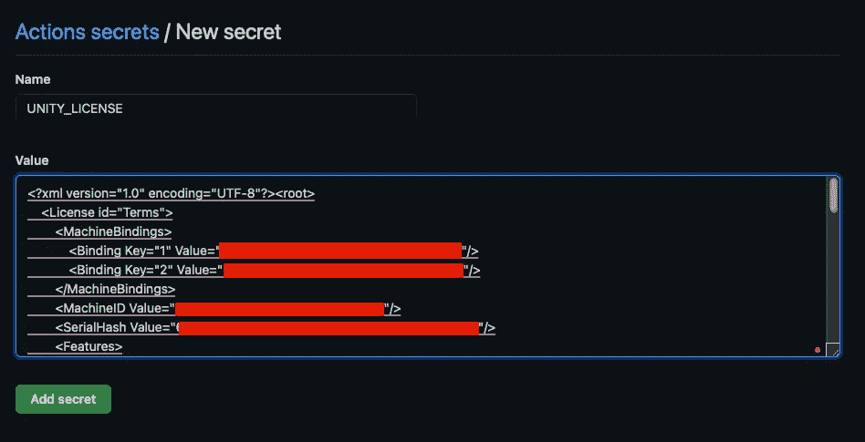

创造一个秘密

现在我们已经将 Unity 许可证存储为 GitHub Secret，准备在我们的工作流程中引用。

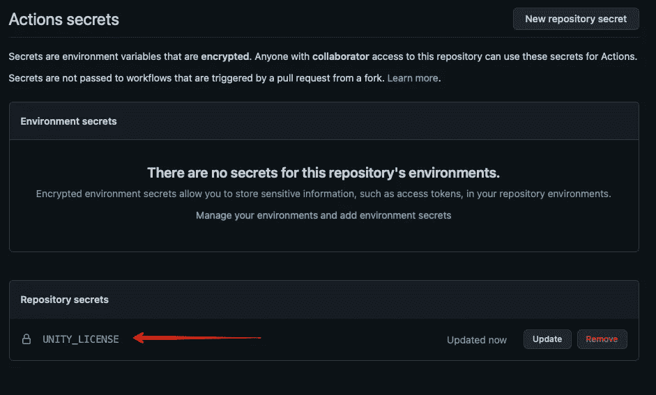

秘密已创建

## 下次吧！

我们已经完成了 Unity 许可证设置和我们的第一个工作流程！现在我们已经将我们的许可证存储为一个秘密，我们准备开始设置我们的主要工作流程！下一次，这正是我们要做的。如果你喜欢这篇文章，或者想在我的旅程中与我同行，请在 gamedevchris.medium.com[跟随我。](#https://gamedevchris.medium.com)