# 使用 Unity 和 Git 进行设置——第 2 部分

> 原文：<https://medium.com/nerd-for-tech/getting-setup-with-unity-and-git-part-2-d63c76eb326?source=collection_archive---------19----------------------->

*如果你还没有，检查一下* [*第 1 部分*](https://thestreetdev.medium.com/getting-setup-with-unity-and-git-ab54ccbaf94e) *以确保你已经采取了前面的步骤。*

现在我们已经熟悉了 Unity 项目的设置，我们可以考虑添加我们的版本控制。首先，我们需要打开 Git Bash 并与我们的项目在同一个目录中。有几种方法可以做到这一点——您可以结合使用“ls”和“cd”命令在 Git 界面中导航，其中“ls”将列出您当前位置的文件和文件夹,“cd”后跟一个文件夹名称将改变您的当前位置。

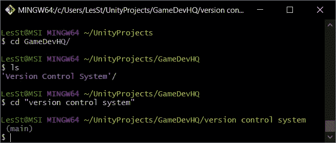

使用 git 界面时需要注意的是，您可以键入名称的前几个字符，然后使用“TAB”自动填充其余的字符。在第一行，我简单地输入了“cd gam[TAB]”。此外，git 需要一个时髦的空格和反斜杠系统来识别名称中的空格。你可以使用我刚才提到的相同方法，自动填充空格，或者你可以根据我对“版本控制系统”文件夹的更改，简单地用引号将名称括起来。git 的另一个优点是它不区分大小写，所以不需要担心大小写。

或者，您可以找到您的项目文件夹，在空白处单击鼠标右键，然后— Git Bash Here！

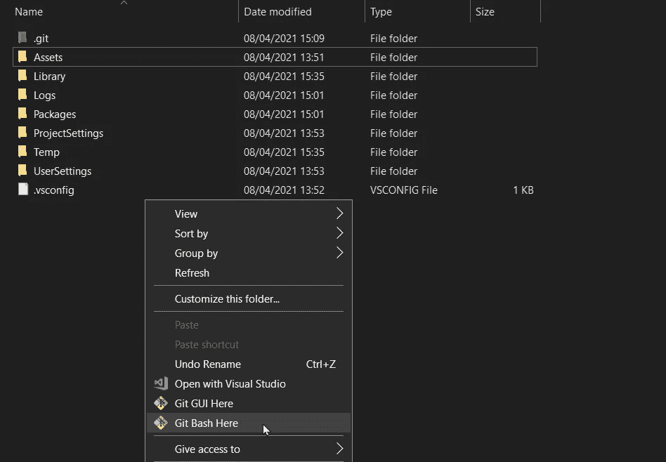

这将把我们直接带到项目所在地的 Git。

现在我们在这里，我们需要初始化我们的本地 repo，我们使用“init”命令来完成这项工作，当使用与管理我们的 repo 相关的命令时，所有命令都以“git”开头，您可能已经注意到，当我们将默认分支设置为 main 时(您可以看到它以蓝色突出显示)。所以…

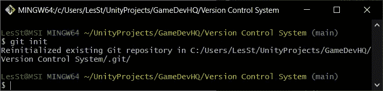

如果成功，您将收到一条消息，说明已初始化了一个空存储库(如果已经执行了此步骤，则重新初始化)。

接下来，我们需要将本地回购指向我们在 GitHub 上创建的回购。所以回到 GitHub repo 并复制 URL。

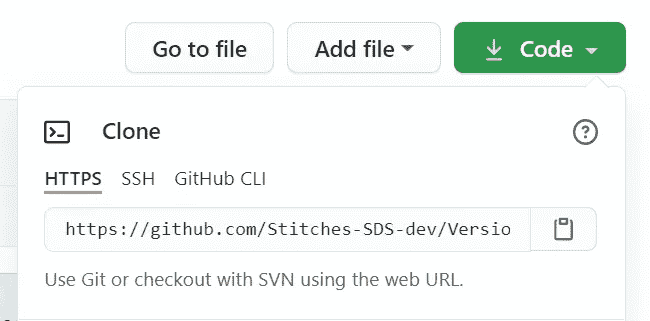

我们可以通过向 repo 添加一个远程服务器，将本地 repo 定向到这个 URL。我们可以通过使用“git remote add origin[paste URL here]”来做到这一点。这将添加 GitHub repo 作为一个远程服务器，我们将其命名为“origin”(一个行业标准参考)，这就是我们现在在执行命令时如何引用该服务器。

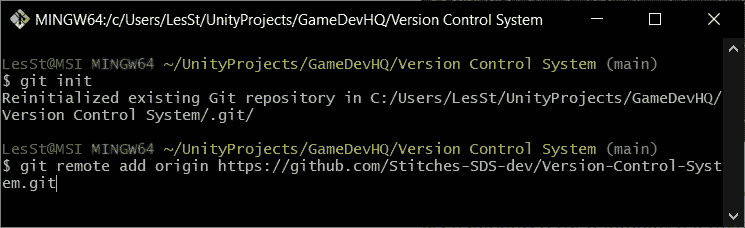

***注意:*** *此时可能会要求您输入您需要的 GitHub 凭据。*

完成后，我们可以验证该命令是否成功…

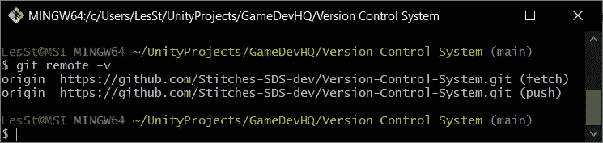

结果显示我们有权限从刚刚配置的远程服务器获取数据并将其推送到该服务器。

所以，现在我们都设置和沟通我们的本地和服务器端回购，我想通过版本控制工作流程运行。这可能会绊倒那些对 VCS 不熟悉的人。有 3 个步骤需要始终遵循，以确保当您尝试将您的工作应用到远程服务器时，不会不断遇到合并冲突错误。那些台阶…？

**拉取→提交→推送**

F 首先，你**从远程服务器(源)获取**数据，然后你添加并**提交**你的工作，最后**将你提交的更改推**到远程服务器(源)。如果你总是遵循这些步骤，你遇到的任何问题应该是最小的。

进入第一步— **拉动**。当我们从服务器中提取数据时，我们需要将它合并到一个分支中(我们当前的分支是用蓝色突出显示的分支—在我们的例子中是‘main’)。我们可以用…做到这一点

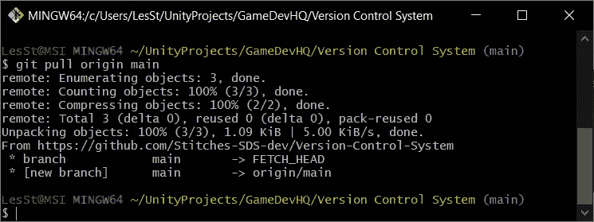

现在，我们有了服务器端回购的参考拷贝，我们可以发现是否有任何变化—也就是说，我们的本地拷贝和新拉入的拷贝有所不同吗？为此，我们可以检查回购的状态。

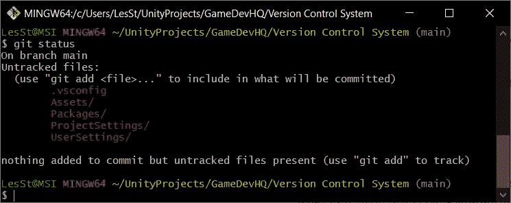

未更改的文件/文件夹显示为绿色，而更改的显示为红色，我们很容易看出我们的两个副本是不同的。那么，我们如何将我们的本地更改与我们的服务器端回购合并…你问得真有趣！首先，我们需要将所有更改添加到提交中，我们可以使用“add”命令来完成。我们可以通过指定来单独添加所有的文件夹和文件，但是想象一下我们有 150 个文件要添加！那可能需要一段时间。我们可以一次添加所有文件，而不是浪费时间添加单个文件。

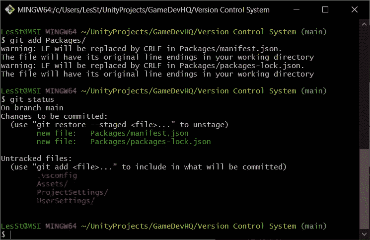

添加单个文件夹

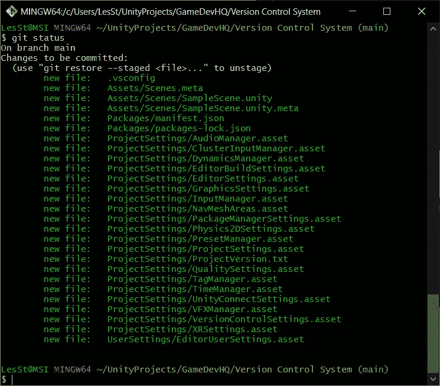

一次添加所有文件

所有这些可爱的绿色文件意味着我们已经成功地将所有更改添加到提交中，所以下一步— **提交**

当我们这样做时，我们总是希望包含一个注释，以便于跟踪提交期间发生了什么变化，我们可以在创建提交时通过使用“-m”标志来做到这一点。

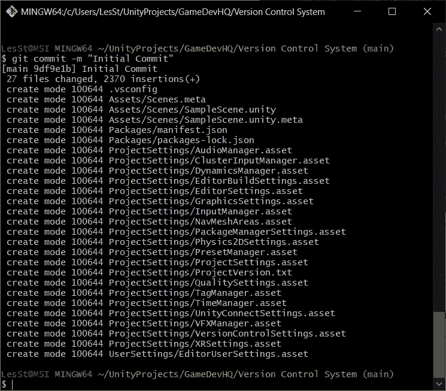

由于这是一个设置回购以备使用的提交，因此这被称为“初始提交”是一个标准，这是我们的起点。

随着我们的提交准备就绪，我们还有一个步骤要完成——我们的**推送**。

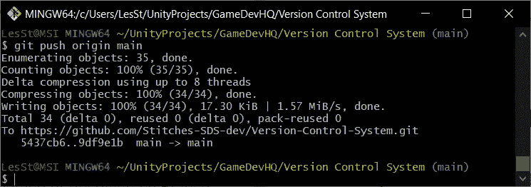

一旦这样做了，我们的改变就完成了！如果我们回到 GitHub 上的 repo，点击刷新——

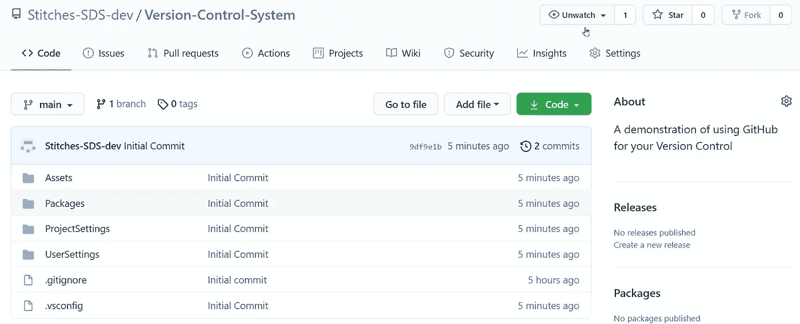

我们可以看到我们所有的文件都在 GitHub repo 上更新了。