# 开始使用 Nmap

> 原文：<https://medium.com/nerd-for-tech/getting-started-using-nmap-41f4ec3f8d84?source=collection_archive---------0----------------------->

Nmap 入门手册

Nmap

首先，在直接进入 Nmap 之前，让我们先了解什么是 Nmap 以及它的重要性。Nmap 是 Gordon Lyon 创建的网络扫描仪。Nmap 用于通过发送数据包和分析响应来发现计算机网络上的主机和服务。Nmap 提供了许多探测计算机网络的功能，包括主机发现和服务以及操作系统检测*【来源:* [*维基百科*](https://en.wikipedia.org/wiki/Nmap)*。Nmap 可用于执行网络测试和侦察。*

1.  ***首次使用 Nmap】***

*Nmap 预装在 Kali Linux 中(建议作为网络安全专家使用 Kali Linux)，或者可以使用命令*'****apt-get install nmap****'*安装在其他 Linux 操作系统上。对于 Windows OS，可以从[这里](https://nmap.org/dist/nmap-7.92-setup.exe)下载。下载后，运行安装文件，并遵循 Windows 机器上的基本安装过程。一旦安装完成，打开你的 Windows 终端，进入 Nmap 目录，然后你就可以开始了。运行*'****nmap–version****'*查看其是否安装成功。*

*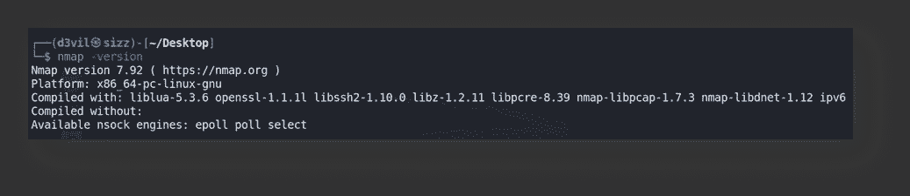*

*正在检查 Nmap 版本*

*如果安装成功，那么根据您安装的 Nmap 版本，将会显示类似的结果。*

*2.**使用 Nmap 开关***

*您可以在终端上使用' **nmap *-h*** '命令找到所有 Nmap 交换机。如果你想详细了解 Nmap，你可以使用'***man**Nmap****'。**

*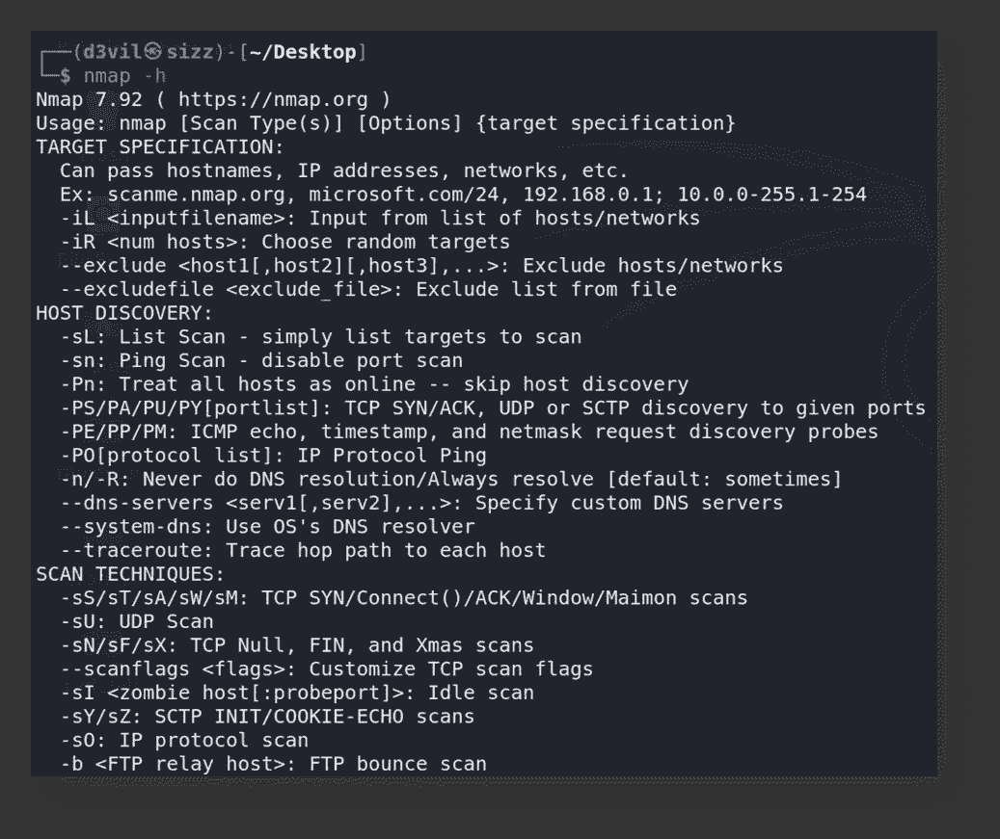*

*Nmap 帮助菜单*

*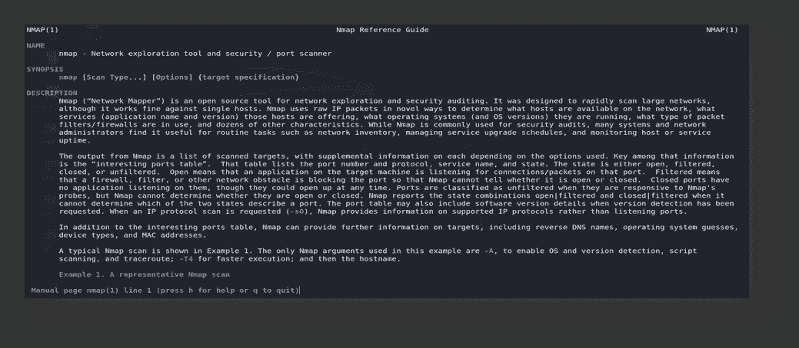*

*Nmap 手册*

*如上面第一个截图所示，帮助开关(-h)列出了所有可以与 ***nmap*** *一起使用的开关。*nmap*中的开关*只是用来根据我们的需要定制结果的标志。交换机分为各种类别，如主机发现、扫描技术、端口规格和扫描顺序、服务/版本检测、脚本扫描、操作系统检测、计时和性能、防火墙/ IDSs 规避和欺骗等。*

*第二张截图是 ***nmap*** 手册，显示了关于 ***nmap*** 及其各种开关的更多细节。*

*3) **简单扫描***

*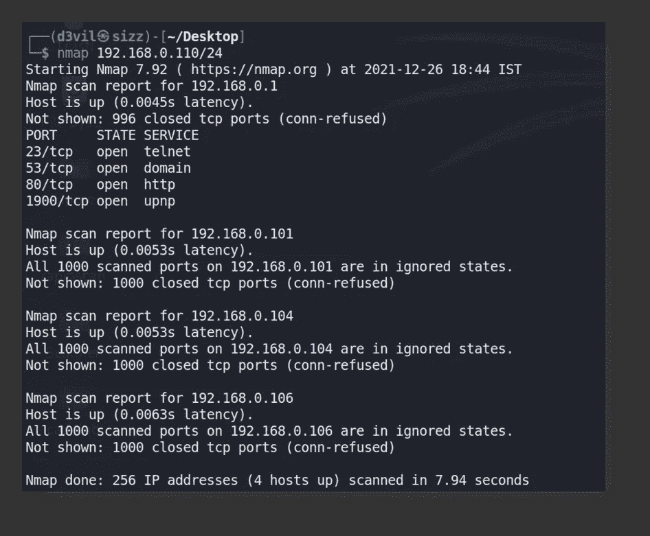*

*Nmap 简单扫描*

*通过仅提供 IP 地址，Nmap 将简单地尝试扫描网络中所有可能的活动主机，并使用默认端口列表检查哪些端口是打开的。从上面的结果可以看出，Nmap 报告网络中总共有 4 台主机处于活动状态。*

> *注意:IP 地址是用 CIDR 符号表示的，/24 表示子网掩码。*

*3) **简单主机枚举***

*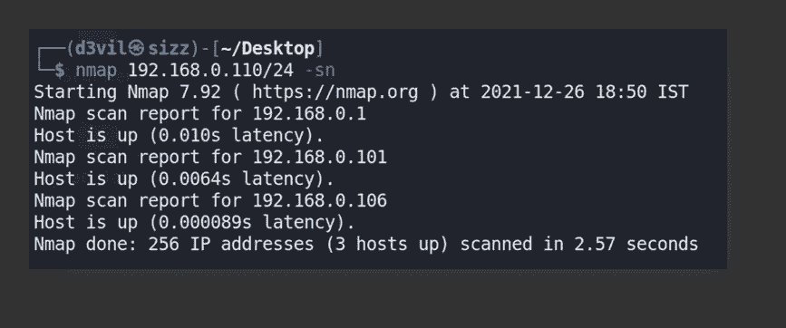*

*简单主机枚举*

****-sn*** 开关可用于仅列举网络中存活的主机，不扫描任何其他细节。它将简单地发送 ICMP ping 数据包到网络中每个可能的 IP 地址，并根据收到的响应将主机标记为活动的。如上图所示，它发现 3 台主机处于活动状态。*

*4) **仅列出网络中可以扫描的主机***

*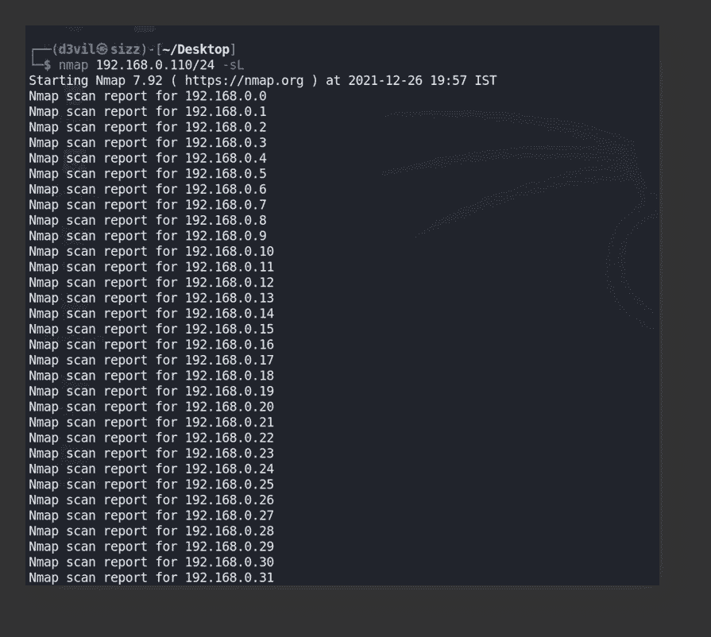*

****-sL*** 开关可以用来了解我们可以扫描的所有主机。*

***简短的成 TCP 三次握手***

*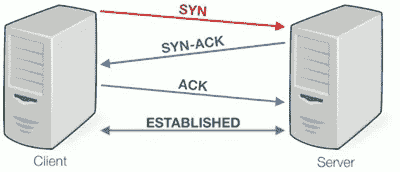*

***图:三次握手***

> *上图显示了 TCP 三次握手过程。它用于在客户端和服务器之间建立连接。这是一个三向过程，从客户端向服务器发送 SYN 数据包开始，服务器通过发送 ACK 和 SYN 数据包对其进行响应，最后客户端通过发送最后的 ACK 数据包进行确认。在客户机和服务器之间建立连接之后。*

*5) **TCP 连接端口扫描***

*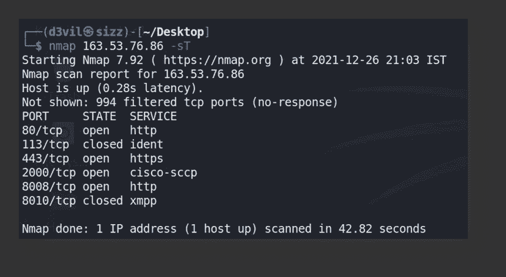*

*TCP 连接扫描*

****-sT*** 交换机在扫描目标主机时执行完整的 TCP 握手。这可能会被记录到目标主机的日志中并被跟踪。在此扫描中，Nmap 将尝试通过完成完整的三方过程来建立与目标主机的完全连接。因此，Nmap 尝试连接的每个目标主机都要经历三次握手过程，以找到活动的主机。处于活动状态的主机将完成三向过程，并将其保存在日志中。现在，如果防火墙发现这种类型的连接请求是可疑的，它就会阻止这种连接请求，并且由于这种原因，这种扫描(-sT)将不能正确地检测所有活动的主机。*

**

*6) **半开 TCP 扫描***

*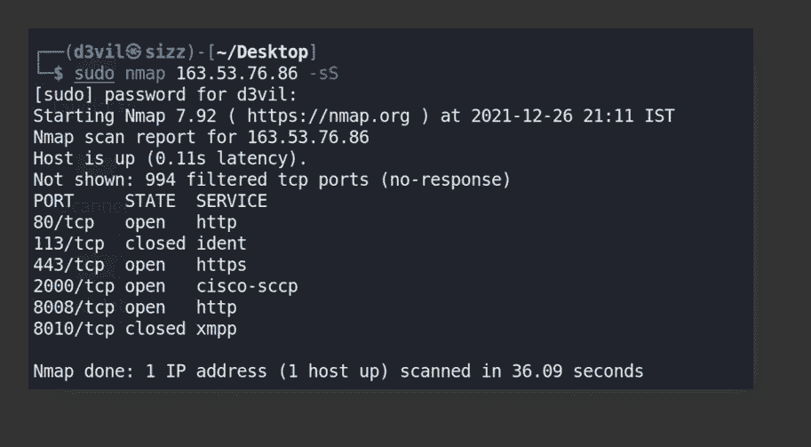*

*半开 TCP 扫描*

****-sS*** 交换机执行部分 TCP 扫描。这被设计成隐形和被动扫描；它没有被记录。您需要有管理员权限才能运行此扫描。此扫描没有完成完整的三向过程。在这种情况下，它将首先向服务器发送 SYN 数据包，如果主机是活动的，它将向客户端发回 SYN + ACK 数据包，Nmap 将知道该主机是活动的，因此它将通过发送 rst 数据包来终止连接，而不是完成完整的连接。因此，这里不会建立完整的连接，目标服务器也不会记录这个连接。这就是这种扫描被称为秘密扫描并需要管理员权限的原因。*

**

*7) **扫描时跳过 ping】***

**

*-Pn 开关*

****-Pn*** 开关用于在默认情况下将给定的目标视为活动的，并在扫描期间跳过 ping 测试。当不使用此交换机时，Nmap 将向所述目标主机发送 ping 请求，以检查网络中的哪些主机是活动的，但是当使用此交换机时，Nmap 将认为所述主机是活动的，并执行其他扫描，如端口扫描和服务扫描等。如果我们事先知道我们要扫描的特定主机在网络中是活动的，则建议使用此交换机，因为这将有助于减少扫描时间。*

*8) **UDP 端口扫描***

*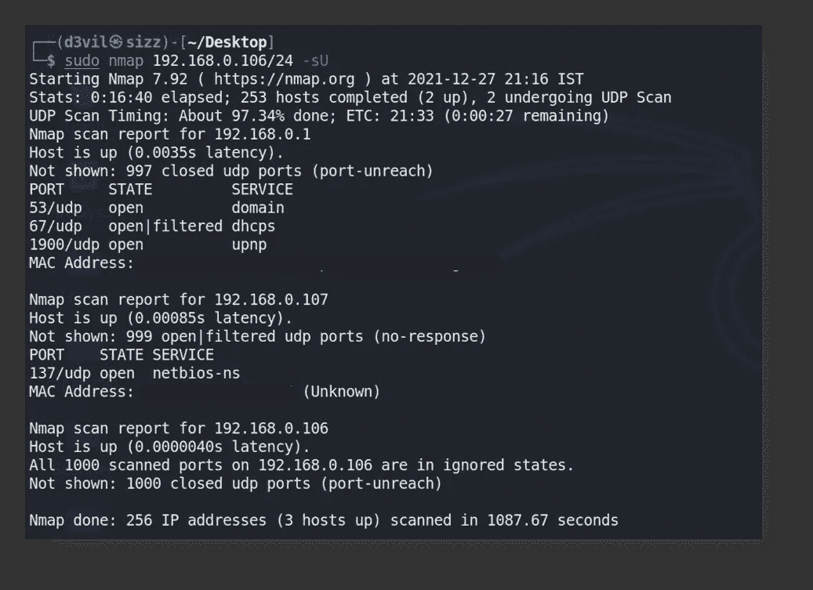*

*UDP 端口扫描*

****-sU*** 交换机用于扫描网络中使用的 UDP 数据包。与 TCP 相反，UDP 是一种无连接协议。当 Nmap 向目标主机发送 UDP 数据包时，如果目标主机上的 UDP 端口关闭，它将发回 ICMP ping 响应，表明端口已关闭，目标不可达，这意味着它不活动。但是如果端口打开，则不会有任何响应。现在这并不总是意味着港口是开放的，这是无法证实的。如果没有响应，可能有两种可能性，第一种是端口打开，另一种是防火墙不允许 UDP 数据包到达目标上的 UDP 端口。因此 Nmap 将在结果中显示 open|filtered。*

> *注:注意使用 ***-sU*** 开关时，结果显示**打开|少数端口过滤**。*

*9) **服务及其版本检测***

*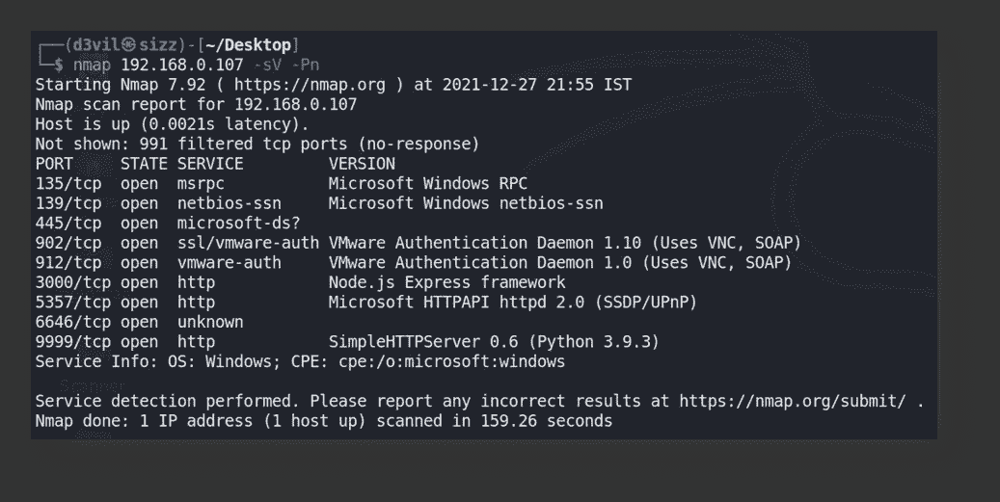*

*服务及其版本检测*

****-sV*** 开关用于检测正在上述目标上运行的服务及其版本。在结果中可以看到，Nmap 已经检测到在不同端口上运行的服务及其版本。此版本详细信息可用于攻击目标上正在运行的特定服务，在最坏的情况下，还可用于获取整个系统的访问权限。*

*10) **检测目标的操作系统***

*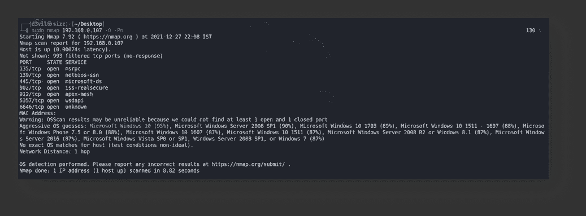*

*操作系统检测*

****-*O**开关用于检测操作系统的目标。并非每次结果都是精确的，在上面的快照中，可以看到 Nmap 猜测了各种操作系统，并显示了置信度百分比。特定的目标是运行基于 windows 10 的 Windows 11，Nmap 对 Windows 10 表现出 95%的信心，以蓝色突出显示。同样，检测操作系统及其版本对于攻击目标非常重要。*

*11) **Nmap 脚本引擎(NSE 脚本)***

*NSE 脚本可以被视为 Nmap 的扩展。这些脚本帮助 Nmap 做的不仅仅是扫描目标的开放端口和服务。它们可用于扫描目标的不同类型的漏洞，也可用于利用这些漏洞。不同的脚本可用于执行不同的事情。Nmap 将这些脚本分为不同的类别，如 safe(不影响目标的脚本)、Intrusive(与 Safe 不同，这些脚本具有攻击性，会影响目标)、Exploit(这些脚本可用于尝试利用漏洞)、Auth(这些脚本可用于尝试绕过目标主机上运行的身份验证服务)、Vuln(用于查找目标中漏洞的脚本)、Brute(顾名思义，这些脚本用于暴力破解运行服务的凭据)等等。*

*NSE 脚本的详细列表可在此处[找到](https://nmap.org/nsedoc/)，不同类别可在此处找到[。](https://nmap.org/book/nse-usage.html#nse-categories)*

***用于查找 SQL 注入漏洞的 NSE 脚本示例:***

*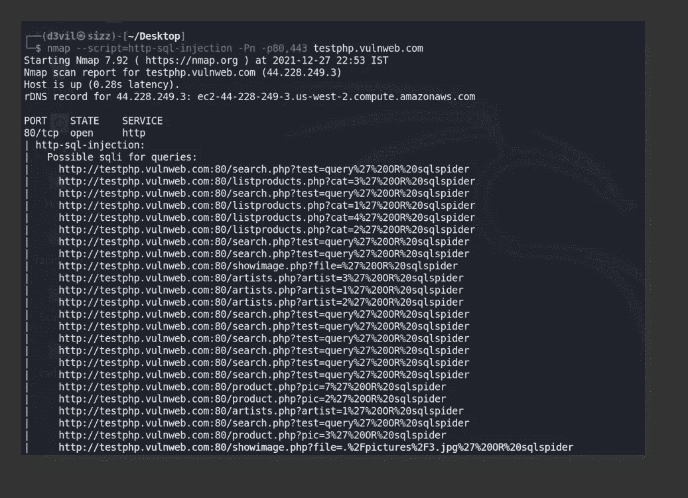*

*NSE http-sql 注入脚本*

*可以看出，该脚本找到了可以执行 SQL 注入的端点。*

*因此，这些是初学者开始使用 Nmap 需要了解的一些基础知识。*

***下面给出了开始使用 Nmap 的一些要点:***

***1)** **-p** 开关用于指定目标上要扫描的特定端口号。如果未指定，Nmap 将扫描默认的 1000 端口列表。为了使 Nmap 扫描所有端口**，可以使用-p-** 开关。此外，可以使用逗号指定多个端口(例如:-p80，443，999)。也可以指定端口号的范围(例如:-P1–1000，它将从端口号 1 到 1000 进行扫描)。*

***2)** 可以指定要扫描的 IP 地址范围(例如:nmap 192.168.0.1–234，它将从 192 . 168 . 0 . 1 开始扫描，直到 192.168.0.234)。同样，可以使用逗号指定类似端口的 IP 地址(例如:nmap 192.168.0.1、192.168.1.1、192.168.10.4，它将扫描 3 个 IP 地址)。甚至可以同时指定单个 IP 地址和一系列 IP 地址(例如:nmap 192.168.0.1、10.10.0.1–255，它将一次扫描 192.168.0.1，然后从 10 . 10 . 0 . 1 扫描到 10.10.0.255)。IP 地址也可以以 CIDR 符号的形式指定，以扫描网络中的所有主机(例如:nmap 192.168.0.3/24，它将扫描网络中的所有 256 台主机； */24 表示子网掩码是 255.255.255.0，表示特定子网中有 28 = 256 台主机**

***3) -p-** 与**-P1–65536**相同，都将扫描所有 216 个端口。*

***4)** 默认情况下，如果没有指定其他扫描类型，Nmap 将使用 TCP 连接扫描( **-sT** )。*

***5)** 注意 **-sS** 和 **-sT** 扫描结果之间的差异，两者应该给出相同的结果。 **-sS** 应该在您不希望目标记录您的 Nmap 请求的情况下使用。*

***6)** 可以将结果保存在一个文件中，以便以后使用。Nmap 提供各种开关以不同的格式保存结果， **-oN** 用于以普通文本格式保存结果， **-oG** 用于以 greppable 格式保存输出， **-oX** 用于以 XML 格式保存输出。除了这些格式，还有一些其他格式来保存结果。*

***7)** 默认情况下，Nmap 不会显示扫描的实时进度，要查看实时更新，您可以在扫描打开时按 enter 或 space，以定期查看实时更新。如果想自动看到现场进度，可以使用 **-v** 开关。*

***8)** 也可以向 Nmap 提供包含待扫描目标的文件。 **-iL** 可用于指定包含待扫描目标的文件名。*

***9)** 最后但并非最不重要的一点是，您可以组合并尝试不同的开关组合，以便在一次扫描中获得所有结果，同时减少扫描时间。*

***例如:***

**nmap 192 . 168 . 0 . 1-p--sV-sS**

**nmap -p80，9999 -sT -O 192.168.1.1**

**nmap 192 . 168 . 0 . 1–134-sU-Pn-oN output . txt**

> *花点时间探索 Nmap 的最大潜力。使用不同开关组合的不同目标，观察结果。实际上，如果您连接到 Wi-Fi 或 LAN 网络，您可以使用这些不同的扫描来扫描您自己的网络。但是请始终记住，Nmap 不应用于任何个人利益，并且 Nmap 扫描涉及向目标发送多个请求，这有时会影响目标。*

*对于任何技术或其他错误，随时与我联系，以便进一步的读者受益。*

*感谢您的阅读。知识就是力量，所以不断获取！😈*

*在 [GitHub](https://github.com/gandhidevansh) 上关注我吧！*