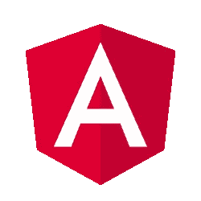
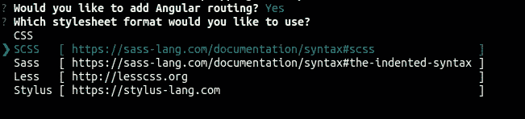
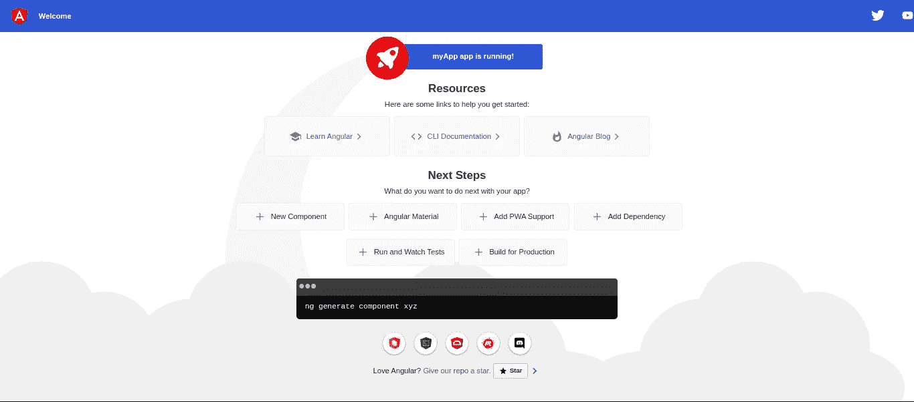
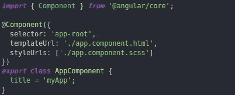
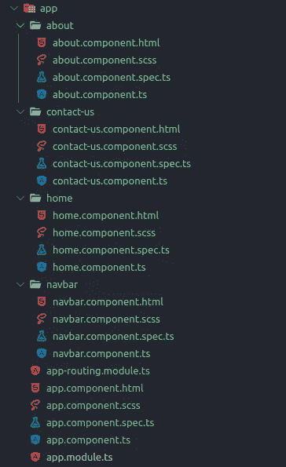
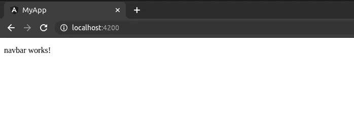
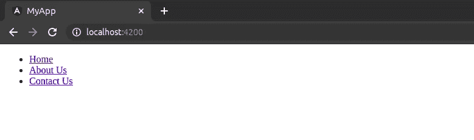

# Angular 入门。

> 原文：<https://medium.com/nerd-for-tech/getting-started-with-angular-5b20e72783bc?source=collection_archive---------12----------------------->



新来的 Angular？没问题！在这篇文章的结尾，你将会知道 Angular 的基础知识，这将会帮助你开始未来的项目。您将在几个不同的文件上编码。现在让我们开始吧！

# **先决条件**

在开始学习 Angular 之前，您需要确保您的系统已经安装了以下软件，如果没有，那么首先您需要安装这些软件:

*   Node.js:至少需要 Node.js 的 10.x 版本。如果您的系统中已经安装了 Node.js，那么您可以在终端/命令提示符下运行 *node -v* 命令。如果你没有 Node.js，那么你可以在这里下载[。](https://nodejs.org/en/)
*   npm: Node Package Manager 或 NPM 随 Node.js 一起分发，这意味着当你安装 Node.js 时，NPM 也会自动安装。
*   代码编辑器:有很多代码编辑器，比如 atom、sublime、brackets 等等。但是在本文中，我们将使用 Visual Studio 代码。如果没有 VS 代码，可以从[这里](https://code.visualstudio.com/)下载。

# **安装角度**

安装完上述要求后，现在可以在系统中安装 Angular 了。打开您的终端/命令提示符并运行:

> npm 安装-g @angular/cli

该命令将在您的系统中全局安装 Angular CLI(命令行界面)。如果要安装特定版本，请运行:

> npm 安装-g @angular/cli@xx.x.x

这里 *xx.x.x* 是你想要的版本，例如:11.2.0。

# **创建您的第一个应用程序**

现在，您已经准备好创建您的第一个角度应用程序。打开终端/命令提示符并运行:

> ng 新的 myApp

这将创建一个标题为“myApp”的新应用程序(您可以随意命名)。

运行该命令后，它会询问您是否要添加路由文件。您可以根据需要键入 yes 或 no。然后它会要求你选择一个样式表格式，你可以选择任何你想要的。对于这篇文章，我们将与 SCSS(。scss)。



选择样式表格式后，终端将开始生成 Angular 应用程序。一旦完成，您现在可以打开您的 VS 代码并打开您的应用程序。

要运行应用程序，请执行以下操作:

1.  打开您的系统终端/命令提示符或 VS 代码终端。
2.  然后， **cd myApp** 。
3.  一旦你进入终端的应用程序文件夹，运行 **ng serve** 。此命令将启动您的本地开发服务器。完成后，你可以打开你最喜欢的浏览器，在地址栏输入 **localhost:4200** 。



初始窗口

当您在 [http://localhost:4200，](http://localhost:4200,)打开 Angular 应用程序时，应该可以看到这个屏幕。

# **了解文件夹结构和文件**

再次打开你的 VS 代码，点击“src”文件夹。在那里你会找到一个 index.html 的**文件。打开来看一看。这是应用程序的主 html 文件。除了 index，你会找到你的 **main.ts** 、 **polyfills.ts** 、 **test.ts** 和你的样式表 **style.scss** (如果你选择了 scss，如果你选择了 css，你会找到 **style.css** )。**

1.  **main.ts:** 是你应用的入口点。它编译您的应用程序并引导 app.module 在浏览器中运行。
2.  **polyfills . ts:**Angular 中的 poly fills 是几行代码，使您的应用程序浏览器兼容，即您的应用程序可以在不同的浏览器上运行，例如 IE 或 firefox。
3.  这个文件包含了主要组件的单元测试。当使用 Angular CLI 运行测试时，该文件将运行所有的**规格文件**文件。

除了这些文件，你会发现一个名为“应用程序”的文件夹。这是默认情况下生成的文件夹。如果你打开你的应用程序文件夹，你会发现一些文件，即:

1.  **app.component.html:** 顾名思义，这是你的 html 文件，你的 HTML 代码将放在这里。
2.  这是你的样式表。这里是你的风格代码。
3.  **app.component.ts:** 这是逻辑文件。你想为一个特定的组件或 HTML 元素写的任何逻辑，它都会在这里。
4.  **app.component.spec.ts:** 这是测试文件。在这里，您将基本上编写测试逻辑。
5.  **app.module.ts:** 这是一个模块文件，其他模块/组件从这里导入。
6.  **app-routing.module.ts:** 这是一个路由文件。如果您有多个页面的应用程序，所有需要的路线将进入这个文件。

> 创建应用程序时，如果您没有选择“路由”，您将不会在您的文件夹结构中找到 **app-routing.module.ts** 。类似地，您选择的样式表选项将决定您将进一步创建的组件的样式表文件。

让我们打开 **app.component.ts** 来看看吧。



每个 component.ts 文件都将包含一个针对组件和装饰器的导入语句。装饰器内部是您的选择器、templateURL 和 StyleURLs。简单地说，你的选择器只是你给你的组件起的一个名字，这样你就可以通过你的应用程序访问它，templateURL 只是你的 html 模板的文件位置，styleURLs 是你的样式表的文件位置。最后，您有了导出语句，这样您就可以在应用程序的其他组件中使用该组件。

# **创建组件**

现在我们将生成一些新的组件用于我们的应用程序。转到您的终端/命令提示符或 VS 代码终端，输入以下命令来创建一个组件:

> ng 生成组件导航栏
> 
> 注意:你也可以使用类似 ng g c <component-name>的简写命令来创建组件，而不是 ng generate component<component-name></component-name></component-name>

这将在你的应用程序文件夹中创建一个名为 navbar 的新文件夹。在 navbar 中，它将创建我们之前讨论过的四个文件。html，。scss，。ts 和. spec.ts)，并用新组件更新您的 app.module.ts 文件。

除了导航栏，我们需要更多的组件，如主页，关于我们，联系我们等。继续创建这些组件。

创建这些组件后，您的文件夹应该如下所示:



完成创建组件后的文件夹结构。

现在让我们从创建导航栏开始。继续打开你的 app.component.html 文件，删除所有代码，写下这些:

```
<app-navbar></app-navbar><section> <router-outlet></router-outlet></section>
```

我们使用<app-navbar>,因为这是分配给 navbar 组件的选择器值。如果愿意，您可以将选择器值更改为其他值。</app-navbar>

保存这个文件，你的应用应该会自动刷新并更新为“navbar 工作！”。这是因为我们还没有更新。html 来显示任何其他内容。



现在，我们可以打开我们的 navbar.component.html 并输入以下代码:

```
<header> <div *class*=”container”> <nav> <ul> <li><a *routerLink*=”/home”>Home</a></li> <li><a *routerLink*=”/about-us”>About Us</a></li> <li><a *routerLink*=”/contact-us”>Contact Us</a></li> </ul> </nav> </div></header>
```

保存此代码并重新访问您的应用。您应该看到以下内容:



让我们继续设计我们的导航栏，使它看起来像一个真正的导航栏。让我们打开样式文件，输入以下内容:

```
body, html { height: 100*%*; margin: 0 auto;}body { font-family: ‘Roboto’; font-size: 20*px*;}a { text-decoration: none;}*.container* { width: 80*%*; margin: auto; padding: 23*px*; display: grid; grid-template-columns: 25*%* auto; a { color: #fff; }}
```

保存该文件，然后打开 navbar.component.scss 并输入以下代码:

```
header { background: #2f2e2e; *.logo* { font-weight: bold; } nav { justify-self: flex-start; ul { list-style-type: none; margin: 0; padding: 0; li { float: left; a { font-size: 16*px*; padding: 10*px*; &*:hover* { background: rgb(32, 0, 173); } } } } }}
```

保存该文件，打开浏览器，查看新的导航栏。现在剩下的唯一事情就是让链接实际链接到某个东西，也就是在你的导航菜单中添加路由。

转到您的 app-routing.module.ts。在那里您会找到一系列路线。您可以在这里指定应用程序的路径。

继续添加以下代码:

```
*import* { HomeComponent } *from* './home/home.component';*import* { AboutComponent } *from* './about/about.component';*import* { ContactUsComponent } *from* './contact-us/contact-us.component';const routes*:* Routes *=* [ { path: 'home', component: HomeComponent }, { path: 'about-us', component: AboutComponent }, { path: 'contact-us', component: ContactUsComponent },];
```

保存文件并返回浏览器。请注意你是如何点击不同的链接并进入新的页面的。这仅仅意味着您的路由工作正常！

现在你已经有了 Angular 的基本知识，并且创建了你自己的第一个带有功能导航栏的 Angular 应用程序。现在，您可以开始创建自己的项目了。