# AWS CLI、Windows PowerShell 和 JSON 解析器入门

> 原文：<https://medium.com/nerd-for-tech/getting-started-with-aws-cli-windows-powershell-json-parser-9ff1fc1fc138?source=collection_archive---------0----------------------->

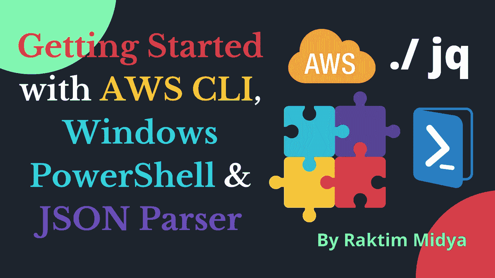

由 Raktim 创建

## 让我们了解如何使用 AWS CLI 和 Windows 高级 shell 脚本(PowerShell 和 JSON 解析)在 AWS 上工作。

他的文章将帮助你**学习 AWS 命令行界面的基础知识。**此外，我们将学习**如何在 Windows PowerShell 和 JSON 解析器上工作。**然后我们将**整合这些东西来创建一个自动化脚本**，它将帮助我们**在 AWS 上提供一些资源。让我们一个一个地开始吧…**

# AWS CLI:


来源:谷歌

AWS 命令行界面(CLI)是管理 AWS 服务的统一工具。只需下载和配置一个工具，我们就可以**从命令行控制多个 AWS 服务**并通过脚本实现自动化。

*   我不想浪费你的时间来解释什么是 AWS CLI，因为一旦我们开始练习，你就会很容易理解。简单地说，你可以认为它是一个程序，为我们提供了一个名为“aws”的命令。使用这个命令，我们作为 AWS 的用户可以与我们的 AWS 帐户通信，并且可以控制 AWS 帐户上的几乎所有东西。这个程序的伟大之处在于你可以在任何操作系统上运行它。
*   ***了解更多 AWS CLI:***[***https://aws.amazon.com/cli/***](https://aws.amazon.com/cli/)

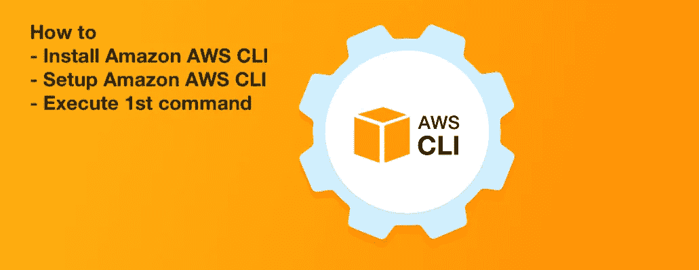

来源:谷歌

## 安装 AWS CLI:

**AWS CLI 的安装就是这么简单。**您只需从下面提到的链接下载该应用程序，就像我们安装任何其他应用程序一样，只需运行该应用程序并持续点击，它就会被安装。

*   ***下载 AWS CLI:***[***https://docs . AWS . Amazon . com/CLI/latest/user guide/install-CLI v2 . html***](https://docs.aws.amazon.com/cli/latest/userguide/install-cliv2.html)

> **安装完成后，打开命令提示符或终端，运行下面提到的命令，检查它是否工作…**

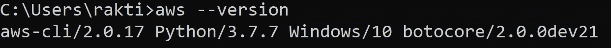

## 配置 AWS CLI:

开始之前，**我们需要 aws 访问密钥和密钥来进行配置。**因为对于人类，我们使用用户名和密码进行身份验证。但是为了验证任何程序，我们使用访问密钥和秘密密钥。

*   要获得您需要的东西，请从 AWS Web 控制台**转到您的 AWS 帐户。然后转到“IAM”service =>点击“Users”=>然后点击“Add User”并创建一个用户。**
*   然后点击**“程序化访问”**，如果你阅读这个访问的描述，你可以看到，**给了我们“访问密钥”和“秘密密钥”**。参考下面提到的截图…

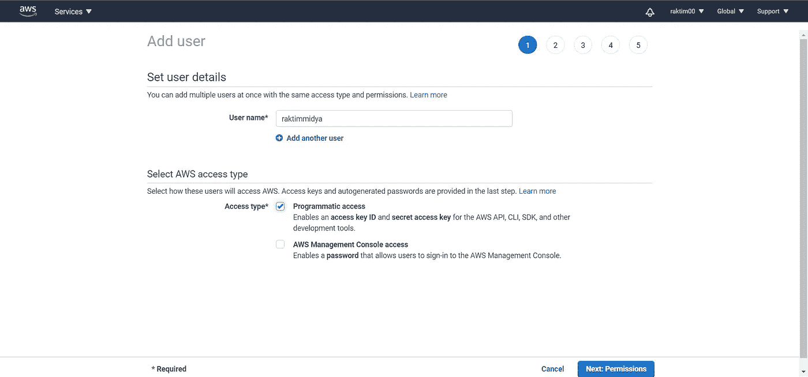

AWS IAM 截图

*   接下来，转到**“权限”**，点击**“附加现有策略”。如果你知道 IAM，你可以选择你想要的政策。**但是为了简单起见，我给了“管理员访问”权限。**请参考下面提到的截图…**

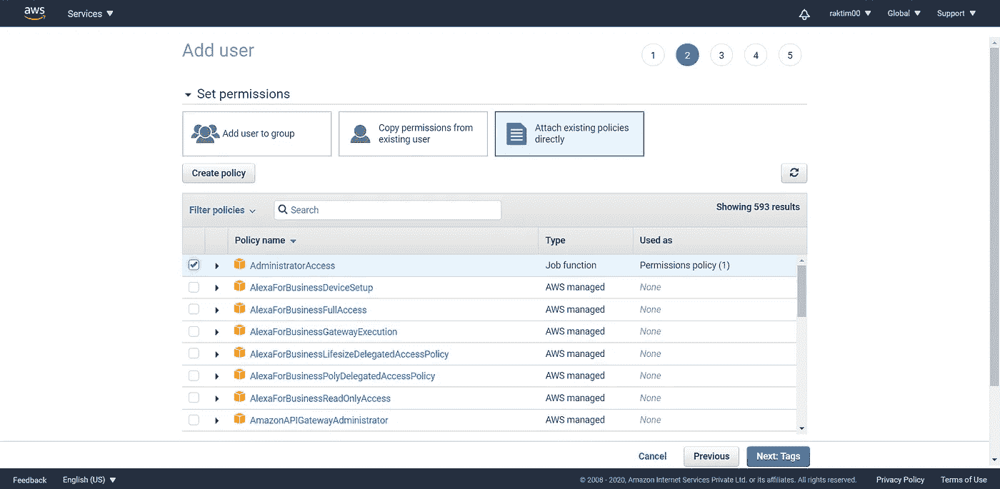

AWS IAM 截图

*   接下来，点击**“标签”**并给出任何想要的标签。然后点击**“审核”，再点击“创建用户”。**接下来，它将为您提供**一个选项来查看您的访问密钥和秘密密钥。**不要忘记点击下载按钮“下载”凭证以备将来参考。

> ***现在该用我们的 AWS 帐户验证我们的 AWS CLI 了。为此，请转到命令行，键入下面提到的命令。***

```
aws configure
```

*   接下来，提供您的**“访问密钥”**和**“密钥”**，然后**提供区域**表示您想要在哪个区域上工作。**最后在“输出格式”中不提供任何东西。为了便于参考，请查看下面提到的截图…**

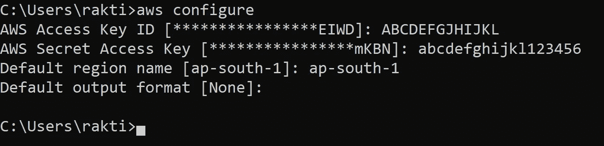

*   **接下来，确保您的 AWS CLI 能够与您的 AWS 帐户通信。运行下面提到的命令，如果您没有看到错误，则表示我们已经成功设置了我们的 AWS CLI……**

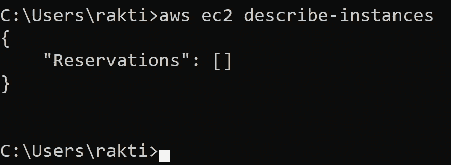

# AWS CLI 基础:

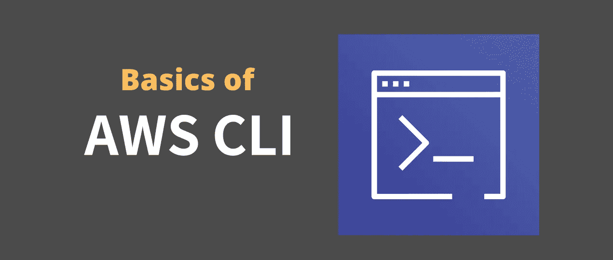

由 Raktim 创建

*   通常，**在 AWS CLI 上运行任何命令之前，**您应该有一些关于 AWS 的**知识，**您也应该知道**您想要在哪个服务上工作。**
*   要找到基本的命令结构，你可以运行**“AWS 帮助”命令。坦率地说，AWS CLI 的文档太多了，所以请尝试使用帮助来利用它。**
*   运行帮助后，你只需继续按**空格键滚动和“q”退出。**现在**我的要求是在“EC2”服务上检查一些东西**。因此，如果你稍微阅读一下帮助，你会看到有一个名为“ec2”的**子命令。**
*   现在**让我们来看看“ec2”的帮助。对于运行" aws ec2 help"** 来说，再次通过阅读这个输出，我们可以理解" aws ec2 "命令也有一些子命令。**“AWS ec2”命令的子命令之一是“描述-实例”。**这个子命令告诉我们实例的细节。**现在回到我们刚刚运行的最后一个命令，你会明白，这一次我的帐户上没有任何实例，所以输出什么也没有显示。**
*   现在，这里需要注意的一点是，默认情况下,**AWS CLI 以 JSON 格式向我们提供输出。**因此，**为了从这些输出中过滤数据，我们需要将它们传递给一个 JSON 解析器。**
*   接下来，我将讨论 JSON parser，因为一旦我们学习了 JSON parser，然后我们进入实际操作，就很容易理解如何使用 AWS CLI 配置资源。

# JSON 解析器(JQ):

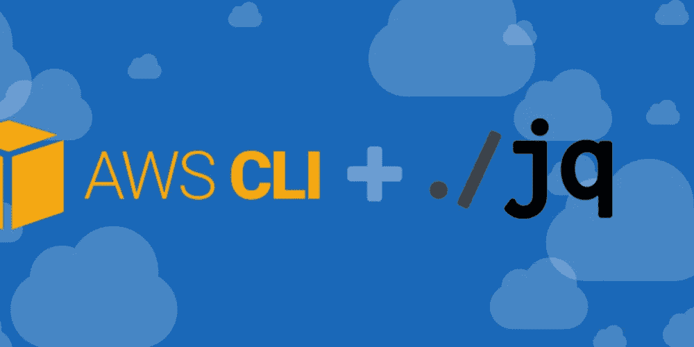

来源:谷歌

Q 是一个程序，我们使用它进行 JSON 解析或者从 JSON 脚本中获取数据。 JQ 就像是 JSON 数据的**sed**——你可以用它来**切片、过滤、映射和转换结构化数据**，就像 sed、awk、grep 和 friends 让你玩文本一样容易。jq 是用可移植的 C 语言编写的，它没有运行时依赖性。

## JQ 的安装:

**安装 JQ 非常简单。我建议按照下面提到的 YouTube 链接安装 JQ 程序。**

*   **【https://youtu.be/rrjIVepRqPI】**安装: [***安装***](https://youtu.be/rrjIVepRqPI)

## JQ 基础知识:

这里我也不想谈论太多 JSON 解析，因为我认为一旦我们开始编写 automaton 脚本，你将能够很容易地理解 JSON 解析。但是我建议如果你不知道什么是 JSON 解析或者如何使用 JQ，就看下面提到的 YouTube 视频。

*   ***https://youtu.be/EvpwhGeiH0U***[](https://youtu.be/EvpwhGeiH0U)

# *Windows PowerShell:*

*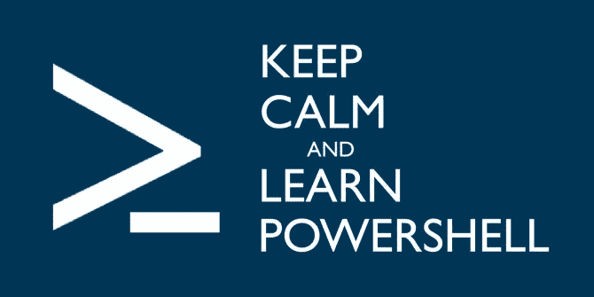*

*来源:谷歌*

*P **owerShell 是一种面向对象的自动化引擎和脚本语言，具有交互式命令行外壳，由微软开发，用于帮助 IT 专业人员配置系统和自动化管理任务。** PowerShell，构建于。NET framework 使用对象，而大多数命令行 shells 都是基于文本的。*

*   *坦率地说，PowerShell 是一个很大的学习课题，因为它有很多工具。但是要做我们实际的**，我们只需要 PowerShell 的基本变量概念**。这和我们在 Linux 上使用“Bash Shell”几乎是一样的。这里的**要存储任何变量，首先使用“$”符号，然后是变量名，然后等于(=)我们想要存储在该变量上的值。**例如，参见下面提到的截图……*

*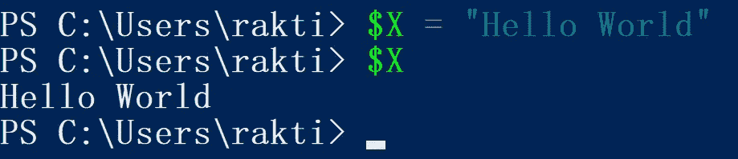*

*PowerShell 截图*

> ***现在，我将讲述更多概念，让我们开始构建自动化脚本，一旦我解释了脚本中的每一行，您将非常容易理解 PowerShell 和 JQ 的这些概念。***

# *让我们看看问题陈述:*

1.  *创建一个密钥对。*
2.  *创建安全组。*
3.  *使用上面创建的密钥对和安全组启动一个实例。*
4.  *创建 1 GB 的 EBS 卷。*
5.  *最后一步是将上面创建的 EBS 卷附加到您在前面步骤中创建的实例。*

# *先决条件:*

*   *在本文中，我不会谈论这些 AWS 资源。我主要关注的是如何使用 AWS CLI 提供这些资源。所以，我在考虑你**已经掌握了这些资源的知识。***
*   *接下来，我给出了我的文件名**“AWS-CLI . PS1”**。您可以给任何名称，但扩展名应为**“PS1”**。另外，**我使用 VSCode 作为我的文本编辑器，但是你可以使用任何你想要的编辑器**。*

> ****和往常一样，我们会看到脚本的每个部分，最后我会提供 GitHub 链接，你可以从那里下载整个脚本。****

## *设置变量:*

*   *正如我们可以注意到的，我存储了一些变量，我们将在将来使用这些变量来传递 AWS 命令。在这里，**我将我的密钥名给了“MyWebKey ”,将安全组名给了“WebSG”。***
*   *接下来，**我选择了亚马逊 Linux 2 AMI ID，存储在一个名为“image_id”的变量中。**接下来，我选择我的实例类型为**“T2 . micro”**，实例计数为 1。*
*   *接下来，**我选择了要在其中启动实例的子网，以及要在其中调配额外 1GB EBS 卷的可用性区域。**需要注意的一件非常重要的事情是，确保您的子网属于您为额外 EBS 选择的同一可用性区域。因为 EBS 是分区服务。*
*   *最后，我将**卷大小选择为 1 表示 1GB** ，并存储在一个名为“volume_size”的变量中。最后，我将**的卷类型选择为“GP2”**，并存储在一个变量中。*

## *创建 AWS 密钥对:*

```
*aws ec2 create-key-pair --key-name "$key_name" --query 'KeyMaterial' --output text | out-file -encoding ascii -filepath "$key_name.pem"*
```

*   *为了创建 AWS 密钥对，我使用了上面提到的命令。现在让我们来理解如何编写这个命令。*
*   *首先，你已经知道**密钥对属于 EC2，这就是我们使用“AWS ec2”作为主命令**的原因，在此命令下，我们运行一个名为**“创建密钥对”**的子命令。这有助于我们创建一个 AWS 密钥对。*
*   *现在这个命令有一个参数叫做 **"- - key-name"** 。**使用这个参数，我们传递想要设置的键名。接下来，我们调用我们的变量，由于这是 shell 脚本，所以这个变量将被它的值替换。***
*   *接下来，我们有一个选项叫做**“--查询”。** **该选项作用于任何 aws 命令的输出，它获取我们想要获取的任何变量的值。**一开始，我已经告诉过 **AWS 命令给我们 JSON 格式的输出，**在这种格式中，我们通常**以键值对的形式存储数据。***
*   *所以，create key 命令输出的键之一是**“key material”**。因此，我们获取它的值并使用 **"- -输出"**，我们将它转换成文本格式的数据。*
*   *接下来，**我们将传递包含 aws 私钥的文本格式数据，使用管道符号(|)将它传递给一个名为“-encoding”的选项以对其进行编码**，最后使用**-file path“我们以 pem 格式存储此密钥**，在这里我们再次使用变量为我们的密钥赋予与创建时相同的名称。*

## *正在创建安全组:*

```
*$sg_id = aws ec2 create-security-group --group-name "$sg_name"       --description "Security group allowing SSH" |  jq ".GroupId"aws ec2 authorize-security-group-ingress --group-id "$sg_id"          --protocol tcp --port 22 --cidr 0.0.0.0/0*
```

*   ***从这里开始实际的 JSON 解析，我们要用到。现在，每次我们在 AWS Command 上运行任何命令时，它都会以 JSON 格式给出输出。**接下来，我们使用管道符号(|)将输出传递给下一个命令**。在我们的例子中，**我们将 aws 命令的输出传递给“jq”**命令。***
*   *现在让我们来理解第一行。这里我们使用一个名为**“AWS ec2 create-security-group”**的命令，然后我们传递名称和描述等参数。**这些是我们用来创建安全组的非常简单的参数。**接下来，从该命令的**输出，我们使用 JSON 解析过滤“GroupId”，并最终将其存储在一个名为“sg_id”的变量中。***

> *我知道这有点棘手，但我会在创建实例时再次解释这个相同的概念。所以，不用担心…*

*   *接下来使用**“AWS ec2 authorize-security-group-ingress”**命令，我们正在**向我们创建的安全组添加规则。**现在，如果你注意到**我们正在获取新创建的安全组的 id，并且通过变量，我们在这个命令中传递它。**将来，我想在互联网的任何位置使用 SSH，这就是为什么允许使用“tcp 22 号”端口和“cidr 0.0.0.0/0”。*

## *启动实例:*

```
*$instance_id = aws ec2 run-instances --image-id "$image_id"         --instance-type "$instance_type" --count "$instance_count"           --subnet-id "$subnet_id" --security-group-ids "$sg_id"               --key-name "$key_name" | jq ".Instances[0].InstanceId"*
```

*   *现在使用**“AWS ec2 run-instances”命令，我们正在启动一个实例。**这里，我们从先前设置的变量中获取映像 id、实例类型、计数、子网 id、密钥名称。*
*   *接下来是**“安全组 id ”,我们从创建安全组时动态创建的变量中获取。***
*   *最后，我们再次使用**管道符号将这个“aws ec2 run-instances”命令的输出传递给“jq”命令**，然后使用**。Instances[0]"参数我们正在过滤输出，只获取第一个实例的详细信息。***
*   *下一步**在获取第一个实例的细节后，我们再次传递。InstanceId”来过滤实例 Id。**最后，我们**将它存储在一个名为“instance _ id”**的变量中，以备将来参考。*

## *创建 EBS:*

```
*$volume_id = aws ec2 create-volume --availability-zone "$az" --size "$volume_size" --volume-type "$volume_type" | jq ".VolumeId"*
```

*   *接下来使用**“AWS ec2 创建卷”,我们将创建一个 1GB 的 EBS 卷。**在这里，我们从之前设置的变量中传递可用性区域的值、卷大小&卷类型值。*
*   *接下来，我们传递来自“jq”的**输出，解析卷 Id 并将其存储在一个名为“Volume _ Id”**的变量中。*

> *据你所知，我们在“jq”之后传递的参数完全依赖于前一个命令的输出。像前面的输出一样，我们需要在获取实例后获取实例 id。但是这里我们直接获取卷 Id。*

## *附加卷:*

```
*Start-Sleep 20aws ec2 attach-volume --volume-id "$volume_id" --instance-id "$instance_id" --device /dev/xvdh*
```

*   *我用这个“开始睡眠”来保持我的外壳 20 秒。因为通常在我们提供实例后，需要几秒钟才能运行。在它运行之前，我们无法附加 EBS 卷。这就是为什么我等了 20 秒，然后最终运行命令来连接 EBS。*
*   *接下来，**我使用“aws ec2 attach-volume”命令，并从我们在启动它们时创建的变量中传递卷 id 和实例 id。最后，我们需要提到一个挂载点，我选择了“/dev/xvdh”。***

# *我们跑吧:*

## *你可以从下面提到的 GitHub 链接中找到完整的代码…*

*[](https://github.com/raktim00/AWS-CLI-PowerShell) [## raktim00/AWS-CLI-PowerShell

### 此时您不能执行该操作。您已使用另一个标签页或窗口登录。您已在另一个选项卡中注销，或者…

github.com](https://github.com/raktim00/AWS-CLI-PowerShell) 

*   运行任何 PowerShell 脚本都是如此简单。只需打开 Windows PowerShell 并导航到您拥有**“PS1”**文件的工作区。然后只需输入完整的文件名和扩展名，然后“回车”，它就会运行。
*   因为，**我使用的是 VSCode，所以在这里我们可以使用“f5”键轻松运行我们的脚本。**

## 让我们看看输出…

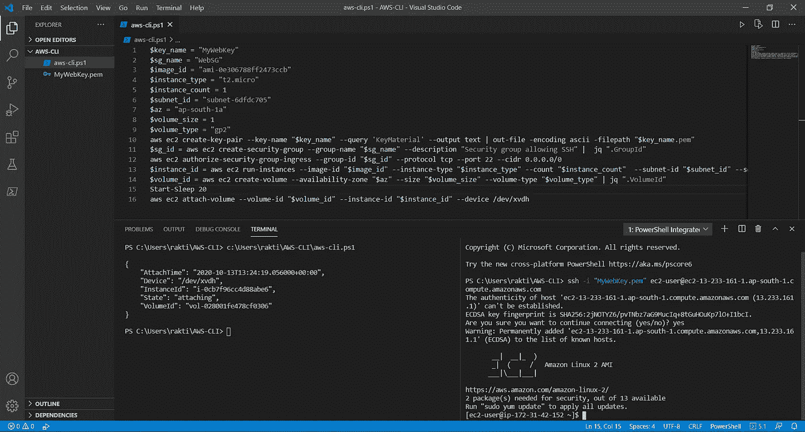

VS 代码截图

*   在左侧的**终端，您可以看到我运行了脚本，最后，我们可以看到我们最后一个命令**的输出，它是卷附加。这意味着我们之前的所有命令都成功运行。
*   **在右边的终端上，我们正在对实例执行 ssh，我们可以看到我们成功地执行了 SSH。**最后，为了确保 v **卷已经连接，在 EC2 实例中运行下面提到的 linux 命令。**

```
sudo su - root
fdisk -l 
```

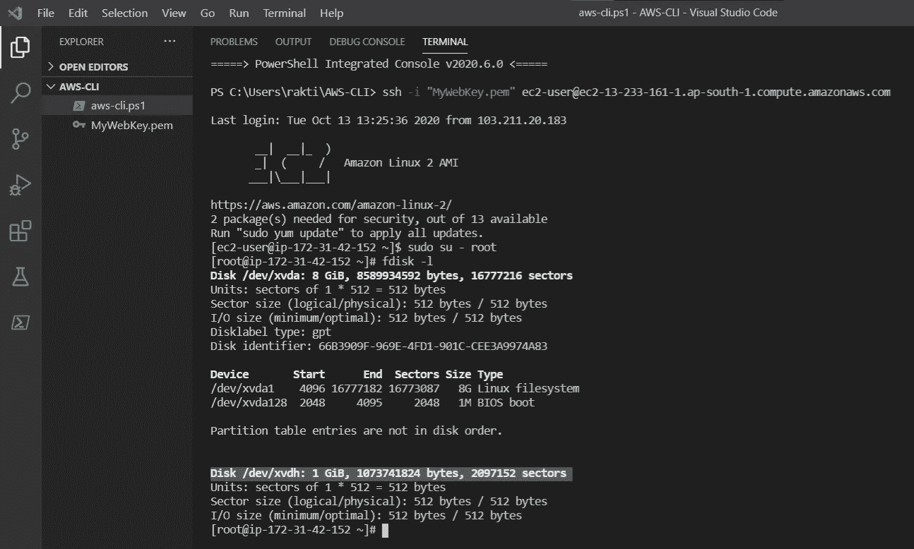

VS 代码截图

## 恭喜…我们已经成功完成了我们的实践，还学习了如何使用 AWS CLI、Windows PowerShell 脚本和 JQ 解析器。

# 最后的话:

*   **这是对这些工具的快速介绍。**这些工具**有无限的可能性**比如我们可以**通过添加更多 aws 命令来提供更多资源。**如果我们愿意，我们还可以做更多的**高级 Shell 脚本，因为它也是一种编程语言**，我们可以做几乎所有我们在其他编程语言上做的操作。
*   JQ 是一个非常有用的工具，我们每天都在使用它，因为在网络中我们总是需要使用 JSON。
*   我试图让它尽可能简单。希望你从这里学到了一些东西。请随意查看下面提到的我的 LinkedIn 个人资料，当然也可以随意发表评论。我写 DevOps，云计算，机器学习等等。博客，所以请随时关注我的媒体。

[](https://www.linkedin.com/in/raktim00/) [## 微软学习学生大使(Alpha) -微软学习学生大使 CEE |…

### ★我是一名技术爱好者，致力于更好地理解不同热门技术领域背后的核心概念…

www.linkedin.com](https://www.linkedin.com/in/raktim00/) 

感谢大家的阅读。就这样…结束…😊

*