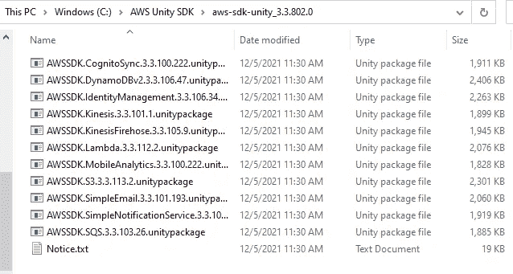
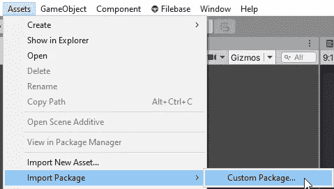
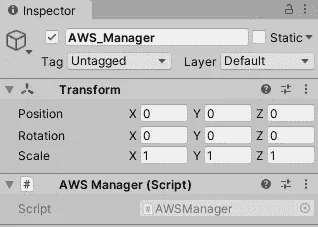
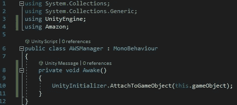
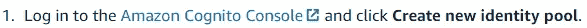
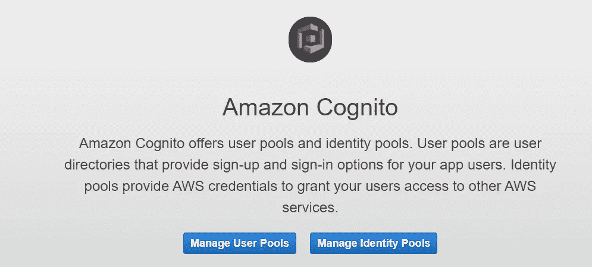
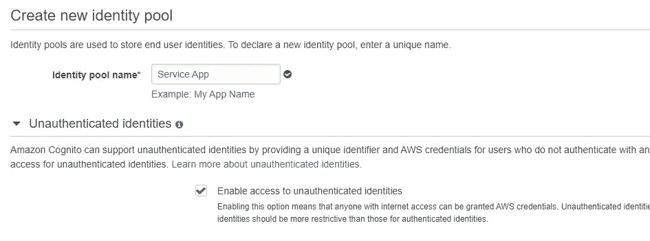
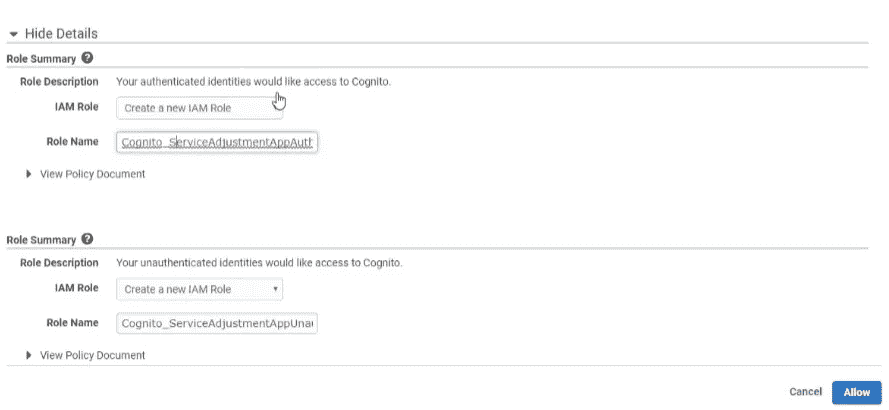

# 开始使用 AWS for Unity

> 原文：<https://medium.com/nerd-for-tech/getting-started-with-aws-for-unity-7c4bb2381d74?source=collection_archive---------5----------------------->

要开始使用 AWS for Unity，您可以查阅使用 AWS 的先决条件文档。

 [## 为 Unity 设置 AWS Mobile SDK

### 要开始使用 AWS Mobile SDK for Unity，您可以设置 SDK 并开始构建一个新项目，或者您可以…

docs.aws.amazon.com](https://docs.aws.amazon.com/mobile/sdkforunity/developerguide/setup-unity.html) 

您需要有一个 AWS 帐户，因此您需要登录或按照链接创建您的帐户。

登录或创建帐户后，您可以单击链接下载包含使用 AWS 所需软件包的 zip 文件。

您可以在文件中创建一个新文件夹，并解压缩您下载的 zip 文件。

我将使用 AWS SDK . s 3 . 3 . 3 . 113 . 2 . unity package。在您创建的 AWS 文件中找到您想要下载的包，打开并将其导入 unity。

安装好软件包后，创建一个新的名为 AWS_Manager 的空游戏对象。您将向游戏对象附加一个名为 AWS Manager 的新 C#脚本。

您将打开该脚本并使用 Amazon 名称空间通过 void Awake 方法初始化 AWS。

最后要做的是使用 Amazon Cognito 建立一个新的身份池。单击文档中的链接开始使用。

单击管理身份池按钮。

单击创建新的身份池。

您将创建一个名称，并决定是否允许未经验证的帐户访问。

创建池并允许未经身份验证和经过身份验证的帐户访问。

一旦您允许，您就可以开始使用 Unity 中的 AWS 服务。