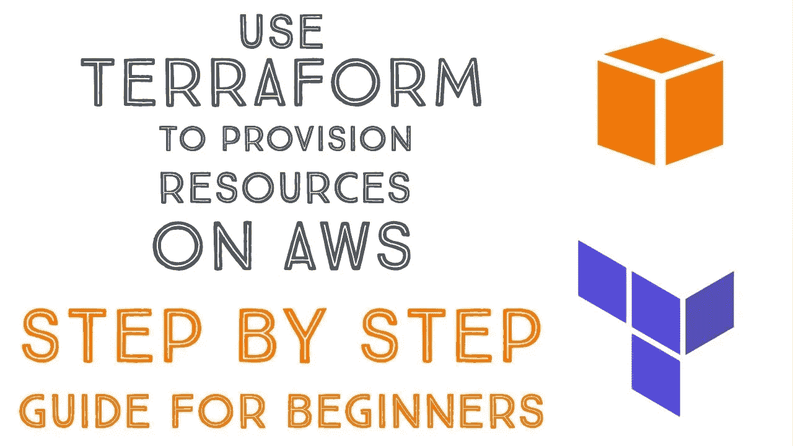
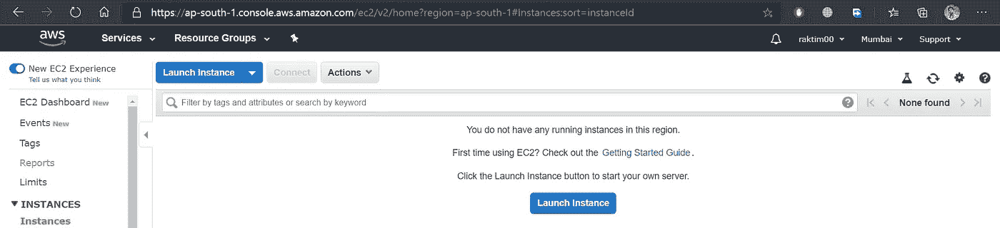
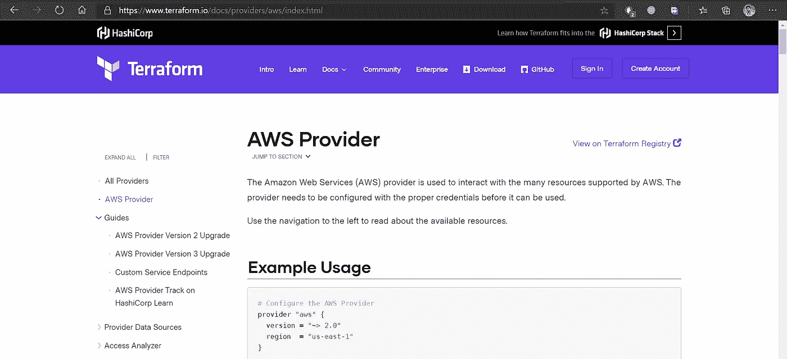
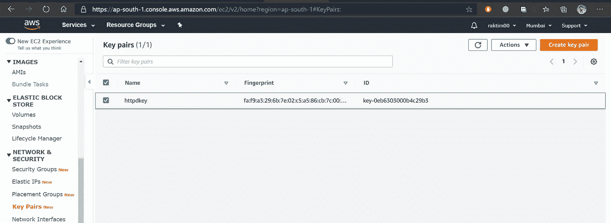
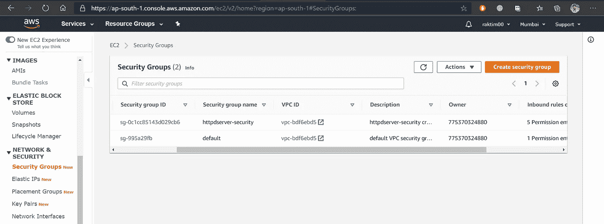
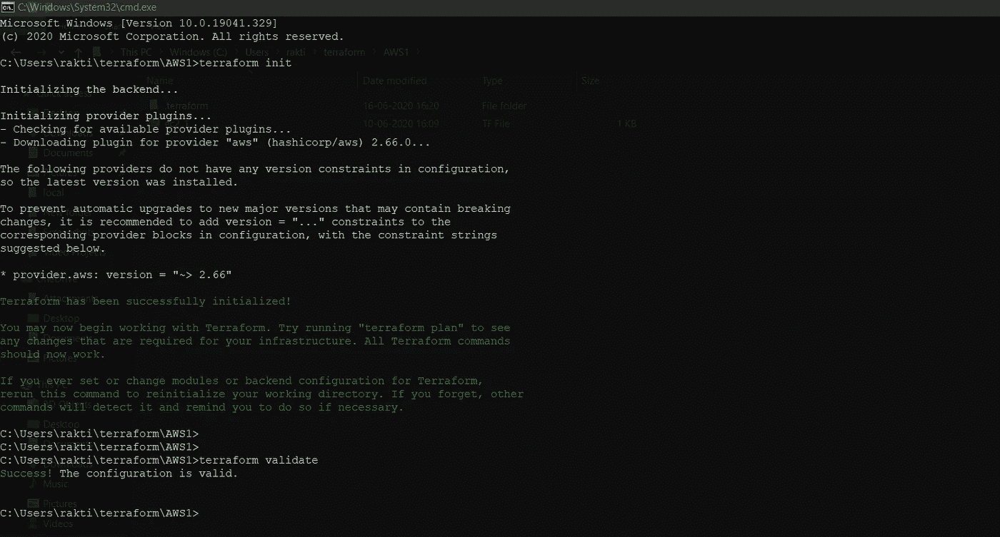
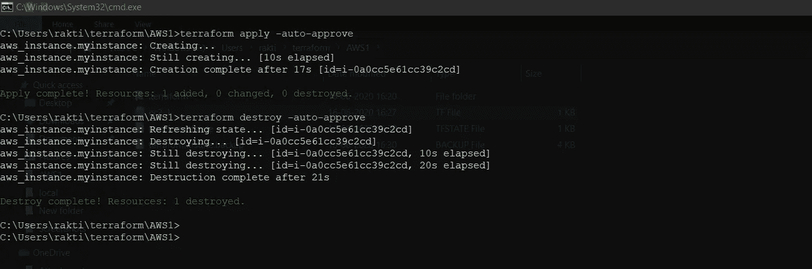

# AWS & Terraform 入门。

> 原文：<https://medium.com/nerd-for-tech/getting-started-with-aws-terraform-293e9125dff?source=collection_archive---------0----------------------->



# 什么是 AWS？

一个 ***mazon Web Services* 或俗称 AWS 是一个提供公共云计算基础设施的平台。**在 AWS 中，您可以在云上部署自己的应用程序。这意味着没有任何资源，如内存，CPU，硬盘等。您可以轻松托管您的 WebApp、网站、移动应用等。在 AWS 云上。AWS 最好的一点是它们便宜得多，因为它们在世界各地有 250 多个数据中心，所以它们在向客户交付应用程序方面要快得多。

# 什么是 Terraform？

erraform 是一个安全有效地构建、更改和版本化基础设施的工具。这意味着使用 Terraform，您可以轻松地构建大型复杂基础架构，如公共云基础架构，并且可以非常轻松地管理它们。Terraform 最棒的一点是，你不需要知道任何 AWS 命令，尤其是任何其他云计算命令来构建基础设施。Terraform 有自己的语言叫做 **HCL (HashiCorp 配置语言)。现在，只要知道这种语言，你就可以创建任何云计算基础设施，比如 AWS、GCP、AZURE、OpenStack 等等。**

是的，在不知道任何云命令的情况下，我们可以创建整个云设置，这听起来可能不现实。但是我向你保证，在读完这篇文章后，你将会了解 Terraform 的力量。

# 因此，让我们首先直接研究 AWS:

首先要做的事。让我们使用 Terraform 创建一个实例。你可以认为这个实例就像一个虚拟机，它将为我提供一个操作系统。首次登录 AWS 帐户时启动实例。接下来，转到 services，然后是 EC2，最后单击“running instances”。

在下面的截图中，您会看到我没有运行任何实例。



因此，我们只需点击 AWS WebUI 门户就可以轻松启动一个实例。但是我们要用地形来做。为什么是 Terraform？因为在 Terraform 中，我们创建了一个代码，您可以将这个代码视为文档。现在，假设将来您需要再次启动一个新实例。因此，下一次我们可以使用 Terraform 通过一次点击轻松启动同一个实例，而不是手动操作。

这是地形代码。我会解释它的每一点。我相信，在学习了这段代码之后，你将来编写任何 Terraform 代码都会得心应手。

**但在开始之前，我建议你浏览一下 YouTube 视频，并在你的系统中安装 Terraform 软件。一旦你完成了，我们就可以开始了。**

# 让我们看看 Terraform 网站上的文档:

如果你在网上搜索“Terraform AWS Provider ”,你会找到这个官方的 Terraform 文档。在这里，如果你阅读，你会知道在 Terraform 中，我们把每一个服务称为“提供者”。意味着您将何时构建基础架构，您希望在哪里构建？你喜欢在像 AWS、GCP、AZURE 等公共云上构建吗？或者在类似私有云的 OpenStack 中。因此，这里的提供商意味着您必须指定 Terraform 应该在哪里建立您的基础设施。



这是一个示例代码，它将在 AWS 云中创建一个实例。

*   现在让我们看看这段代码里有什么。第一件事:“提供商”，我已经跟你说过了。下一个区域意味着在 AWS 中我们有许多可用区域，在这里您必须指定您希望在哪个 AZ 中启动您的实例。下一个概要文件意味着您必须在本地系统中为 AWS 凭证创建一个概要文件。你可以在 YouTube 上找到很多关于如何制作的教程。
*   AWS 中的下一个资源意味着我们主要使用许多服务，因此这些资源意味着您想要使用哪些服务。因此，我选择“aws_instance ”,因为我们将启动一个实例。接下来，你要给出你作品的名字。为什么？因为每当我们在 AWS 中使用 Terraform 进行任何工作时，在完成工作后，next AWS 会在我的 Terraform 中存储一些关于该特定工作的数据。现在，将来如果我们需要收集一些关于这项工作的信息，我们只需使用这个“myinstance”。这是一种变量。
*   接下来启动实例，我们必须提供一些基本的东西，如你想使用哪个 ami id。AMI 的意思是亚马逊机器图像。意味着启动一个操作系统我们总是需要一个映像。这里我们使用了一个 Linux 映像。
*   下一个“实例类型”表示您想要创建哪种类型的实例。这里的类型意味着什么样的内存，CPU，网络带宽等。你愿意付出。因为我有一个免费帐户，这就是为什么我使用免费类型“t2.micro”。
*   下一个键名表示您想要使用哪个键。在这里，在提供密钥名之前，您应该在 EC2 中创建一个密钥对。只需转到 EC2，key-pair 中的下一个，并创建一个新密钥。接下来，为实例提供键名。你可以把它想象成你的电脑有一个用户 id 和密码来登录。因此，在未来，如果你想登录到实例，那么你将需要这个关键。



*   最后，“安全组”意味着你想提供哪种类型的安全。同样，在这里，您也必须转到 EC2，接下来是安全组，然后创建一个安全组。



*   接下来是标签，这是可选的，但在更大的基础架构中，我们可以借助这些标签来管理东西。

# 现在让我们使用 Terraform 构建这些实例:

所以，我现在一点一点告诉你你要做什么。你必须创建一个文件夹，在这个文件夹里写下这段代码，然后给出你的文件。tf 扩展。接下来，您必须在该文件夹上运行 terraform CMD。首先，您必须使用初始化 Terraform

```
terraform init
```

所以，这个命令将首先检查你正在使用的提供者，然后下载相应的插件。因为使用这些插件，Terraform 可以与 AWS 交互。

接下来，验证您的代码是一个很好的实践。这意味着如果有任何语法错误，它会显示出来。为了这种用途

```
terraform validate
```

在下图中，你会看到我运行了这两个命令。



接下来，我们将使用最后一个 CMD，这将创建我们完整的基础架构。CMD 是

```
terraform apply
```

它会要求你输入是，所以输入“是”。另外，如果你不想每次申请时都键入 yes，你可以使用

```
terraform apply -auto-approve
```

接下来，您将看到您的完整实例在 AWS 上启动。现在，如果您想要销毁实例或整个基础结构，请使用

```
terraform destroy
```

在下面这张图片中，你将能够看到如何去做。



这就是地形的力量。谢谢大家，结束了，拜拜👋。

