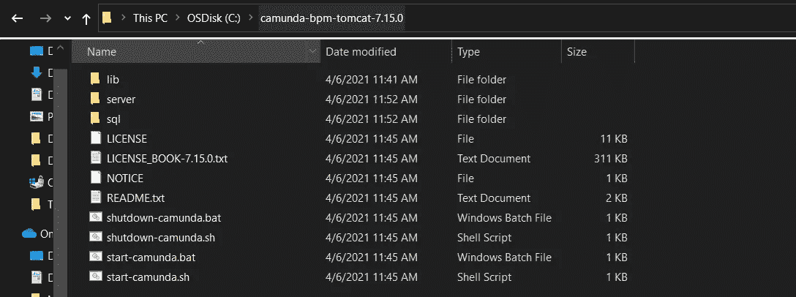
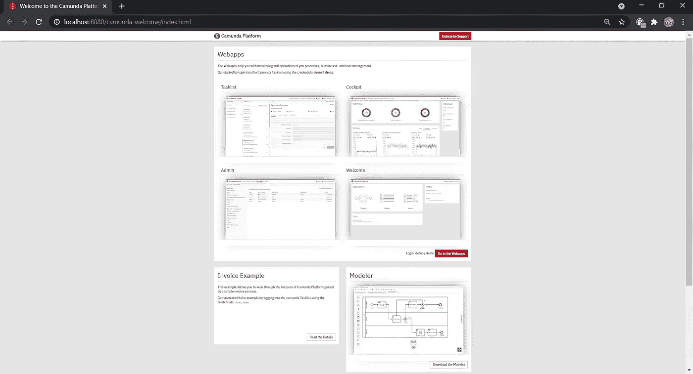
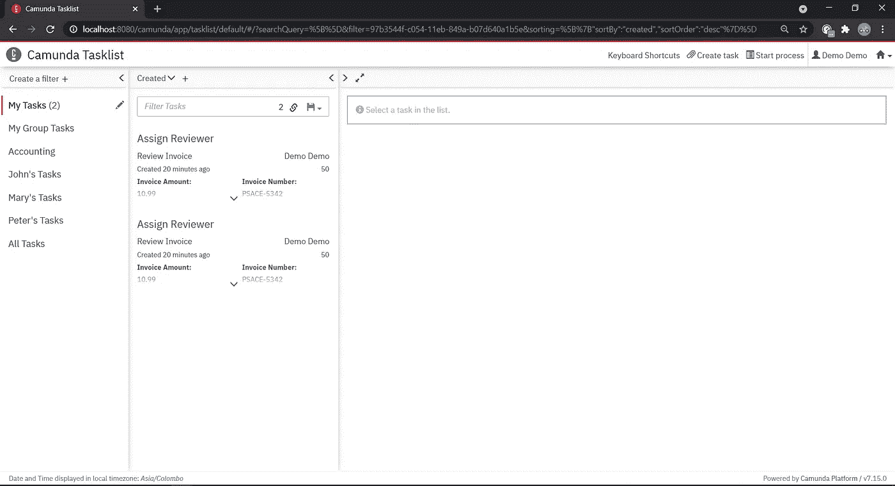
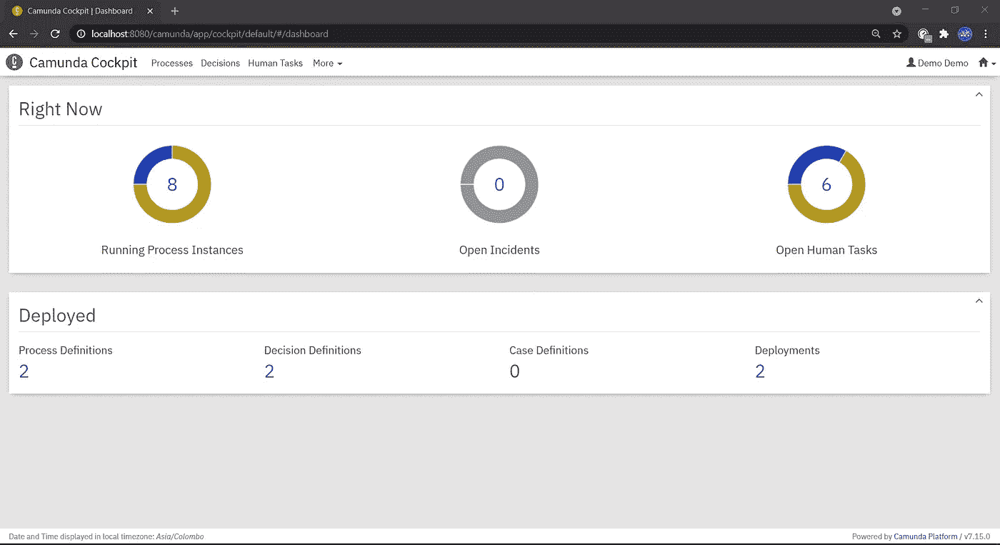

# Camunda 入门

> 原文：<https://medium.com/nerd-for-tech/getting-started-with-camunda-82b65df31f8c?source=collection_archive---------3----------------------->

*本文旨在提供关于业务流程管理、工作流、业务流程建模和 Camunda 的见解。*


卡蒙达

# 洞察业务流程

一个**业务流程**是一组利益相关者为实现一个精确目标而执行的一系列步骤。**业务流程**中的每个任务都与一个参与者相关联。此外,**业务流程**是几个相关概念的基础构件，例如**业务流程管理、流程自动化等。**

# **业务流程管理**

**业务流程管理**是一门学科，在这门学科中，一个组织将从整体和单独的角度审视其流程。它分析当前状态并确定需要改进的领域，以创建一个更加高效和有效的组织。

***业务流程管理(BPM)是一个组织如何创建、编辑和分析构成其业务核心的可预测流程。***

简单地说，组织中的每个部门都被指定负责获取一些原材料或数据，并将其转化为其他东西。每个部门可能处理十几个甚至更多的核心流程。

# 什么是工作流？

***工作流由一组技术和工具组成，使文档、信息、活动和任务在组织中适当地流动。***

它由描述流程任务的标准化符号组成，您可以从开始到结束一步一步地设计您的业务流程。此外，它还包括为每个定义的步骤指定的用户角色和职责。**工作流**有助于致力于流程的人们理解他们的角色和执行顺序。

理想情况下，工作流是**业务流程管理(BPM)** 为您的组织流程所能做的一小部分。

# 业务流程建模

业务流程建模或流程建模是一种图形化的表示，或者简单地说，是对一个组织的业务流程的说明。这使得它成为有效的业务流程管理(BPM)的关键组成部分。

*   **业务流程模型和符号(BPMN)** 是用于在业务流程模型中指定业务流程的图形表示。
*   **决策模型和符号(DMN)** 旨在与 **BPMN** 和/或 **CMMN** 一起工作，提供一种对与流程和案例相关的决策进行建模的机制。
*   **案例管理模型和符号(CMMN)** 是一个规范，它定义了一个通用的元模型和符号，用于建模和图形化地表达一个**案例**，以及在不同工具之间交换案例模型的交换格式。

# 卡蒙达是什么？

**Camunda** 是一个基于 Java 的开源框架，支持**工作流**的**业务流程 BPMN** 和**流程自动化、** **CMMN** 案例管理、和 **DMN** 业务决策管理。**工作流引擎**和**投诉决策引擎**可以嵌入到 Java 应用以及其他使用 **Camunda 公开的 **REST API** 的应用中。**

是时候把手弄脏了……..😉

****请注意:上机操作是在 Windows 环境下进行的。*

# 1.从以下链接安装适用于 Windows 环境的 Java JDK 8:

[](https://www.guru99.com/install-java.html) [## 如何在 Windows 中下载和安装 Java JDK 8

### 在本教程中，学习如何在 Windows 中下载和安装 Java JDK 8 并设置环境变量。

www.guru99.com](https://www.guru99.com/install-java.html) 

# 2.从以下链接下载 Camunda:

让我们来看看运行时嵌入 Apache Tomcat 服务器的 Camunda 开源社区版。

[https://downloads . cam unda . cloud/release/cam unda-BPM/Tomcat/7.15/cam unda-BPM-Tomcat-7 . 15 . 0 . zip](https://downloads.camunda.cloud/release/camunda-bpm/tomcat/7.15/camunda-bpm-tomcat-7.15.0.zip)

[](https://camunda.com/download/) [## 下载开源工作流软件| Camunda

### 卡蒙达平台运行引擎任务清单驾驶舱基本其他分布码头拉…

camunda.com](https://camunda.com/download/) 

# **3。在 Windows 环境下解压下载的‘cam unda-BPM-Tomcat-7 . 15 . 0 . zip’**



解压缩的 Camunda 文件夹

# 4.初创企业 Camunda

从这个位置***' C:\ cam unda-BPM-Tomcat-7 . 15 . 0 '，*** 打开一个命令提示符，执行下面的命令:

```
C:\camunda-bpm-tomcat-7.15.0>start-camunda.bat
```

# **5。欢迎来到卡蒙达**

一旦上述执行完成，Camunda 网页将在您的浏览器中自动打开。

[http://localhost:8080/cam unda-welcome/index . html](http://localhost:8080/camunda-welcome/index.html)



欢迎来到卡蒙达

有几个页面可用，使用**用户名/密码**作为**演示/演示进行导航。**

## Camunda 任务列表

任务列表是一个基于网络的应用程序，允许你处理用户任务。您可以使用以下 URL 访问**任务列表**:

[http://localhost:8080/cam unda/app/task list](http://localhost:8080/camunda/app/tasklist)



Camunda 任务列表

## 卡蒙达驾驶舱

**驾驶舱**是一个基于网络的应用程序，用于监控和操作。它提供对已部署的 **BPMN 流程**和 **DMN 决策**的访问，允许搜索正在运行和已结束的实例并对它们执行操作。您可以使用以下 URL 访问**驾驶舱**:

[http://localhost:8080/cam unda/app/cockpit/default/#/dashboard](http://localhost:8080/camunda/app/cockpit/default/#/dashboard)



卡蒙达驾驶舱

# 6.访问 Camunda 建模器

**Camunda Modeler** 是一个桌面应用程序，用于建模 **BPMN** 和 **DMN。**它允许你直接在你的本地文件系统上建模文件。

使用下面的链接下载 **Camunda Modeler** 并在 Windows 环境下运行***‘cam unda Modeler . exe’***。

[](https://camunda.com/download/modeler/) [## 下载卡蒙达 BPMN / DMN 流程建模器|卡蒙达

### BPMN DMN 下载和解压缩只是解压缩下载到一个文件夹中，你的选择。不需要额外安装…

camunda.com](https://camunda.com/download/modeler/) 

Camunda 建模器

为了设计和运行您的**工作流程**，请查看 [**卡蒙达官方文档**](https://docs.camunda.org/manual/7.15/) 上的 [**入门页面**](https://docs.camunda.org/get-started/quick-start/?__hstc=252030934.6852c56dde68a5f07e451d70b2475556.1620182370817.1622273516991.1622277334045.17&__hssc=252030934.4.1622277334045&__hsfp=322626364) 。

强烈推荐 [**Niall 和他的鹰派**](https://www.youtube.com/watch?v=l-sCUKQZ44s&list=PLJG25HlmvsOUnCziyJBWzcNh7RM5quTmv) 关于 Camunda 入门和实现**工作流的视频教程。**

# 结论

希望您已经对**业务流程管理、**和 **Camunda** 在您的 Windows 环境**上的入门演练有了透彻的了解。**


感谢阅读！😊

别忘了鼓掌👏请随时提供任何 feedback❤️

保持联系，获取更多信息。

# 参考

 [## 卡蒙达平台文档| docs.camunda.org

### 欢迎使用卡蒙达平台手册！Camunda 平台是一个轻量级、开源的业务流程平台…

docs.camunda.org](https://docs.camunda.org/manual/7.15/) [](https://kissflow.com/workflow/bpm/business-process-management-overview/) [## 业务流程管理(BPM) -定义、步骤和优势

### 在大多数组织中，管理业务流程是一个巨大的挑战。许多企业主认为这是一个巨大的…

kissflow.com](https://kissflow.com/workflow/bpm/business-process-management-overview/)  [## BPMN 规范-业务过程模型和符号

### 提供最准确和最新的信息，BPMN 2.0-BPMN.org 是你的官方 BPMN 资源…

www.bpmn.org](https://www.bpmn.org/) [](https://www.process.st/what-is-a-workflow/) [## 什么是工作流？简单的入门指南|流程街|清单、工作流程和…

### 如果你查看维基百科对工作流的定义，你可能会像我一样感到困惑:“工作流…

www.process.st](https://www.process.st/what-is-a-workflow/)