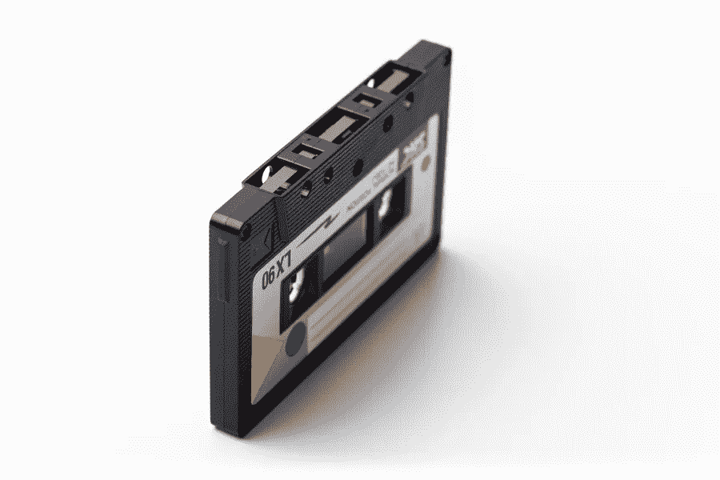
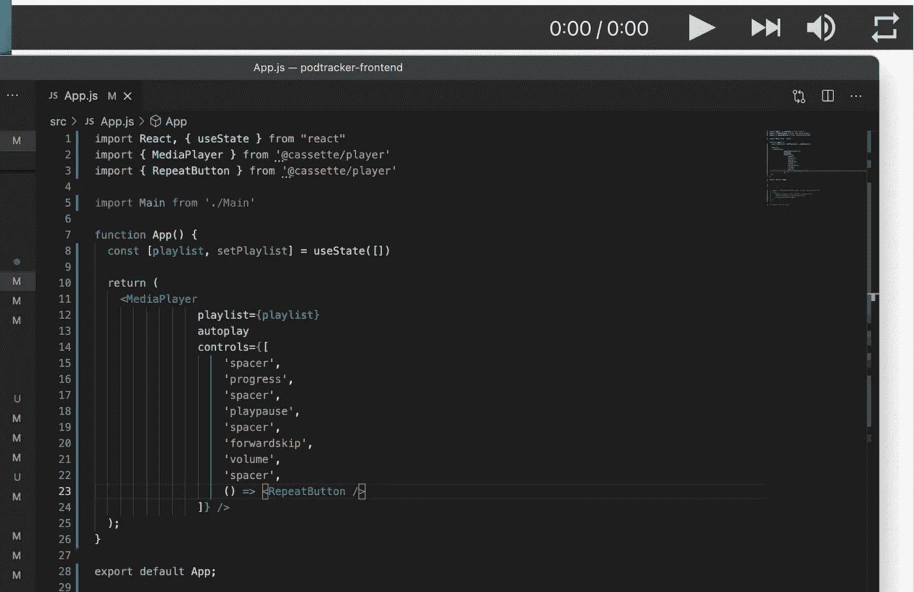
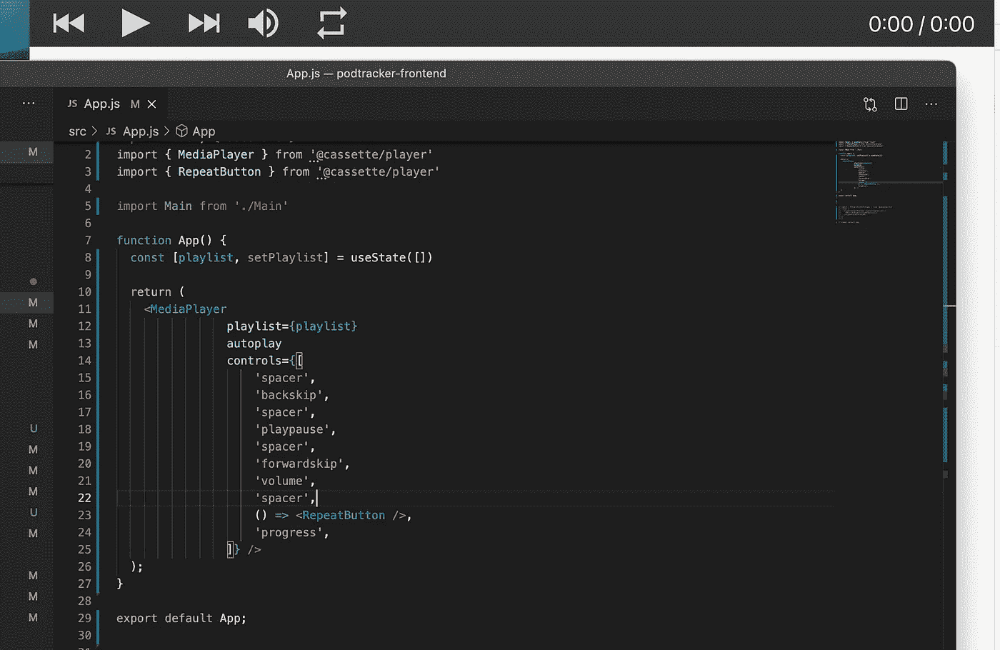
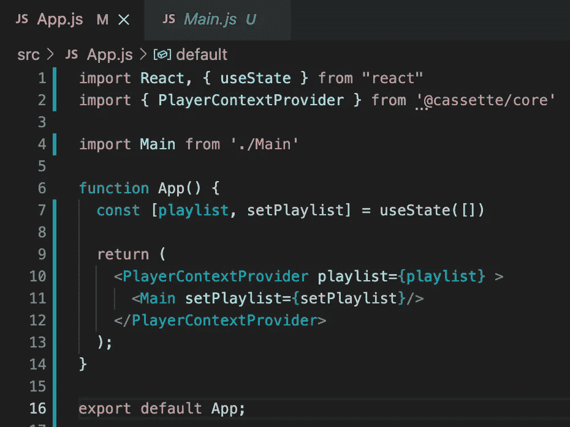
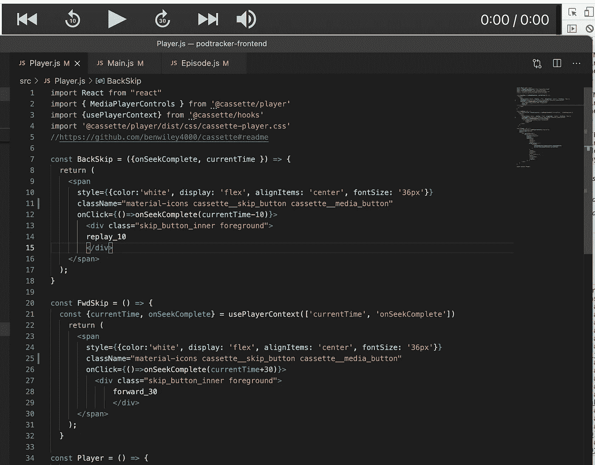
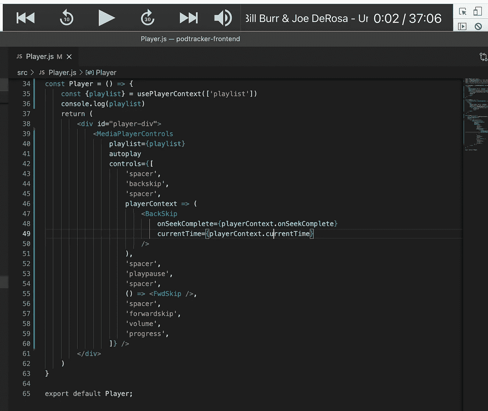
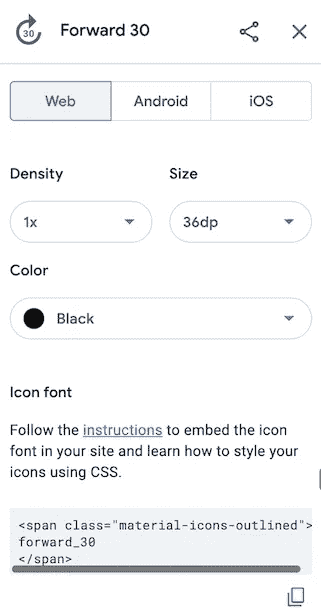

# 卡带入门—定制您的播放器

> 原文：<https://medium.com/nerd-for-tech/getting-started-with-cassette-customizing-your-player-817e31eac7dc?source=collection_archive---------25----------------------->



去 Github 上看看卡带吧！

Cassette 是一个 React 组件库，允许您非常容易地将媒体播放器功能添加到您的网站。它开箱即用，但你也可以建立自定义功能，您可以添加到播放器，以满足您的需求-这是令人难以置信的灵活性。

你可以在这里 找到卡带的 Github 页面(由 Ben Wiley 编写) [**，在这里**](https://github.com/benwiley4000/cassette) 也有完整的文档页面 [**。我建议大家都去看看 Github 页面上有一些使用 Cassette 可以做什么的例子，文档中也有很多有用的信息。**](https://benwiley4000.github.io/cassette/styleguide/)

虽然文档非常全面，但我承认我很难理解如何使用其中的一些功能，所以希望下面的例子能帮助其他卡带新手更快适应。我绝不是专家，但事情似乎到目前为止工作——如果你发现下面的任何不正确的或可以改进的地方，我很乐意听到它！

**入门**

盒式磁带由四个组件组成——核心、播放器、挂钩和组件。核心就是给你 React 组件来构建和与玩家一起工作。播放器包是给你提供现成的播放器组件，我们将定制。钩子包给了你一个非常有用的钩子来访问和改变玩家状态，就像 React Context 一样。最后，组件包给了你一些额外的玩家定制选项，我个人还没有用过。

您可以通过在终端中运行以下命令来安装我在上面使用的软件包-

```
npm install @cassette/core @cassette/player @cassette/hooks 
```

盒式磁带开箱即可使用——这里有几个例子说明如何定制它来满足您的需求。网页只有播放器栏在顶部，所以我包括了播放器栏的样子，以及与每个相关的代码。



MediaPlayer 示例 1

我们在第 2 行导入 MediaPlayer 来获取播放器，还有第 3 行的 RepeatButton，这是您可以添加到播放器的几个额外的自定义按钮之一——您可以在官方文档中查看这些按钮的完整列表。

MediaPlayer 获取了一个播放列表属性，我将它存储为 state——这将是一个 track 对象数组，我们稍后再来讨论。在您的道具中包含自动播放功能将导致播放器在页面加载时开始播放播放列表中的任何内容，但请注意，这不会导致播放器在您稍后向播放列表添加曲目时开始播放。Controls 是一个数组，按照在数组中声明的顺序表示播放器上的按钮。在这个例子中，我们以一个间隔符开始(栏中的一个空格，这样按钮就不会粘在一起)，然后是播放器上每个按钮的名称，每个按钮都用间隔符隔开，并按照它们各自的值在数组中出现的顺序排列。

您会注意到 Repeat 按钮的格式有点不同，因为它不是 Controls 数组的默认值，而是您可以导入的额外自定义组件。如果您使用的是导入的组件，比如 repeat 按钮，或者您自己的定制组件，我们稍后会讨论，您需要使用箭头符号来声明它们，如第 23 行所示。让我们看一个不同的例子。



示例 2

这里唯一的变化是控件数组中的值的顺序——注意我们能够多么容易地改变播放器布局！

这是内置控制值的完整列表。

**PlayerContextProvider 和 MediaPlayerControls**

上面的媒体播放器很方便，但是如果你想定制播放器，你需要利用这些组件。

首先，你需要用一个<playercontextprovider playlist="{playlist}">组件来包装你的应用程序的任何部分，并在其中声明你的播放列表。根据我的经验，播放列表需要在这个组件中声明，否则播放器不会呈现，尽管我不完全确定是否总是这样。我使用 state 来保存播放列表，因为我将在我的站点中向播放列表添加曲目—我传递了 setPlaylist 方法，但是可以使用 usePlayerContext 挂钩来访问播放列表属性，我们很快就会看到这一点。主组件包含了我的整个站点。</playercontextprovider>



为我的整个应用程序提供 playerContext。

一旦您设置了 PlayerContextProvider，您就可以使用 MediaPlayerControls 组件来创建您的播放器，这使我们能够使用 playerContext 及其所有属性(此处列出了)。

在下面的代码中，您将看到自定义组件向后跳过 10 秒或向前跳过 30 秒，以及如何使用 usePlayerContext 挂钩，该挂钩从 PlayerContextProvider 的子应用程序中的任何位置获取 PlayerContext。另外，一个关于使用材质 UI 按钮的快速教程，这是我得到步进按钮的地方。



带有自定义按钮声明的 MediaPlayerControls 控件

首先是进口。我们现在导入 MediaPlayerControls 而不是 MediaPlayer，随着这一变化，我们需要在第 4 行包含导入，以使 CSS 正确格式化播放器。我们还导入了 usePlayerContext 挂钩，用于 FwdSkip 按钮。BackSkip 按钮是通过 props 而不是上下文实现的。让我们先讨论一下 skip 按钮的功能，然后我们再回到样式上来。

Skip 功能需要两个 playerContext 值(同样，您可以在这里查看完整的值列表),这两个值是从第 46 行到第 51 行的 MediaPlayerControls 组件传递过来的。currentTime 告诉你当前曲目的播放时间(以秒为单位),当用整数值调用 onSeekComplete 时，将以秒为单位搜索到该时间的曲目。在第 12 行，我调用 onSeekComplete 到当前时间减 10 秒，这将使轨道后退 10 秒。

FwdSkip 方法以同样的方式工作，正如您在第 26 行看到的，但是在这里，我们没有向下传递 playerContext，而是在第 55 行的 controls 数组中只包含了 FwdSkip 组件。回到第 21 行，我们使用析构符号，使用 usePlayerContext 从父组件 PlayerContextProvider 中提取 PlayerContext 值。注意任何所需的 playerContext 值都必须作为字符串值包含在 usePlayerContext([])数组中。我们现在对 currentTime 和 onSeekComplete 方法有相同的访问权限，允许我们在曲目中向前跳过 30 秒。

**素材 UI 和播放器造型**

素材 UI 已经用于卡带中的一些播放器按钮，所以我照着做了，并在同一个地方找到了时间跳跃按钮——你可以在[这个页面](https://fonts.google.com/icons)上查看所有的素材图标——音频&视频部分在这种情况下特别有用。当然，查看官方文档的材料图标[这里](https://material-ui.com/components/icons/)！

要使用材质图标，你需要做的就是将这一行添加到 react 项目的公共文件夹中的 index.html 中的

```
<link rel="stylesheet" href="https://fonts.googleapis.com/icon?family=Material+Icons" />
```



然后你可以点击我上面链接的页面上的任何图标来找到你选择的图标的代码，如这里左边所示。您将看到代码段中列出的 span 显示了一个类名“material-icons-outlined”，这是这个按钮的不同版本(我使用的是无轮廓的那个)，但是过程是相同的。在应用程序中使用上面的样式表，这行代码看起来就像你在图片左上角看到的图标一样。

最后，第 10 行的样式、第 13 行的 div 和第 11 行列出的“材质图标”之后的类都是从播放器内置按钮的 CSS 中复制的，所以我的按钮与播放器的整体样式相匹配。

我希望这是一个有用的卡带播放器定制演练！