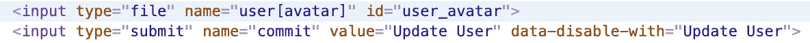
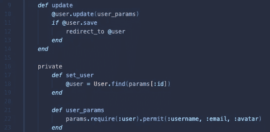

# Ruby on Rails 6 中的 Cloudinary 入门

> 原文：<https://medium.com/nerd-for-tech/getting-started-with-cloudinary-in-ruby-on-rails-6-925888032395?source=collection_archive---------2----------------------->


[阮卡洛斯](https://unsplash.com/@rcpolski?utm_source=medium&utm_medium=referral)在 [Unsplash](https://unsplash.com?utm_source=medium&utm_medium=referral) 上拍照

图像和文件存储是每个称职的网站或应用程序都需要跨越的障碍。Cloudinary 是一个强大的工具，可以轻松实现文件上传和引用任务，并且是一个免费层，允许开发人员在将其功能部署到生产部署之前学习这些工具。在 Rails 6 中，我们可以使用现有的活动存储框架干净地连接到 Cloudinary，并允许我们的用户无缝地将图像和文件上传到我们的应用程序。Cloudinary 文档和博客非常广泛，信息量也很大，但是，在用 Rails 6 设置 gem 时，我仍然遇到了一些障碍。在这篇文章中，我将解决设置的基本问题，并整合更深入这些细节的最佳帖子。

## 安装宝石

首先，让我们建立宝石。对于我的例子，我将使用 Ruby 2.7.2 和 Rails 6.1.3。对于 Rails 6，我们可以在终端中使用以下命令安装 gem:

```
$ gem install cloudinary
```

只要我们运行的是 Rails 3.x 或更高版本，我们就可以将 gem 添加到我们的`Gemfile`并运行`bundle install`:

```
gem 'cloudinary'
```

查看官方 gem 的 [Github repo](https://github.com/cloudinary/cloudinary_gem) 的[自述文件](https://github.com/cloudinary/cloudinary_gem)，了解更多关于安装的信息。

在下一步之前，您需要在这里注册一个免费的 Cloudinary 帐户[。](https://cloudinary.com/)

## 配置活动记录以使用 Cloudinary 服务

接下来，我们必须确保我们的 Rails 应用程序使用它的内置框架、活动存储，并且它连接到 Cloudinary 来存储文件，而不是本地机器上的文件夹。

活动记录的设置非常简单，激活后会自动进行一些更改。让我们从安装活动存储开始，从根目录运行以下代码行:

```
$ bin/rails active_storage:install
```

这将在`db/migrate`中生成一个新的迁移文件。为了运行这个迁移，从而将这些新表添加到我们的数据库中，我们运行:

```
$ rake db:migrate
```

活动存储使用两个主表来跟踪存储在对象上的数据:`active_storage_blobs`和`active_storage_attachments`。后者使用多态引用列，这意味着它可以引用数据库中的多种对象。但是，如果您使用的型号更改了名称，您的迁移将必须重新运行，以便活动存储继续工作。[导轨](https://edgeguides.rubyonrails.org/active_storage_overview.html)在此设置的边缘情况下相当全面。

我们需要更改一些文件来完成与我们的 Cloudinary 帐户的连接。

在 Rails 6 中，我们将在我们的`config`文件夹`config/cloudinary.yml`中使用一个`.yml`文件。在这里，我们可以为每个环境指定连接细节。

```
---
development:
  cloud_name: bm4l2f1pq
  api_key: '384786930741074'
  api_secret: "-LladYP3cuLWz1QM3o_wpofEaWI"
  enhance_image_tag: true
  static_file_support: false
production:
  cloud_name: bm4l2f1pq
  api_key: '384786930741074'
  api_secret: "-LladYP3cuLWz1QM3o_wpofEaWI"
  enhance_image_tag: true
  static_file_support: true
test:
  cloud_name: bm4l2f1pq
  api_key: '384786930741074'
  api_secret: "-LladYP3cuLWz1QM3o_wpofEaWI"
  enhance_image_tag: true
  static_file_support: false
```

在您的 Cloudinary 仪表板上，该文件可以自动生成，并与您的帐户详细信息一起下载，然后直接放入您的`config`文件夹:


接下来，我们必须告诉活动存储使用 Cloudinary 来存储文件，而不是本地存储。让我们首先在`config/storage.yml`文件中将`cloudinary`声明为服务:

```
cloudinary:
  service: Cloudinary
```

如果需要特定于环境的定制，这可以在以后扩展，但是现在，这足以让服务启动并运行。

最后，我们需要在`config/environments/development.rb`中更新我们的环境:

```
config.active_storage.service = :cloudinary
```

该设置必须与`config/storage.yml`文件中的声明相匹配。它甚至有这样的评论:

```
*# Store uploaded files on the local file system (see config/storage.yml for options).*
```

现在，我们应该可以使用我们的 Cloudinary 帐户接受、存储和交付图像和其他媒体文件到我们的应用程序。

## 将它们放在一起:活动存储和云计算

现在我们已经配置了应用程序，我们可以使用一个宏来设置我们的一个模型使用活动存储。如果我们希望允许用户为他们的帐户上传头像图像，我们可以像这样设置我们的模型`models/user.rb`:

```
class User < ApplicationRecord
    has_one_attached :avatar
end
```

在这种情况下，`:avatar`是指我们将附加的文件的标识符。我们可以随意命名它，但是我们稍后将使用这个标识符！这就是让活动存储发挥作用，活动存储库中还有许多其他工具。一定要看一下[文档](https://edgeguides.rubyonrails.org/active_storage_overview.html)。

## 使用 Rails 表单生成器上传文件

现在我们已经安装并配置好了所有的东西，我们终于可以开始在表单上工作了，向用户对象添加一个头像图片附件。让我们在`edit.html.erb`文件中使用一个[表单生成器](https://guides.rubyonrails.org/form_helpers.html):

```
<%= form_for @user *do* |f| %>
    <%= f.file_field :avatar %>
    <%= f.submit "Update User" %>
<% end %>
```

这会生成一个超级简单的 HTML 表单供活动存储使用:



在我们的`users_controller.rb`文件中，我们简单地将`:avatar`参数添加到我们允许的参数列表中:



提交后，该表单会自动将所选文件上传到您的 Cloudinary 帐户的根目录，并创建适当的活动存储数据库条目，以将该文件绑定到我们的用户。

`active_storage_attachments`，我们的主动存储迁移创建的表现在充当用户表和`active_storage_blobs`表之间的连接表。引用的 blob 将存储一些重要的数据点:

*   `:key` -这将在以后被 Cloudinary 用来引用存储的信息。
*   `:filename` -上传文件的原始名称。
*   `:content_type` -正在存储的文件类型。
*   `:service_name` -如果一切设置正确，应该显示“cloudinary”。

当您在一个对象上有一个附加文件时，就像我们的用户示例一样，我们可以使用我们在前面的`rails console`中定义的标识符在数据库中检查这些条目:

```
$ User.first.avatar_blob 
#<ActiveStorage::Blob:0x00007f97c92684b0> {
              :id => 11,
             :key => "1i7pq5wwbg5harkjsv5dhh8j4dpt",
        :filename => "profile_pic.jpg",
    :content_type => "image/jpg",
        :metadata => {
        "identified" => true,
          "analyzed" => true
    },
    :service_name => "cloudinary",
       :byte_size => 94559,
        :checksum => "jqMqh+i6HnjegqnVe7h2Og==",
      :created_at => Sun, 07 Mar 2021 18:40:39.646523000 UTC +00:00
}
=> nil
```

`:key`属性与您的 Cloudinary 媒体库中可见的文件相关。

## 请求从 Cloudinary 返回附加图像

Cloudinary 是一个强大的工具，允许开发人员在媒体被发送到您的视图之前对其进行转换。一个常见的用例是存储大照片，但只在需要时下载小版本的缩略图或个人资料照片。对于最终用户来说，这将使你的页面更加整洁。尽管这些工具很有用，但有一些细节没有真正解释清楚，而且第一次使用时可能会很棘手。

Cloudinary 使用请求 URL 中包含的数据进行适当的转换，然后发送回转换后的照片。Cloudinary 添加了一些有用的宏和方法，帮助我们以编程方式构建这些 URL:

```
<% *if* @user.avatar.attached? %>
    <%= cl_image_tag @user.avatar.key, :width=>150, :crop=>"fill" %>
<% end %>
```

会生成类似这样的 HTML:

```

```

我们可以探索和利用一些其他的助手。例如，我们也可以用活动记录对象`.url`生成器直接生成这个 URL:

```
150, :crop=>"fill") %>>
```

注意我们的`:width`和`:crop`参数是如何在 URL 中被转换成`[c_fill,w_150](http://res.cloudinary.com/dn4l2f1ea/image/upload/c_fill,w_150/xodacelv7zuttaq3yl6udy0f6l8t.jpg)`的。这告诉 Cloudinary 在将图像发送到浏览器之前应用这种裁剪，并将图像的宽度缩小到 150px。它还告诉``单独显示宽度为 150 像素的图像。

**** * *此阶段可能出现的几个问题******

*   总是在浏览器的检查器中检查你的元素，确保你的转换进入了`img`标签的 URL！有时可能会有语法错误，直到浏览器才会调整图像的大小，这意味着您仍然在加载完整的图像！
*   有时，忽略某些属性会导致 URL 不采用正确的转换键。例如，在声明`:width`或`:height`时，必须包含一个`:crop`标签。
*   我在第一个要传递给`cl_image_tag`的参数上看到了不同的指令，但是它似乎应该总是存储在活动存储 Blob 中的键。第一个参数中的键或其他任何东西都会直接插入到 url 中。

```
<%= cl_image_tag @user.avatar %>
```

将被错误地解析为:

```

```

在这种情况下，实际的活动存储对象被插入到 URL 中，显然破坏了代码，但是在初始标记中使用`@user.avatar.key`可以修复这一点。在不同的情况下还可以使用其他的标签。就像大多数 Ruby Gems 一样，您可以挖掘隐藏在引擎盖下的“魔力”,找出代码真正在做什么，以便更好地编写和理解表面代码。

利用 Cloudinary 网站上的工具或文档中的[这里的](https://cloudinary.com/documentation/rails_image_manipulation),花点时间探索一下 cloud inary 可用的转换范围。有几个助手方法与宝石一起被发现，所以尽情享受吧！我仍然发现有必要密切跟踪所有活动的部分，以确保事情顺利进行，但最终的回报是巨大的！

## 结论

这仅仅是主动存储和云计算的皮毛，但我希望这些信息对您有用！

[](https://github.com/cloudinary/cloudinary_gem) [## cloudinary/cloudinary_gem

### Cloudinary 是一种云服务，为 web 应用程序的整个图像管理管道提供解决方案。很容易…

github.com](https://github.com/cloudinary/cloudinary_gem) [](https://edgeguides.rubyonrails.org/active_storage_overview.html) [## 活动存储概述- Ruby on Rails 指南

### 活动存储概述本指南介绍如何将文件附加到活动记录模型。阅读本指南后，您…

edgeguides.rubyonrails.org](https://edgeguides.rubyonrails.org/active_storage_overview.html) [](https://cloudinary.com/documentation/rails_image_manipulation) [## Rails 图像转换| Cloudinary

### 在您或您的用户将图像资产上传到 Cloudinary 后，您可以通过动态 URL 交付它们。你可以…

cloudinary.com](https://cloudinary.com/documentation/rails_image_manipulation)  [## 方法:CloudinaryHelper#cl_image_tag

### Rails image_tag 助手的替代，它接受各种转换选项。获取公共 ID，可能是…

www.rubydoc.info](https://www.rubydoc.info/github/cloudinary/cloudinary_gem/CloudinaryHelper:cl_image_tag) [](https://devcenter.heroku.com/articles/cloudinary) [## 云-图像和视频管理

### 管理、优化和交付高性能图像和视频体验。Cloudinary 是一种云服务，它提供了…

devcenter.heroku.com](https://devcenter.heroku.com/articles/cloudinary)