# Docker 入门并在其中运行 GUI 应用程序

> 原文：<https://medium.com/nerd-for-tech/getting-started-with-docker-running-gui-application-inside-it-c50d2190a2ed?source=collection_archive---------1----------------------->


## 大多数情况下，我们在 Docker 容器中运行我们的服务器或任务，但是想象一下——我们甚至可以在 Docker 容器中启动 GUI 应用程序，并且可以从 Docker 主机系统访问它们。请继续关注我，直到这篇博客结束，来学习 Docker 的基础知识&如何实现这个奇妙的实用…

# 码头工人:

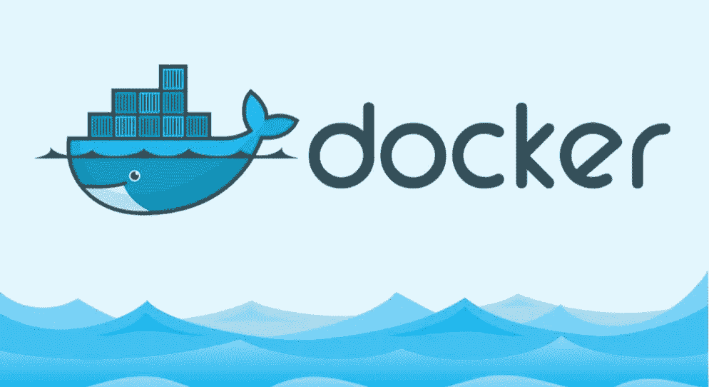

Docker 标志，来源:谷歌

2013 年，Solomon Hykes 推出了数十年来最大的创新产品，名为 **Docker** &，两年内 **docker &集装箱技术成为业内要求最高的技术。**

*   以前，在虚拟机或云计算上配置和设置服务器需要 10 到 15 分钟，而 **Docker 只需 1 到 2 秒钟就能启动带有预配置服务器的整个操作系统。**行业开始蓬勃发展&每个公司都开始实施 DevOps 解决方案，如容器技术。
*   与此同时，Docker 也开始改进& **那时 Docker 最大的利润是——它是一个开源产品。**意味着成千上万的技术人员开始在 Docker 上实现新的想法&这些年来，Docker 也开始改进。
*   今天，容器技术如此强大，它可以做我们想做的每一件事。**我们可以使用 Kubernetes 集群、存储集群、数据库集群、计算集群、网络集群等容器来设置多节点集群。**事实上现在**容器技术是如此强大**以至于我们甚至可以**在其中设置整个私有云计算**。
*   容器技术有无限的可能性，但在这篇博客中，我将谈论 Docker 容器的一个非常有趣的可能性，那就是**我们将运行 GUI 应用程序，如 firefox、gedit 等。码头集装箱内。**

> **注意:我将首先谈论 Docker 的基础知识，这样任何正在阅读这篇博客的人都可以学习这个神奇的工具。**

# 什么是容器？

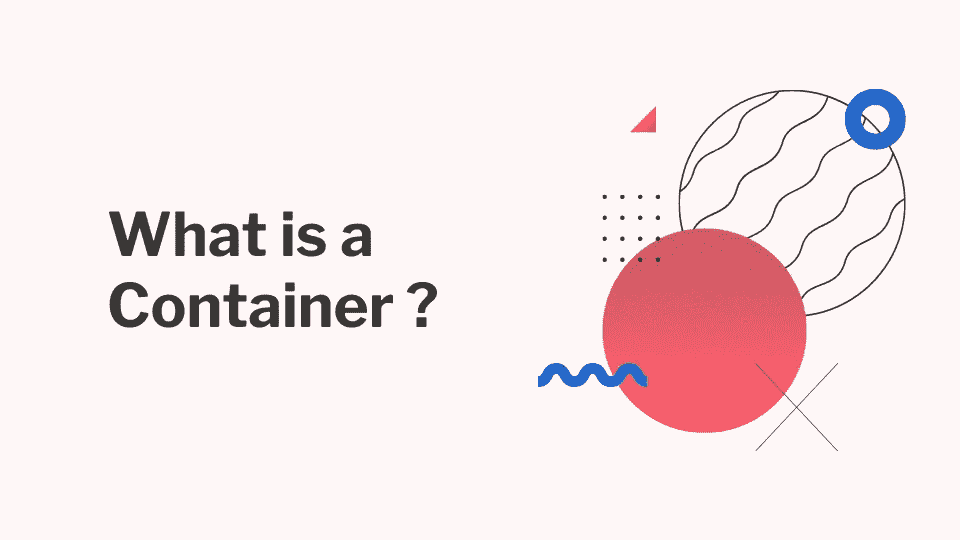

使用 Canva 自制

让我们这样想——我们为什么需要操作系统？

*   因为我们想在里面运行一些程序。操作系统有能力连接硬件来运行我们的程序。现在根据限制，我们在特定的时间点只能在一个 RAM & CPU 上运行一个操作系统。
*   如果你注意到这个限制，那么你会一直觉得你的资源被浪费了，因为大多数时候我们没有利用我们购买的全部硬件。为了克服这一限制的挑战，工程师们提出了名为虚拟化的解决方案。虚拟化意味着我们将虚拟地创建硬件空间，这样我们就可以在一个硬件上运行多个操作系统。
*   这在一定程度上解决了资源浪费的挑战，但最终**它花费了太多的时间来配置、设置虚拟机&然后运行程序等。**最后，如果你再次思考为什么我们需要操作系统的第一个问题，答案总是一样的，我们想运行一些程序&没有操作系统就不可能运行任何程序。
*   那么**为什么要浪费时间来配置操作系统呢？**为了解决这个问题，行业开始使用容器技术。**容器技术最棒的部分是它可以在一两秒钟内启动&登录到一个全新的操作系统。**此外，如果您有预先配置的 Docker 映像，那么您可以在几秒钟内启动整个操作系统以及正在运行的服务器。
*   容器就像一个运行应用程序的隔离环境。这就像你的系统中有多个虚拟机一样。与 VM 类似，**容器也有自己的特定于操作系统的命令、自己的网卡、自己的特定于操作系统的文件&文件夹、自己的进程、自己的存储等等。**

# 让我们来看看实际情况:

*   请记住一件事，如果您想进行虚拟化，那么您需要在您的系统上安装至少一个虚拟化软件，如 Oracle VirtualBox、Hyper-V、VM-Ware、KVM 等。类似地，如果你**想要集装箱化，那么你需要相应的软件**。
*   有许多程序具有创建容器的能力，如 Docker、CRI-O、Podman、Rocket 等。但是在这篇博客中，我们的重点是 Docker 技术。**先从安装 Docker 的软件开始。**现在 Docker 有两个版本——**社区版**免费使用& **企业版**需要许可证才能使用。**我们准备用 Docker 社区版(docker-ce)。**

# 先决条件:

虽然我们可以在 Windows 系统中运行 Docker，但是我将使用 Linux 操作系统作为我的 Docker 主机。表示我将在我的 RedHat Linux 8 系统上安装 Docker 软件。如果你没有 RHEL8 系统，那么你也可以使用 CentOS/Fedora 系统。

我使用的是 Windows 系统&我安装了 Oracle VirtualBox 软件，其中有一个 RHEL8 虚拟机。这将是我的码头主人。你可以使用任何 Linux 操作系统来安装 Docker，但是基于 Linux 发行版的风格，Docker 的安装过程会有所不同。但是一旦我们安装了 Docker，那么无论你使用什么操作系统，一切都是一样的。

> **注意:我没有展示如何安装 Docker，因为 Google 上有很多关于“如何在 CentOS8/RHEL8 上安装 docker-ce”的文章。只需关注其中任何一个&供参考我分享一个链接——**[**https://www . linuxtechi . com/install-docker-ce-centos-8-rhel-8/**](https://www.linuxtechi.com/install-docker-ce-centos-8-rhel-8/)

**下载&安装 docker 软件后，启动 Docker 服务。**

# 什么是 Docker 图像？

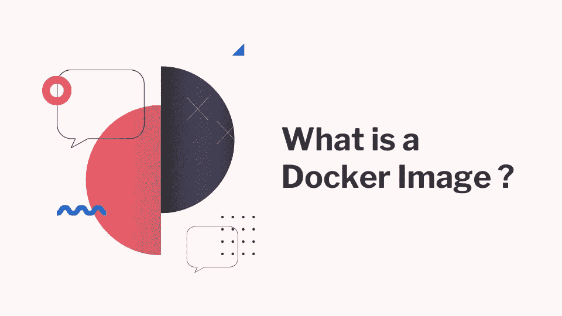

使用 Canva 自制

要安装任何操作系统，我们需要各自的图像。映像包含运行特定操作系统所需的所有数据。

*   类似地，要启动 Docker 容器或操作系统，我们需要使用 Docker 映像。Docker 储存库中有成千上万的图像，称为**Docker Hub—**[**https://hub.docker.com/**](https://hub.docker.com/)**。**
*   Docker Hub 上的大部分图片都是免费使用的。假设我们想要一个 **Ubuntu 18.04 操作系统**，然后使用 Docker 启动它，我们首先需要 Ubuntu 18.04 的 Docker 映像。**去 Docker Hub &搜索“Ubuntu”&你会找到官方图片。**

现在，我们将使用 Docker 在我们的本地系统上下载该映像，在我的例子中，它是 RHEL8 系统，这是我的 Docker 主机。运行下面提到的命令下载图像…

```
docker pull ubuntu:18.04
```

接下来，您将看到下面截图中提到的输出…

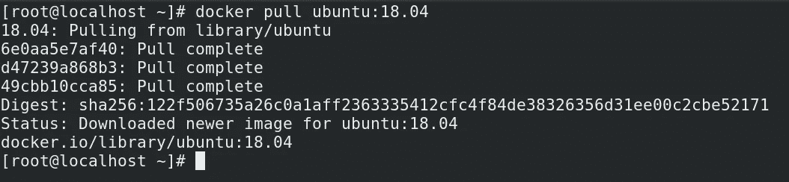

一旦图像下载成功，运行下面提到的命令，看看你有多少图像下载到本地…

```
docker image ls
```

让我们再下载一个名为 centos 8 的图片。类似于前面的命令运行…

```
docker pull centos:8
```

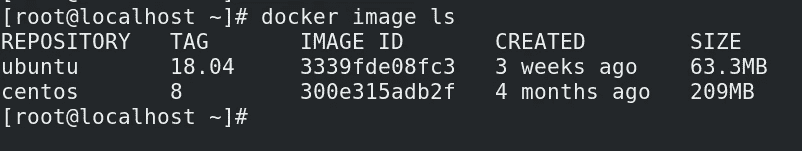

现在我们有两个 Docker 图像。让我们进入下一步。

# 启动容器:

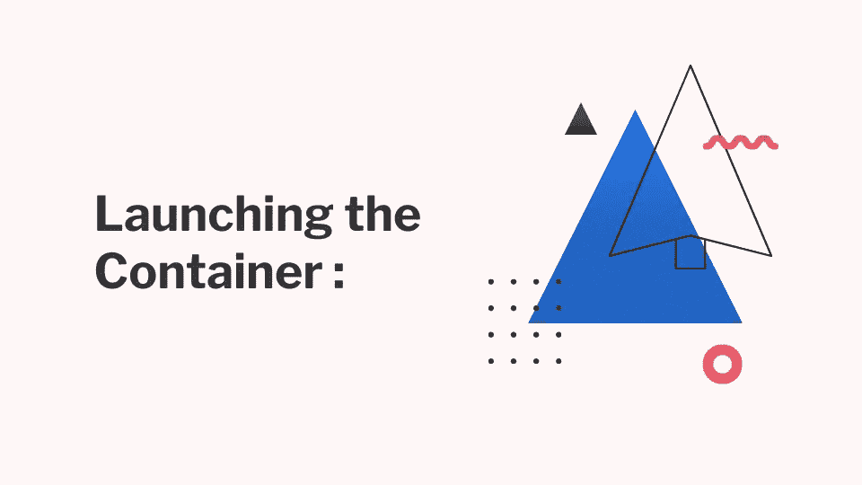

使用 Canva 自制

现在在这里你会看到 Docker 的实际力量。正如我已经说过的，我们需要 Docker 图像来启动容器。现在我们有了图像，**让我们启动一个容器。**运行下面提到的命令来启动容器…

```
docker run -it --name os1 ubuntu:18.04
```

*   我们给 docker 容器起了个名字叫做**“os1”**&它是用 **ubuntu:18.04 image** 启动的。**此处的“-it”选项表示在集装箱启动后为我提供一个“交互终端”。**
*   **你会看到在 1 秒钟内，你的终端改变了&现在你在一个新的终端里。这里最有趣的部分是这个终端不是你的 Docker 主机(RHEL8)终端。是 Ubuntu 容器的终点站。**
*   这意味着现在您将看到 RHEL8 的所有特定命令都不起作用。例如运行**“百胜报告列表”**命令&你会看到**“百胜命令未找到”**。因为在 Ubuntu 中我们使用**“apt-get”**来安装软件。如果您运行**“apt 列表”**，它将开始工作。请参考下面提到的截图…

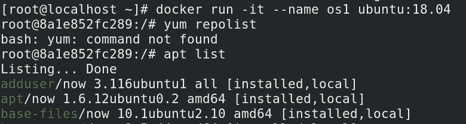

**现在，当您在本地 Docker 主机 GUI 上时，会打开一个新的终端，而不会关闭之前的终端。**这里运行…

```
docker ps
```

您将看到一个容器正在运行&在它启动之前还有多长时间。现在让我们做一件更有趣的事情。运行下述命令&启动一个 centos:8 集装箱…

```
docker run -it --name os2 centos:8
```

一旦运行该命令，现在您就进入了 **"centos:8"** docker 容器。检查运行**“yum repolist”**&你会看到它工作正常。但是如果你运行**“apt 列表”**，它会说**“apt 命令未找到”**。作为参考，请查看下面提到的截图…

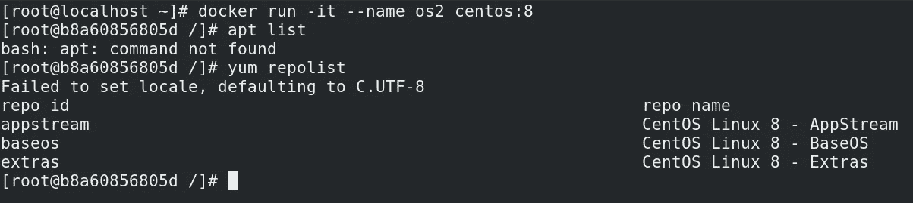

# 容器的隔离:

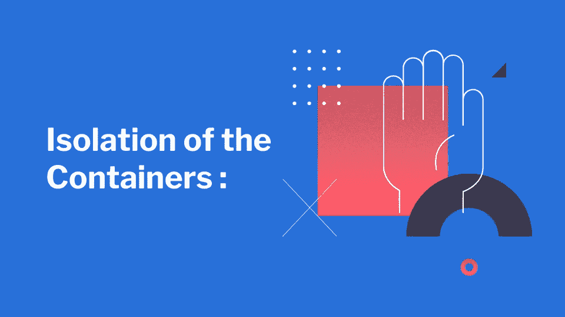

使用 Canva 自制

我之前已经说过，容器就像一个隔离的空间，有自己的操作系统各自的命令，文件&文件夹，自己的网络适配器，自己的进程，存储器等等。让我们检查一下那些东西在不在。在 os2 上运行下面提到的命令…

```
yum install net-tools -y
```

> **注意:如果你看到 yum 没有安装软件，那么在你的基本操作系统上，停止 firewalld 服务&然后重启 docker &然后再次启动一个不同名称的新容器&它将开始工作。**

*   一旦这个软件被安装，你将在你的容器上得到一些命令。**现在运行“ifconfig”命令** **&你会看到你的容器有一个全新的 IP 地址和相应的网络适配器。**接下来，如果你运行“ls”命令，你会看到它有所有操作系统特定的文件&文件夹。
*   现在要从容器中退出只需运行**【退出】** & **你就会看到你再次登陆到你的 Docker 主机的终端上。**接下来，如果你运行 **"docker ps"** ，你会看到没有容器在运行，但是如果你想**看到停止的容器，那么你可以运行" docker ps -a "。**请参考下面提到的截图…

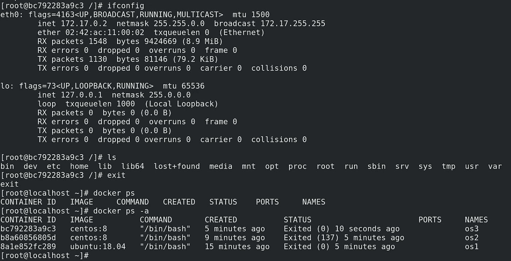

**要启动一个停止的容器&然后进入正在运行的容器，您可以分别使用下面提到的命令…**

```
docker start os2
docker attach os2
```

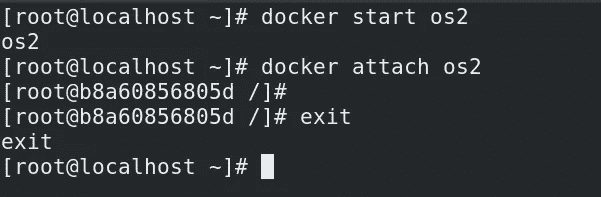

> Docker 有很多概念，但作为一个基本的起点，这些知识足以进行下一步的实践。

# 创建 Docker 图像:

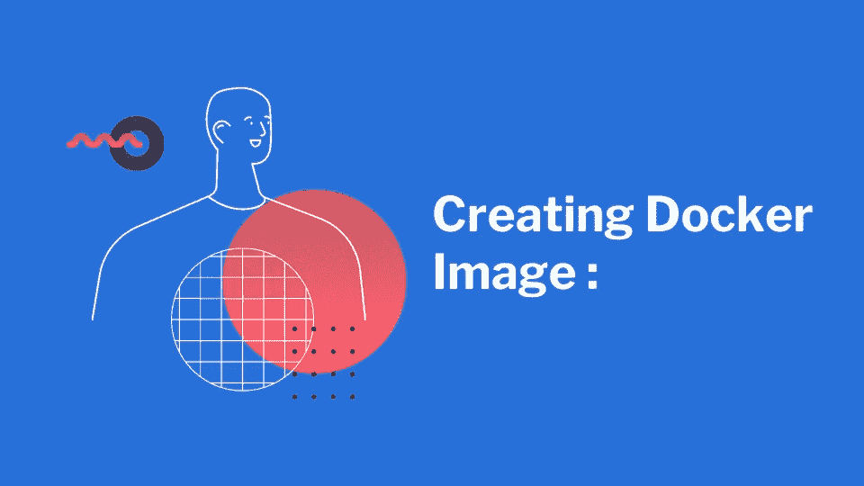

使用 Canva 自制

现在是时候打造我们自己的 Docker 形象了。有两种方法可以做到这一点——Docker Commit 命令& Dockerfile 概念。我想说说 Dockerfile。

*   **记住一件事，我们的最终目标不仅仅是发布操作系统。我们的最终目标是在容器中运行我们的程序。**因此，我们可以发布一个容器&来运行我们的程序，但是**在工业中我们并行运行数千个容器。**
*   因此，不可能在每个容器中手动运行程序。所以我们可以做的是——我们可以将所有信息放入 Docker 映像&中。一旦我们启动容器，我们的程序也将启动&,直到我们的程序运行为止。容器将运行&。一旦程序关闭，我们不再需要容器，因此它将自动停止。

这就是我们想要创建 Docker 图像的原因&为此，我们使用了**“Docker file”**概念。在您的 Docker 主机上创建一个文件夹作为您的工作区&，然后在工作区内使用 vim 或 gedit 编辑器创建一个文件。**这里需要注意的一件小事是，文件名应该是“Dockerfile”。**每个&文件名的每个字符都应该和我写的一模一样。

**现在在你的“Dockerfile”中放入下面提到的代码…**

```
FROM centos:8
RUN yum install net-tools -y
CMD ifconfig
```

*   保存文件&现在让我们了解这个文件是如何编写的。 **Dockerfile 有自己特定的关键字来讲述某些事情。**就像我们使用 **"FROM"** 关键字来告诉使用 **"centos:8"** image &一样，我们将在这个图像的顶部运行我们的程序。
*   接下来运行任何程序我们都需要安装所需的软件，为此我们使用**“运行”**关键字&告诉使用**“yum install net-tools-y”命令来安装软件。**只需注意一件事，因为我们使用 **"centos:8"** 来运行我们的程序，这就是为什么我们使用 **"yum"** 命令来安装软件。
*   接下来我们使用 **"CMD"** 关键字来告诉一旦容器启动就运行 **"ifconfig"** 命令。

现在是建立形象的时候了。为此，在“docker file”…所在的同一文件夹中运行下面提到的命令

```
docker build -t myimage:v1 .
```

*   这里我们使用 **"docker build"** 命令来构建图像& **以给图像一个名称/标签，我们使用"-t "选项**。然后我们给我们的图像加上标签**“my image”**&**“v1”**是我们图像的版本。你可以给任何你想要的标签&版本名，但是在这部分要尽量符合逻辑。
*   最后，我们使用**。”**告诉 docker，Dockerfile 就在我们运行**“docker build”**命令的地方。**如果你注意到这里我们没有提到任何文件名，因为我已经告诉过你这个文件名“Dockerfile”是固定的**。因此，在你当前的工作空间中，它会寻找那个文件&并从它开始构建镜像。

现在你会看到你的图像准备好了。因此，再次从这个映像创建容器，您可以运行…

```
docker run --name myos1 myimage:v1
```

*   这里我们没有使用**-it "**，因为我们不想使用容器的终端。因此，**正如你现在可以意识到的，我们正在启动一个容器&命名为“myos1”，&它是从我们自己创建的 Docker 映像启动的。**查看以下截图，以供参考…

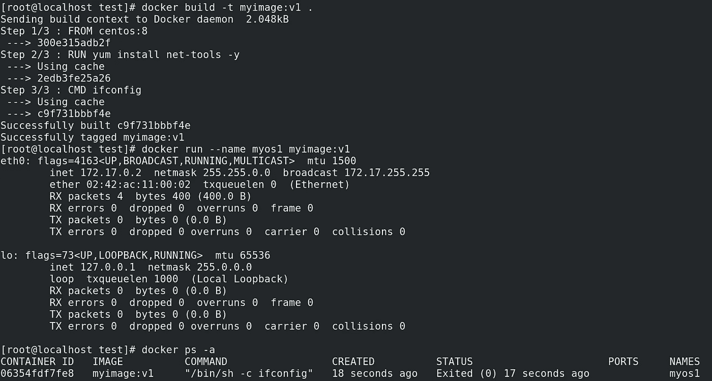

*   你会看到在 1 或 2 秒内，你从你的容器&中得到**“ifconfig”**命令的 o/p，最好的部分是你甚至不会意识到当你登录&从容器的操作系统中注销。
*   **你为什么注销得这么快？因为我已经告诉过你，我们使用容器来运行我们的程序。**现在，由于“ifconfig”cmd 运行时间不到 1 秒，所以我们的容器将只在那个时刻运行。****

# 删除旧容器:

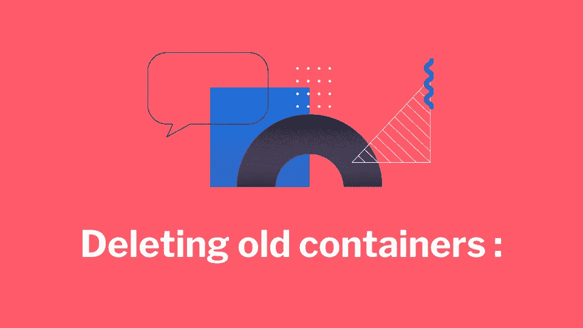

使用 Canva 自制

接下来，如果您运行**“docker PS-a”**，您将看到您的**“myos 1”**容器在几分钟前刚刚启动。

*   **有一点需要注意，在 Docker 中，如果你创建了一个名为“myos5”的容器，那么以后你不能再使用“docker run”来运行同名的容器，因为它已经存在了。**
*   所以，我们可以做的是，每次启动容器时，我们都可以更改名称。但是有一点要注意，容器中的数据实际上是存储在你的硬盘中的，意味着很快你就会感到空间不足。那么如何移除一个容器呢？

**运行下述命令…**

```
docker rm myos1
```

*   在这里，除了提供容器名，你还可以提供容器 id。现在，如果您运行**“docker PS-a”**，您将看到**“myos 1”**容器已移除。

## 在 Linux 上，我们通常遵循一个快速的技巧来删除所有的容器，那就是运行下面提到的命令…

```
docker rm -f `docker ps -aq`
```

*   这里我们使用**-f "**选项，意思是强行删除当前正在运行的容器。接下来，我们使用反引号来告诉将反引号内的命令输出提供给 **"docker rm"** 命令。最后**“docker PS-AQ”**帮助找到所有的容器 id。

类似地，Docker 中有数百个命令选项来实现不同种类的用例。我相信现在我们已经了解了“创建自己的 docker 映像”&如何启动容器。我们可以去参加最后的实战了！！！

# 在 Docker 容器中运行 GUI 应用程序:

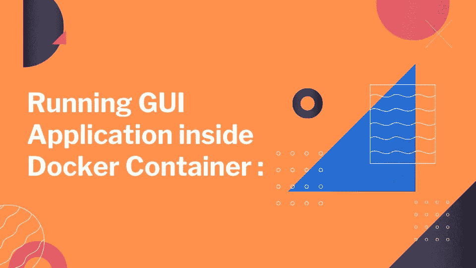

使用 Canva 自制

## 定制的 Docker 图像构建:

假设我们想在 Docker 容器中运行“firefox”程序。因此，我们可以做的是——我们可以创建一个 Docker 映像，可以说无论何时任何容器从这个映像启动，运行 Firefox 程序。因此，让我们创建“docker file”…

```
FROM centos:8
RUN yum install firefox -y
CMD firefox
```

*   我们可以注意到，这是一个简短的基本**【docker file】**，其中使用了**【centos:8】**镜像&安装了**【Firefox】**软件。**最后，使用“CMD”关键字启动 Firefox 软件。**

**现在让我们构建图像……**

```
docker build -t myfirefox:v1 .
```

构建完成后，让我们启动容器。所以像上次一样运行下面提到的代码…

```
docker run -it --name firefoxos1 myfirefox:v1
```

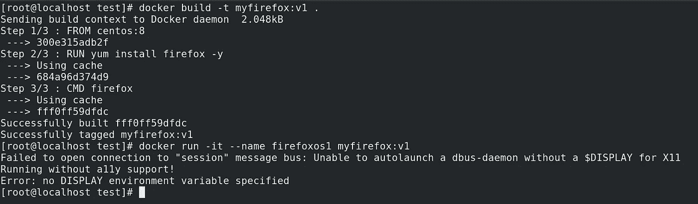

## 您将看到错误&最终 Firefox 将无法成功启动。为什么？

*   逻辑是 Firefox 需要一个环境变量来运行它自己。这个 shell 变量实际上帮助 Firefox 将它 gui 标签投射到屏幕上。现在我们肯定知道 Docker 容器没有 gui 屏幕来运行 Firefox，这就是为什么我们需要告诉容器使用主机系统的 gui 屏幕&，为此我们将使用选项 **"env"** 在 **"docker run"** 命令中使用该环境变量。因此，运行下面提到的命令…

```
docker run -it --name firefoxos2 --env="DISPLAY" --net=host myfirefox:v1
```

*   **很明显，你可能会想为什么我们在这个命令中需要“net”选项。**在这里，这是一个网络概念，但是如果我们想要理解 basic，那么你可以认为这个选项会将你的 docker 容器与你的 RHEL8 docker 主机的主网卡连接起来。实际上需要这个选项，因为启动 container 后，它将在 GUI 窗口中为我们提供 Firefox 软件，现在无论我们在这个窗口中搜索什么，都需要通过 Docker 主机进入 Docker 容器。为了连接，我们将 Docker 主机网络添加到容器中。

**就这样…现在让我们在下面的 GIF 中看看它的实际效果…**

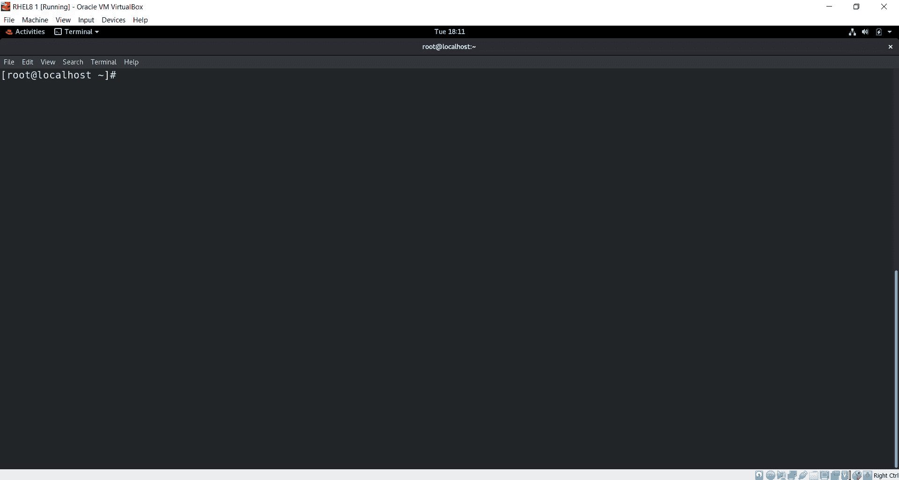

过程演示

# 最后的话:

*   **当今行业中有成千上万的公司在使用容器技术，因为它速度超快，具有很好的可扩展性&显然它是安全的。** Docker 有很多可能性&学习 Docker 在当今的行业中非常有帮助。要了解更多关于 Docker 的信息，你可以参考这个 YouTube 播放列表——https://youtube.com/playlist?[**list = plai 9 x 1 ug 6 JZ 30 qgz 7 FZ 55 a 27 jpey 8 ewke**](https://youtube.com/playlist?list=PLAi9X1uG6jZ30QGz7FZ55A27jPeY8EwkE)
*   我尽了最大努力来谈论 Docker &它的可能性。我们还看到了一个非常有趣的。我只想说，最后，如果你喜欢这个博客，请给一些掌声，并在评论中留下你的想法。
*   我一直在写关于机器学习、DevOps 自动化、云计算、大数据等方面的博客。因此，如果你想阅读我以后的博客，请关注我的媒体。您也可以在 LinkedIn 上 ping 我，在下面查看我的 LinkedIn 个人资料…

[](https://www.linkedin.com/in/raktimmidya/) [## Raktim Midya -微软学生学习大使(测试版)-微软| LinkedIn

### ★我是一名技术爱好者，致力于更好地理解不同热门技术领域背后的核心概念…

www.linkedin.com](https://www.linkedin.com/in/raktimmidya/) 

**感谢大家的阅读。就这样…结束…😊**

