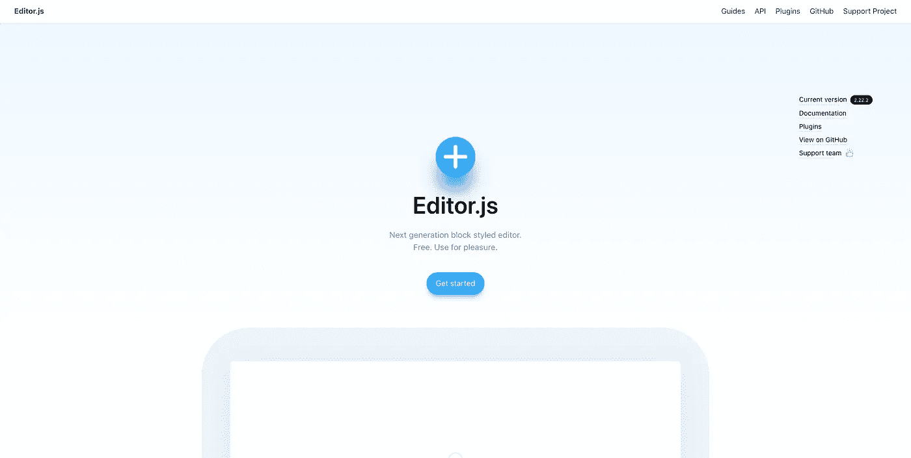

# 编辑器 JS 入门

> 原文：<https://medium.com/nerd-for-tech/getting-started-with-editor-js-197d06926b6b?source=collection_archive---------1----------------------->

为你的网站创建你自己的博客编辑器

[编辑 js 网站截图](https://editorjs.io/)

## 在后台

2022 年的第一个故事，这个想法始于我们为我们的网站 [iHateReading](http://www.ihatereading.in) 开发故事编辑器的时候。我们的想法是在本地网站上提供阅读和分享技术故事的界面。所以我们最终使用了这个叫做 editorjs 的包。