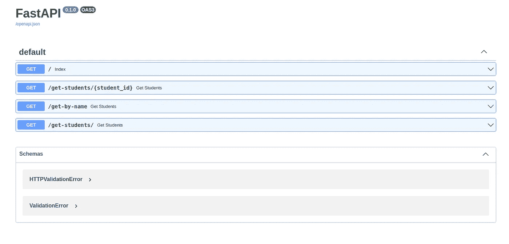

# 快速 API 入门

> 原文：<https://medium.com/nerd-for-tech/getting-started-with-fastapi-cc005fb818d2?source=collection_archive---------0----------------------->

在本教程中，我们将探索 FastAPI，更具体地说是构建 RESTful APIs 和在服务器上部署应用程序。

FastAPI 是一个用 Python 开发 RESTful APIs 的 Web 框架。它完全支持异步编程，可以与 Uvicorn 和 Gunicorn 一起运行。Uvicorn 是一个快如闪电的 ASGI 服务器实现。

我们将首先创建一个基本的 FastAPI 应用程序，然后将它部署在 [Deta](https://www.deta.sh/?ref=fastapi) 上。

## 创建一个基本的 FastAPI 应用程序

为您的应用程序创建一个目录，并创建一个名为 **main.py 的新文件。**这是您的应用程序的入口点。我们将在该文件中创建端点。

在创建端点之前，我们需要定义数据。让我们考虑一个简单的学生例子。让我们创建一个学生详细信息的 JSON 表示。之后，让我们创建基于不同场景检索数据的端点。

从上面可以看出，数据存储在 **students，**中，它由 id 和相应的 object 两个元素组成。该对象由姓名、年龄和阶级等细节组成。

让我们考虑所有的情况。看第一个场景；点击索引页时要检索的数据。“@app.get()”指定我们在这里使用 get 方法。此外，这里的参数类型是 **path、**，这个场景的路径是“/”。第二个场景是检索具有特定 id 的学生的数据。这里的路径是“/get-students/{student_id}”，其中 student_id 是一个整数。第三个场景是检索具有特定姓名的学生的数据。这里我们使用了查询参数。路径“/get-by-name”被附加到 URL，并且查询名称**被传递。在第三种方法中，我们遍历学生列表，并检查姓名与用户在查询中提供的姓名相匹配的学生。当找到匹配时，返回该特定对象。在最后一个场景中，返回整个学生列表。这里的路径是“/get-students/”。**

现在我们已经实现了端点，让我们继续下一步。

**要求**

现在，在同一个目录中创建一个文件 **requirements.txt** ，包含:

> fastapi

## 部署

第一步是在 [Deta](https://www.deta.sh/?ref=fastapi) 上**创建一个账户**。下一步是**安装**Deta 的 **CLI** 版本。如果您在 Linux 机器上，您可以在终端上执行以下命令。

> https://get.deta.dev/cli.sh |上海

安装后，打开一个新的终端，以便检测安装的 CLI。在新终端中，确认正确安装了:

> 详细信息—帮助

下一步是从 CLI 登录 Deta。

> 详细登录

这将打开一个 web 浏览器并自动进行身份验证。

最后一步是部署应用程序。在项目目录中执行以下命令。

> deta 新

您将看到类似于以下内容的 JSON 消息:

现在，打开带有端点 URL 的浏览器。在上面的例子中，是[https://hwzlsi.deta.dev/](https://hwzlsi.deta.dev/)，但是你的将会不同。如前所述，您可以使用不同的场景来测试 API。您也可以通过访问您的 URL 的/docs 来执行交互式测试。它会向您的文档显示如下内容:

恭喜你。您将 FastAPI 应用程序部署到了 Deta！🎉 🍰

本教程到此结束。感谢阅读！编码快乐！

如果您有任何疑问，请在下面的**评论**部分发帖。在 [LinkedIn](https://www.linkedin.com/in/vaidhyanathansm/) 上与我联系。此外，如果你想看看我开发的惊人的应用程序集，别忘了查看[谷歌 Play 商店](https://play.google.com/store/apps/developer?id=Programmers+Gateway)。

更多了解我[这里](http://vaidhyanathansm.netlify.app/)。