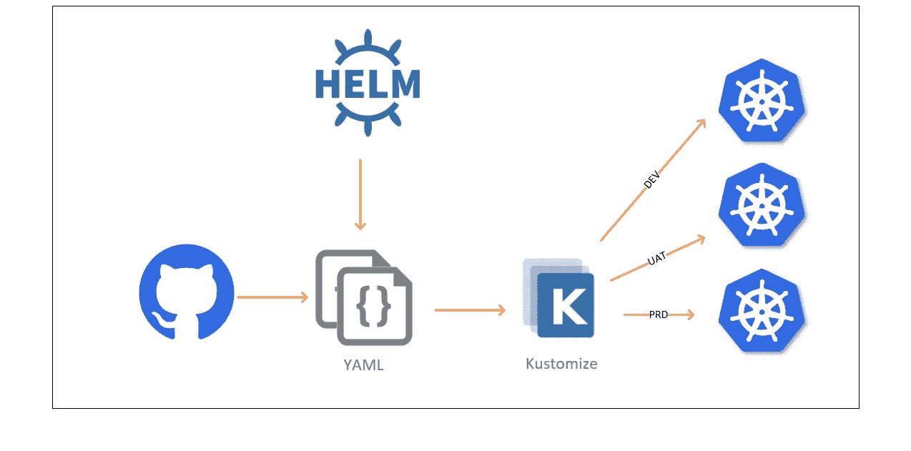

# Kustomize 入门

> 原文：<https://medium.com/nerd-for-tech/getting-started-with-kustomize-bff87e820cde?source=collection_archive---------1----------------------->

## 技术基础

当您在 Kubernetes 中部署组件或系统时，您必须使用 YAML 文件。您创建一组 Kubernetes 对象文件，并通过运行 kubectl create 或 apply 命令来部署它。当您处理一个环境和一组有限的对象时，这种方法相当不错。这种方法在管理多个环境和大量…