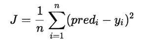
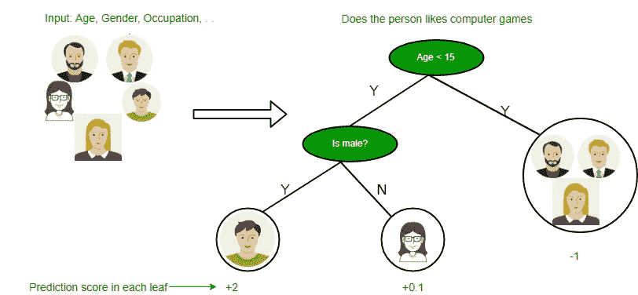
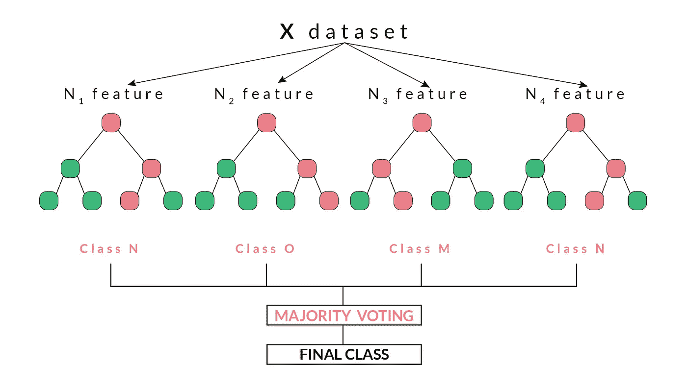
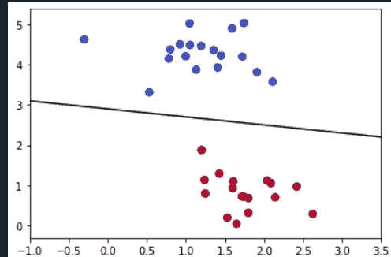

# 机器学习及其算法入门 2021。

> 原文：<https://medium.com/nerd-for-tech/getting-started-with-machine-learning-and-its-algorithms-2020-748811f972f5?source=collection_archive---------2----------------------->

计算机技能与消防需求解释容易。

马库斯·温克勒在 [Unsplash](https://unsplash.com?utm_source=medium&utm_medium=referral) 上的照片

ola 的读者们，从未来的工程师到其他工程师，

**机器学习是一个炙手可热的话题**，是在这个*技能和发展*的当今时代抢得一份合适工作的**急需技能**。

他们说 ML 很难，不容易，尽管它很难，但它不适合聪明的工作人员和聪明的学习者。开发新的机器学习算法确实涉及大量数学和专业知识。但是大多数时候**做** **机器学习**并不是为了新的算法，而是利用现有的算法和代码库来训练机器学习模型。

现在来看什么，为什么，以及其他…

> 什么是机器学习？

在听到术语**机器学习**…这听起来像一个大的**技术术语，**但是当你开始了解它的时候，它对你来说似乎是一个简单的概念，这通常是*现在到处都在使用*。这基本上是一种学习，在这种学习中，机器开始自己学习东西**，而不需要显式编程**。它是**人工智能**应用的一个子集或一种类型，为系统提供从过去的经验中自动学习并为未来的处理进行自我改进的能力。

机器学习总是致力于计算机程序的开发，因此它可以访问数据，并使用这些数据进行自学。机器学习旨在研究计算机如何在没有任何人工干预或帮助的情况下自动学习，以便机器可以根据需要调整其动作。

> “婴儿学会爬、走，然后跑。在应用机器学习方面，我们正处于爬行阶段。”戴夫·沃特斯

照片由[最大焦点](https://unsplash.com/@maximalfocus?utm_source=medium&utm_medium=referral)在[不飞溅](https://unsplash.com?utm_source=medium&utm_medium=referral)上拍摄

# **机器学习的先决条件:**

在学习机器学习之前，先了解以下内容是必要的。

1.线性代数

2.结石

3.概率论

4.编程；编排

5.最优化理论

虽然没有那么必要，但掌握所有这些基础知识将会加快你学习 ML 的能力。

# **机器学习中流行的算法**

## **1。线性回归:**

**线性回归**是 **ML** 中最常见最通用的算法。基于**监督学习**的线性回归(LR)算法；现在什么是监督学习… *监督学习基本上是利用数据进行学习，或者简单地说，它意味着使用被标记的数据/数据集，即定义的数据集，来训练或教授 ML 模型。*

因此，LR 基本上是**训练一个模型**，然后是**用一组示例或**测试数据集**测试模型**，这样我们的 ML 模型分析**训练数据集**并基于其**监督学习算法**产生正确的输出。
它执行**回归任务** …这意味着回归预测建模，即*将从输入变量比如‘x’到连续变量比如‘y’的映射函数进行映射或近似。*
根据自变量给出预测值。它主要用于找出变量之间的关系并进行预测。
LR 执行任务，根据自变量‘x’预测因变量‘y’。所以基本上给出了‘x’和‘y’的线性关系所谓的**线性变量**。

> LR 的假设函数:Y= **θ** 1 + **θ** 2.x

这里 Y=数据的标签(监督学习)
x =输入训练数据；参数
**θ** 1 =截距
**θ**2 = x 的系数
*当训练一个模型时，它拟合最佳线来预测给定的 x 值的 y 值。*
模型得到最佳回归拟合线，最佳值为 **θ** 1 和 **θ** 2。

**LR 中的成本函数(J)**…*成本函数用于估计模型的表现有多差*。简而言之，成本函数是对模型在估计 X 和 y 之间关系的能力方面的错误程度的度量。*这通常表示为预测值和实际值之间的差异或距离。*

LR 中的成本函数

在 LR 中，我们预测‘y’的值，使得预测值和真实值之间的误差最小。
**线性回归的代价函数(J)是预测 y 值(pred)与真实 y 值(y)之间的均方根误差(RMSE)。**
它用于*最小化成本*和*最大化一个组织的生产率*。

## 2.决策树(DT):

**决策树机器学习算法**是另一种**监督学习**算法。它们可用于解决**回归**和**分类**问题。简单来说，分类算法的**任务是将输入变量‘x’映射为离散输出变量‘y’。
DT 在**数据挖掘**和 Ml 中都有用到……所以我们可以说是一个著名的算法。
决策树基本上使用**树表示**来解决每个**叶节点(最后一个节点没有子节点)**对应一个**类标签**表示“猫】和**属性**在树的内部节点表示为“动物”的问题。**

[https://www.geeksforgeeks.org/](https://www.geeksforgeeks.org/decision-tree-introduction-example/)

人们不能忽视这种算法的简单性…它通常被称为从数据中学习决策树。
一般来说 **DT 算法**被称为**类和回归树**。
**分类树**是那些总体目标是对可能性进行分类或者更好地说出是/否结果的树。举个例子:他要么吃要么不吃。
而**回归树**是那些预测连续值的回归树。例如:东西的价格。
**生长一棵树涉及到选择哪些特征，使用什么条件进行分裂……以及何时停止的想法。**
因此，**递归二进制分裂**被用作分裂树的技术……在这个过程中，所有的特征都被考虑，并且不同的**分裂点**被*使用成本函数尝试和测试。*
我们使用一个成本函数来计算分割的准确度，选择较低的成本。
**DT 中的成本函数**:
尝试找到最同质的分支，即具有相同响应的相同组。

> 对于回归:sum(y 预测)
> 
> 对于分类:总和(pk* (1-pk))

在决策树中，主要的挑战是识别每一层根节点的属性。这个过程被称为**属性选择**。我们有两个流行的属性选择度量:
**信息增益**和**基尼指数**度量。

## 3.k 近邻(KNN):

**K-最近邻**也是**机器学习**中最基本也是最本质的分类算法之一。
它也是基于前面讨论过的**监督学习算法**。
在**数据挖掘、模式识别**等方面都有应用
在现实生活场景中非常适用。
由于是**非参数**，意思是:*它不对数据的分布做任何潜在的假设。*

[https://www.saedsayad.com/k_nearest_neighbors.htm](https://www.saedsayad.com/k_nearest_neighbors.htm)

在图中，箭头表示该点的最近邻。

以下两个特性可以很好地定义 KNN

*   **懒惰学习算法**——KNN 是一种懒惰学习算法，因为它没有专门的训练阶段，在分类时使用所有数据进行训练。
*   **非参数学习算法**—KNN 也是一种非参数学习算法，因为它没有对底层数据做任何假设。

我们获得了一些先验数据(也称为**训练数据**)和另一组数据点(也称为**测试数据**)，如果我们将这些点绘制在图上，我们可能能够定位一些**集群或群组**。现在，给定一个**未分类点**，我们可以通过观察它最近的邻居属于哪个组来将其分配到一个组。这意味着接近被分类为“一类”的点簇的点有更高的概率被分类为完全相同的“一类”。
**随着训练数据集中数据点数量的增加，这种 ML 模型的准确性也随之增加。**

## **4。随机森林(RF) :**

它也是一种**监督学习算法**，灵活，易于使用的算法。出错的可能性很小，也不会出现**过拟合问题** ( ***过拟合*** *发生在模型学习训练数据中的细节和噪声，以至于对模型在新数据上的性能产生负面影响*)。
生成预测**很慢**因为有很多 DT，并且有可能简单的决策**耗时**并且**复杂**但是**偏差**在这里被防止，因为它需要各种投票**的平均值。**
它同时用于**分类**和**回归**技术。
由**树**组成，树越多**健壮的随机森林为**。
RF 根据随机选择的**数据样本**创建 DT，并根据每棵树给出**预测**，并根据**投票**选择最佳解决方案。
RF 的应用范围很广，有些是**图像分类、推荐引擎、疾病预测**等。

> 它基本上工作在 4 个步骤上:-
> -从给定的数据集中选择随机样本。
> —为每个样本构建一个 DT，并预测每个 DT 的结果。
> —对每个预测结果进行投票。
> —选择投票最多的预测结果作为最终预测。

[https://blog.quantinsti.com/](https://blog.quantinsti.com/random-forest-algorithm-in-python/)

它是**博鲁塔算法**的基础。*这意味着
它选择数据集中的重要特征*…围绕 Boruta 算法总结构建，它试图捕捉所有与结果特征相关的不感兴趣的特征。

## 5.支持向量机(SVM):

**支持向量机**也称为**支持向量网络**。
它也是一种**监督 ML 算法**，既用于**分类**又用于**回归**挑战，但目前大多用于分类。
SVM 模型将示例表示为空间中的**点，通过映射，各个类别的示例被尽可能宽的清晰间隙分开，由分离的**超平面** ( *非常好地区分两个类别的直线*)…意味着我们将每个数据项绘制为 n 维空间**中的一个点: *n 是特征的数量，每个特征的值就是值然后，我们通过寻找超平面来执行分类任务。*

> 现在为了决定**右超平面**，我们得到了一些**规则**，它们是:
> ——应该选择能更好地分离两个类的超平面。
> —计算最近的数据点和超平面之间的距离。具有最大距离的平面将被认为是正确的超平面，以更好地分类。
> **SVM 有规则 1 更占优势。**

这里的直线是将两个类分开的超线。

当我们得到一个**外层** ( *一个与其成员位置不同的点/类，即远离其同类*)，
SVM 取最大**个数据点**并最大化它们。
**我们甚至可以通过添加新的特征或新的轴来进入非线性超平面，为此，SVM 具有将低维输入空间带入高维输出空间的内核技巧函数。**

一些最常用的**内核**如下:
1 .**线性核**为直线超平面。
2。**曲线和非线性超平面的多项式核**。
3。**径向基函数核**…常用于 SVM 机。

最后，终点将是世界正在走向自动化和人工智能的时代，为了应对这一时代，人们必须充分了解趋势技术和堆栈，而机器学习就是其中之一。

> 机器学习只是一个开始...最重要的不是接下来的高级话题，每个人都可以做一些机器学习项目，因为在 youtube，medium.com，GitHub，e.t.c 上有很多这样的项目，但是理解其中发生了什么，它是如何实现的，以及背后的目的是机器学习和数据科学的新生所关心的事情。

照片由 [Unsplash](https://unsplash.com?utm_source=medium&utm_medium=referral) 上的 [h heyerlein](https://unsplash.com/@heyerlein?utm_source=medium&utm_medium=referral) 拍摄