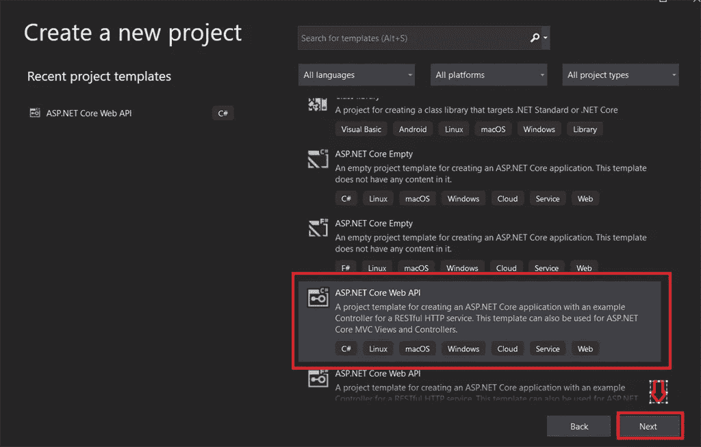
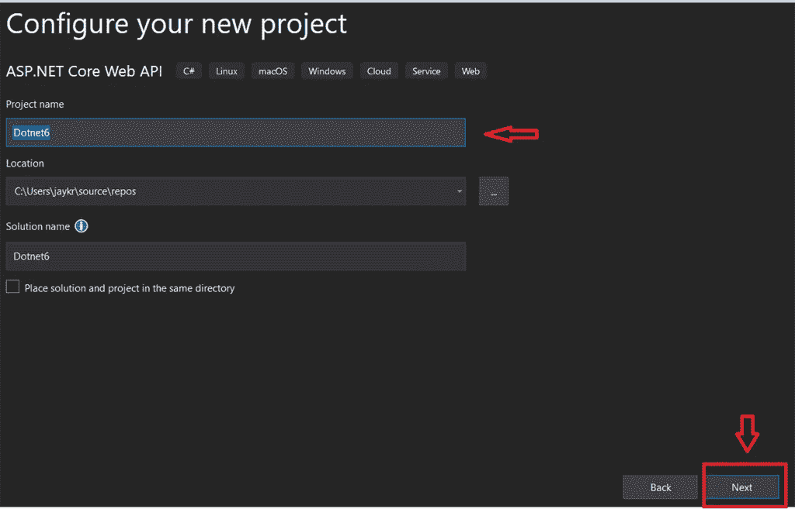
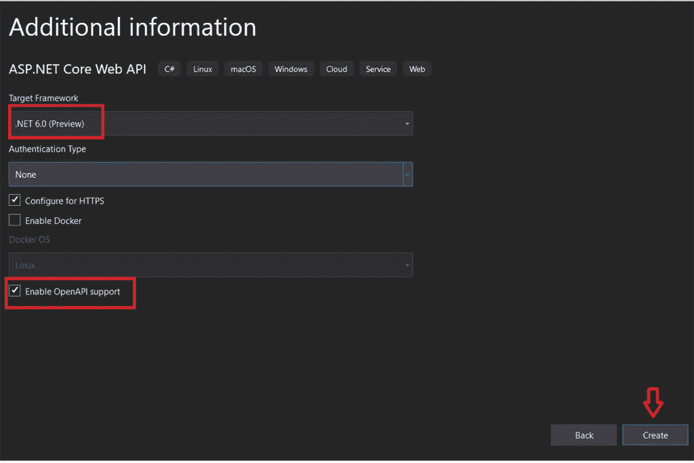
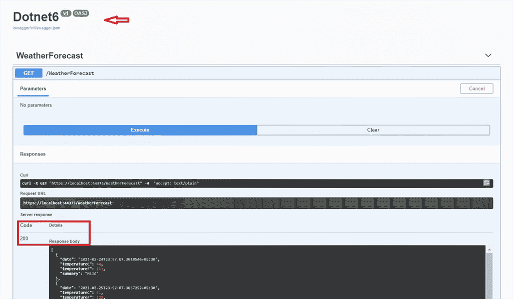

# ⚡Getting 从。网络 6

> 原文：<https://medium.com/nerd-for-tech/getting-started-with-net-6-4a89c5bb7e4b?source=collection_archive---------5----------------------->

# 介绍

大家好。众所周知，微软最近推出了. NET 6 预览版，并在他们的官方博客网站上证实了这一消息。的新版本。之后的. NET。NET 5 版本中，微软在这方面做了很大的改进。面向 LTS 的 NET 6 稳定版本(长期支持)。在本文中，我们将看到如何设置？NET 6(预览版)。

**安装**

*   [。NET 6 SDK](https://dotnet.microsoft.com/download/visual-studio-sdks) —可以下载 Visual Studio 的 SDK，它只支持 Visual Studio 2019 版(16.9)预览版。
*   [Visual Studio 2019 (16.9)预览版](https://devblogs.microsoft.com/visualstudio/visual-studio-2019-v16-9-preview-2/) —确保为 Windows、Mac 和 Linux 安装该版本，无论你的操作系统适合哪个平台。

NET 6 已经过 Visual Studio 16.9 Preview 4 和 Visual Studio for Mac 8.9 的测试。如果你想尝试，请尝试使用这些版本。NET 6。

**支持**

。Net 6 将于 2021 年 11 月正式发布，并将获得 3 年的长期支持(LTS)。这里面的矩阵。Net 6 的改进比。净 5。

新增内容包括:

*   安卓。
*   iOS。
*   Mac 和 Mac 催化剂，为 x64 和苹果硅“M1”。
*   Windows Arm64(特别是 Windows 桌面)。

# 在下创建项目。网络 6

安装后。Net 6 SDK 和 vs 2019 预览版，我会创建一个样例 API 项目来展示过程。

打开 Visual Studio 并选择模板，然后单击“创建”按钮。

添加项目名称，然后单击下一步按钮

选择目标框架作为。Net 6(预览)并单击创建按钮。

双击该项目。我们可以看到如所示的目标框架。NET 6 在我们的解决方案，我分享如下:

运行项目:

这是如何设置的清晰图片。NET 6 并创建一个示例 API 项目。

我希望这能帮助你理解。NET 6 的循序渐进的过程中。如果你发现这篇文章对你有帮助，给它一个👏🏻！

继续学习……!