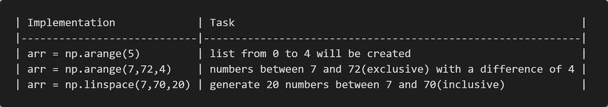
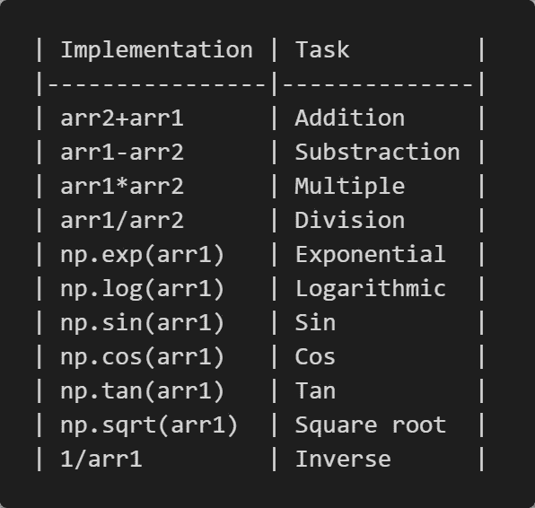
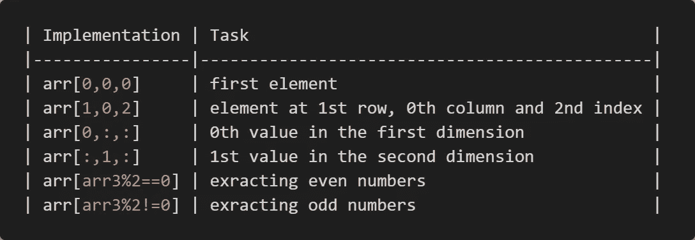
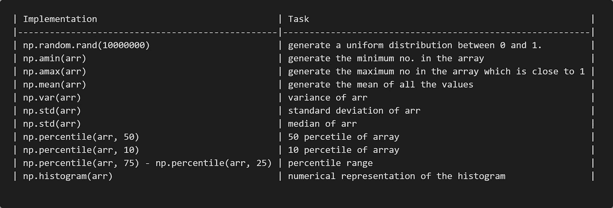

# Numpy 入门

> 原文：<https://medium.com/nerd-for-tech/getting-started-with-numpy-3914e52a0d9b?source=collection_archive---------21----------------------->


# 目录—

*   创建高维数组
*   数字运算
*   索引
*   NumPy 的统计数据

👉另外，为了让你更好的理解，我在 YouTube 上做了一个视频。

> 去吧！看着。

# 安装—

*   因为 NumPy 是一个外部库。所以我们会先安装。

```
> pip install numpy
> import numpy as np
```

> 关于 NumPy 更详细的代码，可以参考我的 [GitHub 库](https://github.com/varchasa/numpy/)。

# 1.创建高维数字阵列——

*   在这一部分，我将告诉您如何创建几种类型的高维 NumPy 数组。



# 2.NumPy 操作—

```
arr1 = np.random.rand(3, 4)
arr2 = np.random.rand(3, 4) 
#creating 3*4 numpy array
```

*   Numpy 包括一些操作，如加、减、正弦、余弦等。



# 3.索引

索引是指从数组中取出一些部分。这可以通过几种方式实现。



# 4.Numpy 的统计数据

NumPy 提供了大量的统计函数，如平均值、中值、百分位数等。



> 感谢阅读这篇文章，如果你觉得我的文章有用。支持🙌我，通过鼓掌👏。