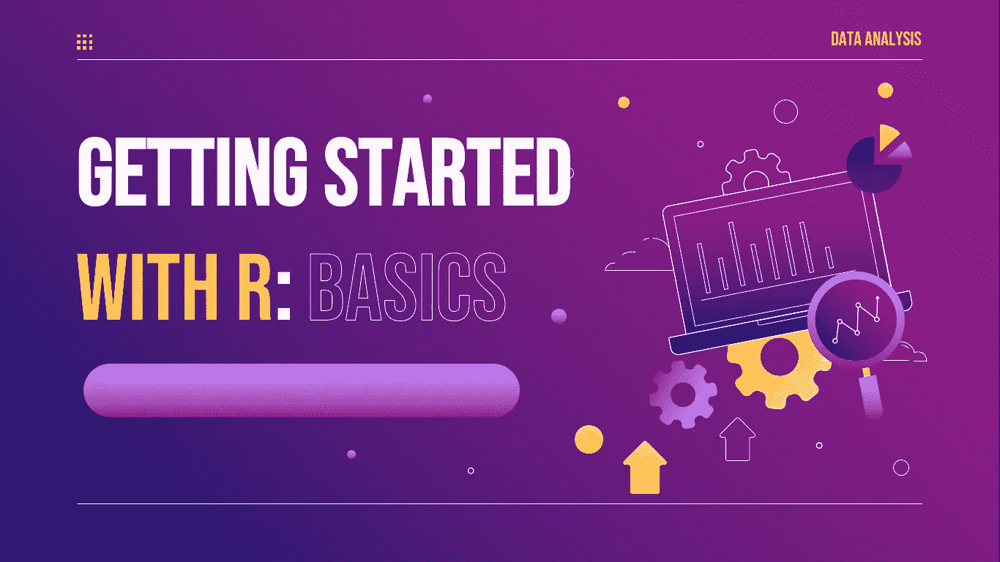

# R:基础知识入门

> 原文：<https://medium.com/nerd-for-tech/getting-started-with-r-basics-61c0cc4a6a11?source=collection_archive---------7----------------------->



每一项研究的中心目标都是产生洞见或重申某一特定主题上已经存在的洞见。洞察力是通过将数据分析成信息而形成的；分析这些数据的过程就是数据分析。数据分析是一个简单但结构化的过程，涉及数据提取、清理、探索性数据分析、验证、可视化和呈现。根据研究和方法的要求，这些过程涉及使用多种软件或单一软件。

当我们谈论使用 R 语言时，R Studio 将被用作集成开发环境。它是专门为统计计算和图形而创建的。r 是一个 GNU 项目，类似于约翰·钱伯斯和他的同事在贝尔实验室(以前的美国电话电报公司，现在的朗讯科技)创建的 S 语言和环境。r 提供了广泛的图形和统计技术，包括时间序列分析，分类，聚类，线性和非线性建模。它还具有很强的可扩展性(R-project，2022)。

**安装 R 和 RStudio:** 从[这个页面](https://cran.r-project.org/)下载最新版本 R。要获得 R 软件，请选择与您的操作系统兼容的安装程序或 zip 文件，并将其解压缩。

安装 R 后，您必须下载 RStudio，因为它是 R 最实用的互动程序。这里的[是 RStudio](https://posit.co/download/rstudio-desktop/) 的网址。选择开源版本，下载到你的电脑上，安装。

下载完这两个程序后，请打开 RStudio 窗口，跟着我一起学习。

让我们从讨论 R 中的一些重要术语开始

R objects :
R 使用对象是因为它是一种面向对象的编程语言，而 C 语言则是面向过程的，使用数据类型来声明变量。在 R 中，变量被链接到对象，然后变量被赋予对象的数据类型。向量、列表、数组、矩阵、数据帧、变量和因子是一些非常有用的 R 对象。

赋值运算符可用于保存对象中的变量:

小于字符和不带空格的连字符组成(

等号(=)。

然后，其他计算可以利用这些项目。只需输入对象的名称即可打印。命名对象有一些限制:

！、+、-和#是不能在对象名中使用的符号示例。

两个点(。)和下划线()，以及以点开头的名称都是可以接受的。

尽管对象名可以以数字结尾，但不能以数字开头。

x 和 x 以及 temp 和 temP 都是独立的对象，R 区分大小写。

**变量:** 数据值保存在分配给对象的变量中。R 中没有声明变量的命令。当一个变量第一次被赋予一个值时，它被认为是被创建的。使用< -符号将变量分配给对象。只需输入变量名即可输出(或打印)值。

```
 # Assigning variable to an object

e <- 1
e
[1] 1

E <-2
E
[1] 2

q <- "mike"
q
[1] "mike" 
```

**数据类型:** 标量、向量(数字、字符和逻辑)、矩阵、数据帧和列表只是 r 中众多可用数据类型中的一部分

为了识别对象的数据类型，使用了“class()”函数。

```
 # Identifying the data type of an object

e <- 1 
class(e)
[1] "numeric"

q <- "mike"
class(q)
[1] "character"

c <- TRUE
class(c)
[1] "logical"
```

**向量:** R 中最基本的对象就是向量。这是因为它们的好处，特别是数据表示和理解的简单性。可以使用 c()方法创建向量:向量是通过使用 c()方法组合多个值来创建的。

不同数据类型的对象也可以组合，在这种情况下，向量的数据类型成为其组成材料的最高数据类型。r 将生成一个向量，其模式可以容纳它包含的所有元素。这种存储模式之间的转换被称为“强制”当 R 根据内容转换存储模式时，它被称为“隐式强制”。

```
# Creating vectors

# Using the C() method to create
a <- c(1,2.1,5.3,6,-2,4)
class(a)
[1] "numeric"

b <- c("five","six","ten") 
class(b) 
[1] "character"

c <- c(FALSE,TRUE,TRUE,FALSE,TRUE,FALSE)
class(c)
[1] "logical"

d <- c(1,2,4,2,"one","two",3)
class(d)
[1] "character"
```

```
# Vectors can also be created using
# : method (it is used to create vectors as a sequence of numbers.)

nums <- 3:13
nums
 [1]  3  4  5  6  7  8  9 10 11 12 13

# seq() method (it is also used to create vectors as a sequence of numbers.)

nums2 <- seq(1:13)
nums2
 [1]  1  2  3  4  5  6  7  8  9 10 11 12 13

nums3 <- seq(4,20,by=3)
nums3
[1]  4  7 10 13 16 19
```

**列表** 列表是万能的、包罗万象的对象。它们可以容纳各种各样的物体。它们可以包含矩阵、数值、向量，甚至其他列表。

```
# Creating a list
# Lists are created using list() funtion
list1 <- list("mike",1,3,4,c(9,5,7),"one","two")
list1
[[1]]
[1] "mike"

[[2]]
[1] 1

[[3]]
[1] 3

[[4]]
[1] 4

[[5]]
[1] 9 5 7

[[6]]
[1] "one"

[[7]]
[1] "two"
```

可以组合多个列表，并且可以命名列表的元素。要评估合并列表中的一个列表，使用“$”来选择它。

```
# Merging and naming lists
named_list <- list (c(16,19,20,31,22,24), c("lagos","abuja", "cape town","new york"))
names(named_list) <- c("age","cities")
named_list
$age
[1] 16 19 20 31 22 24

$cities
[1] "lagos"     "abuja"     "cape town" "new york" 

#selecting a list from the named lists
print(named_list$age)
[1] 16 19 20 31 22 24
```

**矩阵:** 矩阵是包含二维的向量。矩阵中的所有列必须具有相同的模式(数字、字符等。)和同样的长度。
一般格式是:

```
mymatrix <- matrix(vector, nrow=r, ncol=c, byrow=FALSE,dimnames=list(char_vector_rownames, char_vector_colnames))
```

```
 #Creating a matrix
# Generate 3 x 5 numeric matrix 
y<-matrix(1:15, nrow=3,ncol=5)
y
     [,1] [,2] [,3] [,4] [,5]
[1,]    1    4    7   10   13
[2,]    2    5    8   11   14
[3,]    3    6    9   12   15

# 
cells <- c(13,61,54,28)
rnames <- c("A1", "A2")
cnames <- c("B1", "B2") 
x <- matrix(cells, nrow=2, ncol=2, byrow=TRUE, dimnames=list(rnames, cnames)) 
x
   B1 B2
A1 13 61
A2 54 28
```

**数据框:** 由于不同的列可以有不同的模式，数据框比矩阵更通用(数字、字符、因子等)。).数据框是将数据组织成行和列的有效方式，类似于具有强制标题和行 id 的二维数组结构。

数据框具有以下特征:
列名不能为空。
行标识符应该是唯一的。
每一列必须有相同数量的数据项。

```
# Creating a Data Frame

age <- c(15,19,17,13)
sex <- c("male", "female", "female","male")
member <- c(FALSE,TRUE,FALSE,FALSE)
mydata <- data.frame(age,sex,member)
names(mydata) <- c("Age","sex","member") #variable names 

mydata
  Age    sex member
1  15   male  FALSE
2  19 female   TRUE
3  17 female  FALSE
4  13   male  FALSE
```

数据框也是使用 read.csv()和 read.table()方法从不同文件(如 csv 文件)中读取数据而从数据集创建的。

read.csv():

此方法有助于读取 CSV 格式的文件并输出数据帧。我们将在另一个时间进一步讨论这个问题。

```
# first row contains variable names, comma is separator 
edustats <- read.csv(file = 'C:/Users/Omole Daniel Tope/Downloads/edustats.csv')
head(edustats)
                                         Indicator  Unit Subgroup    Area Area.ID Time.Period                                         Source Data.Value
1 Gender parity index in secondary level enrolment Index    Total Jamaica  LACJAM        2008 JAM-Ministry of Education_Statistics Unit_2008       0.98
2 Gender parity index in secondary level enrolment Index    Total Jamaica  LACJAM        2009 JAM-Ministry of Education_Statistics Unit_2009       1.00
3 Gender parity index in secondary level enrolment Index    Total Jamaica  LACJAM        2010 JAM-Ministry of Education_Statistics Unit_2010       1.03
4 Gender parity index in secondary level enrolment Index    Total Jamaica  LACJAM        2011 JAM-Ministry of Education_Statistics Unit_2011       1.06
5 Gender parity index in secondary level enrolment Index    Total Jamaica  LACJAM        2012 JAM-Ministry of Education_Statistics Unit_2012       1.04
6 Gender parity index in secondary level enrolment Index    Total Jamaica  LACJAM        2013 JAM-Ministry of Education_Statistics Unit_2013       1.05

# The View() function invokes a spreadsheet-style data viewer within RStudio. Note: Make sure you type a capital “V” when using this function
View(edustats)
```

我们已经介绍了 r 中的数据类型和对象。在下一篇文章中，我们将学习更多关于操作、使用和创建数学运算的知识。

感谢你花时间阅读我的博客❤️.你可以在 LinkedIn 上联系我

**如果你对话题有什么想法，请在评论中分享；我一直在寻求更多的学习和提高。**

如果这篇文章有帮助，请点击拍手👏按钮几下，以示你对作者的支持👇