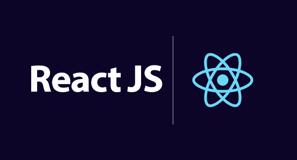
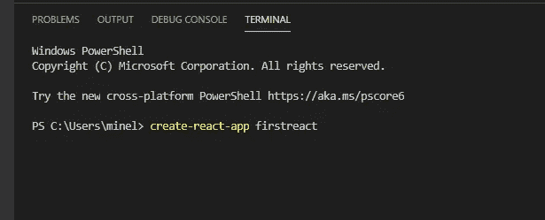
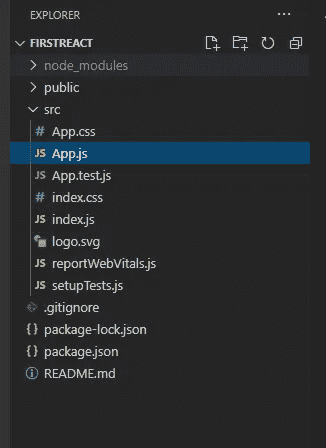
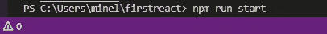
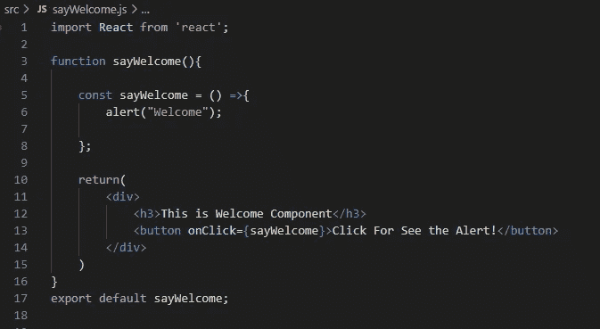
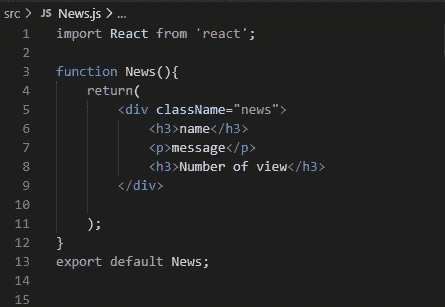
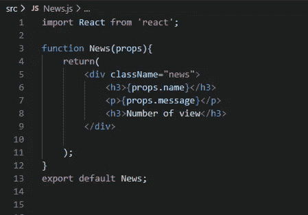
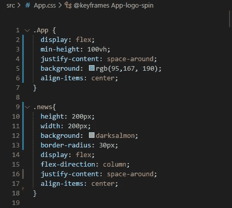
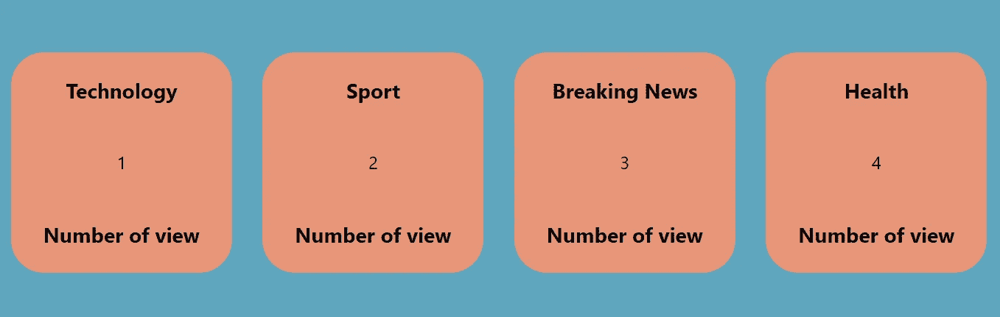

# React.js 入门-构建第一个 React App-1

> 原文：<https://medium.com/nerd-for-tech/getting-started-with-react-js-building-first-react-app-1-3246c5a16705?source=collection_archive---------17----------------------->

React JS 是用来创建用户界面的最流行的 Javascript 库之一。它是由脸书开发的。React 不是一个框架，它是一个库，因为它专注于视图层。

React 为我们提供了许多优势。例如，任何网站的中心都有一个关于页面如何组织的结构，称为面向文档的模型(DOM)。每次用户刷新网站时都会更新 DOM，导致高用户网站的性能下降。React 使用虚拟 DOM 只渲染有变化的地方。此外，React 使用 JSX，它可以用 HTML 风格的代码修改和开发自己的 DOM。JSX 是一种允许用 Javascript 编写 HTML 的格式，对于网站性能是一种非常有效的解决方案。React 是基于组件的，因此允许我们避免重复，用一个函数获得多个解决方案。

在简单描述了 React JS 之后，让我们安装需求并使用 React 编写我们的第一个应用程序。

# 我们需要什么？

*   我们的电脑上需要有 node.js，如果没有，你可以在这里下载[**https://nodejs.org/en/**](https://nodejs.org/en/)
*   我们将安装 **Create React App** 包，这个包将允许我们为 React 安装必要的环境。
*   我将使用 Visual Studio 代码作为编辑器，您可以选择任何您想要的编辑器。[**https://code.visualstudio.com/download**](https://code.visualstudio.com/download)

首先，我们从这里打开 Visual Studio 代码终端:

Visual Studio 代码终端

然后我们将下载我们需要的 **create-react-app** 包:

正在安装 create-react-app 包

安装软件包后，我们的结构如下所示:

项目结构

现在我们需要在终端上写 **npm run start** ，它会自动打开我们在 localhost 上的第一个项目。

npm 运行开始

你在打开的页面上看到的一切都是在 App 里的 App 函数里定义的。Js 文件。

现在让我们做些改变，在 src 下添加一个名为 **sayWelcome.js** 的新 JS 文件:

src > sayWelcome.js

这里您可以看到一个 Javascript 函数:

*   我们导入 React，因此可以在函数的返回中添加 HTML 元素。
*   我们创建一个 const 函数，给出一个名为 sayWelcome 的欢迎警告。
*   然后我们将这个常量函数用于手镯内部的按钮 onclick。我们需要使用手环来使用 Javascript 元素。
*   我们不应该忘记导出我们的 sayWelcome 函数。

然后我们转到 App.js，在这里导入我们的 **sayWelcome** 函数。我们需要做的就是在 App 函数中添加**</>/**组件:

src > App.js

让我们保存代码并转到 localhost:3000:

本地主机:3000

如果我们单击该按钮，我们将看到欢迎警告。

让我们更深入地在 src 下创建另一个名为 News 的 JS 文件。

src >新闻. js

如果我们在 app 函数中添加另一个名为 news ( <news>)的组件，我们会在网站上看到“名称”、“消息”和“浏览量”字符串。让我们把它变得更合格。</news>

src > App.js

我们添加了四个不同新闻组件，正如我之前提到的，我们不必为每个新闻类别编写四次 HTML 标签。那么我们需要在 News.js 文件中做什么呢？

src >新闻. js

我们到了！我们将项目作为道具发送给我们的新闻功能，并在 HTML 标签之间按顺序使用它们。我们所做的只是使用新闻功能来创建另一个新闻类别。

让我们在 App.css 中给它们一些形状和视图:

src > App.css

这是我们的网站:

本地主机:3000

感谢您的阅读！:)