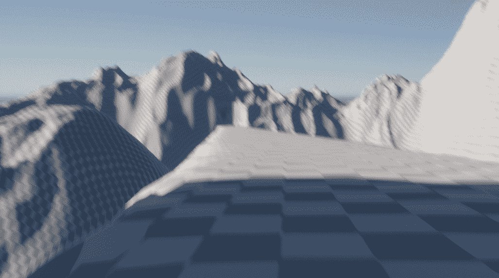

# Unity 地形工具入门第 1 部分:界面和网格雕刻

> 原文：<https://medium.com/nerd-for-tech/getting-started-with-terrain-tools-in-unity-part-1-interface-and-mesh-sculpting-f8348308fa8d?source=collection_archive---------1----------------------->

如果你喜欢开放世界游戏，并且曾经想要制作美丽的户外 3D 环境，这篇文章就是为你准备的。使用 *Unity 的*地形工具，创建一个细节丰富的环境从未像现在这样简单快捷。

**设置**

首先创建一个*新的 3D 项目*。你不需要有任何特别的…