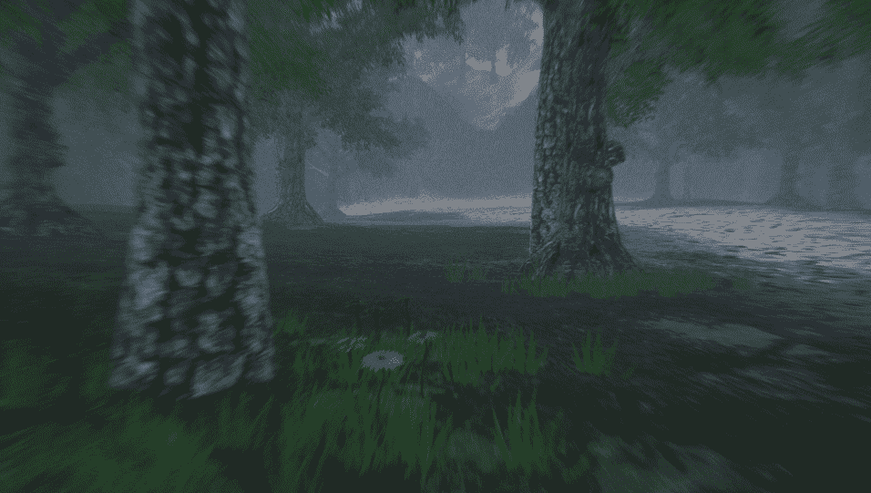

# Unity 地形工具入门第 2 部分:纹理和树

> 原文：<https://medium.com/nerd-for-tech/getting-started-with-terrain-tools-in-unity-part-2-textures-and-trees-5f6b2f57393c?source=collection_archive---------2----------------------->

现在，景观网格已经雕刻好了，我们可以开始在场景中绘制纹理和树木了！

在我的上一篇文章中，我留下了这个雕刻的游戏场景，它只是一个没有颜色和纹理的基础网格。让我们来给它加点料。