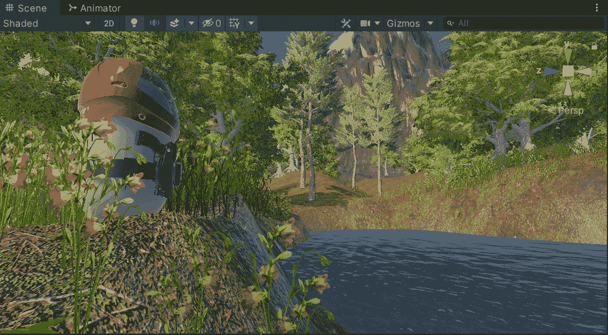

# Unity 地形工具入门第 3 部分:细节、风和水

> 原文：<https://medium.com/nerd-for-tech/getting-started-with-terrain-tools-in-unity-part-3-details-wind-and-water-b56f7653d54c?source=collection_archive---------0----------------------->

欢迎来到使用 Unity 神奇地形工具系列的最后一部分。HDRP 不支持一些非常棒的功能，所以我想确保在这里使用 URP 涵盖这些功能。

我制作了一个新的 URP 项目，然后根据前两篇文章中所学的知识组合了一个新场景。大气…