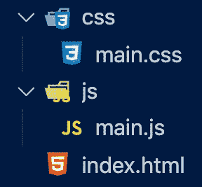
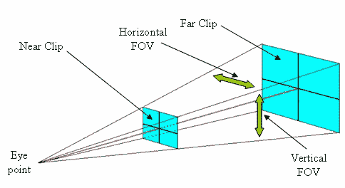
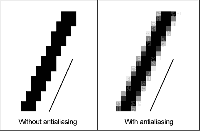
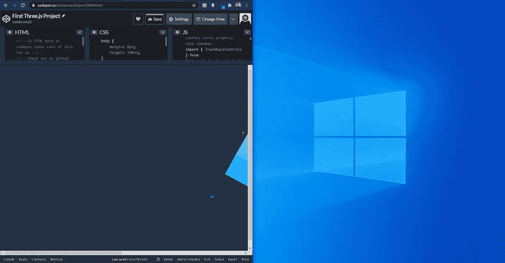
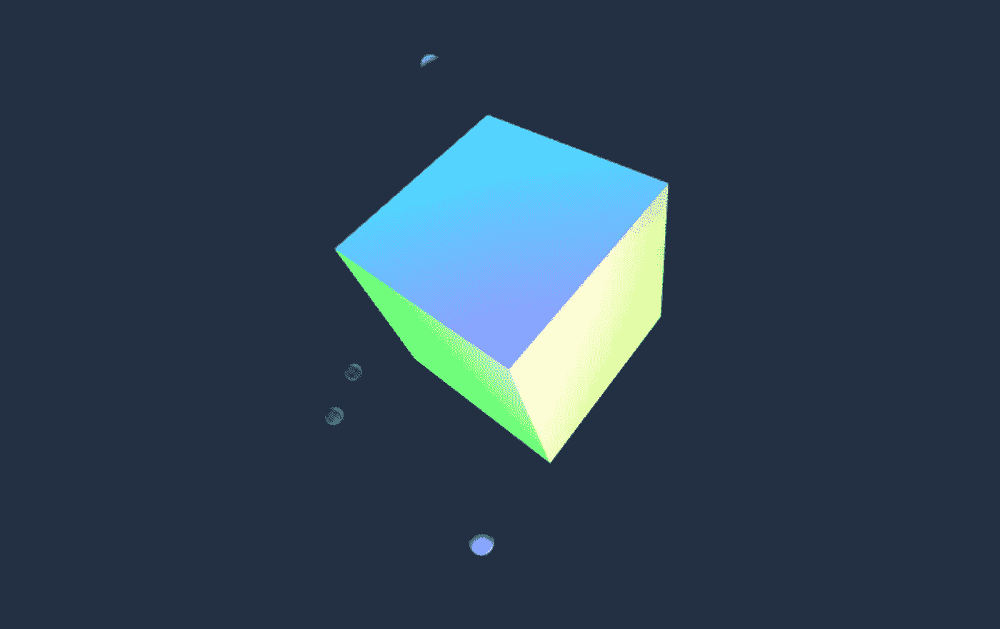

# 开始您的第一个 three.js 项目:第一部分—设置

> 原文：<https://medium.com/nerd-for-tech/getting-started-with-your-first-three-js-project-part-one-the-setup-17f18660aecc?source=collection_archive---------1----------------------->

按下“运行笔”以查看我们将构建的实时演示

# three.js 是什么？

three.js 是一个强大的 JavaScript 库和 API，允许开发人员创建令人难以置信的 2D 和 3D 图形，这些图形可以在没有插件的情况下在浏览器中动画显示(使用 [WebGL](https://get.webgl.org/) )。

要查看由才华横溢的开发人员创建的一些令人惊叹的项目，您可以在 [three.js](https://threejs.org/) 主页查看它们，以及许多关于如何充分利用该库的高级指南。

# 我们在建造什么？

在上面的标题中(点击“运行笔”后)，您可以看到我们将在本教程中构建的动画的现场演示。它是一个旋转缓慢的立方体，有四个小球体以更快的速度绕着它旋转，每个球体都有自己的轨道。它的颜色也很鲜艳，因为单色是单调的。

用户还可以任意旋转立方体和球体！

# 入门指南

在我们开始之前，让我们先进行项目设置。创建一个项目目录，放在一个你的终端容易到达的地方。我构建目录的方式如下所示(这很重要，这样导入路径才能正常工作):

```
/first_threejs_project
|__ /css
|__ |__ main.css
|__ /js
|__ |__ main.js
|__ index.html
```

在终端中键入以下命令，以正确设置项目目录(不要忘记在每行之间按“Enter”键):

```
mkdir first_threejs_project
cd first_threejs_project
mkdir css js
touch index.html
cd css
touch main.css
cd ../js
touch main.js
```



## 您的目录现在应该看起来像这样

您可以按照自己喜欢的方式设置 HTML 和 CSS，也可以使用以下代码作为模板进行工作:

【index.html 

```
<!DOCTYPE html>
<html lang=”en”>
<head>    
    <meta charset="UTF-8">
    <meta http-equiv="X-UA-Compatible" content="IE=edge">
    <meta name="viewport" content="width=device-width, initial-scale=1.0">
    <title>My First three.js Project</title>
    <link rel="stylesheet" href="css/main.css">
</head>
<body>
    // This line imports our javascript code from our /js directory
    <script type="module" src="./js/main.js"></script>
</body>
</html>
```

**main.css**

```
body {
    margin: 0px;
    height: 100vh;
}canvas {
    display: block;
}
```

现在我们已经准备好了初始文件，我们需要将 three.js 库导入到我们的项目中。有几种方法可以做到这一点，所有方法都可以在 three.js [安装指南](https://threejs.org/docs/#manual/en/introduction/Installation)中找到，但是最好的方法需要几个步骤:

1.  打开您的终端并导航到您的主项目目录
2.  如果使用节点程序包管理器(npm ),请在终端中输入以下内容:

```
npm install --save three
```

或者，如果您使用 yarn，请输入:

```
yarn add three
```

*(如果这些命令都不起作用或者对你没有意义，你可能需要在这里下载*[*NPM*](https://www.npmjs.com/get-npm)*或者*[*yarn*](https://classic.yarnpkg.com/en/docs/install/#windows-stable)*)。*

3.这应该已经向您的主项目目录添加了一系列目录。在 **/node_modules** 目录中是 **/three** 目录。如果你打开它，你会看到 **/build** 目录，其中包含了你需要导入到代码中的核心库文件。核心库文件只包含库的最重要部分，所以要包含其他有用的 three.js 特性，我们需要从另一个目录中导入它们(在安装过程中已经为我们下载了这个目录)。这些可以在子目录 **/examples/jsm** 中找到，里面有控件、加载器和一些后期处理效果。

在创建我们的第一个场景之前，只剩下最后一步了。前往您最喜欢的代码编辑器，打开 **main.js** 文件。在文件的顶部，您需要编写下面两行代码:

**main.js**

```
import * as THREE from '../node_modules/three/build/three.module.js';import { TrackballControls } from '../node_modules/three/examples/jsm/controls/TrackballControls.js';
```

上面这两条导入语句让我们的 **main.jss** 文件可以访问:

1.three.js 核心库

2.轨迹球控制模块，允许我们用鼠标点击和拖动来旋转我们的动画

# 创建您的第一个场景

现在一切都设置好了，可以开始我们的第一行 three.js 代码了！我们创建的每个动画(或“场景”)都需要三个关键对象:

1.  场景:一个父对象，在这里我们放置所有的渲染对象，灯光和摄像机
2.  照相机:一个能让我们看到其他物体的物体。有几种类型的相机，但是我们想要用于标准透视渲染的是**透视相机**
3.  Renderer:用 WebGL API 为我们渲染场景的对象

这三个对象的代码如下所示:

```
const scene = new THREE.Scene();const camera = new THREE.PerspectiveCamera(75, window.innerWidth / window.innerHeight, 0.6, 1200);const renderer = new THREE.WebGLRenderer({antialias: true});
```

现在，让我们更深入地研究这三行代码，这样我们就可以了解这背后发生了什么:

1.  场景:非常简单，我们正在创建一个新的 three.js 场景对象来放置所有东西
2.  相机:如前所述，我们已经创建了一个**透视相机**，它接受四个参数(按顺序):



来源:[研究之门](https://www.researchgate.net/figure/Camera-perspective-To-illustrate-the-camera-frustum-manipulation-we-create-two-separated_fig5_216127594)

*   视野(FOV):这是一个代表垂直 FOV(见左图)的数字(以度为单位)
*   纵横比:这是场景的宽度和高度之间的比率(宽度除以高度)。大多数情况下，我们希望将它设置为窗口的宽度和高度，这样我们就不会挤压场景中的物体。在这种情况下，我们使用**。内宽**和**。window 对象的 innerHeight** 属性(包含我们的 HTML 的主要 DOM 文档元素的窗口)
*   近剪裁平面:最靠近相机的边界平面。任何比该值更靠近相机的物体都不会被渲染
*   远剪裁平面:离相机最远的边界平面。任何比这个值更远的物体都不会被渲染

*提示:如果将远裁剪平面设置为等于或小于近裁剪平面，将不会渲染任何内容。别做那个戴夫。*

3.渲染器:这里我们创建一个 WebGL 渲染器对象来渲染我们的对象。虽然这个函数可以在没有任何参数的情况下调用，但是我们也可以传递一个带有任何我们想要改变的默认行为设置的对象。



来源:3dPrint.com

## 在我们的例子中，我们已经将**抗锯齿**属性从 false 改为 true。见图(左)的例子，我们的场景看起来像有或没有抗锯齿

初始场景创建所需的最后三行代码是:

```
renderer.setClearColor("#233143");renderer.setSize(window.innerWidth, window.innerHeight);document.body.appendChild(renderer.domElement);
```

1.  **。setClearColor** :我们的第一行设置了场景背景的颜色(在本例中是一个作为字符串传递的十六进制值)。您可以选择将一个介于 0 和 1 之间的浮点数传递给第二个参数(称为 alpha)来设置不透明度
2.  **。setSize** :设置应用程序的大小，在我们的例子中，我们想要填充整个窗口，所以我们将宽度和高度设置为**。内宽**和**。再次调用窗口对象的 innerHeight** 属性。如果您只想让应用程序占据部分窗口，可以使用较小的值。例如，**renderer . setsize(window . inner width/2，window.innerHeight/2)**会以窗口大小的 50%显示我们的应用程序
3.  **。appendChild** :这一行将渲染器作为< canvas >元素添加到我们的 HTML 文档中，负责使用 WebGL API 绘制我们的对象和动画。

## **关于响应式设计的说明:**

创建 web 应用程序时，为从智能手机到平板电脑和 4K 桌面显示器的所有设备进行开发是非常重要的。这已经由**帮我们解决了。setSize()** 函数为设备的原生屏幕尺寸。

> 如果用户改变他们在台式机或笔记本电脑上的窗口大小会怎样？



当窗口大小改变时，我们的立方体被切断

我们的渲染将停留在屏幕的中心，并被覆盖，而不是匹配新的窗口大小。为了解决这个问题，我们需要在窗口中添加一个事件监听器来调整大小，这样如果用户改变了窗口的大小，我们就可以重新计算画布的窗口大小。

我们可以用下面的代码解决这个问题:

```
window.addEventListener('resize', () => {
    renderer.setSize(window.innerWidth, window.innerHeight);
    camera.aspect = window.innerWidth / window.innerHeight;
    camera.updateProjectionMatrix();
})
```

这里，我们将画布的大小改回窗口的大小，并重置纵横比以匹配。最后我们称之为**。updateProjectionMatrix()** 函数来应用新的更改。

到目前为止，我们已经添加了所有的代码，您应该会看到类似这样的内容:

**main.js**

```
import * as THREE from '../node_modules/three/build/three.module.js';
import { TrackballControls } from '../node_modules/three/examples/jsm/controls/TrackballControls.js';// Scene
const scene = new THREE.Scene();// Camera
const camera = new THREE.PerspectiveCamera(75, window.innerWidth / window.innerHeight, 0.6, 1200);// Renderer
const renderer = new THREE.WebGLRenderer({antialias: true});
renderer.setClearColor("#233143");
renderer.setSize(window.innerWidth, window.innerHeight);
document.body.appendChild(renderer.domElement);// Make Canvas Responsive
window.addEventListener('resize', () => {
    renderer.setSize(window.innerWidth, window.innerHeight);
    camera.aspect = window.innerWidth / window.innerHeight;
    camera.updateProjectionMatrix();
})
```

我们现在已经完全设置好了我们的环境，包括一个场景，一个摄像机和一个渲染器来为我们绘制一切。如果你看不到任何东西，不要惊慌，我们还没有构建任何要渲染的东西。

要看我们如何构建动画的其余部分，请前往本教程的[第二部分](https://danielwaldow.medium.com/getting-started-with-your-first-three-js-project-part-two-the-build-3fd9a2f21418)。那里见！



我们将很快建造这些物体！