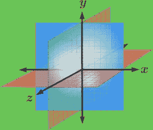
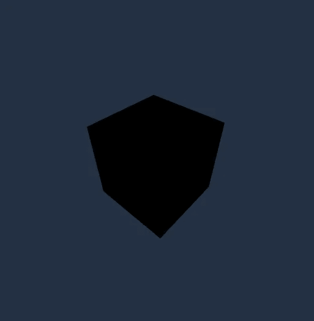
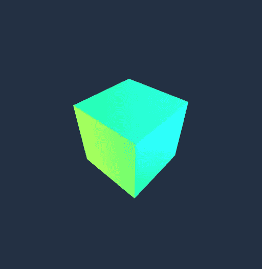
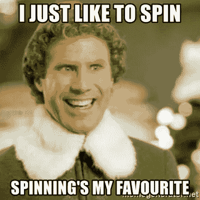
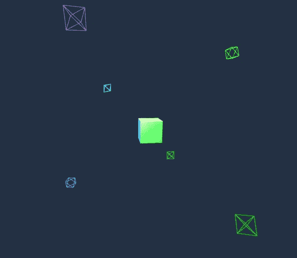
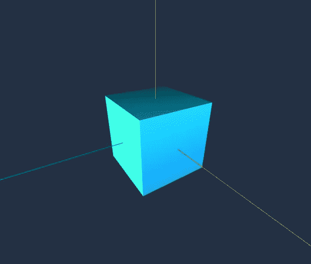
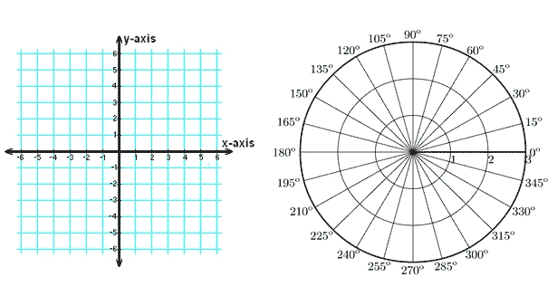
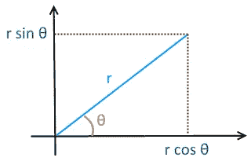

# 开始您的第一个 three.js 项目:第二部分——构建

> 原文：<https://medium.com/nerd-for-tech/getting-started-with-your-first-three-js-project-part-two-the-build-3fd9a2f21418?source=collection_archive---------5----------------------->

按下“运行笔”以查看我们将构建的实时演示

# 欢迎回来！

这是开始使用 three.js 的两部分教程的第二部分。如果你还没有看过第一部分，你可以在这里查看[进行设置，然后回来完成构建。](https://danielwaldow.medium.com/getting-started-with-your-first-three-js-project-part-one-the-setup-17f18660aecc)

概括地说，到目前为止，我们应该有以下代码:

index.html

```
<!DOCTYPE html>
<html lang=”en”>
<head>    
    <meta charset="UTF-8">
    <meta http-equiv="X-UA-Compatible" content="IE=edge">
    <meta name="viewport" content="width=device-width, initial-scale=1.0">
    <title>My First three.js Project</title>
    <link rel="stylesheet" href="css/main.css">
</head>
<body>
    // This line imports our javascript code from our /js directory
    <script type="module" src="./js/main.js"></script>
</body>
</html>
```

****main.css****

```
body {
 margin: 0px;
 height: 100vh;
}canvas {
 display: block;
}
```

****main.js****

```
import * as THREE from '../node_modules/three/build/three.module.js';
import { TrackballControls } from '../node_modules/three/examples/jsm/controls/TrackballControls.js';// Scene
const scene = new THREE.Scene();// Camera
const camera = new THREE.PerspectiveCamera(75, window.innerWidth / window.innerHeight, 0.6, 1200);// Renderer
const renderer = new THREE.WebGLRenderer({antialias: true});
renderer.setClearColor("#233143");
renderer.setSize(window.innerWidth, window.innerHeight);
document.body.appendChild(renderer.domElement);// Make Canvas Responsive
window.addEventListener('resize', () => {
    renderer.setSize(window.innerWidth, window.innerHeight);
    camera.aspect = window.innerWidth / window.innerHeight;
    camera.updateProjectionMatrix();
})
```

**如果你在任何一点卡住了，你可以在运行上面的笔后点击' JS '按钮看到最终的代码解决方案。**

# **构建立方体**

**现在我们已经用场景、摄像机和渲染器完全设置好了我们的环境，可以为我们绘制所有的东西了，是时候构建我们的第一个对象了！**

**在我们的场景中，最好的开始是添加我们的核心，盒子！为此，我们可以用下面的 three.js 语法声明几个常量:**

```
// Create Box
const boxGeometry = new THREE.BoxGeometry(2, 2, 2);
const boxMaterial = new THREE.MeshLambertMaterial({color: 0xFFFFFF});
const boxMesh = new THREE.Mesh(boxGeometry, 
boxMaterial);
boxMesh.rotation.set(40, 0, 40);
scene.add(boxMesh);
```

1.  **在我们的第一行中，我们声明了我们的常量 **boxGeometry** ，它表示我们盒子的框架，然后用**调用 **new** 关键字。BoxGeometry** 函数，传入宽度、高度和深度作为参数**
2.  **其次，我们声明要用于盒子的材料。有许多不同类型的[材料](https://threejs.org/docs/?q=material#api/en/constants/Materials)可供选择，但在我们的示例中，我们将使用**。MeshLambertMaterial** ，通过传入一个选项对象给它一个白色(这在后面会变得很重要，但是你真的可以选择任何你想要的颜色)**
3.  **我们在第三行中使用这两个常量，通过创建一个**新的。网格**根据我们刚刚定义的几何体和材质构建一个盒子**
4.  **我们可以随意改变盒子的初始旋转，如第四行所示，使用我们的 **.rotation.set** 函数，传入一个 x、y 和 z 旋转的数值(浮点数),以度数表示**
5.  **最后，我们用**将我们的盒子添加到**场景**中。添加**函数，用我们新创建的盒子作为我们的参数**

## **时光倒流一步…**

**我希望你还记得你高中时的坐标几何，因为这对我们接下来的教程会有很大的帮助。谁说你再也不会用高中数学了？**

****

**来源:[brilliant.org](https://brilliant.org/wiki/3d-coordinate-geometry-equation-of-a-plane/)**

**默认情况下，上面的最后一步将在原点(0，0，0)添加我们的立方体，就像我们的相机(目前也在原点)，这意味着我们的相机将在我们的盒子里面，我们将看不到任何东西！**

**为了解决这个问题，我们可以通过改变初始位置将相机偏移到一组不同的坐标。为此，我们可以在相机部分添加以下行:**

```
// Camera
const camera = new THREE.PerspectiveCamera(75, window.innerWidth / window.innerHeight, 0.6, 1200);
**camera.position.z = 5; // <- New code**
```

**如果到目前为止你已经完成了每一步，那么做得很好！然而，你可能在想:“我们已经设置好了我们的环境；有了场景、相机和渲染器，我们已经使我们的画布具有响应性，并且我们已经构建了立方体并将其添加到场景中。那为什么我什么都看不到？!"**

# **渲染场景**

**我们还看不到任何东西，因为我们还没有渲染任何东西。我们已经准备好了渲染器，但是还没有提供任何说明！**

**让我们现在就开始吧:**

```
const rendering = function() {
    requestAnimationFrame(rendering); // Constantly rotate box
    scene.rotation.z -= 0.005;
    scene.rotation.x -= 0.01; renderer.render(scene, camera);
}rendering();
```

**我们的第一行定义了我们的渲染函数，它作为一个动画循环。这个循环要做的是在每次屏幕刷新时重新绘制我们的场景(通常每秒 60 次，也称为“每秒帧数”(FPS))。**

**这个渲染函数位于 JavaScript 文件的底部，这一点很重要，因为它调用了一些需要首先定义的常量(即在引用它们的函数之上)。**

**在我们的块中，有以下四行:**

*   ****requestAnimationFrame(rendering)**:这行代码创建了函数的循环部分，在每次刷新后调用它自己(看看我们是如何把父 **rendering** 函数作为参数传回来的？).我们当然可以在这里使用 **setInterval()** 来代替，但是 **requestAnimationFrame()** 函数有许多独特的优点，因为它是专门为这种类型的渲染设计的。最重要的是，该函数在识别到用户导航到另一个标签时停止循环，节省了宝贵的处理能力**
*   ****场景旋转(。x 和。z)** :为了美化我们的盒子动画，我们可以设置一个旋转值，立方体将在每次刷新时更新，使盒子看起来像是在自己旋转**
*   ****renderer.render(scene，camera)** :这一行简单地指示我们的 renderer 常量使用我们的**相机**渲染我们的**场景****

****

**我们在现场的第一瞥！**

# **我们现在应该可以在场景中看到我们的立方体了！！！**

**对于眼尖的人来说，当我们将盒子的颜色设置为白色的十六进制值时(在我们的 **boxMaterial** 行上的 0xFFFFFF ),可能会弄不清楚为什么我们会看到一个黑盒。那是因为我们正在关灯看我们的盒子…**

# **照明设备**

**如果我们想正确地观看我们的场景，我们需要打开灯。**

> **“但是，我们还没有任何灯”。**

**正确！现在就来补充吧。**

**有许多类型的灯光可供选择，但在我们的例子中，我们将添加**点光源**。它们的行为与现实世界中裸露的灯泡非常相似，因此它们是最容易使用的。**

**以下几行将为你的场景添加一个灯光:**

```
const light = new THREE.PointLight(0xFFFFFF, 1, 100);
light.position.set(5, 5, 5);
scene.add(light);
```

**让我们仔细看看上面是怎么回事:**

**在我们的第一行中，我们使用**点光源**构造函数声明了一个新的**光源**常量，该构造函数最多有四个参数:**

1.  ****Colour** :这需要一个十六进制值(就像我们之前的白色例子，0xFFFFFF)来改变灯光的颜色**
2.  ****强度**:这需要一个数字，代表光的强度**
3.  ****距离**:另一个数字，定义光线从你的灯光到场景的最大距离(如果这个数字小于到场景中物体的距离，光线显然不会到达场景)**
4.  ****衰减**:光线从亮到最远距离的过程中变暗的量**

***在上面的例子中，我们只包含了三个参数，只是省略了***的一个值，默认设置为 1。****

***我们的第二条线设置我们的**灯**的位置(在我们的例子中，**灯**被设置为在 x、y 和 z 平面上离原点五个单位)。***

***最后，我们的第三条线将**灯光**添加到我们的**场景**中。***

***在我们的最终构建中，用户将能够在所有方向上旋转立方体，因此如果我们只添加一个灯光，则只能看到立方体的一面，而其余部分是黑暗的。为了解决这个问题，我们可以添加更多的灯光。***

***我们可以多次重写上面的三行，手动改变每一行的颜色和位置，但是这样会产生很多重复的代码。更好的方法是将唯一的光照值存储在一个对象数组中，并创建一个光照构造器循环。实现这一点的一种方法写在下面:***

```
*// Lights
const lights = [];const lightValues = [
    {colour: 0x14D14A, intensity: 8, dist: 12, x: 1, y: 0, z: 8},
    {colour: 0xBE61CF, intensity: 6, dist: 12, x: -2, y: 1, z: -10},
    {colour: 0x00FFFF, intensity: 3, dist: 10, x: 0, y: 10, z: 1},
    {colour: 0x00FF00, intensity: 6, dist: 12, x: 0, y: -10, z: -1},
    {colour: 0x16A7F5, intensity: 6, dist: 12, x: 10, y: 3, z: 0},
    {colour: 0x90F615, intensity: 6, dist: 12, x: -10, y: -1, z: 0}
];for (let i=0; i<6; i++) {
    lights[i] = new THREE.PointLight(
        lightValues[i]['colour'], 
        lightValues[i]['intensity'], 
        lightValues[i]['dist']);
    lights[i].position.set(
        lightValues[i]['x'], 
        lightValues[i]['y'], 
        lightValues[i]['z']);
    scene.add(lights[i]);
}*
```

***首先，我们创建一个空的**灯光**数组(一旦我们创建了它们，就存储它们)。***

***接下来，我们创建一个**灯光值**数组，其中存储了我们想要用于每个灯光的**颜色**、**强度**、**距离**以及在对象中的位置坐标的值(在下面的标题**控件和助手**下可以找到为您自己的场景计算这些值的一些技巧)。这使得引用我们想要作为参数传递给 light 构造函数的确切属性变得更加容易。***

***最后，我们为循环创建一个简单的*。在上面的例子中，我们将变量 *i* 设置为 0，并递增到(但不包括)6。这将给我们 6 次迭代，每次迭代的 *i* 值对应于上面数组中每个对象的索引(例如 *i* = 0，然后 1，然后 2 …直到 5；我们的对象的第 6 个索引)。****

***在这个循环中，我们可以插入前面看到的三行代码的修改版本:***

1.  *****lights[i]** :这个语法是访问特定索引处的数组元素的一种方式，或者在我们的例子中，在当前循环迭代中由 *i* 定义的索引处创建一个新的 **pointLight** 对象。对于我们传入的三个参数，我们只需要 **lightValues** 数组的 *i* 索引，然后我们可以访问我们之前存储在每个对象中的值(例如 **lightValues[i]['dist']** 表示**距离*****
2.  *****lights[i].position.set** :现在我们已经为当前迭代在 *i* 索引处创建了一个灯光，我们可以再次使用相同的技巧来设置灯光位置的 x、y 和 z 坐标***
3.  ***最后，我们将当前迭代的灯光添加到我们的场景中***

******

***看起来已经好多了！***

# ***我们的立方体开始看起来好多了！***

> ****“可是，还是不白！”****

***我们的立方体不是白色的原因是因为我们在一个白色的立方体上闪耀着彩色的光！***

***我们为盒子选择的材料具有反射光线的不发光物体的特性(这就是为什么我们需要灯光来适当地展示我们的盒子)。***

***我最初只使用彩色灯光，以便在使用 three.js 灯光助手时更容易区分它们(在下面的**控件和助手**中有更多关于这些的信息)，但我非常喜欢它们在白色盒子上的样子(而不是白色灯光的彩色盒子)，所以我决定保留它们。如果我们仔细看看代码中的 **lightValues** 数组，我们可以看到每种光的十六进制值都是一组特定的颜色(我为我的作品集网站的配色方案选择的颜色)。我鼓励你用你最喜欢的颜色替换它们，这可以用颜色选择器很容易地完成(谷歌有一个很好的颜色选择器[这里](https://www.google.com/search?q=colour+picker&oq=colour+picker&aqs=chrome.0.69i59i433j0l9.1657j0j7&sourceid=chrome&ie=UTF-8)，十六进制值列在所选颜色的下面)。***

# ***控件和助手***

***到目前为止，这个立方体看起来还不错。它是彩色的，而且会自己旋转。如果我们想要控制它，并把它转到我们想要的方向呢？***

## ***轨迹球控制***

***我们可以在动画中使用许多类型的控件，但是就我们的目的而言，我们想要一个可以让我们向任何方向旋转盒子的相机控件。输入轨迹球控制:***

```
*//Trackball Controls for Camera 
const controls = new TrackballControls(camera, renderer.domElement); 
controls.rotateSpeed = 4;
controls.dynamicDampingFactor = 0.15;*
```

***在我们的第一行中，我们声明我们的**控件**常量，构造一个新的 **TrackballControls** 对象，它接受两个参数:***

1.  *****相机**:我们渲染场景中的**相机*****
2.  *****domElement** :将用于事件监听器的 HTML 元素(对象‘监听’来自用户的任何交互)。在我们的例子中，我们想要的是**。我们的**渲染器**附加到的 domElement*****

***我们的第二行定义了当用户点击并拖动鼠标时场景的旋转速度。***

***最后我们设置了**。dynamicDampingFactor** ，该值用于确定一旦用户放开鼠标，旋转将减慢的速度。想象一下，当用户停止使用轨迹球控件时，盒子旋转会产生摩擦。***

> ***但是等等，还有呢！***

***如果我们把它留在这里控制会发生什么？它们将在动画的第一帧工作，但永远不会再次更新(意味着它们将在第一个 1/60 秒内工作)。***

***为了解决这个问题，我们需要在渲染函数中添加一行代码**，在每次页面刷新后更新我们的控件:*****

```
*// Update trackball controls
controls.update();*
```

******

***来源:[memegenerator.net](https://memegenerator.net/instance/66045118/buddy-the-elf-i-just-like-to-spin-spinnings-my-favourite)***

## ***现在我们可以尽情旋转我们的盒子了！***

## ***只需点击并拖动你的鼠标(或按下并轻弹手机)发送立方体飞行！***

## ***灯光助手***

***当我第一次开始添加灯光时，定位它们并正确设置它们的属性是一件非常痛苦的事情。在我偶然发现光助手后，这变得简单多了。***

***灯光助手是简单的对象，可以添加到场景中，以正确显示灯光在空间中的位置以及它们的颜色设置(这是区分多个灯光的有用技巧)。***

***将这些添加到场景中的代码如下所示(新代码以粗体显示):***

```
*// Lights
const lights = [];
**const lightHelpers = []; // <- New code**const lightValues = [
    {colour: 0x14D14A, intensity: 8, dist: 12, x: 1, y: 0, z: 8},
    {colour: 0xBE61CF, intensity: 6, dist: 12, x: -2, y: 1, z: -10},
    {colour: 0x00FFFF, intensity: 3, dist: 10, x: 0, y: 10, z: 1},
    {colour: 0x00FF00, intensity: 6, dist: 12, x: 0, y: -10, z: -1},
    {colour: 0x16A7F5, intensity: 6, dist: 12, x: 10, y: 3, z: 0},
    {colour: 0x90F615, intensity: 6, dist: 12, x: -10, y: -1, z: 0}
];for (let i=0; i<6; i++) {
    lights[i] = new THREE.PointLight(lightValues[i]['colour'], lightValues[i]['intensity'], lightValues[i]['dist']);
    lights[i].position.set(lightValues[i]['x'], lightValues[i]['y'], lightValues[i]['z']);
    scene.add(lights[i]); **// New Code: Add light helpers for each light
    lightHelpers[i] = new THREE.PointLightHelper(lights[i], 0.7);
    scene.add(lightHelpers[i]);** }*
```

***就像我们之前添加灯光的步骤一样，我们首先声明一个新的空数组， **lightHelpers** 。***

***在代码片段底部的新代码中(在循环的*中)，我们使用相同的数组访问语法为我们的每个灯光创建一个新的 **PointLightHelper** ，为我们想要的灯光传入一个助手(例如当 *i* = 0 时，传入**lights[0】**)和一个助手的大小(例如 0.7)。****

***最后，我们将每个助手添加到场景中。***

******

***我们渲染的场景，每个灯光都有一个彩色的钻石“灯光助手”***

***现在可以更容易地看到每盏灯在空间中的确切位置，从而更容易调整每盏灯的 x、y 和 z 坐标。当你有多个灯光时，改变每个灯光的颜色也是一个好主意，这样更容易确定哪个灯光被移动或编辑。***

***当你使用完灯光助手时，不要忘记删除这些行(或者用//注释掉它们)。***

## ***Axes 助手***

***在 three.js 中有许多不同类型对象的助手。另一个真正有用的助手是 Axes 助手。让我们来看看:***

```
*// Axes Helper
const axesHelper = new THREE.AxesHelper(5);
scene.add(axesHelper); // X == red, Y == green, Z == blue*
```

***这里，我们声明了**axe helper**，并通过传入一个我们想要绘制的轴的长度来构造它。***

******

***另一个助手，伟大的可视化轴***

***然后我们将它添加到场景中。正如上面的代码注释所指出的，X 轴是红色的，Y 轴是绿色的，Z 轴是蓝色的。***

***这将变得特别有帮助，当我们开始追踪我们的球体物体的轨道时。同样，当您使用 axes 辅助对象时，不要忘记删除这些行(或者用//注释掉它们)。***

# ***其他对象***

## ***创造我们的轨道球体***

***如果你回想一下(或者如果你瞥一眼页面顶部的钢笔)，你会记得我们在动画中有四个球体围绕着盒子转。让我们继续创建下面的球体:***

```
*// Create spheres: 
const sphereMeshes = [];const sphereGeometry = new THREE.SphereGeometry(0.1, 32, 32);
const sphereMaterial = new THREE.MeshLambertMaterial({color: 0xC56CEF});for (let i=0; i<4; i++) {
    sphereMeshes[i] = new THREE.Mesh(sphereGeometry, sphereMaterial);
    sphereMeshes[i].position.set(0, 0, 0);
    scene.add(sphereMeshes[i]);
}*
```

***你可能会注意到这里有很多相似之处。首先，使用我们在 light 构造中看到的相同逻辑，通过一个循环创建多个对象(为了简洁，我在这里不再详细介绍每一行)。此外，一个球体的构造函数与我们之前看到的盒子构造函数有很多共同之处，只有一些小的不同。***

***我们的**有很多参数。球面几何**函数可以取，在我们的例子中我们使用前三个，它们是:***

1.  *****半径**:以浮点数表示的球体半径(十进制)。默认值为 1***
2.  *****widthSegments** :水平段的数量(整数)***
3.  *****高度段**:垂直段的数量(整数)***

****用于宽度和高度分段的数字越大(最大为 32 ),球体看起来就越“圆”。****

***我们正在使用**。再次使用 MeshLambertMaterial** 以保持视觉一致性。这里唯一的区别是将默认颜色设置为紫色而不是白色。如果球体看起来太暗，你可以把它变回白色。***

***你可能已经注意到的另一个怪癖是，我们将每个球体的位置设置为原点。在这一点上，你可能会想“为什么我们要把它们都放在原点，这不是把它们都放在我们看不见的盒子里吗？”***

***你会很高兴地知道这个初始位置并不重要，因为我们会在每次刷新时改变球体的位置，所以它从哪里开始并不重要。***

## ***重温三角学***

***在我们回到数学教室学习一些“轻松”的三角学时，提前为引发任何痛苦的高中记忆道歉。***

***当我开始这个项目时，我真的希望有多个球体围绕一个盒子旋转，就像人们可以模拟电子围绕一个原子旋转一样。这带来了一些挑战:***

*   ***每个球体的半径需要不同，以确保球体在碰撞中不会互相穿过(这并不困难)***

******

***笛卡尔坐标(左)和极坐标(右)，来源: [wyzant](https://www.wyzant.com/resources/lessons/math/trigonometry/unit-circle/cartesian-vs-polar-coordinates)***

*   ***每个球体的轨道(通常在极坐标中测量)需要转换到笛卡尔坐标才能被 three.js 理解(中等难度)***
*   ***为了对不同平面中的每个球体的轨道路径建模，极坐标到笛卡尔坐标的转换需要从 2D 环境适应到 3D 环境(完全混乱)***

***为了解决这些挑战，让我们戴上数学帽子，投入其中:***

*****不同的半径**:***

*   ***一个简单的解决方法，这些可以存储在每个球体的对象中，稍后我们可以在函数中访问这些对象***

*****将极坐标转换为笛卡尔坐标**:***

*   ***在 2D 笛卡尔坐标中，我们通过点离 x 轴(y = 0)和 y 轴(x = 0)的距离来测量点***

******

***极坐标和笛卡尔坐标的关系，来源: [MattLoftus](https://mattloftus.github.io/2016/02/03/threejs-p2/)***

*   ***在 2D 极坐标中，我们通过测量半径( *r)* 的长度和角度(*θ*)来计算到原点(0，0)的距离，角度从 x 轴延伸到半径向量(连接我们的点和原点)***
*   ***为了绘制球体的轨道，我们需要在每次页面刷新时增加角度(我们的 *theta* 值),并保持半径不变***
*   ***对于这些计算中的每一个，我们可以运行一些 trig 函数来获得我们想要的值，在我们的例子中，我们的 x 坐标是 *r* 乘以 cos(φ),我们的 y 坐标是 *r* 乘以 sin(φ)***

***运行这些计算所需的代码包括一些不同的附加内容:***

```
*// Trigonometry Constants for Orbital Paths
let theta = 0;
const dTheta = 2 * Math.PI / 100;*
```

***这两条线定义了我们的:***

1.  *****theta** :我们将用来存储当前页面刷新的 *theta* 角度的变量(我们在这里使用 **let** ，因为它每次都会改变)。它从 0 开始***
2.  *****dTheta** :我们将增加的角度常数 **theta** 被设置为 2π /我们希望每转增加的数量。这个数字越小(在我们的例子中是 100 ),球体环绕长方体的速度就越快***

***这一部分的最后一块拼图是在我们的**渲染**函数中增加我们的*θ*角度:***

```
*theta += dTheta; // <- THIS MUST BE INSIDE OUR RENDERING FUNCTION*
```

*****从 2D 适应 3D 环境:*****

***这一部分有点棘手，但经过大量的试验和错误，我能够找到一系列的值用于我们的触发函数，这将产生四个独特的轨道，每个都在不同的平面上。我们可以将它们存储在一个对象数组中:***

```
*// Store trig functions for sphere orbits // MUST BE INSIDE RENDERING FUNCTION OR 
// THETA VALUES ONLY GET SET ONCE const trigs = [
        {x: Math.cos(theta*1.05), 
         y: Math.sin(theta*1.05), 
         z: Math.cos(theta*1.05), 
         r: 2}, {x: Math.cos(theta*0.8), 
         y: Math.sin(theta*0.8), 
         z: Math.sin(theta*0.8), 
         r: 2.25}, {x: Math.cos(theta*1.25), 
         y: Math.cos(theta*1.25), 
         z: Math.sin(theta*1.25), 
         r: 2.5}, {x: Math.sin(theta*0.6), 
         y: Math.cos(theta*0.6), 
         z: Math.sin(theta*0), 
         r: 2.75}
    ];*
```

***在我们的 **trigs** 数组中，我们为每个球体的轨道路径存储一个对象，为 x、y 和 z 坐标以及半径( *r* )定义一个值，这些值将在下面的 trig 函数中使用:***

```
*// Loop 4 times (for each sphere), updating the position 
// MUST BE INSIDE RENDERING FUNCTIONfor (let i=0; i<4; i++) {
    sphereMeshes[i].position.x = trigs[i]['r'] * trigs[i]['x'];
    sphereMeshes[i].position.y = trigs[i]['r'] * trigs[i]['y'];
    sphereMeshes[i].position.z = trigs[i]['r'] * trigs[i]['z'];
};*
```

***另一个*为循环*？最肯定！***

***在这个循环中，我们使用上面的等式对每个球体进行一次迭代。我们可以访问唯一的半径值，并在每次迭代中将其乘以我们的 cos(φ)和 sin(φ)值(以及选择的乘数常数，例如 1.05、0.8、1.25、0.6 和 0)。将我们的 2D 路径转换为 3D 路径的关键是将 cos(φ)或 sin(φ)添加到 z 坐标(如果 x、y 或 z 中的至少一个值为 sin(φ),则另两个值为 sin(φ),反之亦然，以确保它们围绕原点旋转)。***

***我强烈建议您通过改变 **trigs** 数组中 **cos** 和 **sin** 比率的位置以及乘数常数来进行试验，看看每个组件对整个动画有什么影响。***

# *****我们完成了！*****

***如果你已经做到了这一步，恭喜你！你现在应该有你自己的美丽的，多彩的，旋转的立方体，包括轨道球体！***

***下面是完整代码解决方案的示例(如果您想在 IDE 风格的环境中查看，可以单击页面顶部笔中的“JS”按钮):***

```
*import * as THREE from '../node_modules/three/build/three.module.js';
import { TrackballControls } from '../node_modules/three/examples/jsm/controls/TrackballControls.js';// Scene
const scene = new THREE.Scene();// Camera
const camera = new THREE.PerspectiveCamera(75, window.innerWidth / window.innerHeight, 0.6, 1200);
camera.position.z = 5; // Set camera position// Renderer
const renderer = new THREE.WebGLRenderer({antialias: true});
renderer.setClearColor("#233143"); // Set background colour
renderer.setSize(window.innerWidth, window.innerHeight);
document.body.appendChild(renderer.domElement); // Add renderer to HTML as a canvas element// Make Canvas Responsive
window.addEventListener('resize', () => {
    renderer.setSize(window.innerWidth, window.innerHeight); // Update size
    camera.aspect = window.innerWidth / window.innerHeight; // Update aspect ratio
    camera.updateProjectionMatrix(); // Apply changes
})// Create box:
const boxGeometry = new THREE.BoxGeometry(2, 2, 2); // Define geometry
const boxMaterial = new THREE.MeshLambertMaterial({color: 0xFFFFFF}); // Define material
const boxMesh = new THREE.Mesh(boxGeometry, boxMaterial); // Build box
boxMesh.rotation.set(40, 0, 40); // Set box initial rotation
scene.add(boxMesh); // Add box to canvas// Create spheres: 
const sphereMeshes = [];
const sphereGeometry = new THREE.SphereGeometry(0.1, 32, 32); // Define geometry
const sphereMaterial = new THREE.MeshLambertMaterial({color: 0xC56CEF}); // Define material
for (let i=0; i<4; i++) {
    sphereMeshes[i] = new THREE.Mesh(sphereGeometry, sphereMaterial); // Build sphere
    sphereMeshes[i].position.set(0, 0, 0);
    scene.add(sphereMeshes[i]); // Add sphere to canvas
}// Lights
const lights = []; // Storage for lights
// const lightHelpers = []; // Storage for light helpers// Properties for each light
const lightValues = [
    {colour: 0x14D14A, intensity: 8, dist: 12, x: 1, y: 0, z: 8},
    {colour: 0xBE61CF, intensity: 6, dist: 12, x: -2, y: 1, z: -10},
    {colour: 0x00FFFF, intensity: 3, dist: 10, x: 0, y: 10, z: 1},
    {colour: 0x00FF00, intensity: 6, dist: 12, x: 0, y: -10, z: -1},
    {colour: 0x16A7F5, intensity: 6, dist: 12, x: 10, y: 3, z: 0},
    {colour: 0x90F615, intensity: 6, dist: 12, x: -10, y: -1, z: 0}
];for (let i=0; i<6; i++) {
    // Loop 6 times to add each light to lights array
    // using the lightValues array to input properties
    lights[i] = new THREE.PointLight(
      lightValues[i]['colour'], 
      lightValues[i]['intensity'], 
      lightValues[i]['dist']
    );

    lights[i].position.set(
      lightValues[i]['x'], 
      lightValues[i]['y'], 
      lightValues[i]['z']
    );

    scene.add(lights[i]);// Add light helpers for each light
    // lightHelpers[i] = new THREE.PointLightHelper(lights[i]);
    // scene.add(lightHelpers[i]);
};//Trackball Controls for Camera 
const controls = new TrackballControls(camera, renderer.domElement); 
controls.rotateSpeed = 4;
controls.dynamicDampingFactor = 0.15;// Axes Helper
// const axesHelper = new THREE.AxesHelper(5);
// scene.add( axesHelper ); // X axis = red, Y axis = green, Z axis = blue// Trigonometry Constants for Orbital Paths 
let theta = 0; // Current angle
// Angle increment on each render
const dTheta = 2 * Math.PI / 100;// Rendering Function
const rendering = function() {
    // Rerender every time the page refreshes (pause when on another tab)
    requestAnimationFrame(rendering);// Update trackball controls
    controls.update();// Constantly rotate box
    scene.rotation.z -= 0.005;
    scene.rotation.x -= 0.01;//Increment theta, and update sphere coords based off new value        
    theta += dTheta;// Store trig functions for sphere orbits 
    // MUST BE INSIDE RENDERING FUNCTION OR THETA VALUES ONLY GET SET ONCE
    const trigs = [
        {x: Math.cos(theta*1.05), y: Math.sin(theta*1.05), z: Math.cos(theta*1.05), r: 2},
        {x: Math.cos(theta*0.8), y: Math.sin(theta*0.8), z: Math.sin(theta*0.8), r: 2.25},
        {x: Math.cos(theta*1.25), y: Math.cos(theta*1.25), z: Math.sin(theta*1.25), r: 2.5},
        {x: Math.sin(theta*0.6), y: Math.cos(theta*0.6), z: Math.sin(theta*0), r: 2.75}
    ];// Loop 4 times (for each sphere), updating the position 
    for (let i=0; i<4; i++) {
        sphereMeshes[i].position.x = trigs[i]['r'] * trigs[i]['x'];
        sphereMeshes[i].position.y = trigs[i]['r'] * trigs[i]['y'];
        sphereMeshes[i].position.z = trigs[i]['r'] * trigs[i]['z'];
    };renderer.render(scene, camera);
}rendering();*
```

***感谢您阅读本教程，下次再见！***

***—沃尔多. the.Dev***