# 缓存速成班

> 原文：<https://medium.com/nerd-for-tech/getting-that-cache-money-1f93aea4f6ef?source=collection_archive---------6----------------------->

## 缓存原理介绍


使用缓存提高应用速度

# 观众

本文的目标读者是对互联网功能、当代应用程序架构和 AWS 有合理理解的开发人员。

它将涵盖什么是更一般意义上的缓存，使用它背后的动机，然后深入到具体的实现。

# 争吵

高速缓存将先前使用或计算的数据存储在高速数据存储中，以使其比在主存储层中更快可用。一般来说，我们会使用硬件，如内存。

例如，我们可能会将喜欢的外卖保存为配送应用程序中的收藏夹。我们不是每次都在应用程序中搜索外卖，而是去我们最喜欢的部分。这实际上充当了我们的缓存。

高速缓存的优势包括:

*   **降低数据库成本:**如果您的数据库实施按 IOPS(每秒输入/输出)收费，那么高速缓存可以帮助降低成本。
*   **降低后端负载:**如果相同的查询正在轰击后端，那么通过引入缓存，我们可以降低后端负载。这与上述降低数据库成本的观点相结合，因为这意味着我们的主数据存储可以更小。
*   **提高应用程序性能**:如前所述，缓存结果的检索要快得多。
*   **可预测的性能:**传统数据存储上的高流量事件会导致锁定和其他性能问题。通过高吞吐量缓存，我们可以减少这种情况。
*   **消除数据库热点:**我们数据库中的一些数据可能比其他数据被更频繁地访问。纯粹基于此来扩展我们的整个数据库是没有意义的。

现在，我们已经从概念上介绍了缓存及其优势，让我们深入了解使用案例。

## CDN 缓存

首先，让我们回顾一下内容交付网络(CDN)的目的。

CDN 是遍布全球的许多服务器，目的是提供互联网内容的快速传送。它允许有效加载互联网内容资产，如 HTML、CSS、JavaScript、视频和图像。

例如，我们可能在伦敦托管我们的服务器，但是在费城访问网页。通过在纽约建立一个存在点(POP)或边缘服务器，我们可以更快地将内容传送到费城。

总体而言，cdn 通过规避 DDOS 攻击，缩短了网站加载时间，降低了带宽成本，提高了内容可用性并提高了安全性。

AWS CDN 产品是 [CloudFront](https://aws.amazon.com/cloudfront/) ，它可以通过 [Lambda@Edge](https://aws.amazon.com/lambda/edge/) 提供的计算能力得到增强。CloudFront 服务器充当缓存，位于边缘位置，提供资产的缓存版本。

例如，我们可能从一个 S3 桶提供一个静态网站。然后，我们可以设置 CloudFront 来缓存站点，并设置 edge Lambda 来向请求添加安全头。

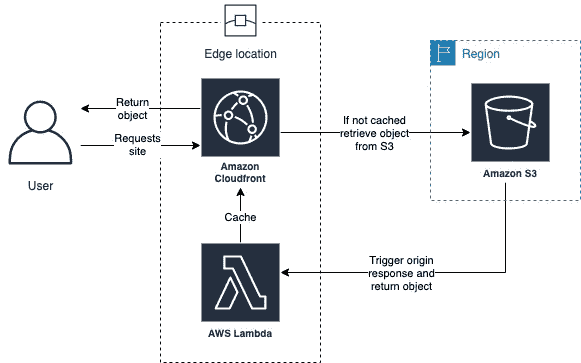

在 AWS 中使用 CDN 缓存信息的示例

## DNS 缓存

在介绍 DNS 缓存之前，我们先介绍一下 DNS。

当我们在浏览器中加载一个网站时，我们输入一个 URL，比如`https://medium.com`。然后，我们的浏览器向路由器询问该网站的 IP 地址，以便检索文件。路由器转到 DNS 服务器并找到 IP 地址，之后你的浏览器就可以加载页面了。

DNS 缓存是您机器上的一个临时数据库，包含最近 URL 到 IP 地址映射的记录。

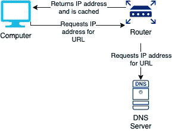

DNS 解析和缓存的示例流程

值得注意的是，内部的 ISP 和 DNS 服务器也会做自己的缓存！

## Web 缓存

Web 缓存通过在缓存中保留 HTTP 响应和 web 资源来提高网站的响应能力。这个缓存可以驻留在浏览器中，或者在服务器端，它使用一个反向代理(比如 [Varnish](https://varnish-cache.org/intro/index.html#intro) )或者一个 web 应用加速器。

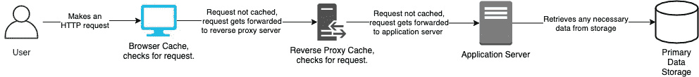

HTTP 缓存层的一个例子

这两者(和 cdn)都是由 HTTP 缓存头驱动的。它们驻留在 HTTP 响应上，并允许资源告诉缓存将它们存储多长时间。

需要注意的核心头是`Cache-Control`,它指出谁应该缓存响应、何时缓存以及缓存多长时间。总的来说，它具有以下形式:

```
Cache-Control: public/private, max-age=0, no-cache/no-store, must-revalidate, proxy-revalidate, no-transform
```

*   **Public/ Private:** Public 让缓存引擎知道可以缓存响应，即使它通常与身份验证相关联。我们可以通过提供最大年龄来间接暗示这一点。Private 让浏览器知道它可以缓存它，但是服务器不能，因为它与用户的私人信息相关联。
*   **最长时间:**这是响应可以再次使用的最长时间(秒)。例如，`max-age=60`表示从发出请求起 60 秒内可以从缓存中检索到资产。
*   **无缓存/无存储:**无缓存强制向服务器发出请求，以检查其是否仍然有效(通常使用 [ETag](https://developer.mozilla.org/en-US/docs/Web/HTTP/Headers/ETag) 头)。如果高速缓存条目仍然有效，则不需要下载。没有比这更简单的存储了，它阻止了所有级别的所有缓存。
*   **必须重新验证:**当响应变得过时(缓存条目已用尽)时使用，告知缓存必须对具有源的响应进行端到端验证，并且不使用过时的资产。
*   **代理重新验证:**这与“必须重新验证”相同，但仅适用于代理级别。例如，一个经过身份验证的用户可能在浏览器中缓存了可以重用的响应，但是在代理级别缓存的任何响应都需要重新验证。
*   **无转换:**这告诉任何中间缓存不要修改响应。

## 会话缓存

有关会议的概述，请点击[此处](https://jc1175.medium.com/cookies-sessions-and-jwt-the-very-very-basics-73dc706125e6)查看相关文章。

我们可以用几种方式处理会话。一种是将用户的会话存储在处理用户请求的特定节点上，并每次将它们重定向到该节点(粘性会话)。另一种方法是在应用程序中设置一个专用的会话缓存层，供所有节点访问。这通常会使用一个键/值存储。

在 AWS 中，我们可能会使用类似于 [Redis](https://redis.io/) 或 [Memcached](https://memcached.org/) 的东西，我们可以在下面简化的 AWS 架构中看到。

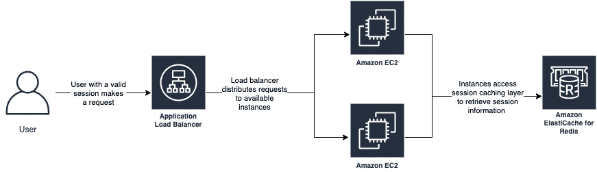

显示用于会话管理的缓存的简化 AWS 体系结构。

## 数据库缓存

内存缓存可以帮助减轻数据库的一些压力。如果您经常访问只读数据，那么将这些数据存储在缓存中而不是永久存储中可能是有意义的。这可以在数据库本身、本地应用服务器或类似的会话上完成，它可以使用专用的缓存层。

通过在数据库上缓存，我们可以自动处理直写(更新的数据如何影响我们的缓存值)。然而，缓存将与数据库位于同一个服务器上，这意味着它需要与整个数据库引擎一起伸缩。

通过在我们的应用服务器上进行缓存，我们缓解了其中的一些问题，但是我们现在只能访问一个节点上的缓存，如果它关闭，我们将会丢失缓存。

专用缓存层可以解决这一问题，但会带来延迟，因为必须发出请求。对于这个和前面的解决方案，我们还面临当数据更新时更新缓存值的问题。一个狡猾的逻辑！

## 通用缓存

到目前为止，您已经了解了这个要点，缓存可以用在应用程序中任何有用的地方。它根本不是什么灵丹妙药，但却非常有用！

## 关于从缓存中获取数据的快速说明

我相信你已经意识到，缓存不是无限的。我们需要以某种方式删除条目。一种方法是引入生存时间(TTL)——当我们向缓存中添加一个条目时，我们给它一段我们希望它停留的时间，之后它将被删除。

但是，当我们的缓存填满且 TTL 尚未过期时，我们还有其他选择:

*   **无驱逐:**缓存抛出错误。
*   **FIFO(先进先出)/ LIFO(后进先出):**要放入缓存的第一个/最后一个条目被逐出。
*   **LFU(最少使用)/ LRU(最近最少使用):** 具有最少命中/最早命中的条目被驱逐。
*   **TLRU(时间感知最近最少使用):**没有 TTL 的最近最少使用的条目被驱逐。
*   **SLRU(分段 LRU):** 缓存一分为二——试用和受保护。第一次缓存命中将条目置于试用状态，第二次缓存命中将条目置于受保护状态。最近最少使用的试用条目被驱逐。
*   **MRU(最近使用):** 最近使用的条目被驱逐。
*   **RR(随机替换):**随机条目被驱逐。

## 工作示例

让我们用一个使用 [H2](https://www.h2database.com/html/main.html) 、 [Redis](https://redis.io/) 进行缓存，以及使用 [Spring 数据](https://spring.io/projects/spring-data)和 [Spring 数据 Redis](https://docs.spring.io/spring-data/data-redis/docs/current/reference/html/) 进行连接的例子来说明这一切。我们将实现一个简单的系统来检索用户并缓存他们。储存库可以在这里找到。

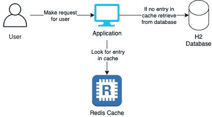

我们的示例应用程序的基本轮廓

首先，我们使用 [Spring Initializr](https://start.spring.io/) 设置 Spring 项目。不可能在一个页面中显示所有的依赖项，所以请查看存储库的 pom 文件以获得完整的列表。

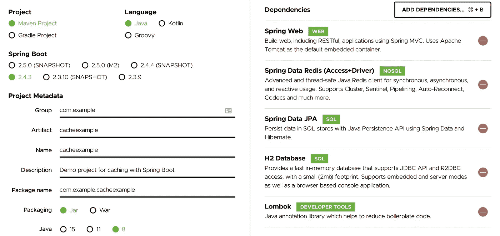

使用 Spring Initializr 设置缓存示例

一旦设置完成，我们还需要在本地安装 Redis。我用的是[家酿](https://brew.sh/)。

```
brew install redis
```

然后，我们使用以下命令启动服务器运行:

```
redis-server /usr/local/etc/redis.conf
```

我们将实现两个端点，一个用于检索采用延迟加载的用户，另一个用于持久化新用户，使用直写缓存。

*   **延迟加载:**这是指我们在加载数据时将数据放入缓存。如果我请求 Id 为“1”的用户，那么我也将把它加载到我的缓存中。
*   **直写:**这是我们在保存数据时将数据放入缓存的时候。如果我创建一个 Id 为' 2 '的新用户，那么我也将把它加载到我的缓存中。

我们还将为缓存条目使用 TTL(生存时间)。

类别结构如下所示:

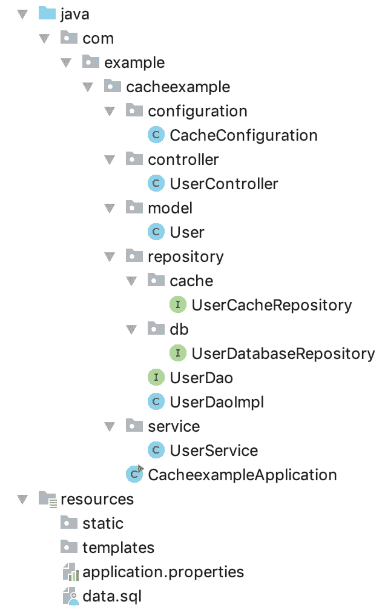

我们的示例项目的 Spring 类结构

首先，我们设置应用程序的主类:

```
@SpringBootApplication
@EnableJpaRepositories(**"com.example.cacheexample.repository.db"**)
@EnableRedisRepositories(**"com.example.cacheexample.repository.cache"**)
**public class** CacheexampleApplication {

   **public static void** main(String[] args) {
      SpringApplication.*run*(CacheexampleApplication.**class**, args);
   }

}
```

我们可以看到，我们在一个包中使存储库能够连接到我们的数据库，在另一个包中使存储库能够连接到 Redis。在我们的`application.properties`文件中，我们关闭了任何自动发现存储库的功能，以防止混淆:

```
spring.data.jpa.repositories.enabled=false
spring.data.redis.repositories.enabled=false
```

让我们看看如何配置我们的应用程序:

```
@Configuration
**public class** CacheConfiguration {

    @Bean
    JedisConnectionFactory jedisConnectionFactory() {
        RedisStandaloneConfiguration redisStandaloneConfiguration = **new** RedisStandaloneConfiguration(**"localhost"**, 6379);
        **return new** JedisConnectionFactory(redisStandaloneConfiguration);
    }

    @Bean
    **public** RedisTemplate<?, ?> redisTemplate() {
        RedisTemplate<?, ?> redisTemplate = **new** RedisTemplate<>();
         redisTemplate.setConnectionFactory(jedisConnectionFactory());
        **return** redisTemplate;
    }

}
```

我们将 Redis 设置为连接到我们刚刚启动的本地实例。`data.sql`文件在我们的 H2 数据库中创建了一个表，并设置了一些初始数据:

```
**DROP TABLE** IF **EXISTS** users;

**CREATE TABLE** users (
  id    **INT** AUTO_INCREMENT  **PRIMARY KEY**,
  name  **VARCHAR**(250) **NOT NULL** );

**INSERT INTO** users (name) **VALUES** (**'Sarah'**),
  (**'June'**),
  (**'Elizabeth'**);
```

这与我们的模型类相匹配:

```
@Data
@Entity
@Table(name = **"users"**)
@RedisHash(value = **"User"**, timeToLive = 5)
**public class** User **implements** Serializable {

    @Id
    @GeneratedValue(strategy = GenerationType.***IDENTITY***)
    **private** Long **id**;

    @NotEmpty
    **private** String **name**;

}
```

请注意我们是如何在数据库中将用户声明为一个实体的，同时也是一个具有 5 秒 TTL 的 Redis 值。

从这里我们公开两个端点。一个通过 Id 获取用户(使用延迟加载)，一个持久化新用户(使用直写)。

```
@Slf4j
@Controller
**public class** UserController {

    @Autowired
    **private** UserService **userService**;

    @GetMapping(**"/user/{id}"**)
    **public** ResponseEntity<User> getUser(@PathVariable String id) {
        ***log***.info(**"Retrieving user with Id {}"**, id);
        **return** ResponseEntity.*ok*(**userService**.getUser(id));
    }

    @PostMapping(**"/user"**)
    **public** ResponseEntity<User> createUser(@Validated @RequestBody User user) {
        ***log***.info(**"Persisting user with name {}"**, user.getName());
        **return** ResponseEntity.*ok*(**userService**.createUser(user));
    }

}
```

这两者都传递给服务类:

```
@Slf4j
@Service
**public class** UserService {

    @Autowired
    **private** UserDao **userDao**;

    **public** User getUser(String id) {
        ***log***.info(**"Calling DAO to get user with Id {}"**, id);
        **return userDao**.getUser(Long.*parseLong*(id));
    }

    **public** User createUser(User user) {
        ***log***.info(**"Calling DAO to persist new user with name {}"**, user.getName());
        **return userDao**.createUser(user);
    }
}
```

然后传递给`DAO`类，该类充当数据库和缓存之间的中介。这是一个界面:

```
**public interface** UserDao {
    User getUser(Long id);
    User createUser(User user);
}
```

然后有一个具体的实现。

```
@Slf4j
@Repository
**public class** UserDaoImpl **implements** UserDao {

    @Autowired
    **private** UserDatabaseRepository **userDatabaseRepository**;

    @Autowired
    **private** UserCacheRepository **userCacheRepository**;

    @Override
    **public** User getUser(Long id) {

        ***log***.info(**"Checking in cache for user with Id {}"**, id);

        Optional<User> userCacheOptional = **userCacheRepository**.findById(id);

        ***log***.info(**"Retrieved cache result for user with Id {}"**, id);

        **return** userCacheOptional.orElseGet(() -> {

            ***log***.info(**"No user with Id {} in cache"**, id);

            Optional<User> optionalUser = **userDatabaseRepository**.findById(id);

            ***log***.info(**"Retrieved user with Id {} from database"**, id);

            User user = optionalUser.orElseThrow(() -> **new** RuntimeException(**"User not found"**));

            ***log***.info(**"Persisting user with Id {} to cache"**, id);

            User cacheUser = **userCacheRepository**.save(user);

            ***log***.info(**"Persisted user with Id {} to cache"**, cacheUser.getId());

            **return** user;

        });

    }

    @Override
    **public** User createUser(User user) {

        ***log***.info(**"Creating a new user in the database with name {}"**, user.getName());

        User newUser = **userDatabaseRepository**.save(user);

        ***log***.info(**"Saved new user in the database Id {}, name {}"**, user.getId(), user.getName());

        **userCacheRepository**.save(newUser);

        ***log***.info(**"Saved new user in the cache Id {}, name {}"**, user.getId());

        **return** newUser;
    }
}
```

这才是我们真正感兴趣的！在`get`方法中，我们检查用户是否在缓存中。如果没有，我们从数据库中获取它们，并把它们放在缓存中。在`put`方法中，我们将它们保存到数据库中，然后保存到缓存中！

让我们来看看它的运行情况。首先，让我们请求获取 Id 为`1`的用户。

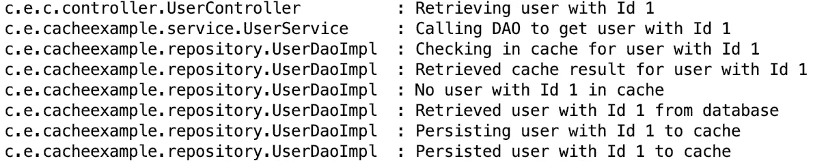

用于检索 Id 为 1 的用户的日志文件

从日志中我们可以看到，缓存中没有 Id 为`1`的用户，所以我们访问了数据库并将结果写入缓存。如果我们在不到五秒钟的时间内再次到达同一个端点，我们将收到以下消息:

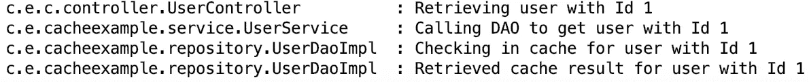

用于检索 Id 为 1 的缓存用户的日志文件

现在我们不再使用数据库，而是完全依赖 Redis。如果我们把它放 5 秒钟，试着回到第一个案例。

最后，让我们持久化并检索一个新用户。

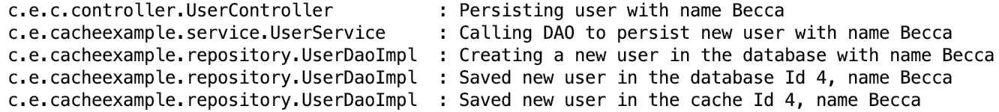

保存新用户 Becca 的日志文件

在这里，我们可以看到我们保存了用户“Becca ”,并将她保存到缓存中。立即找回她给了我们:

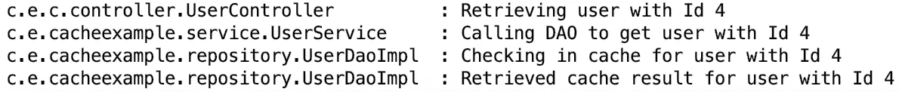

用于从缓存中检索新用户 Becca 的日志文件

我们在那里找到了她。

# 结论

总之，我们已经讨论了在当代应用程序中可以使用缓存的许多地方，并在一个工作示例中演示了它们。