# 用邪恶的酷装备变得邪恶的酷

> 原文：<https://medium.com/nerd-for-tech/getting-wicked-cool-with-the-wicked-coolkit-dba0d2baa3de?source=collection_archive---------22----------------------->

想象一下这样一个世界，简单地使用谷歌不是一个选项，这项服务的最大好处是收集与你的请求相匹配的相似结果。在现代搜索引擎出现之前，你基本上只能靠自己来判断“我下一步该去哪里？”事实上，我记得看过下面这个商业广告，它聚焦于主角探索整个互联网:

# 记住网环

回到 20 世纪 90 年代和 21 世纪初的互联网时代，有一个想法是让全球网络导航更容易。它被称为“ [webring](https://en.wikipedia.org/wiki/Webring) ”，它引入了一个参与网站的公共部分。这个公共部分提供了一种导航到包含类似或推荐内容的其他站点的方法。我从一个(相当陈旧的)网站上找到了以下关于加拿大强力三重奏乐队 Rush 的例子:

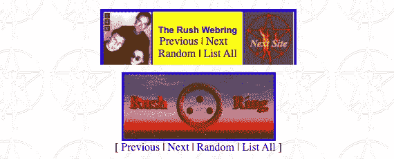

在上面的截图中，该网站每个页面的底部都包含不止一个链接，而是两个关注(或相关)乐队[拉什](https://en.wikipedia.org/wiki/Rush_(band))的网络链接。webring 的好处是，网站的访问者可以导航到关注相同类型内容的其他参与网站。

就像 20 世纪 80 年代的妈妈牛仔裤重新流行起来一样，Salesforce 和 Heroku 的团队认为 webring 的想法重新出现在网络舞台上的时机已经成熟。毕竟，二十多年过去了，这在互联网时代是一个永恒。因此，他们决定他们邪恶的 Coolkit web toolkit 必须包含 webring 功能。

# 介绍邪恶酷派

Wicked Coolkit 是一个有趣的怀旧网络工具包，建立在 Heroku 和 Salesforce 之上。导航到[https://wickedcoolkit.com/](https://wickedcoolkit.com/)站点会出现以下屏幕:

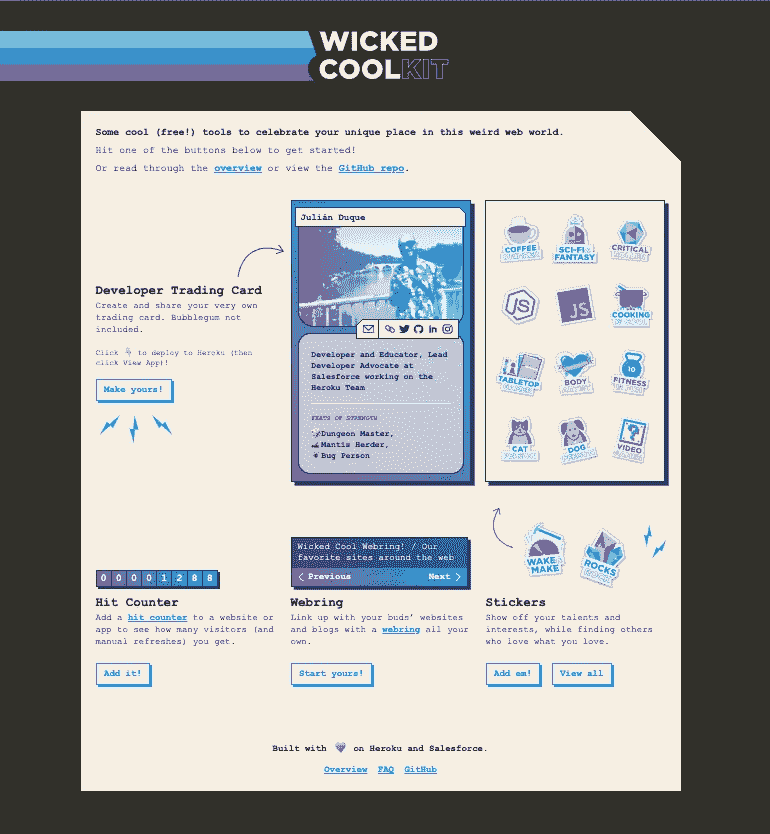

在我看来，Coolkit 用户的好处很简单:

1.  学习新的东西
2.  创建一个开发者交易卡来谈论你自己
3.  引入一些怀旧的 web 1.0 的东西(比如一个计数器和一个 webring)
4.  玩得开心

# 创造我邪恶的 Coolkit 体验

在阅读上述目标时，我必须承认，所有这些似乎都激起了我的兴趣。所以，和我一起体验酷酷的乐趣吧。

第一个链接将我导向 Heroku(我已经有了一个帐户)和创建新应用程序屏幕:

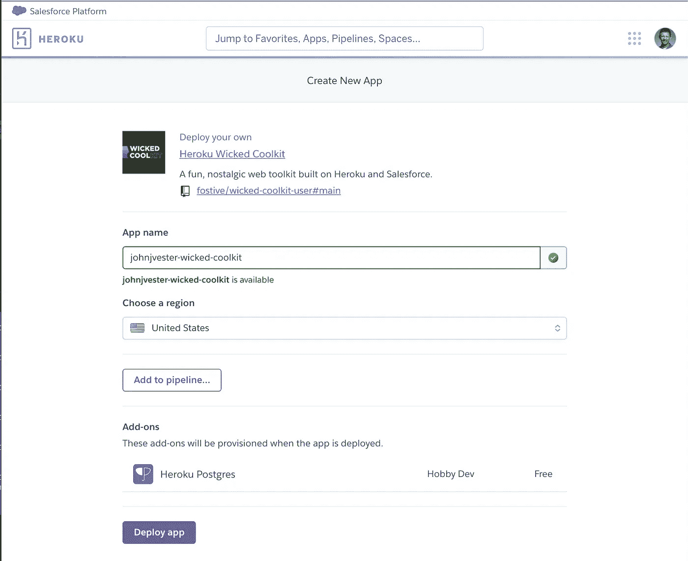

我调用了我的应用程序`johnjvester-wicked-coolkit`,以确保这个 Heroku 应用程序的意图总是为我所知。

单击 Deploy App 按钮后，我看到状态屏幕创建了应用程序，为我配置了环境，构建了应用程序(我相信是 Node Express)，运行了一些脚本，然后将所有东西部署到 Heroku。点击“查看应用程序”按钮，导航至流程的下一步:

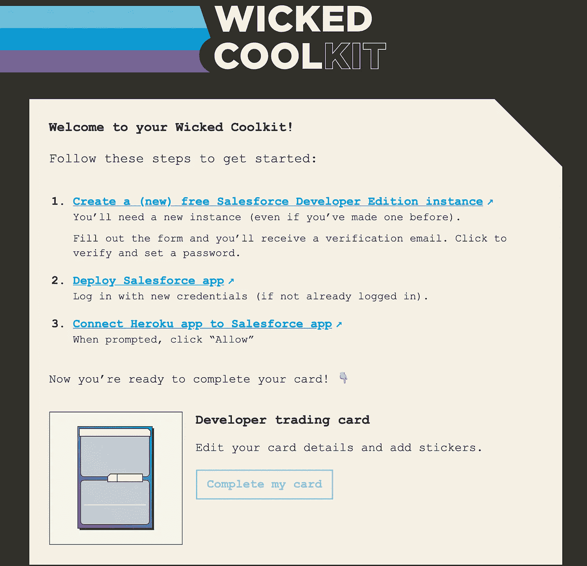

点击第一步，我创建了一个新的 Salesforce 开发人员版本。这对我来说并不新鲜，对大多数用户来说也很简单。

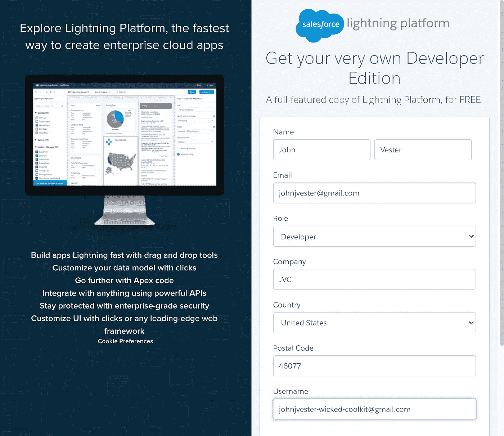

在确认我的身份并建立密码后，下一步是部署 Wicked Coolkit 的 Salesforce 端。在我新创建的 Salesforce 开发人员版中，我选择了为所有用户安装 Wicked_CoolKit 应用程序的选项:

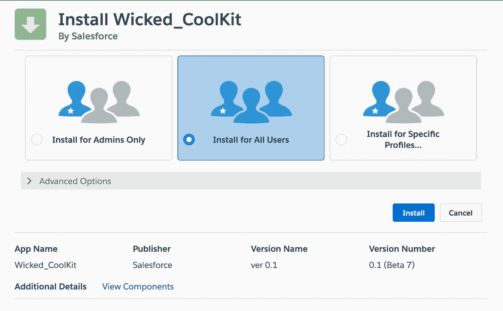

几秒钟后，Wicked_CoolKit 应用程序就安装好了。最后一步是将 Heroku 应用程序连接到 Salesforce。

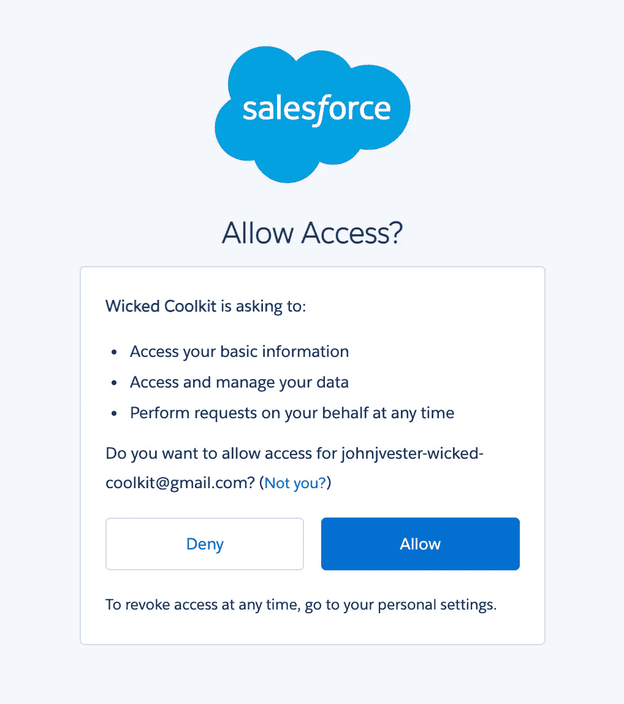

基本上，我只需要点击允许按钮，这将我带回入门屏幕。

创建我的开发者交易卡始于 Salesforce 中的一个表单:

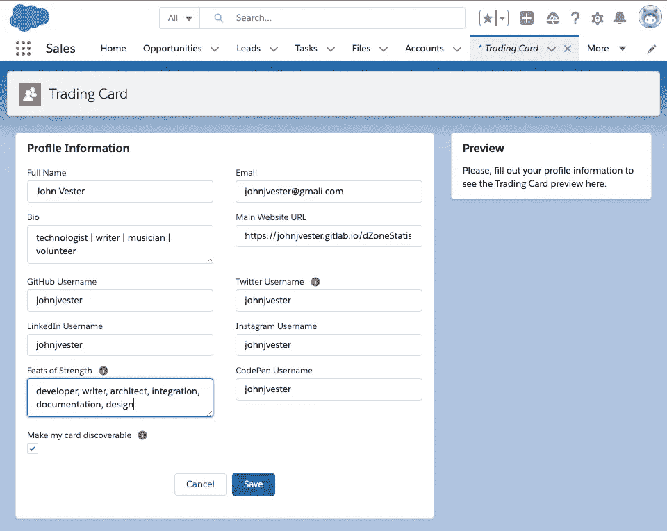

接下来，我上传了我的 [Octocat 照片](https://myoctocat.com/)作为我的头像*——*反映了在 DZone 的早期，当时只有我们几个人在最初的 Slack 频道。

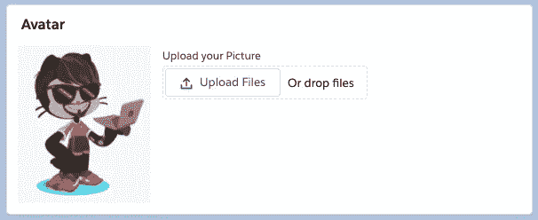

完成后，我可以查看我的 live 卡:

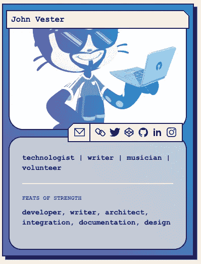

# 网络铃声和点击计数器

一个 Web 1.0 站点如果没有计数器和 webring 功能是不完整的。导航回 Heroku 应用程序会显示以下项目:

两者都提供了在远程站点上使用的必要的

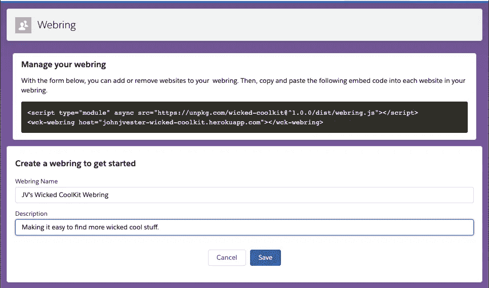

# 结论

虽然我有使用 Heroku 和 Salesforce 的经验，但邪恶的 Coolkit 冒险并没有真正利用这些知识。相反，我能够执行一些简单的步骤，然后专注于开发人员交易卡的创意。

如果我要向任何一位 IT 专业人士传达一份使命宣言，那就是:

> *将您的时间集中在提供扩展知识产权价值的特性/功能上。将框架、产品和服务用于其他一切。*

邪恶的 Coolkit 体验不折不扣地遵循了我的使命宣言。虽然我必须执行一些基本的步骤来把事情安排妥当，但我的大部分时间都花在了开发我的个人开发者交易卡和体验上面。这完全归功于 Heroku 和 Salesforce 的团队。他们提供的解决方案让我能够恰当地利用我的注意力时间。

给邪恶的 Coolkit 一个尝试 *—* 这是非常值得的，只需要最少的时间投入。

祝你今天过得愉快！