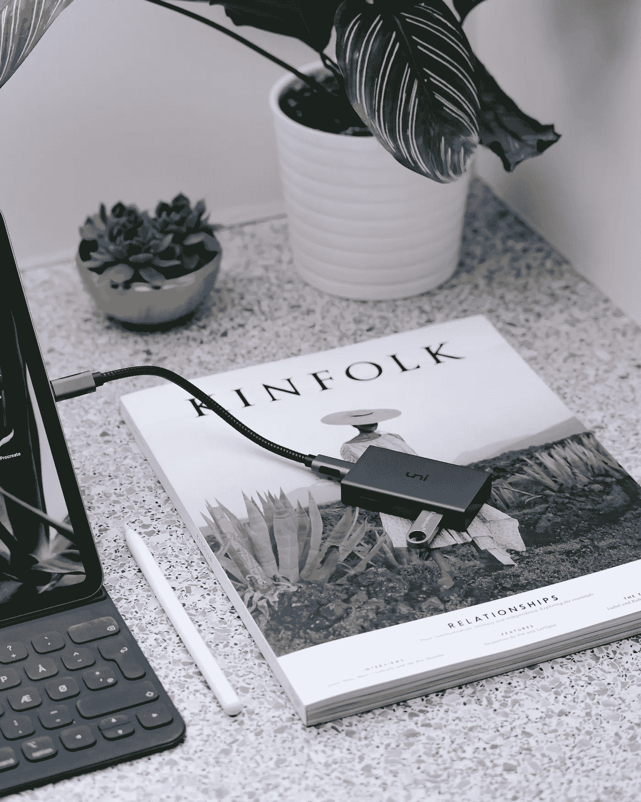

# 我的 MacBook 中的幽灵

> 原文：<https://medium.com/nerd-for-tech/ghost-in-my-macbook-ed0f9d8a43ce?source=collection_archive---------15----------------------->

## 品牌为何重要的第一手资料！

尼古拉·塔拉先科在 [Unsplash](https://unsplash.com/s/photos/macbook?utm_source=unsplash&utm_medium=referral&utm_content=creditCopyText) 上的照片

在我讲这个故事之前，你应该知道我的生日是 10 月 6 日(*随意送我生日礼物*)。

是的，我的生日是六岁，我不太相信超自然现象，我和其他人一样看过恐怖电影，但除此之外没看过别的。

直到这件事发生。

照片由 [Lasse Jensen](https://unsplash.com/@maybejensen?utm_source=unsplash&utm_medium=referral&utm_content=creditCopyText) 在 [Unsplash](https://unsplash.com/s/photos/usb-connector?utm_source=unsplash&utm_medium=referral&utm_content=creditCopyText) 上拍摄

这是一个技术恐怖的故事，我有一个超级可爱的 USB 适配器，它看起来像图中所示的东西，但更小。

我总是把它连接到我的 MacBook 上，以便用 USB nano 接收器连接显示器或鼠标。

我知道这有点技术含量，但是和我在一起，这是值得的！

所以是的，我通常会让连接器连接到 MacBook 上，然后用它连接我的鼠标。

有一天，我觉得自己工作效率超高，觉得有必要给我的家庭办公室来个大改造，于是开始在桌子上到处移动东西。

我需要把笔记本电脑放高一点，所以开始找一个盒子放在下面。这是一个星期天，我的母亲也在大扫除，她扔掉了我们所有的亚马逊盒子，可悲的是，我找不到任何东西放在笔记本电脑下。然后我偶然发现了一个旧的*稳压器*是长方形的，中提琴！

抓住它，把它放在笔记本电脑下面，现在我的屏幕与眼睛齐平，这一天还能更好吗？

现在，当我打开系统时，它开始发出奇怪的噪音，担心可能是稳定器的磁铁导致笔记本电脑出现问题。我把它从底下拿出来，放回储藏室。

检查了系统，噪音仍然存在，现在我的系统开始自己打字，并且连续输入 6！！

好吧，发生什么事了？我重新启动系统，然后在登录屏幕上，它又开始输入 6…666666666666666，并发出奇怪的噪音。

我拔下 USB 适配器，噪音突然停止了。然后我缩小了范围，USB 适配器是罪魁祸首(*可能是稳定磁铁影响了这个，我懂物理，对吧！现在我需要买一个新的。*

一个星期过去了，我想适配器里的东西一定已经修好了，让我们再试一次(伙计，我是个乐观主义者)。又一次，它开始敲 6，我心想，这个小装置肯定知道我的生日，于是我决定离开它，买一个新的。

当我想买一个新的时候，我问我的兄弟这是什么品牌，这就有了转机，他说:*“显然是苹果”*。我不知道，对我来说不太明显。

然后我想，好吧，这是苹果，它不会这么快就变得没用了，开始调查，然后它击中了我！

连接到鼠标的 USB nano 接收器也连接到储藏室的一个键盘，我完全忘记了。

我去了储藏室，当我检查的时候，有一本书在 6 键上，我笑了又笑。

键盘连接到我的系统，我完全忘记了它。一个星期以来，我一直在责怪稳定器的磁铁、连接器电缆的凹痕，或者仅仅是运气，但这就是我的 Macbook 中的幽灵的故事。

一本书超过了键盘的 6 个键，这本书是我的幽灵！

嗯，品牌的确很重要。如果我不知道 USB 接口是苹果公司的，我就不会调查这个问题，但在买了一个昂贵的接口后，我肯定会哭。

谢谢你，史蒂夫·乔布斯！

下次再见，
JD