# Git 和 GitHub——初学者指南:实践方法。

> 原文：<https://medium.com/nerd-for-tech/git-and-github-beginners-guide-a-hands-on-approach-e97e9489a017?source=collection_archive---------12----------------------->

作为一名软件工程师，你可能听说过 Git 和 GitHub 这两个术语。编程界的每个人都说你必须了解 Git 和 GitHub，但是没有人给出真正的原因。还有 Git 和 GitHub 有什么区别或者它们是一样的吗？为什么要学？有什么用？如果你也面临这样的问题，不要担心，读完这篇文章后，你所有的疑问都会迎刃而解。

但是在直接进入 Git 和 GitHub 之前，我们必须了解一下**版本控制系统**，因为这就是 **Git** 的含义。

# 什么是版本控制系统？

它是一个系统，记录一段时间内对一个文件或一组文件的更改，以便您可以在以后调用特定的版本。

它允许您–

*   将选定的文件恢复到以前的状态，
*   将整个项目恢复到以前的状态，
*   比较一段时间内的变化，
*   查看谁在何时修改了您的代码
*   谁在何时提出了问题。

## 版本控制系统的类型

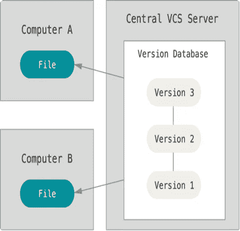

中央版本控制系统

1.  **集中版本控制系统:-**

在 C-VCs 中，客户端需要从服务器获取源代码的本地副本，进行更改并将这些更改提交给 C-VCS。

处理分支是困难的，开发人员经常面临合并冲突。它也不提供离线访问。

如果服务器瘫痪，我们就无法继续工作了。

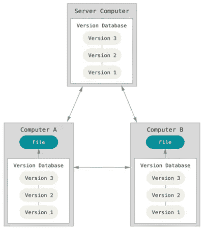

分布式版本控制系统

**2。分布式版本控制系统:-**

在这里，每个客户端都可以拥有本地分支以及完整的历史记录。客户端需要将更改推送到分支，然后分支将被推送到服务器存储库。

在分支机构工作非常容易，我们还可以在本地系统中创建回购副本，这样就不会像 CVCS 那样出现服务器停机的问题。

# Git 是什么？

Git 是一个免费的**分布式版本控制系统**，由 Linus Torvalds 于 2005 年创建，用于与 Linux 内核上的几个开发人员合作，以跟踪任何一组文件中的更改，通常用于在软件开发过程中协调协作开发源代码的程序员之间的工作。

## 为什么是 Git？

*   分布式版本控制系统
*   轻松协作
*   不再担心旧代码的丢失
*   实时代码和开发代码保存在一个地方
*   易于管理大型代码库
*   分布式开发

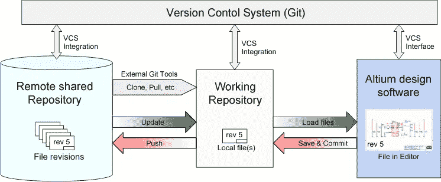

Git 的工作

# 什么是 GitHub？

**GitHub** 是一个用于版本控制和协作的代码托管平台。它让你和其他人在任何地方一起工作。它提供了 Git 的分布式版本控制和源代码管理功能，以及它自己的特性。

在这里，您可以找到最令人难以置信的开源信息、新兴技术、功能和设计。这是一个学习和参与的地方。

基本上，它是一个远程服务器，你可以在那里存储、管理、协作、贡献和共享你的代码或任何类型的工作。

它是开源软件最大的枢纽之一

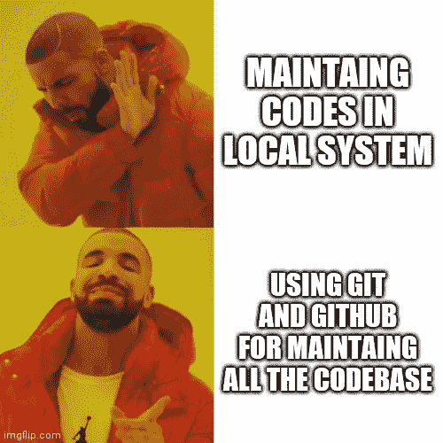

# ⏰是时候动手了

这可能是学习任何技术最令人兴奋的部分之一，即**如何在现实世界中运用我的理论知识？**所以不要再浪费时间了，让我们看看 Git 和 GitHub 的实际实现

## 如何安装 Git？

进入 [**Git**](https://git-scm.com/downloads) 官网，点击想要的 OS 选项，就会自动开始下载软件。

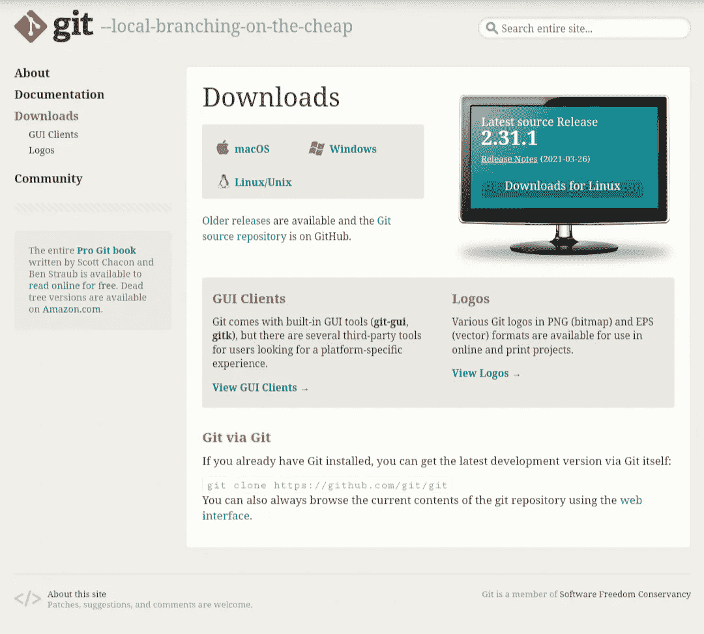

现在将它安装到您的系统中，将所有选项保持在默认模式。

现在检查它是否正确安装或没有使用任何终端，并检查其版本

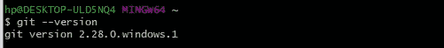

现在，我们将在 Git 中设置配置，以便它可以在我们做出任何贡献时识别我们

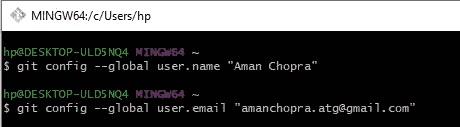

**让我们在** [**GitHub**](https://github.com/join?ref_cta=Sign+up&ref_loc=header+logged+out&ref_page=%2F&source=header-home) 中记账

正确填写所有细节并注册。

**现在登录你的 GitHub 账户，让我们开始回购:-**

单击“存储库”按钮，然后单击“新建”以创建新的存储库。

存储库:- 这是一个你在服务器上存放所有代码或文件夹的地方。它是一种与一个产品相关的文件夹。更改是针对特定存储库的。

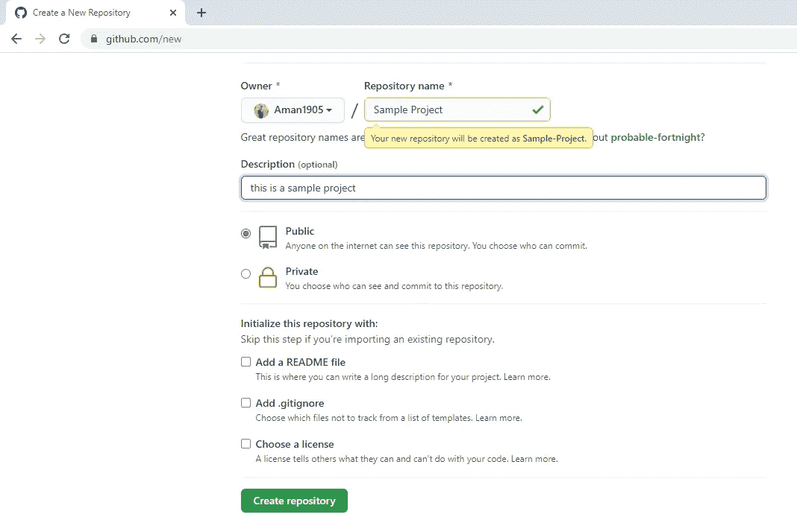

单击创建存储库，然后🔥你刚刚做了你的第一个回购🥳

在完成一个回购之后，你可以在你的本地系统中克隆它，这样你就可以开始工作，或者如果你已经在本地系统中有了你的文件夹，你仍然可以直接提交给你的回购。

**克隆:-** 这意味着您将在本地系统中创建一个同名的远程存储库副本，它将包含远程存储库中存在的所有预加载代码。

## git 克隆

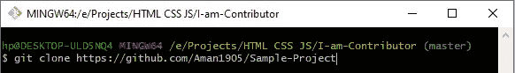

git 克隆

现在我们来看看如何将文件/代码从本地系统提交到远程服务器。

## git 初始化

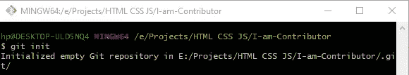

git 初始化

此命令将初始化一个新的空 repo，也可以用于将现有的未版本化的项目转换为 Git repo。

**注意:-** 克隆远程存储库后无需执行此步骤，因为它肯定会包含该文件夹。

## git 添加

> 你可以使用 **git add。**命令或 **git 添加<文件名>或**

两个命令的不同之处在于，第一个命令会添加文件夹中的所有文件，而最后一个命令只会添加特定的文件。

## git 提交

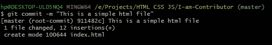

git commit -m“一个有意义的消息”

此命令用于将文件提交到您的远程 repo，您将编写一条有意义的消息，以便其他人可以了解您在该特定文件中所做的更改。

## git 远程添加原点

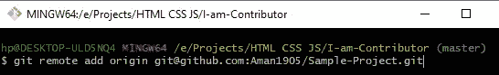

您将通过访问您的 GitHub 帐户获得您的 URL，该帐户位于您想要进行更改的存储库部分。

## git push -u 原始主机

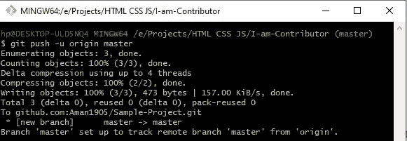

这个命令用于将代码从本地系统推(发送)到远程存储库。

万岁！！🎉🎉你刚刚在你的 GitHub 上做了第一次提交。回到你的 GitHub 账户，刷新存储库页面，你会发现所有你推送的文件。

现在你可能会想，我已经成功地完成了第一笔交易，这太好了，但是如果我的朋友也想进行同样的回购交易呢？来，我们一起学这个😉

## 叉回购:-

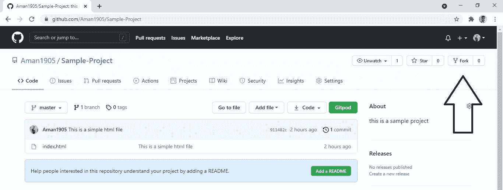

这意味着无论谁点击想要的回购协议上的叉按钮，都将在你的 GitHub 帐户中创建该存储库的副本，现在你可以**将该存储库**克隆到你的本地系统中，以进行更改或添加新功能。

我们总是建议您首先对分叉回购协议进行更改，而不是直接对原始回购协议进行更改，因为这可能会导致原始代码停机。

既然您已经克隆了回购器，进行了所有推荐更改，并成功地将代码推入了您的存储库中，现在是时候进行**拉取请求**

## 拉取请求:-

在进行更改并成功地将代码推入分叉的存储库之后，您将看到一个名为 **Compare & Pull Request** 的按钮，该按钮用于打开特定代码的 Pull 请求。打开一个 pull 请求意味着现在您正在将您的更改发送到原始的存储库，以便该存储库的所有者可以审查您的代码，然后如果您的代码通过了所有期望的测试用例，就**合并**它。

## git 拉

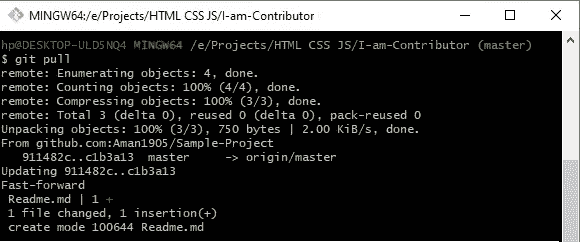

这个命令实际上是用来获取在您的存储库中所做的所有额外的更改，要么直接使用 GitHub GUI，要么通过本地系统 repo 中的任何 pull 请求。因此，在您的本地系统中，您也可以获得远程存储库中的整个代码库。

## git 日志

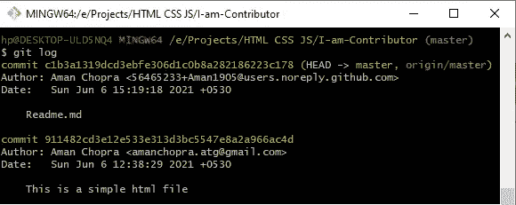

该命令用于检查所有提交的历史记录及其时间和日期。它还显示您在提交文件时编写的消息。

这就是我们称 Git 为版本控制系统的原因，因为它可以帮助你记录提交文件、删除文件、推送请求、合并请求等。

# 分支

Git 分支是创建分支的策略或系统化的过程，并跟踪该分支与代码库主要分支的主要副本的合并。在进入 Git 分支之前，让我们看看为什么我们需要一个分支。

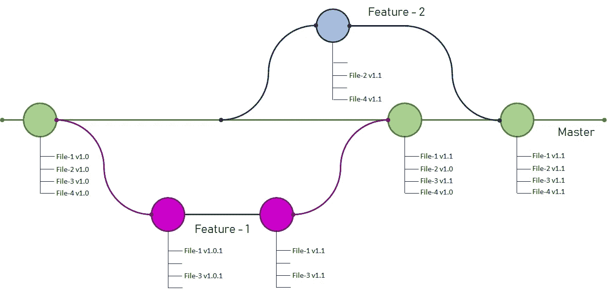

基本上，一个分支是开发特性的孤立和独立的路线。假设中间一行是代码稳定和更新的主分支。然后，假设开发者-1 被分配给开发特征-1。因此，Developer-1 正在从主分支中剪切一个分支，在上图中用洋红色表示。并且，Developer-2 被指派开发 Feature-2，他正在从主分支中剪切一个分支。这是用蓝色表示的。

让我们假设代码库是一组四个文件，分别叫做文件 1、文件 2、文件 3 和文件 4。因此，当 Developer-1 从 master 分支到 develop feature-1 时(假设 File-1 和 File-3 将为开发而改变)。因此，开发人员可以安全地将他对两个文件的更改提交到主分支中。反之亦然，当 Developer-2 从 master 分支到 develop feature-2 时(假设 File-2 和 File-4 将为开发而改变)。

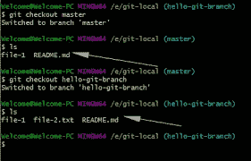

与其他版本控制系统不同，GIT 中的分支在逻辑上复制代码库，当它被合并到主分支时，唯一的更改快照被从特性分支附加到主分支。但是在其他版本控制系统中，比如 SVN，分支在切割分支时被复制，在与主分支合并时被替换。

# 结论:-

但这只是在任何项目中做出贡献所需的 Git 和 GitHub 的基础知识，但我强烈建议大家阅读更多关于 Git 和 GitHub 的相关文章，以探索 Git 和 GitHub 的更多功能

# 编码快乐！！

请务必与我联系👇👇

1.商务化人际关系网

 [## Aman Chopra - CTO 和 Web 开发者价值箱| LinkedIn

### Java 和 Python 爱好者| Web 开发人员|云(AWS) |技术内容作者|编码爱好者|喜欢从事真实的…

www.linkedin.com](https://www.linkedin.com/in/aman-chopra-375a81171) 

2.开源代码库

 [## 阿曼 1905 -概述

### JAVA 爱好者||编码爱好者|| MLSA | | Python 爱好者| |培训师|| Web ||云|| DevOps || - Aman1905

github.com](https://github.com/Aman1905) 

3.推特

 [## JavaScript 不可用。

### 编辑描述

twitter.com](https://twitter.com/iam_chopra_aman?s=09)