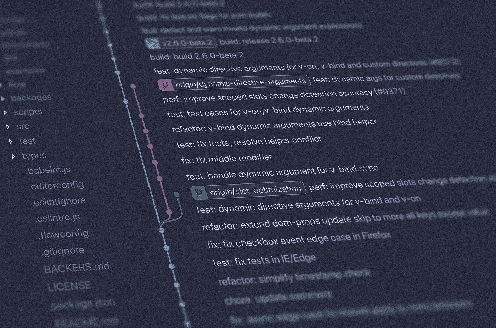

# 为初学者简单解释的 Git 基础知识

> 原文：<https://medium.com/nerd-for-tech/git-basics-simply-explained-for-beginners-d0ba651aa553?source=collection_archive---------16----------------------->



*本文原载于* [*我的个人博客*](/@shahednasser/d0ba651aa553) *。*

学习 Git 对于每一个开发者来说都是非常重要的。对于许多初学者来说，这也非常令人困惑。

在本文中，我将以一种简单的方式介绍初学者需要了解的基本 Git 命令。

## 克隆存储库

这个本身就很简单。您刚刚创建了一个存储库，并且想要在您的机器上克隆它。只需运行:

```
git clone &lt;REPOSITORY_GIT_URL&gt;
```

## 将存储库添加到现有项目中

假设您已经在处理一个项目，并决定稍后为它创建一个存储库。如何将存储库添加到其中？

```
git init
git add .
git commit -m "Initial Commit"
git remote add origin &lt;REPOSITORY_GIT_URL&gt;
```

如果您添加的存储库是空的，您可以运行:

```
git push origin master
```

但是，如果存储库中有一些文件，我建议您首先运行以下命令:

```
git pull origin master
```

然后运行`push`命令。

## 从存储库中获取更改

要从存储库中获取更改，请执行以下操作:

```
git pull origin master
```

## 撤消添加命令

如果你跑了:

```
git add &lt;files&gt;
```

或者

```
git add .
```

然后你意识到你犯了一个错误，你不想添加这些文件，只要运行:

```
git reset &lt;files&gt;
```

这将撤消添加特定的`files`。如果您想要撤消添加所有文件:

```
git reset
```

## 撤消最近提交

你犯了一个错误，然后意识到它有问题。要撤销它，只需运行:

```
git reset ~HEAD
```

您也可以运行:

```
git revert HEAD
```

不同之处在于`git revert`将添加一个新的提交，恢复最近的提交。如果您已经提交了想要撤销的提交，这可能会更有帮助。

## 编辑最新提交

要编辑上次提交或上次提交消息，请运行:

```
git commit --amend -m "new message"
```

## 删除本地更改

如果您在本地进行了更改，并且由于某种原因不再需要它们，您可以通过运行以下命令将它们恢复到 Git 存储库中的最新版本:

```
git checkout .
```

要删除特定文件的本地更改，而不是您可以运行的所有更改:

```
git checkout &lt;files&gt;
```

## 创建分支

要创建新分支:

```
git branch &lt;NEW_BRANCH&gt;
```

## 切换分支

要从一个分支切换到另一个分支:

```
git checkout &lt;BRANCH_NAME&gt;
```

## 创建一个新的分支并切换到它

要创建一个新分支并立即切换到它，您可以运行:

```
git checkout -b &lt;BRANCH_NAME&gt;
```

## 删除分支

要删除分支:

```
git branch -d &lt;BRANCH_NAME&gt;
```

## 合并分支

要将一个分支合并到另一个分支，请切换到要合并到的分支，然后运行:

```
git merge &lt;BRANCH_NAME&gt;
```

## “隐藏”您的本地更改

有时您可能有局部的变更，但是您还没有准备好提交它们。如果您同时需要做其他的事情，回到存储库的初始状态，或者在不丢失变更的情况下改变分支，您可以“隐藏”这些变更以备后用:

```
git stash
```

然后，当您想再次取出这些更改时，只需运行:

```
git stash pop
```

运行此命令将应用您放入存储中的最新更改，然后将其从存储中移除。

如果您有很多已经“隐藏”的更改，您可以通过运行以下命令来检查它们:

```
git stash list
```

然后，您可以应用列表中的存储:

```
git stash apply &lt;STASH_NAME&gt;
```

## 在配置中设置您的电子邮件和姓名

您可以在全局范围和存储库范围内这样做。这些命令将在全局范围内工作，只需添加`--global`选项。

要设置电子邮件:

```
git config user.email "YOUR_EMAIL"
```

要设置名称:

```
git config user.name "YOUR_NAME"
```

## 从 Git 存储库中删除文件

要从 Git 存储库中删除文件:

```
git rm &lt;files&gt;
```

要仅从 Git 中删除这些文件而不在本地删除它们:

```
git rm --cached &lt;files&gt;
```

要删除目录，只需添加`-r`选项。