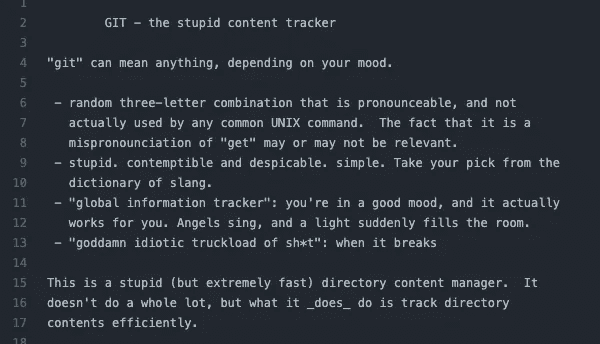
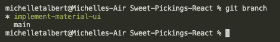

# 快走吧。

> 原文：<https://medium.com/nerd-for-tech/git-going-295805e2b29a?source=collection_archive---------27----------------------->

关于饭桶的一切

马克·柯尼希在 [Unsplash](https://unsplash.com/s/photos/merge-sign?utm_source=unsplash&utm_medium=referral&utm_content=creditCopyText) 上的照片

我最近开始与一个非营利组织的团队合作，这迫使我更好地关注适当的 Git 工作流。当你和其他人一起做一个项目时，Git 添加/git 提交/git 推送不再有效。所以我想，为什么不利用这个时间更新/增加我的 Git 和 Github 知识。

Git 是一个开源软件，它非常有效地服务于软件开发团队的版本控制。这个软件包是在 2005 年 4 月由 Linus Torvald(Linux fame)在与 Bitkeeper(另一个版本控制软件，或 VCS)的争论中创建的，它是专门为比 Bitkeeper 和其他 VCS 更快、更安全以及免费/开放源代码而创建的。Junio Hamano 也是一个主要的贡献者，他的任务是在 Git 发布后很快维护它。

托伐是个非常有趣的人。以下是他对他的 git 第一版*“来自地狱的信息经理”*的最初评论:

2005 年提交的托瓦尔的自述

正如我们大多数人所知，Github 是托管个人存储库(或 repos)的几个平台之一，可以设置为私有或公共，并且是开发团队用来访问代码库的非常方便的工具。我认为它是谷歌驱动，但对程序员来说。Github 于 2008 年使用 Ruby on Rails 创建，2018 年被微软收购。根据维基百科:“*截至 2020 年 1 月，GitHub 报告拥有超过 4000 万用户和超过 1.9 亿个* [*知识库*](https://en.wikipedia.org/wiki/Repository_(version_control)) *(包括至少 2800 万个公共知识库)，成为全球最大的* [*源代码*](https://en.wikipedia.org/wiki/Source_code) *主机。”*

Github(平台)使用 Git(VCS)通过各种命令管理工作流，如果使用正确，可以保护 repo 的主要分支免受 bug 的影响，这些 bug 可能会在您对任何给定的功能分支进行“尝试”(也称为添加功能)时破坏您的代码。我假设读者知道如何创建一个 repo 并执行基本的 git init 和/或 git add/commit/push，并且知道主分支和特性分支之间的区别。以下是您可以在本地计算机上使用的一些常见 CLI 命令:

*   git pull:从您所在的相应(原始)分支下载所有更新。如果你在一个特性分支上，并且已经把这个分支推给了 Github，比如说和一个团队一起工作，git pulling 会从这个分支中拉出，但是不会从任何其他分支中拉出任何东西。如果您在 main 上，这个命令当然会从 main 分支中提取。
*   git 获取原点:将从原点获取并显示所有分支。在此之后，您可以 git checkout <feature branch="" name="">来处理其他人已经创建/推送的特定特性分支。</feature>
*   git add: git add。将暂存所有以前未暂存的更新，而 git add <file-name>将只暂存来自指定文件的更新。</file-name>
*   git commit -am "message goes here ":在单个命令中添加和提交的快捷方式。
*   git 分支:检查哪些分支已经被创建/可以在本地机器上工作。此外，运行 git branch 会告诉您当前在哪个分支上:

星号和绿色文本表示我在这个特性分支上，而不是在 main 上

*   git checkout <branch-name>:切换到指定的分支</branch-name>
*   git checkout -b <branch-name>:创建一个新分支，然后在一个命令中切换到该分支。这是 git 分支 <branch-name>& git checkout <branch-name>的快捷方式:注意:记住分支名称应该是描述性的，以明确在给定的特性分支上正在做什么。</branch-name></branch-name></branch-name>
*   git 状态:告诉您是否有准备提交的更改，例如，您是否运行了 git add，以及您的分支在提交中相对于源的位置。
*   git push -u origin <branch-name>:这将初始分支提交设置并推送到原点<branch-name>。在从一个特性分支进行第一次推送之后，您应该能够进行一次简单的 git 推送，将额外的提交发送到那个原始特性分支(即 git 知道将更新发送到哪里)。</branch-name></branch-name>
*   git merge <branch-name>:合并两个分支上的更新，通常是一个主分支和一个特性分支。即 *git checkout main，git merge<feature-branch>*</branch-name>
*   git branch -d <branch-name>:删除那个分支</branch-name>
*   git [rebase](https://git-scm.com/docs/git-rebase) 这将比合并更清晰地显示您的提交。
*   git remote -v:将显示获取和推送 URL(通常是相同的)。
*   通常对于团队的 git 流，我们将 git 添加/提交/推送一个特性分支，然后请求其他人在编辑和/或合并之前检查变更。
*   或者，如果您正在处理一个特性分支，并且需要继续处理该分支，但是也需要主分支更新，那么您可以运行这些命令:git checkout <feature-branch-name>，git merge main。现在，您的特征分支将拥有主分支更新。但是不要忘记首先进行 git checkout main 和 git pull，这样如果有任何 main 分支更新，您也可以进行这些更新。</feature-branch-name>

注意:记住 fork 和 clone 之间的区别很重要。分叉一个回购会将该回购的完整副本带到您的 Github 帐户。如果你需要和一个团队一起处理一个 repo，你会想跳过 fork 命令，直接从这个 repo 克隆下来。这样，当您提交时，您是将它们发送到团队的回购，而不是发送到您个人的/复制的回购。

请记住，如果您正在处理一个特性分支，并且发现您需要切换回您的主分支，您应该在切换到主分支之前首先 git add 并提交您的更改。Git *不喜欢*未分级和/或未提交的更改。

关于 Git 有太多的东西需要学习，这只是 VCS 的冰山一角！请随意在此浏览更多信息:

 [## Git -基本分支和合并

### 切换到您的生产分支。创建一个分支来添加修补程序。测试完成后，合并热修复分支，然后…

git-scm.com](https://git-scm.com/book/en/v2/Git-Branching-Basic-Branching-and-Merging)  [## Git 手册

### 一个版本控制系统，或称 VCS，在人们和团队一起合作项目时跟踪变更的历史…

guides.github.com](https://guides.github.com/introduction/git-handbook/)  [## Git -维基百科

### Git()是跟踪任何一组文件变化的软件，通常用于协调程序员之间的工作…

en.wikipedia.org](https://en.wikipedia.org/wiki/Git)  [## Git 功能分支工作流| Atlassian Git 教程

### 特性分支工作流背后的核心思想是所有的特性开发都应该在一个专门的…

www.atlassian.com](https://www.atlassian.com/git/tutorials/comparing-workflows/feature-branch-workflow#:~:text=It%27s%20a%20good%20idea%20to,commits%20to%20the%20new%20branch)