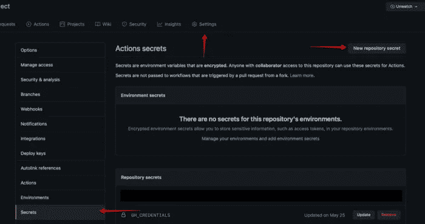

# 把它放到页面上！

> 原文：<https://medium.com/nerd-for-tech/git-it-on-the-page-6b42d43cfb8d?source=collection_archive---------0----------------------->

## 设置与 GitHub 动作的持续集成


照片由[思想目录](https://unsplash.com/@thoughtcatalog?utm_source=medium&utm_medium=referral)在 [Unsplash](https://unsplash.com?utm_source=medium&utm_medium=referral) 上拍摄

## 发布到 GitHub 页面

在我的上一篇文章中，我们研究了如何使用 GitHub Actions 设置管道的连续交付部分，以便我们每次在 GitHub 存储库中创建一个新版本时，我们的项目都会发布到我们的 itch.io 帐户。itch.io 并不是我们唯一可以发布的地方！事实上，GitHub 有一个服务，我们可以在我们的存储库中打开这个服务，叫做 GitHub Pages，它允许我们将我们的存储库(或存储库的一个分支)作为一个网站来托管。此功能更常用于将基于网站的项目存储库直接发布到托管状态。在我们的例子中，我们将在我们的存储库中设置一个特殊的分支，保存我们游戏的 WebGL 构建和在浏览器中显示它所必需的模板文件。然后，我们将使用 GitHub 动作来创建游戏，并将其发布到 GitHub 页面的这个分支中。

## 生成个人访问令牌

1.  在任一页面的右上角，点按您的个人资料照片，然后点按“设置”。
2.  在左侧边栏中，单击开发者设置。
3.  在左侧边栏中，单击个人访问令牌。
4.  单击生成新令牌。
5.  给你的令牌一个描述性的名字。
6.  要让您的令牌过期，请选择“过期”下拉菜单，然后单击默认值或使用日历选择器。
7.  选择您要授予此令牌的作用域或权限。要使用令牌从命令行访问存储库，请选择 repo。
8.  单击生成令牌。
9.  复制令牌并存储在安全的地方(如密码库应用程序)，因为这将不会再次显示

## 创建 GitHub 秘密

出于安全原因，我们不希望任何人访问我们的个人访问令牌，所以我们将把它作为秘密存储在我们的 GitHub 存储库中。

1.  导航到 GitHub 上的存储库
2.  选择设置
3.  选择秘密
4.  点按“新存储库密码”按钮
5.  创建一个名为 GH_CREDENTIALS 的秘密，并将您的令牌值粘贴到其中。
6.  点击“添加密码”按钮



*****确保统一关闭后再继续*****

## 创建干净(孤立)“gh-pages”分支

***一个孤立分支没有连接到其他分支并提交，其工作树根本没有文件。***

创建孤立 gh-pages 分支:在终端中，导航到 repositories 文件夹，确保从命令行为 git 提供程序设置了凭据，然后键入以下内容:

```
git checkout --orphan gh-pages
git reset --hard
git commit --allow-empty -m "Initializing gh-pages branch"
git config lfs.locksverify false
git push origin gh-pages
git checkout develop (or whatever your previous branch was)
```

## 启用 GitHub 页面

1.  导航到 GitHub 上的存储库
2.  选择设置
3.  选择页面
4.  从“Source”部分下的下拉列表中选择“GH-pages”repo(如果尚未选择)
5.  从文件夹下拉列表中选择“/(根)”(如果尚未选择)

## 将 GitHub Pages 部署块添加到 Main.yml

```
releaseToGitHubPages:
    name: Release to GitHub Pages
    runs-on: ubuntu-latest
    needs: buildWithLinux
    if: github.event.action == 'published' || (contains(github.event.inputs.mode, 'release') && contains(github.event.inputs.mode, 'Web')) 
    steps:
      - name: Checkout Repository
        uses: actions/checkout@v2
      - name: Download WebGL Artifact
        uses: actions/download-artifact@v2
        with:
          name: build-WebGL
          path: build/WebGL
      - name: Deploy to GitHub Pages 🚀
        uses: JamesIves/github-pages-deploy-action@4.1.3
        with:
          branch: gh-pages # The branch the action should deploy to.
          folder: build/WebGL # The folder the action should deploy.
          target-folder: build # The folder the action should be deployed to within the deployment branch
```

## 完整的文件

下面是包含附加平台的完整动作工作流文件。

```
name: CI - Build All Platforms
on:
  push:
    branches: [ main ]
  pull_request:
    branches: [ main ]
  release:
    types: [ published ]# Allows you to run this workflow manually from the Actions tab
  workflow_dispatch:
    inputs:
      mode:
        description: 'check OR release (platform)'
        required: true
        default: 'check'
permissions: 
  contents: write
jobs:#-------------------------------------------------------------------
# Build Project (with Linux)
#-------------------------------------------------------------------
  buildWithLinux:
    name: Build for ${{ matrix.targetPlatform }} on version ${{ matrix.unityVersion }}
    runs-on: ubuntu-latest
    strategy: 
      fail-fast: false
      matrix:
        unityVersion: 
          - 2020.3.15f2
        targetPlatform: 
          - StandaloneWindows # build a Windows Standalone
          - StandaloneOSX # build a MacOS Standalone (Intel 64-bit)
          - StandaloneLinux64 # build a Linux 64-bit Standalone 
          - WebGL # WebGL        
    steps:
      - name: Free Disk Space for Android
        if: matrix.targetPlatform == 'Android'
        run: |
          df -h
          sudo swapoff -a
          sudo rm -f /swapfile
          sudo rm -rf /usr/share/dotnet
          sudo rm -rf /opt/ghc
          sudo rm -rf "/usr/local/share/boost"
          sudo rm -rf "$AGENT_TOOLSDIRECTORY"
          df -h
      - name: Checkout Repository
        uses: actions/checkout@v3
        with:
          fetch-depth: 0
          lfs: true
      - name: Cache Library
        uses: actions/cache@v3
        with:
          path: Library
          key: Library-${{ matrix.targetPlatform }}
          restore-keys: Library-
      - name: Build Unity Project
        uses: game-ci/unity-builder@v2.0-alpha-10
        env:
          UNITY_LICENSE: ${{ secrets.UNITY_LICENSE }}
        with:
          unityVersion: ${{ matrix.unityVersion }}
          targetPlatform: ${{ matrix.targetPlatform }}
          buildName: ${{ matrix.targetPlatform }}
          versioning: Semantic
      - name: Upload Build
        uses: actions/upload-artifact@v3
        if: github.event.action == 'published' || contains(github.event.inputs.mode, 'release')
        with:
          name: build-${{ matrix.targetPlatform }}
          path: build/${{ matrix.targetPlatform }}
      - name: Zip build/${{ matrix.targetPlatform }}
        uses: montudor/action-zip@v1
        if: (github.event.action == 'published' || contains(github.event.inputs.mode, 'release')) 
        with:
          args: zip -qq -r build/build-${{ matrix.targetPlatform }}.zip build/${{ matrix.targetPlatform }}
      - name: Upload build-${{ matrix.targetPlatform }}.zip to GitHub Release
        uses: svenstaro/upload-release-action@v2
        if: (github.event.action == 'published' || contains(github.event.inputs.mode, 'release')) 
        with:
          repo_token: ${{ secrets.GH_CREDENTIALS }}
          asset_name: build-${{ matrix.targetPlatform }}.zip
          file: build/build-${{ matrix.targetPlatform }}.zip
          tag: ${{ github.ref }}
          overwrite: true
          body:  ${{ github.event.release.body }}#-------------------------------------------------------------------
# Deploy to GitHub Pages
#-------------------------------------------------------------------releaseToGitHubPages:
    name: Release to GitHub Pages
    runs-on: ubuntu-latest
    needs: buildWithLinux
    if: github.event.action == 'published' || (contains(github.event.inputs.mode, 'release') && contains(github.event.inputs.mode, 'Web')) 
    steps:
      - name: Checkout Repository
        uses: actions/checkout@v3
      - name: Download WebGL Artifact
        uses: actions/download-artifact@v3
        with:
          name: build-WebGL
          path: build/WebGL
      - name: Deploy to GitHub Pages 🚀
        uses: JamesIves/github-pages-deploy-action@v4.3.3
        with:
          branch: gh-pages # The branch the action should deploy to.
          folder: build/WebGL # The folder the action should deploy.
          target-folder: build # The folder the action should be deployed to within the deployment branch#-------------------------------------------------------------------
# Deploy to itch.io
#-------------------------------------------------------------------release_webgl_to_itch:
    name: Release WebGL to itch.io
    runs-on: ubuntu-latest
    needs: buildWithLinux
    if: github.event.action == 'published' || (contains(github.event.inputs.mode, 'release') && contains(github.event.inputs.mode, 'Web'))
    steps:
      - name: download WEBGL
        id: download-webgl
        uses: dsaltares/fetch-gh-release-asset@master
        with:
          version: "latest"
          file: build-WebGL.zip
          token: "${{ secrets.GH_CREDENTIALS }}"
      - name: deploy to itch.io (WEBGL)
        uses: josephbmanley/butler-publish-itchio-action@master
        env:
          BUTLER_CREDENTIALS: ${{ secrets.BUTLER_CREDENTIALS }}
          CHANNEL: html
          ITCH_GAME: space-shooter-pro-redux
          ITCH_USER: Arynoyn
          PACKAGE: build-WebGL.zip
          VERSION: ${{ steps.download-webgl.outputs.version }}release_windows_to_itch:
    name: Release Windows (32-Bit) to itch.io
    runs-on: ubuntu-latest
    needs: buildWithLinux
    if: github.event.action == 'published' || (contains(github.event.inputs.mode, 'release') && contains(github.event.inputs.mode, 'Windows'))
    steps:
      - name: download Windows
        id: download-windows
        uses: dsaltares/fetch-gh-release-asset@master
        with:
          version: "latest"
          file: build-StandaloneWindows.zip
          token: "${{ secrets.GH_CREDENTIALS }}"
      - name: deploy to itch.io (Windows)
        uses: josephbmanley/butler-publish-itchio-action@master
        env:
          BUTLER_CREDENTIALS: ${{ secrets.BUTLER_CREDENTIALS }}
          CHANNEL: windows
          ITCH_GAME: space-shooter-pro-redux
          ITCH_USER: Arynoyn
          PACKAGE: build-StandaloneWindows.zip
          VERSION: ${{ steps.download-windows.outputs.version }}release_macos_to_itch:
    name: Release Mac OSX to itch.io
    runs-on: ubuntu-latest
    needs: buildWithLinux
    if: github.event.action == 'published' || (contains(github.event.inputs.mode, 'release') && contains(github.event.inputs.mode, 'Mac'))
    steps:
      - name: download MacOS
        id: download-macos
        uses: dsaltares/fetch-gh-release-asset@master
        with:
          version: "latest"
          file: build-StandaloneOSX.zip
          token: "${{ secrets.GH_CREDENTIALS }}"
      - name: deploy to itch.io (MacOS)
        uses: josephbmanley/butler-publish-itchio-action@master
        env:
          BUTLER_CREDENTIALS: ${{ secrets.BUTLER_CREDENTIALS }}
          CHANNEL: mac
          ITCH_GAME: space-shooter-pro-redux
          ITCH_USER: Arynoyn
          PACKAGE: build-StandaloneOSX.zip
          VERSION: ${{ steps.download-macos.outputs.version }}

  release_linux_to_itch:
    name: Release Linux (64-bit) to itch.io
    runs-on: ubuntu-latest
    needs: buildWithLinux
    if: github.event.action == 'published' || (contains(github.event.inputs.mode, 'release') && contains(github.event.inputs.mode, 'Linux'))
    steps:
      - name: download Linux
        id: download-linux
        uses: dsaltares/fetch-gh-release-asset@master
        with:
          version: "latest"
          file: build-StandaloneLinux64.zip
          token: "${{ secrets.GH_CREDENTIALS }}"
      - name: deploy to itch.io (Linux)
        uses: josephbmanley/butler-publish-itchio-action@master
        env:
          BUTLER_CREDENTIALS: ${{ secrets.BUTLER_CREDENTIALS }}
          CHANNEL: linux
          ITCH_GAME: space-shooter-pro-redux
          ITCH_USER: Arynoyn
          PACKAGE: build-StandaloneLinux64.zip
          VERSION: ${{ steps.download-linux.outputs.version }}
```

## 下次吧！

如果你喜欢这篇文章，或者想在我的旅程中与我同行，请在[gamedevchris.medium.com](#https://gamedevchris.medium.com)关注我。