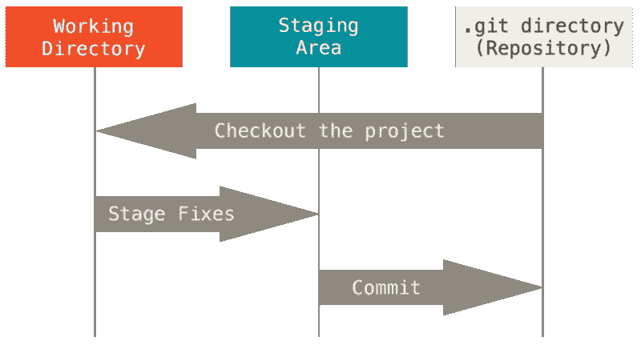

# Git 系列— 1。Git 简介和入门

> 原文：<https://medium.com/nerd-for-tech/git-series-1-introduction-getting-started-with-git-5d006b368228?source=collection_archive---------17----------------------->


[https://images8.alphacoders.com/430/thumb-1920-430944.jpg](https://images8.alphacoders.com/430/thumb-1920-430944.jpg)

# Git 是什么？

首先，什么是 Git？你可能从几乎所有编码人员那里听说过它，但有时他们可能无法向你解释它是什么。因此，让我们首先尝试理解 Git 实际上是什么。根据 Git 官网

> *"* Git 是一个免费的开源分布式版本控制系统，旨在快速高效地处理从小到大的项目。

*根据以上定义，我们可以指出以下关于 Git 的要点。*

*   *自由的*
*   *开放源码*
*   *分布式版本控制系统*

*首先，Git 是免费使用的，在任何规模上都不需要任何形式的支付。第二，是开源。Git 是在 [GNU 通用公共许可证版本 2.0](https://opensource.org/licenses/GPL-2.0) 下发布的，这是一个[开源许可证](https://opensource.org/docs/osd)。第三，也是最重要的，它是一个 I)分布式 ii)版本控制系统。首先让我们看看什么是版本控制系统。*

*   ***版本控制系统(VCS)** 是用于管理、跟踪和控制任何种类信息(包括文档、代码、网站等)变更的系统。它可以帮助你记录从项目开始到任何特定时间的所有进展/变化。*
*   *Git 是一个**分布式** VCS。这意味着项目的所有数据都分布在项目的用户之间，没有一个实体对其拥有权限。如果任何用户添加、编辑或删除了某些内容，这些内容将会反映在所有其他用户的项目中。*

# *Git 的基本特性*

***Git 具有完整性***

*Git 中的所有内容在存储之前都要进行校验和检查，然后通过该校验和进行引用。这意味着在 Git 不知道的情况下改变任何文件或目录的内容是不可能的。该功能内置于 Git 的底层，是其哲学的一部分。在 Git 检测不到的情况下，您不能在传输过程中丢失信息或损坏文件。*

***Git 一般只添加数据***

*当您在 Git 中执行操作时，几乎所有操作都只是向 Git 数据库添加数据。很难让系统做任何不可撤销的事情，也很难让它以任何方式删除数据。与任何 VCS 一样，您可能会丢失或弄乱尚未提交的更改，但是在将快照提交到 Git 后，很难丢失，尤其是如果您定期将数据库推送到另一个存储库。这使得使用 Git 成为一种乐趣，因为我们知道我们可以在没有严重搞砸事情的危险的情况下进行实验。*

***三种状态***

*Git 有三种主要的文件状态:修改、暂存和提交:*

*   ***修改**意味着您已经更改了文件，但是还没有提交到您的数据库。*
*   ***Staged** 意味着您已经在当前版本中标记了一个修改过的文件，以进入您的下一个提交快照。*
*   ***Committed** 表示数据安全地存储在本地数据库中。*

*这将我们引向 Git 项目的三个主要部分:工作树、登台区和 Git 目录。*

***工作树、暂存区和 Git 目录***

*工作树是项目的一个版本的单一检出。这些文件从 Git 目录下的压缩数据库中取出，放在磁盘上供您使用或修改。*

**

*[https://git-scm.com/book/en/v2/images/areas.png](https://git-scm.com/book/en/v2/images/areas.png)*

*staging area 是一个文件，通常包含在您的 Git 目录中，它存储了关于您下一次提交的内容的信息。用 Git 的术语来说，它的技术名称是“索引”，但是短语“暂存区”也可以。*

*Git 目录是 Git 存储项目的元数据和对象数据库的地方。这是 Git 最重要的部分，当您从另一台计算机上克隆一个存储库时，它就是被复制的内容。*

***基本流程***

*基本的 Git 工作流程是这样的:*

*   *您可以修改工作树中的文件。*
*   *您可以有选择地只暂存那些您希望成为下一次提交的一部分的更改，这将只把那些更改添加到暂存区域。*
*   *您执行一个提交操作，该操作将文件保存在临时区域中，并将快照永久存储到 Git 目录中。*
*   *如果文件的一个特定版本在 Git 目录中，它被认为是提交的。如果它已被修改并添加到临时区域，它将被临时存储。如果它在签出后发生了更改，但尚未转移，则它将被修改。*

***几乎每个操作都是局部的***

*Git 中的大多数操作只需要本地文件和资源来操作——通常不需要来自网络上另一台计算机的信息。因为项目的全部历史都在本地磁盘上，所以大多数操作看起来几乎是瞬间完成的。*

# *Git 与 GitHub*

*作为一名程序员，你可能已经看过 GitHub 网站，并且可能想知道，Git 和 GitHub 之间有什么区别？这两者之间的区别就像汽车工厂和汽车展厅之间的区别一样。汽车工厂生产的汽车是一个独立的实体，而展厅是存放所有(或许多)汽车的地方。类似地，Git 是用来创建项目/资源库的系统，GitHub 是管理 Git 资源库的地方。以简洁的方式*

> *“Git 是一个版本控制系统，可以让你管理和跟踪你的源代码历史。GitHub 是一种基于云的托管服务，可以让你管理 Git 存储库。”*

*在 GitHub 上保留您的 Git 库并不是强制性的。你可以把你的服务器放在你能保存它们的地方。但是 GitHub 为你提供了许多有用的功能来更好地管理你的代码。*

# *使用 Git 的好处*

*   ***版本跟踪和分支***

*由于每个更改都是持久化的，它允许您在提交代码之前比较文件、识别更改并在需要时合并更改。它还有助于识别哪个版本目前处于开发、QA 或生产阶段。您也可以很容易地识别出构成或破坏代码的更改。您可以同时在软件的不同版本上工作。*

*   ***分发***

*任何分布式 SCM(软件配置管理)最好的特性之一，包括 Git，就是它是分布式的。这意味着，您不是“签出”当前的源代码，而是“克隆”整个存储库。*

*   ***多次备份***

*这意味着，即使您使用集中式工作流，每个用户本质上都有主服务器的完整备份。在发生崩溃或损坏的情况下，这些副本中的每一个都可以被推上来替换主服务器。实际上，Git 没有单点故障，除非只有一个存储库副本。*

*   ***数据保证***

*Git 使用的数据模型确保了项目每一部分的加密完整性。当签出时，每个文件和提交都通过其校验和进行校验和检索。除了放入的**精确位之外，不可能从 Git 中得到任何东西。如果不更改 Git 存储库中所有内容的 id，也不可能更改 Git 存储库中的任何文件、日期、提交消息或任何其他数据。这意味着，如果您有一个提交 ID，您不仅可以确信您的项目与提交时完全相同，而且它的历史中没有任何内容被更改。默认情况下，大多数集中式版本控制系统不提供这种完整性。***

*   ***集结地***

*与其他系统不同，Git 有一个称为“暂存区”或“索引”的东西。这是一个中间区域，在完成提交之前可以对提交进行格式化和检查。Git 区别于其他工具的一点是，它可以快速暂存一些文件并提交它们，而不需要提交工作目录中所有其他修改过的文件，也不需要在提交期间在命令行中列出它们。*

*这允许您仅转移已修改文件的一部分。在意识到忘记提交其中一个之前，对文件进行两个逻辑上不相关的修改的日子已经一去不复返了。现在，您可以为当前提交准备您需要的更改，并为下一次提交准备另一个更改。此功能可根据需要对文件进行多种不同的更改。*

*当然，如果您不想要这种控制，Git 也很容易忽略这个特性——只需在 commit 命令中添加一个“-a ”,以便将所有文件的所有更改添加到登台区。*

# *装置*

*Git 可以在任何操作系统上使用，包括 Windows、Linux 和 MacOS。*

*   ***在 Windows 上安装***

*在 Windows 上安装 Git 也有几种方法。最官方的版本可以在 Git 网站上下载。只需进入[https://git-scm.com/download/win](https://git-scm.com/download/win)，下载就会自动开始。*

*   ***在 Linux 上安装***

*如果您想通过二进制安装程序在 Linux 上安装基本的 Git 工具，通常可以通过发行版附带的包管理工具来完成。如果您使用 Fedora(或任何密切相关的基于 RPM 的发行版，如 RHEL 或 CentOS)，您可以使用`dnf`:*

```
*$ sudo dnf install git-all*
```

*如果你使用的是基于 Debian 的发行版，比如 Ubuntu，试试`apt`:*

```
*$ sudo apt install git-all*
```

*关于更多选项，Git 网站上有关于在几个不同的 Unix 发行版上安装的说明，网址是[https://git-scm.com/download/linux](https://git-scm.com/download/linux)。*

*   ***在 macOS 上安装***

*在 Mac 上安装 Git 有几种方法。最简单的可能是安装 Xcode 命令行工具。在 Mavericks (10.9)或更高版本上，你可以通过第一次尝试从终端运行`git`来实现。*

```
*$ git --version*
```

*如果您还没有安装它，它会提示您安装它。*

*如果你想要一个更新的版本，你也可以通过二进制安装程序来安装。在 Git 网站[https://git-scm.com/download/mac](https://git-scm.com/download/mac)有一个 macOS Git 安装程序可供下载。*

# *第一次设置 Git*

*   ***你的身份***

*当您安装 Git 时，您应该做的第一件事是设置您的用户名和电子邮件地址。这很重要，因为每个 Git 提交都使用这些信息，并且不可改变地融入到您开始创建的提交中:*

```
*$ git config --global user.name "John Doe"
$ git config --global user.email johndoe@example.com*
```

*如果您传递了`--global`选项，您只需要这样做一次，因为 Git 将总是使用该信息来处理您在该系统上做的任何事情。如果您想为特定项目使用不同的名称或电子邮件地址来覆盖它，您可以在项目中运行不带`--global`选项的命令。*

*对于首次设置，还有其他定制选项可用，我们可以使用这里的[查看他们的详细信息](https://git-scm.com/book/en/v2/Getting-Started-First-Time-Git-Setup)。*

> *现在，您的系统应该可以使用 Git 了，我们将在本系列的下一篇文章中看到如何创建一个存储库，添加和跟踪其中的变更以及更多内容。*