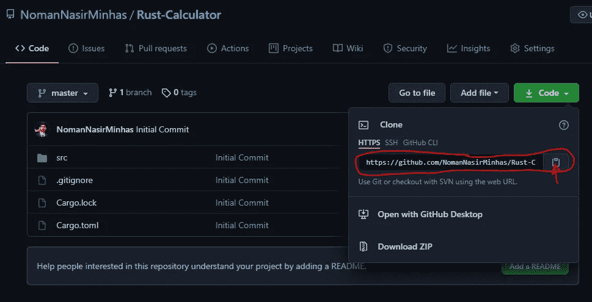

# Git 系列— 2。Git 基础

> 原文：<https://medium.com/nerd-for-tech/git-series-2-git-basics-e986147c98cb?source=collection_archive---------21----------------------->


【https://images8.alphacoders.com/430/thumb-1920-430944.jpg 

在 Git 系列的上一篇文章“[简介&Git 入门](/nerd-for-tech/git-series-1-introduction-getting-started-with-git-5d006b368228)中，我们介绍了 Git 的定义、基本特性、基本流程、优点、Git 和 GitHub 的区别，以及如何在不同的操作系统上安装 Git。在本文中，我们将介绍 Git 的基础知识，从创建一个存储库开始，到克隆一个现有的存储库，跟踪和提交变更，撤销变更，推和拉变更，管理远程分支，标记和别名。让我们开始吧..

# 创建新的存储库

创建新的存储库是 git 中最简单的任务。你只需要根据你的操作系统打开一个 CLI 工具(Linux 中的终端或者 Windows 中的命令提示符/Powershell/Git Bash)，cd 到你需要创建仓库的目录下就可以了

对于 Linux:

```
$ cd /home/user/my_project
```

对于 macOS:

```
$ cd /Users/user/my_project
```

对于 Windows:

```
$ cd C:/Users/user/my_project
```

和类型:

```
$ git init
```

这将创建一个名为`.git`的新的隐藏子目录，其中包含所有必需的存储库文件——Git 存储库框架。

# 克隆现有存储库

如果您想要克隆现有的存储库而不是创建新的存储库，您可以使用

`git clone REPO_URL`

要从 GitHub 克隆一个存储库，可以从下面的截图中找到 REPO_URL



因此，您可以通过键入以下命令来克隆上述存储库

`git clone [https://github.com/NomanNasirMinhas/Rust-Calculator.git](https://github.com/NomanNasirMinhas/Rust-Calculator.git)`

它将在终端中打开的当前工作目录中克隆这个存储库。

正如在[上一篇文章](/nerd-for-tech/git-series-1-introduction-getting-started-with-git-5d006b368228)中提到的，你也可以使用任何服务器托管的存储库来代替 GitHub。因此，要从您的服务器使用存储库，您可以键入

`git clone user@server:path_to_repo/repo.git`

此时，我们刚刚创建或克隆了一个存储库，您的项目中还没有任何东西被跟踪。

# 跟踪和提交更改

**忽略文件**

在开始跟踪和提交更改之前，我们需要了解关于忽略文件的知识。通常，您会有一类不想让 Git 自动添加甚至显示为未被跟踪的文件。例如 nodeJS 项目中的`node modules` 文件夹或 rust 项目中的`target`文件夹。在这种情况下，你可以在项目的父文件夹中创建一个文件列出模式来匹配它们，命名为`.gitignore`。下面是一个示例`.gitignore`文件:

```
# ignore all .a files
*.a

# but do track lib.a, even though you're ignoring .a files above
!lib.a

# only ignore the TODO file in the current directory, not subdir/TODO
/TODO

# ignore all files in any directory named build
build/

# ignore doc/notes.txt, but not doc/server/arch.txt
doc/*.txt

# ignore all .pdf files in the doc/ directory and any of its subdirectories
doc/**/*.pdf
```

> 如果你想要一个项目的起点，GitHub 在 https://github.com/github/gitignore 为几十个项目和语言维护了一个相当全面的好的`.gitignore`文件示例列表。

**暂存文件**

当你添加、编辑或删除了项目中的任何文件，并且想要跟踪 git 中的变化时，你可以根据自己的需要使用不同的方法使用“git add”命令。

要跟踪特定文件中的更改，只需键入

`git add file_name.file_extension`

若要跟踪特定扩展名的文件中的更改，请使用

`git add *.file_extension`

如果有很多文件，并且您不能单独添加所有文件，那么可以跟踪文件夹中包含的所有文件的更改

`git add .`

您可以同时使用多个 add 命令。例如，跟踪特定 exe 文件和所有 txt 扩展名文件的变化

`git add file_name.exe`

`git add *.txt`

为了检查所有跟踪文件的当前状态，您可以使用“git status ”,例如

```
$ git add README
$ git status
On branch master
Your branch is up-to-date with 'origin/master'.
Changes to be committed:
  (use "git restore --staged <file>..." to unstage)

    new file:   README
```

**删除文件**

要从 Git 中删除一个文件，您必须从您跟踪的文件中删除它(更准确地说，从您的临时区域中删除它),然后提交。`git rm`命令会这样做，并且还会从您的工作目录中删除该文件，这样您下次就不会看到它是一个未被跟踪的文件

```
rm PROJECTS.md 
```

您可能想要做的另一件有用的事情是将文件保存在工作树中，但是将它从暂存区域中删除。换句话说，您可能希望将文件保存在硬盘上，但不再让 Git 跟踪它。如果您忘记向您的`.gitignore`文件添加一些东西，并且不小心暂存了它，比如一个大的日志文件或一堆`.a`编译的文件，这将特别有用。为此，使用`--cached`选项:

```
git rm --cached README
```

**提交变更**

添加完所有文件后，您需要通过以下方式提交这些更改

`git commit -m "Describe Your changes in a sentence or any other message"`

在`git commit`命令中添加`-a`选项会让 Git 在提交之前自动暂存每个已经被跟踪的文件，让您跳过`git add`部分

```
git commit -a -m 'Add new benchmarks'
```

在您创建了几个提交之后，或者如果您已经克隆了一个具有现有提交历史的存储库，您可能想要回顾一下发生了什么。最基本和最强大的工具是`git log`命令。最干净的方法是

```
$ git log --pretty=oneline
ca82a6dff817ec66f44342007202690a93763949 Change version number
085bb3bcb608e1e8451d4b2432f8ecbe6306e7e7 Remove unnecessary test
a11bef06a3f659402fe7563abf99ad00de2209e6 Initial commit
```

**撤销提交**

当您过早提交并且可能忘记添加一些文件，或者您弄乱了您的提交消息时，需要一个常见的撤销提交。如果您想重做提交，进行您忘记的额外更改，暂存它们，并使用`--amend`选项再次提交

```
git commit -m 'Initial commit'
git add forgotten_file
git commit --amend
```

**卸载文件**

例如，假设您已经更改了两个文件，并希望将它们作为两个独立的更改提交，但是您不小心键入了`git add *`并将它们都存放起来。你怎么能把两者中的一个分开呢？`git status`命令提醒您:

```
$ git add *
$ git status
On branch master
Changes to be committed:
  (use "git restore --staged <file>..." to unstage)
	modified:   CONTRIBUTING.md
	renamed:    README.md -> README
```

在“Changes to committed”文本的正下方，写着使用`git restore --staged <file>…​`取消登台。因此，让我们使用这个建议来卸载`CONTRIBUTING.md`文件:

```
$ git restore --staged CONTRIBUTING.md
$ git status
On branch master
Changes to be committed:
  (use "git restore --staged <file>..." to unstage)
	renamed:    README.md -> READMEChanges not staged for commit:
  (use "git add <file>..." to update what will be committed)
  (use "git restore <file>..." to discard changes in working directory)
	modified:   CONTRIBUTING.md
```

`CONTRIBUTING.md`文件已修改，但再次未转移。

**取消修改已修改的文件**

如果您意识到您不想保留对`CONTRIBUTING.md`文件的更改，该怎么办？如何轻松地取消修改它——将它恢复到您上次提交时的样子(或者最初克隆，或者您将它放入工作目录时的样子)？幸运的是，`git status`也告诉你如何去做。在最后一个输出示例中，未登台区域如下所示:

```
Changes not staged for commit:
  (use "git add <file>..." to update what will be committed)
  (use "git checkout -- <file>..." to discard changes in working directory) modified:   CONTRIBUTING.md
```

它非常明确地告诉您如何放弃您所做的更改。让我们照它说的做:

```
$ git checkout -- CONTRIBUTING.md
$ git status
On branch master
Changes to be committed:
  (use "git reset HEAD <file>..." to unstage) renamed:    README.md -> README
```

您可以看到更改已被恢复。

# 推送/发布我们的提交

请记住，到目前为止，我们在本地所做更改还没有发布到云/服务器存储库中。

为了发布您的更改，我们只需键入

`git push`

或者

`git push <remote> <branch>`

更具体地说，如果你有多个遥控器或多个分支。

> 我们将在本文的下一节讨论“远程”的细节，在本系列的下一篇文章中讨论“分支”。

在这一阶段，如果您在您拥有的克隆存储库中进行了更改，该命令将发布您的更改，但是您已经创建了一个新的 git 存储库，那么此时`push`命令将抛出一个上游错误。这个错误意味着我们还没有将我们的本地存储库连接到一个远程文件夹，变更将被推送到这个文件夹中。这就引出了我们的下一个话题“遥控器”

# 遥控器

为了能够在任何 Git 项目上协作，您需要知道如何管理您的远程存储库。远程存储库是您的项目的版本，托管在互联网或网络的某个地方。

> 您完全有可能使用一个“远程”存储库，事实上，它位于您所在的主机上。“远程”一词并不一定意味着储存库在网络或互联网上的某个地方，只是意味着它在其他地方。

**检查 git 存储库的远程信息**

要查看您已经配置了哪些远程服务器，您可以运行`git remote`命令。它列出了您指定的每个远程句柄的简称。如果你已经克隆了你的库，你至少应该看到`origin`——这是 Git 给你克隆的服务器的默认名称。

您还可以指定`-v`，它向您显示 Git 为短名称存储的 URL，以便在读写该遥控器时使用。

```
$ git remote -v
origin	https://github.com/schacon/ticgit (fetch)
origin	https://github.com/schacon/ticgit (push)
```

上述命令的结果显示了两个具有相同名称的遥控器，但是*获取和推送。*表示分别从其中拉取变更(根据远程代码同步本地代码)和向其中推送变更的 url。如果我们在新创建的 git 存储库中运行这个命令，那么我们将看不到任何远程。为了添加一个远程您的本地存储库，我们可以使用

`git remote add <shortname> <url>`

例如

```
git remote add origin https://github.com/paulboone/ticgit
```

上面的命令显示我们已经在 GitHub 上创建了我们的远程存储库。我们还可以通过以下方式添加任何其他服务器的远程存储库

``git remote add origin ssh://user@host:/path_to_repository`

既然我们已经向本地存储库添加了一个远程，我们可以通过

```
git push origin master
```

一旦我们添加了一个遥控器，在提交时就不需要再添加了。

**重命名和移除遥控器**

您可以运行`git remote rename`来更改遥控器的简称。例如，如果您想将`origin`重命名为`repo1`，您可以使用`git remote rename`来完成:

```
$ git remote rename origin repo1
```

# 从你的遥控器里拿出来

假设您将更改推送到一个远程设备。您的另一个项目团队克隆了您的存储库。当他检查代码时，他发现了一些错误，于是他对代码做了一些修改来修复它们。然后，他推动了变革。你将如何让你的朋友在你的本地代码中做出改变？您可以运行 pull 命令来获取远程存储库上的最新代码，方法是

`git pull`

如果两个代码之间没有冲突，这将把您的本地代码与远程存储库上的代码进行交换。所谓冲突，是指在将文件推送到远程后，您对任何文件中的代码进行了任何更改。可能出现的情况是，当您拉取代码时，您的代码中可能有一些未提交的本地代码更改，这可能与从远程拉取的代码冲突。在这种情况下，我们有合并问题，因为 git 不能决定应该保留哪些代码；本地或远程。因此，最好总是先提取代码，然后在本地进行修改。

# 磨尖

Git 能够将存储库历史中的特定点标记为重要点。通常，人们使用这个功能来标记发布点(`v1.0`、`v2.0`等等)。Git 支持两种类型的标签:**轻量级**和**带注释的**。轻量级标签非常像一个不变的分支——它只是一个指向特定提交的指针。然而，带注释的标签作为完整的对象存储在 Git 数据库中。

在 Git 中创建带注释的标签很简单。最简单的方法是在运行`tag`命令时指定`-a`:

```
git tag -a v1.4 -m "my version 1.4"
```

您可以看到标记数据以及使用`git show`命令标记的提交:

```
$ git show v1.4
tag v1.4
Tagger: Ben Straub <ben@straub.cc>
Date:   Sat May 3 20:19:12 2014 -0700my version 1.4commit ca82a6dff817ec66f44342007202690a93763949
Author: Scott Chacon <schacon@gee-mail.com>
Date:   Mon Mar 17 21:52:11 2008 -0700 Change version number
```

标记提交的另一种方法是使用轻量级标记。这基本上是存储在文件中的提交校验和，不保留任何其他信息。要创建一个轻量级标记，不要提供任何`-a`、`-s`或`-m`选项，只需提供一个标记名:

```
$ git tag v1.4-lw
```

这一次，如果您在标签上运行`git show`，您将看不到额外的标签信息。该命令只显示提交:

```
$ git show v1.4-lw
commit ca82a6dff817ec66f44342007202690a93763949
Author: Scott Chacon <schacon@gee-mail.com>
Date:   Mon Mar 17 21:52:11 2008 -0700 Change version number
```

默认情况下，`git push`命令不会将标签传输到远程服务器。创建标签后，您必须将标签明确推送到共享服务器。这个过程就像共享远程分支一样——您可以运行`git push origin <tagname>`。

```
$ git push origin v1.5
```

如果您有很多想要一次推送的标签，您也可以使用`git push`命令的`--tags`选项。这将把你所有的标签转移到远程服务器上。

```
$ git push origin --tags
```

在 Git 中列出现有的标签很简单。只需输入`git tag`(可选`-l`或`--list`):

```
$ git tag
v1.0
v2.0
```

要删除本地存储库中的标签，您可以使用`git tag -d <tagname>`。例如，我们可以删除上面的轻量级标签，如下所示:

```
$ git tag -d v1.4-lw
Deleted tag 'v1.4-lw' (was e7d5add)
```

请注意，这不会从任何远程服务器上删除标记。删除远程标签最直观的方法是:

```
$ git push origin --delete <tagname>
```

# Git 别名

如果您不想输入每个 Git 命令的全部文本，您可以使用`git config`为每个命令设置一个别名。以下是您可能想要设置的几个示例:

```
$ git config --global alias.co checkout
$ git config --global alias.br branch
$ git config --global alias.ci commit
$ git config --global alias.st status
```

这意味着，例如，您只需键入`git ci.`，而不是键入`git commit`

> 在下一篇文章中，我们将介绍一个简单的 git 流程，从创建一个空的 git 存储库到推送和拉取代码。