# Git 系列— 3。完整的基本流程

> 原文：<https://medium.com/nerd-for-tech/git-series-3-complete-basic-flow-decb76e6c2b2?source=collection_archive---------21----------------------->

在 git 系列的前一篇文章[中，我们讨论了 Git 基础知识，包括创建 Git 存储库、跟踪文件、暂存和取消暂存文件、提交更改、添加远程、撤销提交、推送和拉取更改、标签和别名。对于一些用户来说，所有的材料可能听起来很复杂，他们可能会对使用 git 进行正常和基本使用的简化流程感兴趣。因此，在本文中，我们将介绍一个简单的 git 流程，从创建一个空的 git 存储库到推送和提取代码。](/nerd-for-tech/git-series-2-git-basics-e986147c98cb)

**先决条件**

我假设您已经在机器上安装了 git，并且已经完成了第一次安装。在本文中，我将使用 [Git Bash](https://git-scm.com/download/win) for windows。您可以根据您的操作系统使用命令行工具。你还需要一个 GitHub 账户。

# 我们开始吧

## 示例 1

*   创建一个名为 git-demo-1 的空文件夹

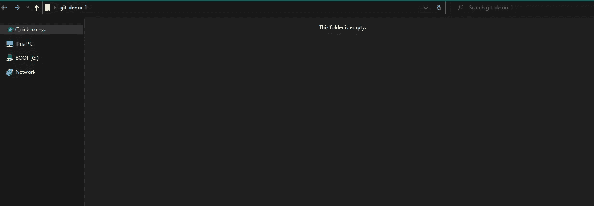

*   打开命令行工具，导航到 git-demo-1 文件夹。
*   在您的 CLI 中键入`git init`

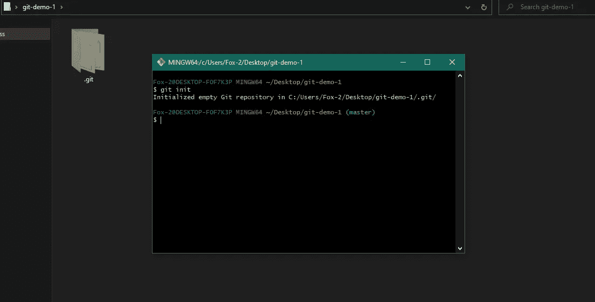

*   这将创建一个空的`.git`(隐藏)文件夹。
*   依次键入以下两个命令
*   `git status`
*   `git remote -v`

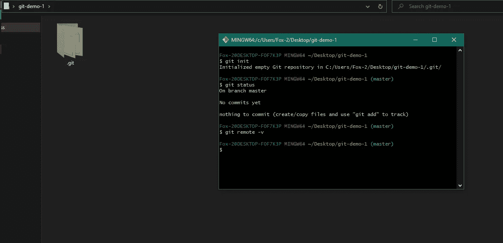

*   您将看到以下结果，这意味着跟踪的文件夹中没有任何更改，也没有为此文件夹设置任何远程设置。
*   不，在文件夹中添加一个名为`demo.txt`的 txt 文件，在该文件中键入`Line 1`并保存文件。

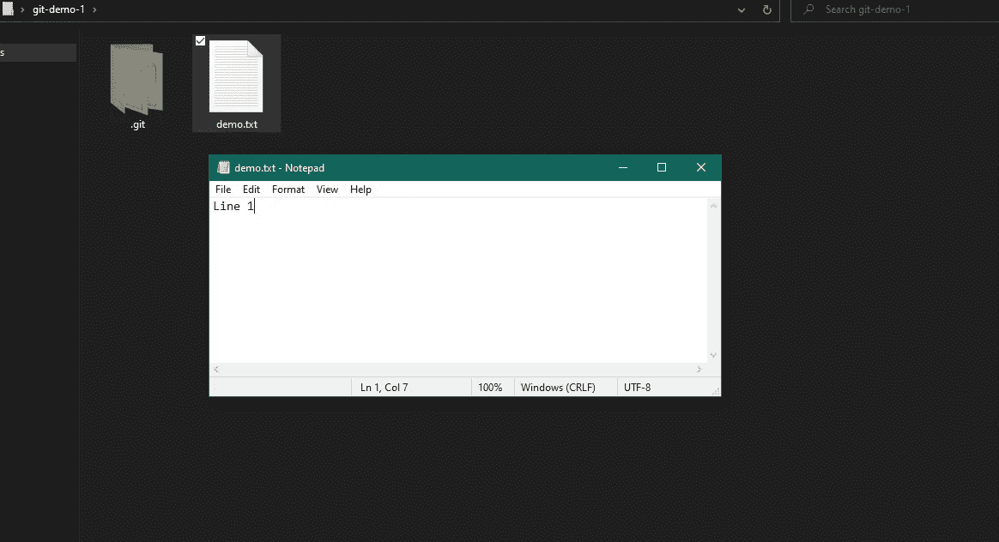

*   在 CLI 中键入以下命令
*   `git add .`
*   `git commit -m "First Line Added"`

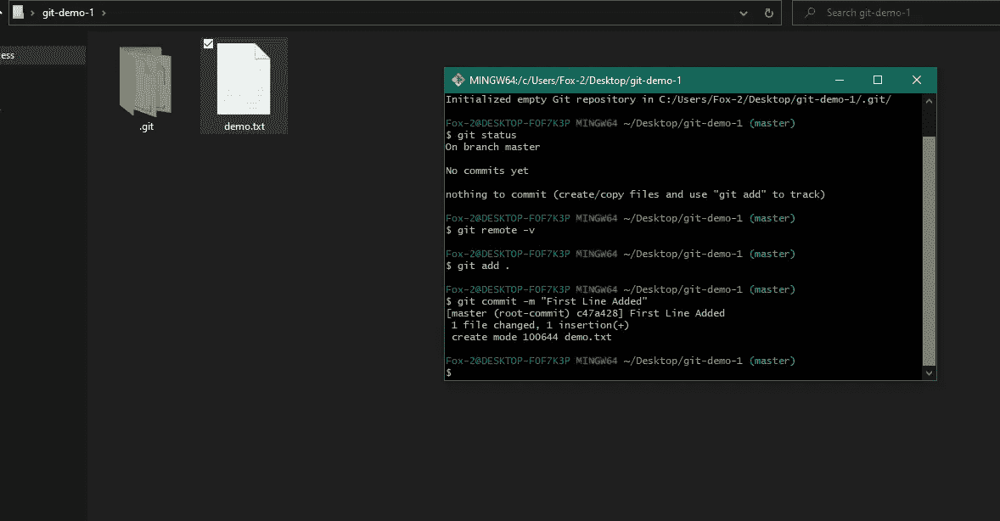

*   既然您已经提交了您的更改，我们需要将它们推送到 GitHub。为此，我们需要在 GitHub 上创建一个存储库，并将这个 GitHub 存储库与 git-demo-1 文件夹的本地存储库连接起来。
*   为此，您需要首先登录 GitHub 并创建一个存储库。

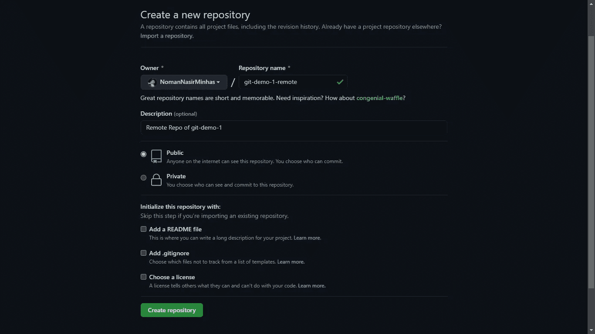

*   复制这个 GitHub 库的链接。

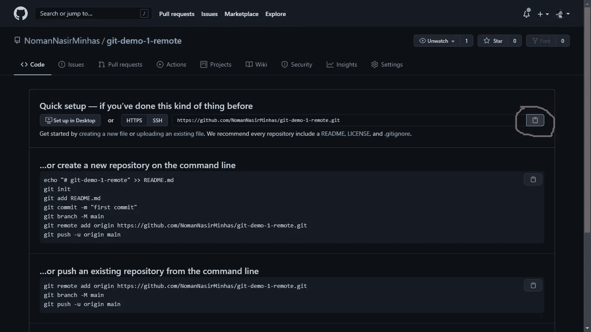

*   在您的 CLI 中键入`git remote add origin LINK_OF_GITHUB_REPOSITORY`
*   您可以键入`git remote -v` 来确认已经添加了遥控器。添加遥控器只需要一次。

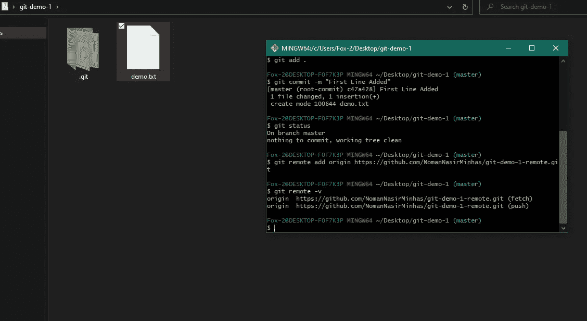

*   现在您的本地存储库已经与 GitHub 连接，您可以输入`git push — set-upstream origin master` 将您的本地文件推送到 GitHub。仅在第一次推动时需要设置上游。

*   你可以刷新你的 GitHub 库页面，在 GitHub 上看到你的 demo.txt 文件。
*   现在，让我们在本地文件夹中添加另一个文件，并推送它。**但是在你对你的文件夹做任何改变之前，每次都要先在 CLI 中输入** `**git pull**` **命令。**(在这种情况下不需要该命令，但我们将在后面看到它的使用)。
*   新建一个文件 demo2.txt，在里面写点东西保存。
*   现在你需要做的就是按照这个顺序执行三个命令。
*   `git add .`
*   `git commit -m "Demo 2 File Added"`
*   `git push`

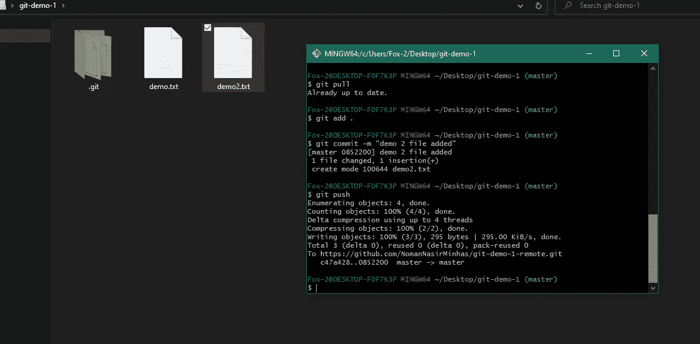

*   **从现在开始，每次你在你的文件夹中做一个改变，你将只需要运行这三个命令。**
*   现在让我们看看什么时候需要`git pull`命令。转到您的 GitHub 存储库，在 demo.txt 文件中进行一些更改并提交它们。

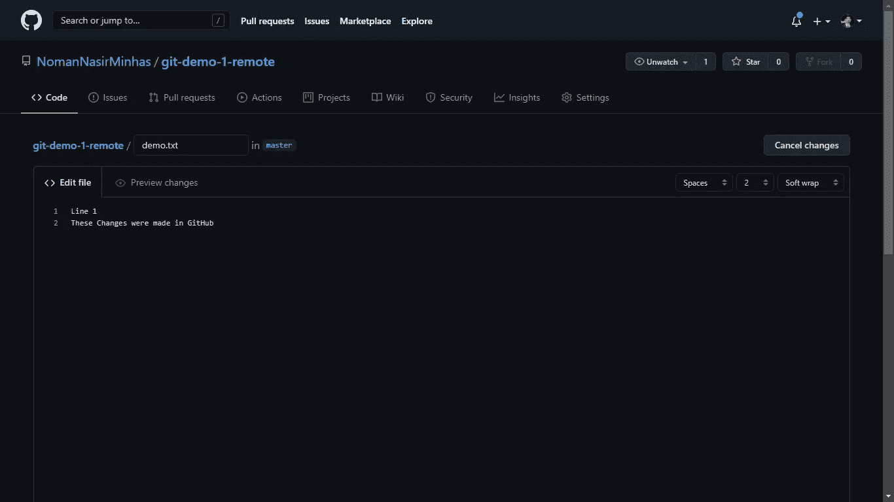

*   现在，在您的 CLI 中，键入`git pull`。这将把在 GitHub 上的 demo.txt 文件中所做的更改添加到我们本地的 demo.txt 中，你可以打开本地的 demo.txt 文件进行确认。**每次在更改本地文件夹中的内容之前运行该命令将有助于避免合并冲突。当多人处理同一个项目时，经常会发生合并冲突。**

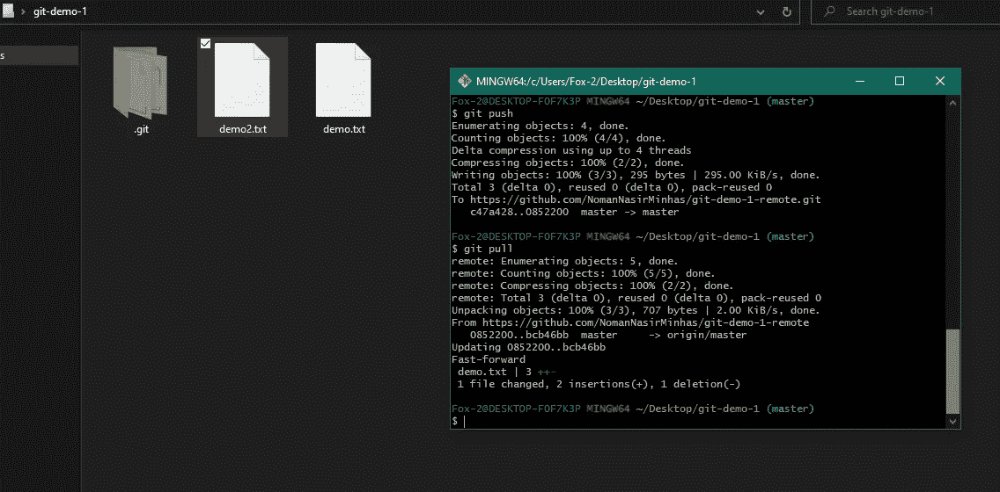

**我们已经学习了如何创建一个空的 git 文件夹，第一次推送更改和第一次之后推送更改。**

在下一篇文章中，我们将深入 Git 分支。