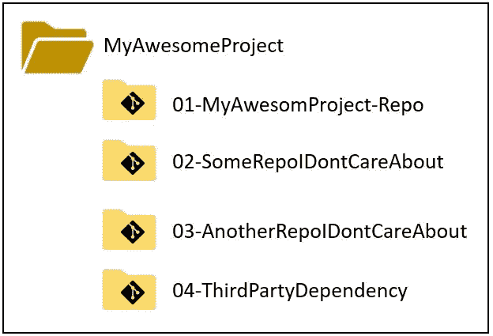

# 多 Git 项目的 git 增压器:gitall

> 原文：<https://medium.com/nerd-for-tech/git-supercharger-for-multi-git-project-gitall-1c3fbb670565?source=collection_archive---------17----------------------->

现实生活和行业优势项目通常很复杂，由全天候的经过测试的 git 版本控制系统管理。随着项目的复杂性和它所能支持的功能列表的发展，项目可能需要分成多个小项目，或者可能需要使用同一组织内的其他项目。在我个人的职业生涯中，我遇到的后者比前者多。这可以在下图中看到:

在第二个场景中，当一个正在开发的项目依赖于其他项目，并且很难逃脱依赖地狱。开发人员可能如此痴迷于他们的任务，以至于他们公然忽略了他们的项目依赖于组织内的其他项目，并愉快地将变更推送到他们的存储库中。

当代码停止编译并且意识到剩余的存储库可能过时时，他们决定更新每个依赖的存储库，这种情况可能是千载难逢的。经典的方法是对每个存储库执行`cd`，然后执行`git pull`。但这很无聊，所以我们很多人(包括我)都会写一个脚本来做这项工作。

但是有一个更好的方法:`gitall`。`gitall`可用于完成几乎与 git 相同的常见任务。例如

1.  `gitall status`
2.  `gitall pull`
3.  `gitall add`
4.  `gitall commit`(虽然我永远不会用)
5.  `gitall diff`

# 如何获得 gitall？

在 windows gitall 上，预构建在 [windows git 客户端](https://gitforwindows.org/index.html)中。在 linux 和 mac-os 上，人们可以很容易地安装[一个可用的](https://www.google.com/search?client=firefox-b-d&q=gitall)开源包装器*并添加一个符号链接到二进制路径(例如`usr/bin/gitall`)。我希望这可以简化我的开发伙伴的生活。

*我不想公开其中的几个工具，因为我还没有全部使用过。一个可能比另一个更好，建议读者阅读文档并自己决定。