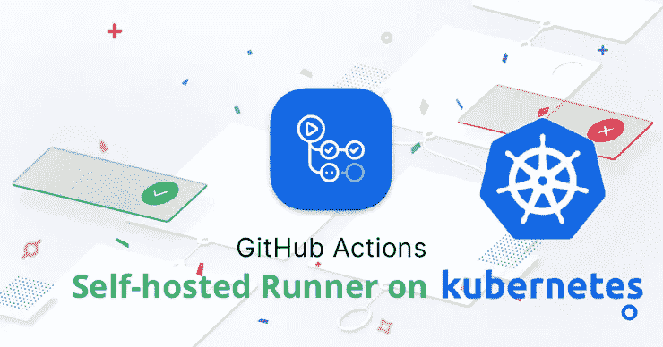

# GitHub Actions Kubernetes 上的自托管 Runner

> 原文：<https://medium.com/nerd-for-tech/github-actions-self-hosted-runner-on-kubernetes-55d077520a31?source=collection_archive---------0----------------------->

**使用 Helm 在 Kubernetes 上部署可扩展的 GitHub Actions 自托管运行程序。**

# 为什么是自主持跑步者？

> *与 GitHub 托管的 runners 相比，自托管的 runners 非常适合在一个高度可定制的环境中运行工作流，对硬件要求、安全性、操作系统和软件工具进行更精细的控制。*
> 
> *自托管运行者可以是物理的、虚拟的、在容器中的、内部的或云中的。在本指南中，我们将把它作为一个容器部署在 AWS 云中的 Kubernetes 集群中。*

# 了解更多:[https://ptuladhar . gum road . com/l/github-actions-self-hosted-runner-on-kubernetes](https://ptuladhar.gumroad.com/l/github-actions-self-hosted-runner-on-kubernetes)