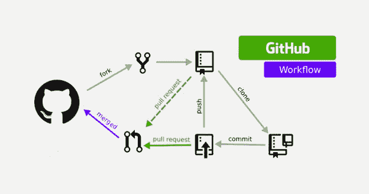
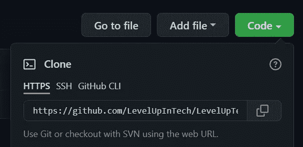
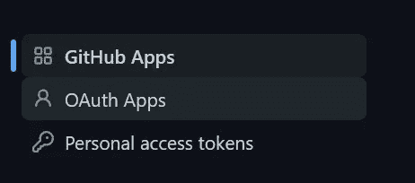
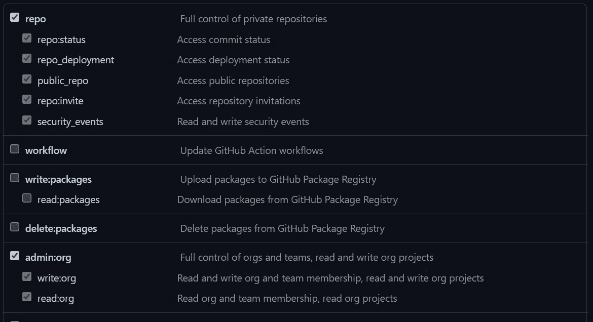
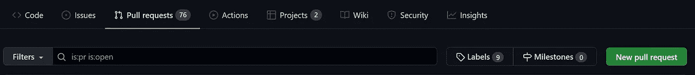

# GitHub 基础知识

> 原文：<https://medium.com/nerd-for-tech/github-basics-f447028e1bd2?source=collection_archive---------2----------------------->

# 派生、克隆、提交、推送、拉取和编辑


# 什么是 GitHub

GitHub 是一家营利性公司，提供基于云的 Git 存储库托管服务。本质上，它使得个人和团队更容易使用 Git 进行版本控制和协作。

此外，任何人都可以免费注册和托管公共代码库，这使得 GitHub 特别受开源项目的欢迎。

这将是一步一步的“如何”安装 git，配置 git 并把一个库分支到你的本地机器上。本地存储库是您可以做出贡献的地方。从那里，我们将把它推回到 GitHub，并提交一个 pull 请求，以便将我们的更改添加到整个项目中。



# 先决条件

我们将通过以下方式实现上述目标:

*   CentOS7 服务器
*   文本编辑器
*   GitHub 账户
*   终端(mac 终端或 Windows Power-shell)

## 步骤 1:更新您的服务器并在您的 CLI 上安装 Git

第一步应该是更新你的服务器。更新包时，yum 将确保满足所有依赖关系。使用下面的命令来确保。

```
sudo yum update
```

现在，将 Git 安装到 CentOS7 服务器上。使用此命令实现这一点。

```
sudo yum install git
```

## 步骤 2:设置 Git 的配置

您需要设置您的身份，以便项目所有者知道是谁向项目提交了他们的工作份额。您可以通过输入以下命令来实现:

```
git config --global user.name "User Name"
git config --global user.email "email"
```

上述命令将建立您的用户名和电子邮件地址。

## 步骤 3:派生存储库

派生存储库允许您自由地试验变更，而不会影响原始项目。访问您希望在 GitHub 上派生的存储库的项目页面。点击 GitHub 页面上的叉状图标。


## 步骤 4:将分叉的回购克隆到您的本地服务器环境中

用 GitHub Desktop 克隆一个分叉的存储库，在你的电脑上创建一个本地存储库。通过克隆存储库，您可以在 GitHub 上创建您有权访问的任何存储库的本地副本。通过点击 GitHub 配置文件屏幕上的“Code ”,将存储库克隆到您的本地机器上。你会在 HTTPS 下面看到一个链接，复制那个链接。



现在，在您的 CLI 环境中，创建一个新目录来存放克隆。在该目录中，输入 git clone 命令(将从 GitHub 页面复制的 https 链接粘贴到命令后面)。该命令将创建一个包含项目文件的目录。完成后，您将看到“完成”

```
mkdir <directory name>
cd <directory you just created>
git clone <url>
```

## 第五步:进行编辑

这是我们根据需要做出贡献和编辑文件的地方。

Vim 是一个高度可配置的文本编辑器，旨在实现高效的文本编辑。要在这个项目中正确使用 Vim，请将当前目录更改为包含您想要在中编辑的文件的目录。输入以下命令:

```
vim <filename>
```

在插入模式下(按 I 键)，输入对文件的更改。对文件进行必要的更改后，按 esc 键退出插入模式。现在按:wq 保存并退出！

## 步骤 6:将文件添加并提交到您的本地 repo

对文件进行必要的更改后，使用下面的命令将文件添加到本地 repo。

```
git add <filename>
```

这个命令告诉 Git 您希望在下一次提交中包含对特定文件的更新。

接下来，我们需要提交我们的更改，或者开始将更改返回到 GitHub 的过程。

```
git commit -m "Comment about your contribution"
```

## 步骤 7:将提交从本地仓库发送到远程仓库

推送是将提交从本地存储库转移到远程存储库的方式。

这需要几个额外的步骤。第一步是设置对 GitHub 的访问。进入你在 GitHub 中的设置，然后进入最底部的“开发者设置”并点击“个人访问令牌”。



接下来，单击“生成新令牌”。为您的令牌提供一个描述性名称，并按如下所示进行选择！



点击“生成令牌”,将令牌复制到你的剪贴板或保存到你的笔记中。

现在转到您的 Linux 环境，使用以下命令将更改推送到您的远程存储库，并在出现提示时输入令牌。

```
git push -u origin main
```

## 步骤 8:发送拉取请求

pull request 是 Git 中的一个事件，贡献者请求 Git 存储库的维护者/开发者检查他们想要合并到项目中的代码。

为此，请转到“拉式请求”选项卡，然后单击“新建拉式请求”。



输入您对项目贡献的描述，然后单击“创建拉动式请求”。就是这样！！

恭喜你！！您已经成功地为 GitHub 上的项目做出了贡献。