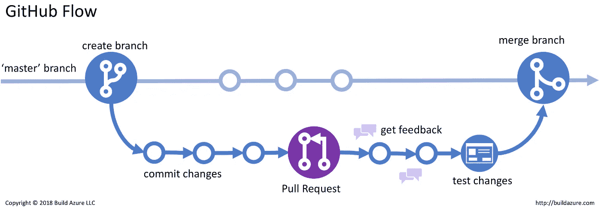

# GitHub 协作

> 原文：<https://medium.com/nerd-for-tech/github-collaboration-a4ea88bc2403?source=collection_archive---------21----------------------->

**Git 命令**

在团队中使用 GitHub 时，您需要不断地获取和推送代码。如果您在主分支或主分支中推送有错误的文件，持续的代码拉和推可能会导致您的同事毛骨悚然。是的，我已经做到了。*骄傲地？是啊！因为..当你还是一个初学者时，为什么不犯错误并学习呢？*😎*。*

无论如何，让我们停止在协作时咬紧牙关，使用我在这里收集的简单的 git 命令，并对每个命令进行简单的描述。

*   当你与某人合作或在团队中工作时，最基本的事情是将你的代码放在一个单独的新分支中，即主分支之外的分支。为什么？当您继续对文件进行更改时，可能会出现错误。不经其他成员审核就直接将其合并到主分支可能会给你的项目带来大麻烦。

# **~命令:**

## **将主分支上完成的新变更带到您的分支:**

*   **git 检验主界面**👉将您带到主分支。
*   **git pull** 👉从主分支提取所有文件和更改。
*   **git 结账你的 _ 分行👉**带你去你的分店。
*   **git 合并主👉**将主分支的变更与你的分支合并。
*   **git 推送👉**推送您的分支中完成的所有合并和变更。

一旦你完成了你的主要分支的所有变化，开始开发东西。在对您的分支做了一些新的事情之后，您需要将您的代码与主项目合并。因此，在所有团队成员的成功评审之后，像你以前做的那样做。就像您如何将变更从主分支带到您的分支一样，您可以使用相同的命令合并您的和主分支，但是使用不同的 end 命令。

## 要将分支上完成的新更改带到主分支，请执行以下操作:

*   **git checkout your_branch** 👉把你带到你的分行。
*   **git 拉**👉从您的分支提取所有文件和更改。
*   **git 结账主界面👉**把你带到主分支。
*   **git 合并你的 _branch👉将您的分支的变更与主分支合并。**
*   **git 推送👉推动主分支中完成的所有合并和更改。**

# 结论:

一开始使用 Github 可能会有点沮丧。但是一旦你开始使用主命令，就会变得有趣起来。如果你是初学者，想知道如何启动 Github，我会在另一篇文章中介绍。这里 可以查看一下 [*！此外，要了解更多关于 Github 的信息，请浏览:*](https://tech-writer.medium.com/github-commands-7246345ba679)

1- [*Git 基础知识*](https://play.google.com/store/apps/details?id=com.harsh_kapadia.git_basics) 安卓应用

2-[*Git-cheat sheets*](https://github.com/Rida-Jamil/github.git)