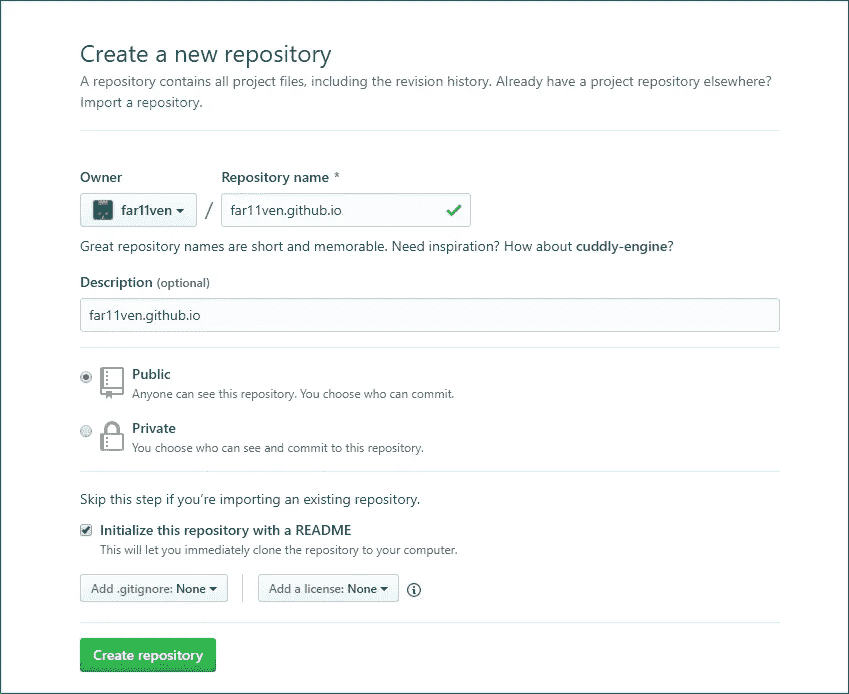
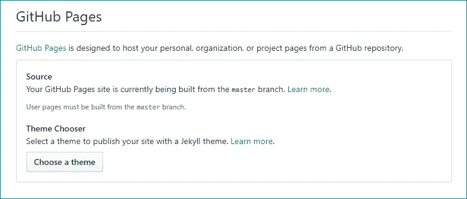
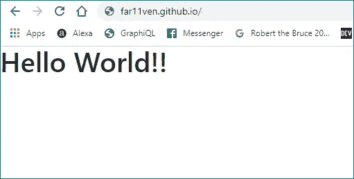
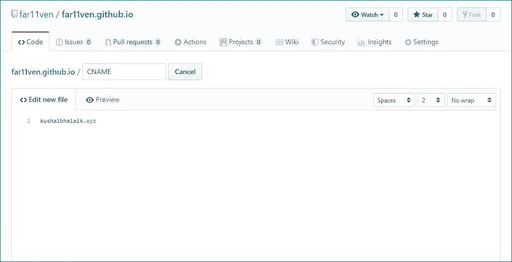

# GitHub Pages —包含图像的综合指南(第 1 部分)

> 原文：<https://medium.com/nerd-for-tech/github-pages-a-comprehensive-guide-w-images-part-1-321b55088466?source=collection_archive---------2----------------------->


[真诚媒体](https://unsplash.com/@sincerelymedia?utm_source=medium&utm_medium=referral)在 [Unsplash](https://unsplash.com?utm_source=medium&utm_medium=referral) 上拍摄的照片

最近我开始建立我的个人[网站](https://kushalbhalaik.xyz)，因为现在每个人都在为自己建设。我得到了一个很酷的 TLD(。xyz)，这是我唯一想花的钱。从那时起，我就一直在寻找免费的方式来举办它。

到目前为止，我已经尝试了不同的主机提供商，如 [Heroku](http://www.heroku.com) 、 [000webhost](http://www.000webhost.com) ，这些都是不错的选择。到目前为止，我的网站是非常静态的页面，直到我想出如何有一个 cms，如 [Ghost](http://www.ghost.org) 与 [Gatsby](http://www.gatsbyjs.org) 集成，用于定期添加内容(当然是免费的)。不管怎样，我想如果我的网站主要是静态页面，为什么不试试 Github 页面呢(它已经在我的列表上很长时间了)，在这个过程中，我遇到了各种障碍，没有一篇详细的文章。所以乡亲们，我们在这里:)

这是本系列文章的第 1 部分，第 2 部分可以在这里找到。*附魔*。

# 设置 Github 页面:

这是最直截了当的事情，在 [Github 页面](https://pages.github.com/)都有清晰的说明，但是正如这篇文章的名字所暗示的，我必须:

我们将从在 Github 上创建一个存储库开始:

1.  转到 [Github.new](https://github.com/new/) ，一个创建 Github 库的更酷的方法(你会看到的)。

> 确保你的 repo-name 是 <username>.github.io
> 以 **<用户名> .github.io** 结尾的页面称为**用户页面**，其中 **<用户名>** 可能属于个人或组织</username>



GitHub 上的存储库创建流程

> 注意:为了让所有人都能访问你的 GitHub 用户页面，公开你的库是很重要的

> 我们不会创建任何其他分支，因为**用户页面**需要从主分支构建。
> 在本文中，我们不会使用 **Jekyll** 来发布我们的页面。



2.首先将回购克隆到本地机器:
这里，< [***用户名***](https://github.com/username/username.github.io) ***>是 GitHub 用户名***

```
**~$ git clone** [**https://github.com/*username*/*username*.github.io**](https://github.com/username/username.github.io)
```

3.在此存储库中创建一个 index.html 文件:

```
**~$ cd *username*.github.io****~$ echo “Hello World!!” > index.html**
```

4.将您的更改添加、提交并推送到 Github remote:

```
**~$ git add *****~$ git commit -m “Initial commit”****~$ git push -u origin master**
```

5.在浏览器中输入{ ***<用户名> .github.io*** }，你就完成了将你的第一个网站发布到 github pages。



已部署 Github 页面的浏览器截图

# 在您的自定义域上设置 Github 页面:

我们已经成功地创建并部署了 Github 页面。但是我想让用户访问我的自定义域名 *kushalbhalaik.xyz.* 让我们把他们联系起来:

1.  在你的存储库中创建了一个 CNAME 文件:
    我将通过 GitHub UI 来完成，只需创建一个 **CNAME** 文件(没有扩展名)并在里面输入你的域名，不需要其他任何东西。



完成后，提交您的更改。


将 CNAME 文件添加到存储库中

2.更改您的 DNS 提供商的 DNS 记录:
我们需要更改现有的 CNAME 记录，以指向创建的 github 页面，即 ***<用户名> .github.io***


改变云辉上的 CNAME 记录

# 要点:

*   此时，我们不需要做任何事情，我们需要等待更改反映到 GitHub 和 Cloudflare 端，这可能需要一些时间(通常是它的提示)，但可能需要一些时间，这取决于您的 DNS 提供商
*   您将无法通过 ***<用户名> .github.io，*** 访问您的页面。如果您尝试在浏览器中输入该用户名，您将被重定向到您的自定义域


部署在自定义域上的 Github 页面

所以这一切都是为了让你开始拥有自己的 Github 页面(用户)。在本系列的第 2 部分中，我们将更深入地研究 ***gh-pages*** 并将页面链接到您的子域。

第 2 部分现已推出[这里](/@kushalbhalaik/github-pages-a-comprehensive-guide-w-images-part-2-94c7a6b8d65b)。
*快乐大厦！！*

*最初发表于 2020 年 1 月 11 日*[*https://kushalbhalaik.xyz/blog*](https://kushalbhalaik.xyz/blog/github-pages-a-comprehensive-guide-w-images-part-1)*。*