# GitHub Pages —包含图像的综合指南(第 2 部分)

> 原文：<https://medium.com/nerd-for-tech/github-pages-a-comprehensive-guide-w-images-part-2-94c7a6b8d65b?source=collection_archive---------3----------------------->

这是 GitHub Pages 系列文章 [*的第 2 部分——包含图片的综合指南*](/@kushalbhalaik/github-pages-a-comprehensive-guide-w-images-part-1-321b55088466)


由[真诚媒体](https://unsplash.com/@sincerelymedia?utm_source=medium&utm_medium=referral)在 [Unsplash](https://unsplash.com?utm_source=medium&utm_medium=referral) 上拍摄

最近我开始建立我的个人网站，因为现在每个人都在为自己建立一个网站。我得到了一个很酷的 TLD(。xyz)，这是我唯一想花的钱。从那时起，我就一直在寻找免费的方式来举办它。

在本系列的第 1 部分中，我们看到了如何发布 GitHub 用户页面以及如何将它与 custom-domain 链接起来。在本文中，我们将了解如何让每个帐户拥有多个 Github 页面(是的，这是可能的)。*评论！！*

> *在继续之前，确保您已经有了一个库<your _ username>. github . io*

# 设置多个 Github 页面:

让我们创建一个新的存储库:

1.  转到 [Github.new](http://www.github.new) 并填写新的存储库详情，我将其命名为****演示****:**

**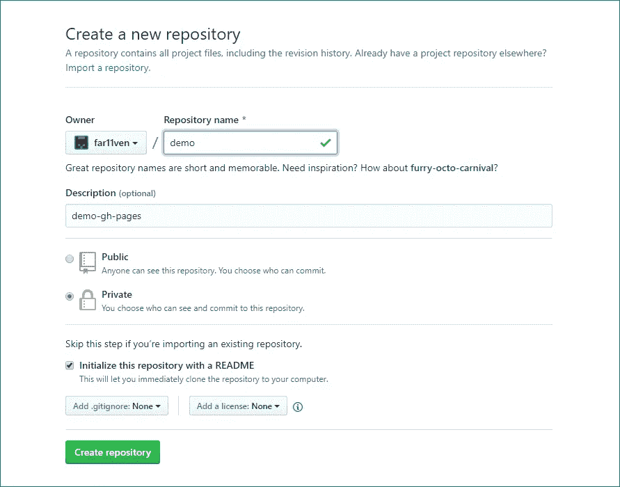**

**GitHub 上的存储库创建流程**

> **注意:保持这个库的公共性是很重要的**

**2.现在转到存储库设置:**

**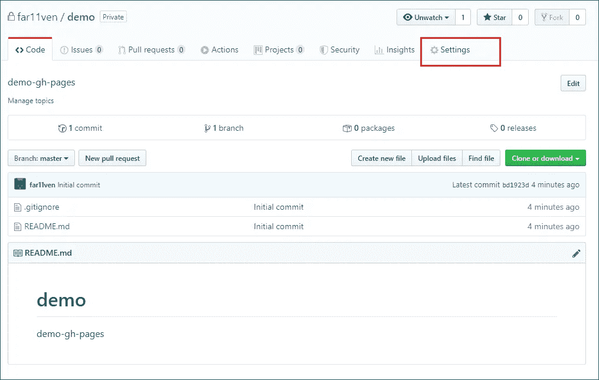**

**3.在设置页面上，向下滚动到 **Github 页面**部分:**

****

**GitHub Repo 设置页面**

**4.如果您看到以下消息，请公开存储库:**

**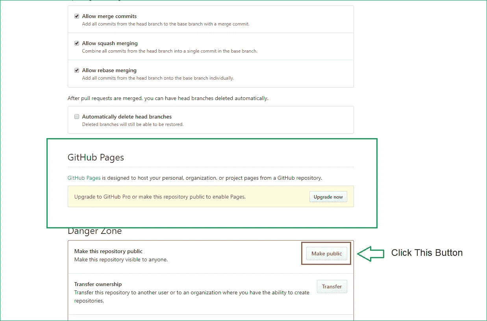**

**在 GitHub 上公开存储库**

**5.一旦存储库是公共的 ***GitHub 页面*** 将为当前存储库启用**

**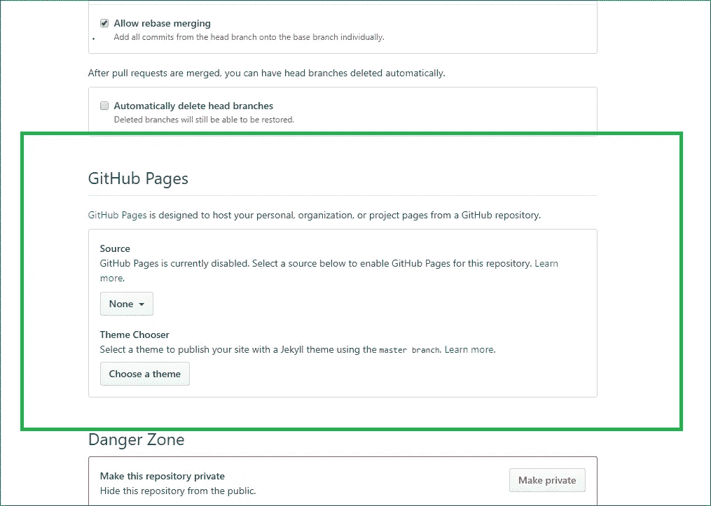**

**GitHub 页面选项**

**6.点击**无**，然后查看当前选项:
我们可以选择以下选项之一:**

1.  **使用演示库的“主”分支发布 GitHub 页面(如 GitHub **用户页面**)**
2.  **使用“主”分支下的/docs 页面发布 GitHub 页面**
3.  **我们将使用 **gh-pages** 分支选项，该选项目前不可用，因为 **gh-pages** 分支对于 ***演示*** 存储库尚不存在**

**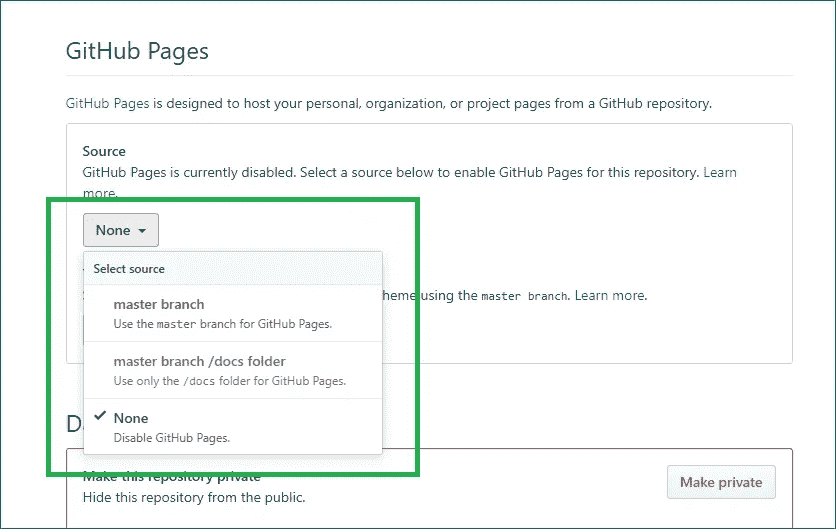**

**默认情况下，GitHub 页面选择“无”**

**7.复制 ***演示*** 资源库链接:**

**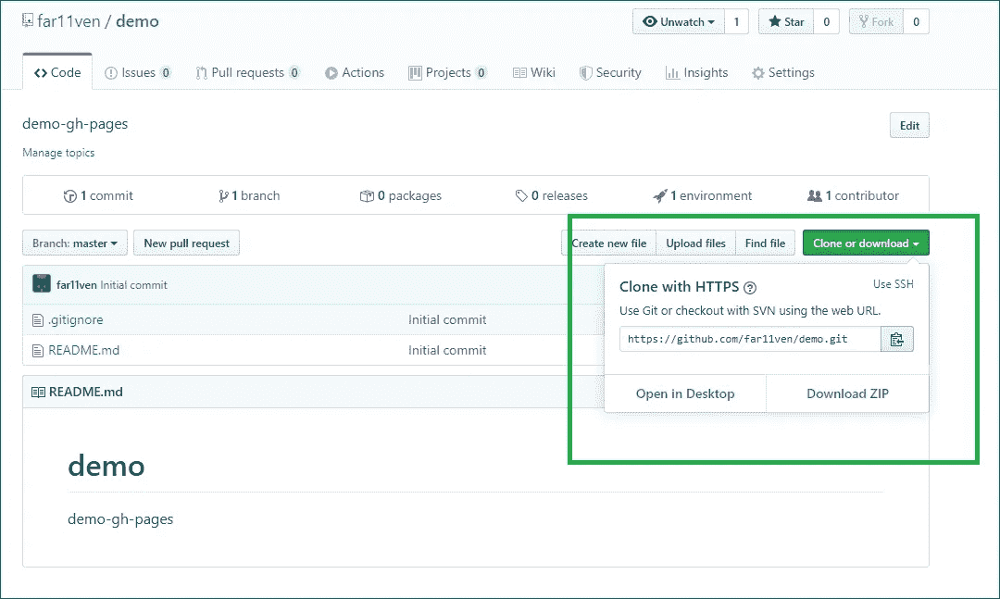**

**从 GitHub 复制存储库链接**

**8.现在将回购克隆到本地机器:
这里，<[***far 11 ven***](https://github.com/username/username.github.io)***>是我的 GitHub 用户名*****

```
****~$ git clone** [**https://github.com/**](https://github.com/username/username.github.io)[***far11ven***](https://github.com/username/username.github.io)[**/**](https://github.com/username/username.github.io)***demo.git*****
```

**9.创建一个本地 **gh-pages** 分支并将其推送到 GitHub:**

```
****~$ cd demo
~$ git branch gh-pages
~$ git push remote -u origin gh-pages****
```

**10.回到 GitHub 上的 ***演示*** 设置，选择 **gh-pages** 作为发布源:**

**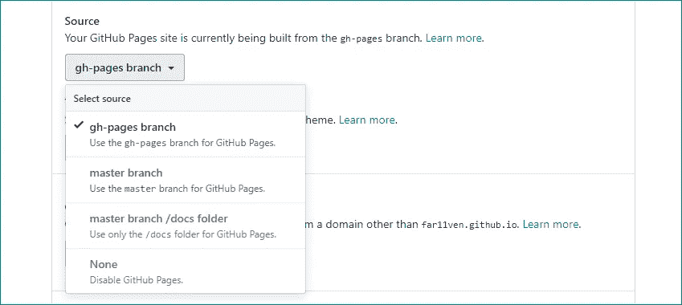**

**在这一步之后，你在 **gh-pages** 分支中放置的任何内容都将被自动发布。**

**11.让我们在这个存储库中创建一个简单的 index.html 文件:**

```
****~$ echo “Hello gh-pages!!” > index.html****
```

**12.将您的更改添加、提交并推送到 GithHub remote:**

```
****~$ git add *
~$ git commit -m “Initial commit”
~$ git push -u origin gh-pages****
```

**13.你可以在你的浏览器中看到**演示库**已经发布**

**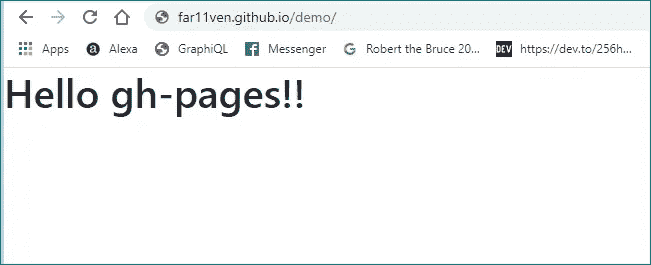**

**在 GitHub 用户页面下发布的“演示”页面**

> **你将有一个主 GitHub 用户页面(每个帐户一个) **<用户名> .github.io** 和所有其他回购将作为子页面发布**
> 
> **或者，**
> 
> **如果你已经链接了一个自定义域名到你的 GitHub 用户页面，那么你可以在**www.example.com/<看到发布的页面****

# **设置自定义域:**

# **I)将 Github 页面设置为域**

**为了让我们的子页面被列为演示页面，我们需要在我们的 GitHub repo 和我们的域提供者中做以下更改**

1.  **创建一个新的 Github 库 ***hello-world*****
2.  **在你的资源库中创建一个 **CNAME** 文件:
    我会通过 GitHub UI 来做，只需创建一个 **CNAME** 文件(没有扩展名)，只需在里面输入你的子域名，别无他求。
    在我的例子中，我想让**演示**页面显示为***your-website.com*****

**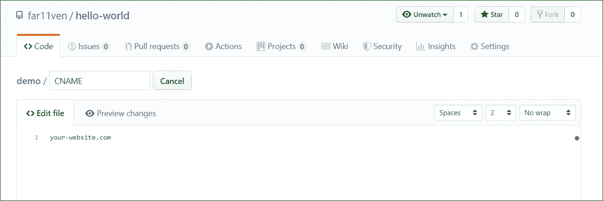**

**CNAME 文件内容**

**完成后，提交您的更改。**

**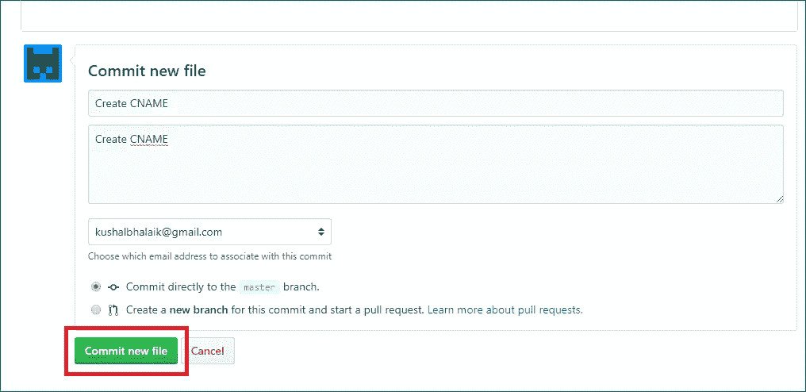**

**将 CNAME 添加到存储库中**

**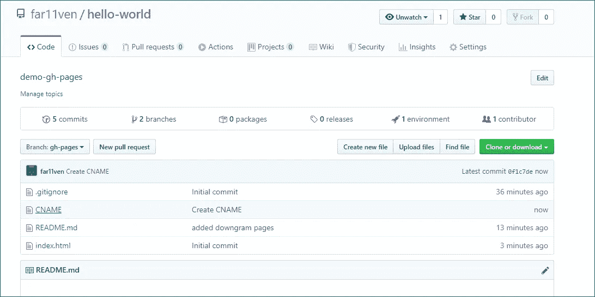**

**将 CNAME 加入回购后**

**3.在您的 DNS 提供商上添加新的 DNS 记录:
我们需要更改现有的 CNAME 记录，以指向创建的 GitHub 页面，即 ***<用户名> .github.io*****

**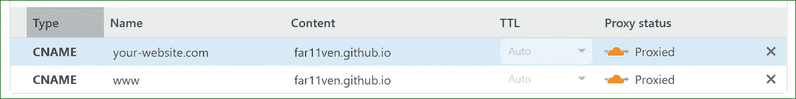**

**在 Cloudflare 上添加新的 CNAME DNS 记录**

# **ii)将 Github 页面设置为子域:**

**为了让我们的子页面被列为演示页面，我们需要在我们的 GitHub repo 和我们的域提供者中做以下更改**

1.  **在你的资源库中创建或编辑一个现有的 **CNAME** 文件:
    我将通过 GitHub UI 来完成，在我的例子中，已经有一个 CNAME 文件，所以我将只编辑现有的文件，并用我的子域替换其中的所有内容，别无其他。
    在我的例子中，我想让**演示**页面显示为***demo . kushalbhalaik . XYZ*****

**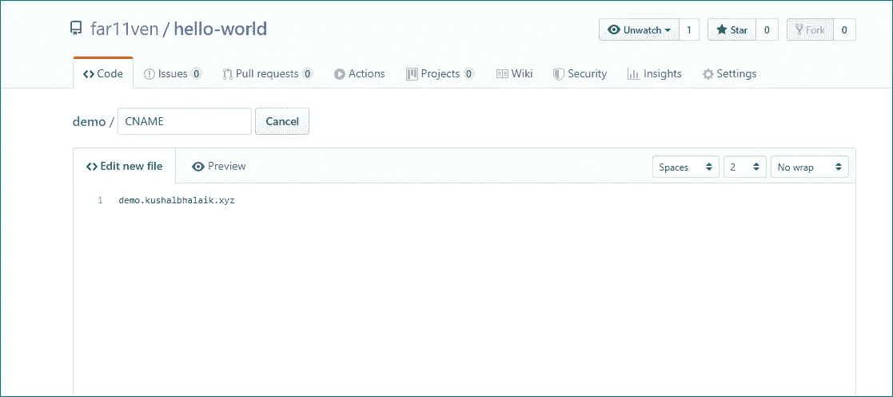**

**CNAME 文件内容**

**完成后，提交您的更改。**

**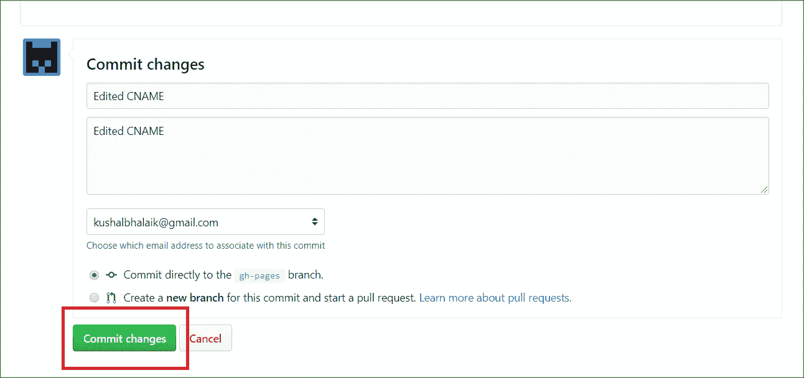**

**编辑存储库中的 CNAME 文件**

**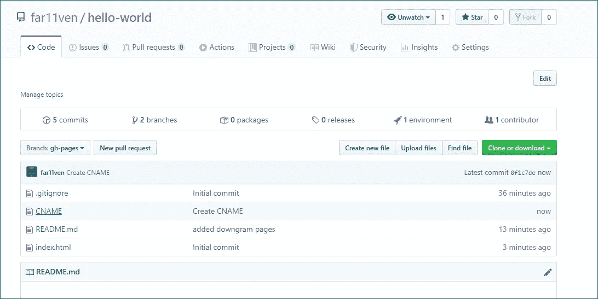**

**更新 CNAME 后**

**2.在您的 DNS 提供商上为现有域添加新的 DNS 记录:
我们需要更改现有的 CNAME 记录，以指向创建的 GitHub 页面，即 ***<用户名> .github.io*****

**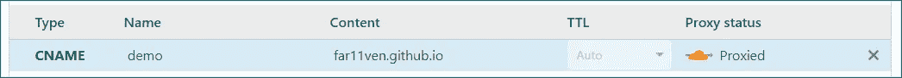**

**在 Cloudflare 上添加新的 CNAME DNS 记录**

# **要点:**

*   **同样，在这一点上，我们不需要做任何事情，我们需要等待更改在 GitHub 和 Cloudflare 端反映出来，这可能需要一些时间(通常是它的提示)，但可能需要一些时间，具体取决于您的 DNS 提供商**
*   **您将无法通过 ***<用户名> .github.io 或<用户名>. github . io/<your-repo>***访问您的页面。如果您尝试在浏览器中输入这些内容，您将被重定向到您的自定义域或自定义子域**
*   **您不能将多个 GitHub 页面作为子域添加到 **GitHub 用户页面**中，即*demo . far 11 ven . GitHub . io*在我的例子中不是有效的 URL**

# **最终结果:**

**我们已经成功地创建了一个子域来托管我们的其他 Github 页面，按照这些步骤在您的网站中创建更多的页面。**

**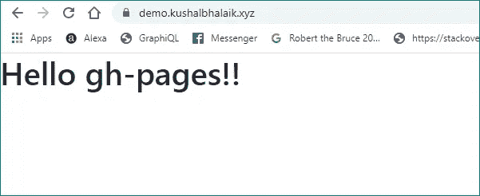**

**在一个子域下发布的 GitHub 页面**

***干杯！！***

***原载于 2020 年 1 月 12 日*[*https://kushalbhalaik.xyz/blog*](https://kushalbhalaik.xyz/blog/github-pages-a-comprehensive-guide-w-images-part-2)*。***