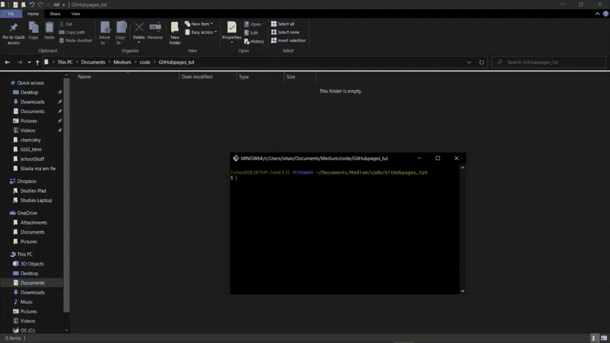
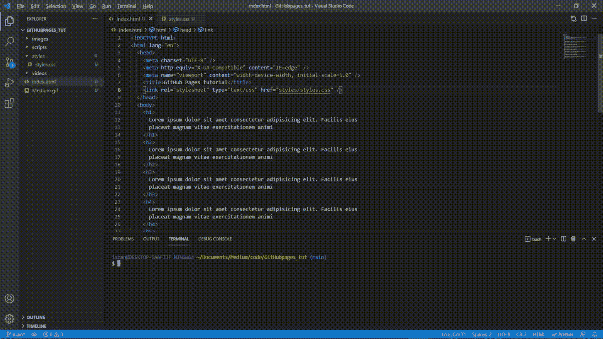
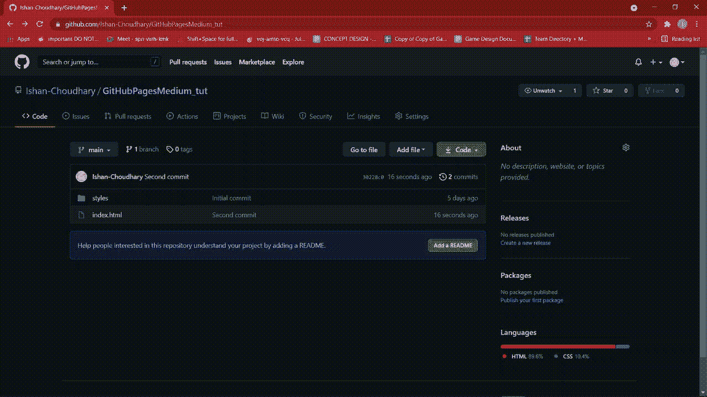
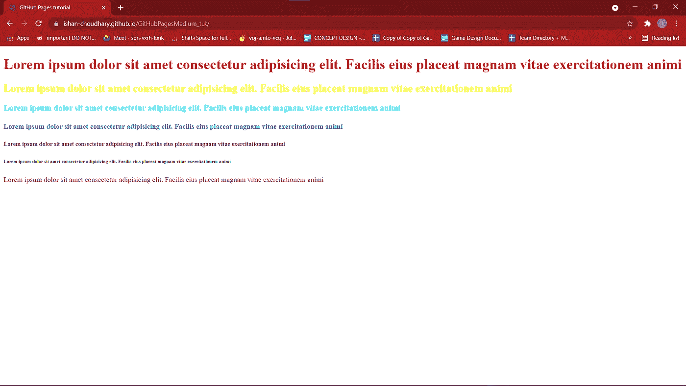

# 面向初学者的 GitHub 页面

> 原文：<https://medium.com/nerd-for-tech/github-pages-for-beginners-b20754f9c380?source=collection_archive---------13----------------------->

大家好！今天我将展示如何使用 GitHub Pages 创建自己的网站。那么什么是 GitHub 页面呢？

> GitHub Pages**是一个静态站点托管服务**，它直接从 GitHub 上的存储库中获取 HTML、CSS 和 JavaScript 文件，可选地通过构建过程运行这些文件，并发布一个网站。
> -docs.github.com

由于我的前两篇博客都是关于 GitHub 和 Git 的基础知识，我认为展示 GitHub 还能提供什么是个好主意。您可以通过五个简单的步骤设置 GitHub pages 网站。

1.  **创建 Git 库**
2.  **编写 HTML 文件。(CSS 和 JS to if you want)**
3.  **将文件推送到 GitHub**
4.  **启用 GitHub 页面的存储库**
5.  **打开您的网站！**

让我们首先完成步骤 1 和步骤 2，即创建一个存储库，并写下 html 和 css 文件。创建一个本地 Git 存储库，其中包含您的文件。然后创建一个 html 文件，以及您想要包含的其他文件，如 css 和 js 文件。我是这样做的:

您可以看到我稍后创建了 git 存储库，如果您也这样做，就不会有任何问题。现在是添加和提交所有更改的时候了。在那之后，我们终于可以把这些变化推到 GitHub 上了。因此，首先将更改提交到您的本地 git 存储库，然后创建一个公共 GitHub 存储库。将 GitHub 存储库链接到您的本地 git 存储库，然后推送更改。你应该这样做:

现在您需要在设置中启用 GitHub 页面的存储库。你应该这样做:

该网站的源文件出现在“主”分支中，这是我们在源文件中选择的内容。你也可以创建一个不同的分支，把你所有的文件放在那里。然后简单地将源代码更改为该分支。几分钟后，点击显示的链接，它会带你到你的网站。

你可以看到链接是 username.github.io/name 的储存库。您也可以在任何其他网站中打开这个相同的网站。这是我 iPad 上的同一个网站:

原来如此！我希望你喜欢这篇文章。与他人分享，他们可能会觉得这很有帮助。

感谢您的阅读！