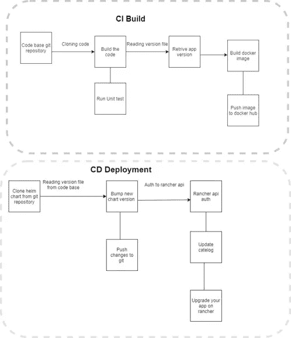
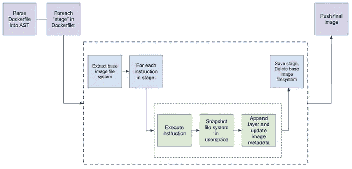

# 从 git 到 K8s 的 GitLab CI/CD

> 原文：<https://medium.com/nerd-for-tech/gitlab-ci-cd-from-git-to-k8s-a57c3bf3df3a?source=collection_archive---------2----------------------->

> 在本文中，我将解释如何使用 GitLab CI/CD 来构建、测试和部署 nodejs 应用程序到 K8s(通过 rancher API)



GitLab 是什么？

GitLab 是一个完整的 DevOps 平台。一个具有无限可能性的应用程序。组织依靠 GitLab 的源代码管理、CI/CD、安全性等来快速交付软件。

什么是 GitLab CI/CD？

是 GitLab 的一部分，每当开发人员向应用程序推送代码时，它就构建并测试
软件。
GitLab CD(持续部署)是一种软件服务
，它将每个代码的变更放在生产
中，从而导致生产的日常部署。
这是一个更快的系统，可用于代码
部署和开发。
您可以通过设置自己的
runner(它是一个处理构建的应用程序)来更快地执行作业，并预先安装了
所有的依赖项。
git lab CI 解决方案既经济又安全，在成本上
非常灵活，与用于运行它的机器一样。
它允许项目团队成员每天集成他们的
工作，这样集成错误可以通过自动化构建容易地识别
。

> GitLab 正在使用 DIND (docker 中的 docker)服务来构建和推送 docker，这意味着在 docker 容器中运行 docker 守护进程。

使用 DIND 有什么问题？

如果你的 GitLab 实例在 Kubernest 之外运行，你可以在你的 runner 机器上使用 docker，但在 K8s 中，DIND 服务需要很多权限才能打开，使用 DIND 也有一些问题，比如

1- (Linux 安全模块)像 SELinux:当启动一个容器时，“内部 Docker”可能会尝试应用与“外部 Docker”冲突或混淆的安全配置文件当试图合并-privileged 标志的原始实现时，这实际上是最难解决的问题。

2-当你在 Docker 中运行 Docker 时，外部 Docker 运行在普通文件系统(EXT4、BTRFS 等等)之上，而内部 Docker 运行在一个写时复制系统(AUFS、BTRFS 等等)之上..取决于外部对接器被设置成使用什么)。有很多组合是行不通的。例如，你不能在 AUFS 之上运行 AUFS。如果您在 BTRFS 之上运行 BTRFS，它应该首先工作，但是一旦您有了嵌套的子卷，删除父子卷将会失败。

因此，我将使用 Kaniko executor 来构建和推动 CI/CD 管道中的 docker 映像，您可以使用 DIND 来考虑这些问题。

kaniko 是一个在容器或 Kubernetes 集群中从 Docker 文件构建容器映像的工具，它支持在不能轻松或安全地运行 Docker 守护进程的环境中构建容器映像，比如标准的 Kubernetes 集群。

为什么我选择了 Kaniko？

1-它不需要 docker 守护进程

2-它不需要任何特殊的特权或许可

3-你可以在一个标准的 Kubernetes 集群、Google Kubernetes 引擎或任何不能访问特权或 Docker 守护进程的环境中运行“kaniko”。

Kaniko 是如何工作的？



**在我解释了工具和技术之后，让我们开始编写管道**

我们需要做到以下几点:

1-安装节点模块并构建 nodejs 应用程序

2-使用 JUnit 和测试报告测试应用程序

3-使用 Kankio executor 构建并推送 docker 映像

4-从 git 库克隆舵图，并使用一种脚本语言编辑它，我将使用 python 和 YAML 管道

5-使用 Rancher CLI 和 API 更新目录和升级应用程序

> *Rancher 是一个开源软件，它结合了组织在生产中采用和运行容器所需的一切。Rancher 构建于 Kubernetes 之上，使 DevOps 团队能够轻松测试、部署和管理他们的应用程序。*

**GitLab 用 YAML 风格写流水线**

*   **首先，我们需要定义流水线阶段**

```
stages:
- build
- test
- docker-build
- bump-helm-chart-version
- deployment
```

*   **对于构建，我将使用节点映像来构建 nodejs 应用程序，您可以使用与您的应用程序相关的任何映像，例如。net core，java，Ruby 等。**

```
build:
stage: build
image: node
script:
- echo “Start building App”
- npm install
- npm build
- echo “Build successfully!”
artifacts:
expire_in: 1 hour
paths:
- build/dist
- node_modules/
```

在构建阶段的工件中，我们将期望构建路径和节点模块

*   **在测试阶段，我也将使用节点映像**

```
stage: test
image: node
script:
- echo “Testing App”
- npm run test
- echo “Test successfully!”
artifacts:
expire_in: 1 hour
paths:
- test-reports/jest-junit.xml
reports:
junit:
- test-reports/jest-junit.xml
```

作为测试阶段的产物，我将 Junit 验证放在测试报告文件中。

*   **对于构建和推送 docker 映像，我将使用 Kankio 映像**

```
docker-build:
image: gcr.io/kaniko-project/executor:debug
stage: docker-build
script:
- export VERSION=$(cat package.json | grep version | head -1 | awk -F= “{ print $2 }” | sed ‘s/[version:,\”,]//g’ | tr -d ‘[[:space:]]’)
- echo “app version $VERSION”
- mkdir -p /kaniko/.docker
- echo “{\”auths\”:{\”$CI_REGISTRY\”:{\”username\”:\”$CI_REGISTRY_USER\”,\”password\”:\”$CI_REGISTRY_PASSWORD\”}}}” > /kaniko/.docker/config.json
- /kaniko/executor — context ./ — dockerfile build/dockerfile — insecure — skip-tls-verify — destination $CI_REGISTRY/amlt/test-node-js-app:$VERSION
- echo “Image build and pushed successfully”
```

首先，我使用 Linux grep 命令从 package.json 导出应用程序的版本(您可以使用自己的方式来版本化您的应用程序)。

然后我为 Kankio 创建了 config.json，其中包含 docker 注册表凭证，我使用了 GitLab 预定义的 ENV。您可以在 GitLab 中设置某种 ENV，以便在管道中使用。从您的 git 存储库中转到 settings 并选择 CI/CD。

最后，我运行了 kaniko 构建/推送命令

**克隆和编辑 K8s 舵图**

在这个阶段，我将使用一个纯 ubuntu 映像，并准备以下工具在这个阶段使用

1- SSH 代理连接到 helm charts git 存储库进行克隆、提交和推送。

2- Python 和 Python 管道编辑舵图

3 吉特

```
bump-helm-chart-version:
stage: bump-helm-chart-version
image: ubuntu:18.04
before_script:
- export VERSION=$(cat package.json | grep version | head -1 | awk -F= “{ print $2 }” | sed ‘s/[version:,\”,]//g’ | tr -d ‘[[:space:]]’)
- apt-get update -y && apt-get install openssh-client -y
- apt install git -y
- apt-get install -y python
- apt-get install python-pip -y
- python -m pip install pyyaml
- eval $(ssh-agent -s)
- echo “$GIT_SSH_PRIVATE_KEY” | tr -d ‘\r’ | ssh-add -
- mkdir -p ~/.ssh
- chmod 700 ~/.ssh
- ssh-keyscan $GIT_HOST >> ~/.ssh/known_hosts
- chmod 644 ~/.ssh/known_hosts
- git config — global user.name “${GIT_USER_NAME}”
- git config — global user.email “${GIT_USER_EMAIL}”script:
- ssh “git@$GIT_HOST”
- git clone $CI_CHART_REPOSITORY
- cd $HELM_CHART_ROOT_FOLDER
- |
if [ -d “$HELM_CHART_FOLDER_NAME-$VERSION” ]; then
echo “Skip version exists”
else
cp -a -r $HELM_CHART_FOLDER_NAME “$HELM_CHART_FOLDER_NAME-$VERSION”
cd “$HELM_CHART_FOLDER_NAME-$VERSION”
python ../../update-yaml.py
cd ../
git add . && git commit -m “CI-CD bump version $VERSION” && git push
fi
only:
- branches
```

在预脚本工作中，我准备了我们的映像并设置了所需的工具，并让 git 知道用户名和电子邮件，以避免在克隆或推送期间询问。

在脚本中，我首先使用 ssh-agent 连接到 git 主机，然后克隆了 helm charts。

为了降级和升级的目的，我从原始版本中复制了一份进行编辑，以保持 Rancher 中的版本控制。

我编写了一个简单的 python 脚本来编辑 YAML 文件的值，如 docker 图像标签、图表版本和应用程序版本

```
*import* yaml
*import* os
f=open(“values.yaml”)
y=yaml.safe_load(f)
y[“image”][“tag”] = os.environ[“VERSION”]
*with* open(“values.yaml”, “w”) *as* f:
yaml.dump(y, f)
f=open(“Chart.yaml”)
y=yaml.safe_load(f)
y[“version”]= os.environ[“VERSION”]
y[“appVersion”]= os.environ[“VERSION”]
*with* open(“Chart.yaml”, “w”) *as* f:
yaml.dump(y, f)
```

最后，我将修改提交并推送到 git 存储库。

**最后一个阶段，我们需要使用 Rancher API 升级 K8s 中的 app**

在这个阶段，我使用了带有 Rancher CLI 的 Linux 映像

> 您也可以使用直接 HTTP 调用 Rancher API

```
deployment:
image: ubuntu:18.04
stage: deployment
before_script:
- echo “Configure machine”
- export VERSION=$(cat package.json | grep version | head -1 | awk -F= “{ print $2 }” | sed ‘s/[version:,\”,]//g’ | tr -d ‘[[:space:]]’)
- apt-get update
- apt install curl -y
- curl -k $RANCHER_CLI_URL | tar xz
script:
- echo “Start deployment”
- cd $RANCHER_CLI_FOLDER_NAME
- ls -t
- ./rancher login $RANCHER_URL/v3 — token $RANCHER_API_TOKEN — skip-verify — context $RANCHER_CONTEXT
- |
curl -k — location — request POST “$REFRESH_CATELOG_URL” — header “Authorization: Bearer $RANCHER_API_TOKEN” && sleep 20
- ./rancher app upgrade $RANCHER_APP_NAME $VERSION
- echo “The App successfully upgraded”
```

首先，我通过从 GitLab ENV 中存储的 URL 下载 rancher CLI 来准备图像，以便于更改。

*   我使用存储在 env 中的牧场主访问令牌向牧场主 api 进行了身份验证
*   在更新目录步骤中，我使用直接 HTTP 调用作为解决方法，因为 CLI 不读取/刷新项目范围目录
*   最后，我使用 package.json 中的应用程序版本，使用 rancher 升级 K8s 中的应用程序(请记住，您可以使用您的版本控制，如 git 标记等)

现在，您的应用程序已经升级，工作负载也用新的 docker 映像进行了更新，您节省了时间。

最后，我希望我为您提供了解决部署问题的思路

如果你用的是 Jenkins 而不是 GitLab，我建议你看看我的文章

[](https://regoo707.medium.com/build-and-deploy-your-app-in-rancher-using-jenkins-pipeline-cc1bb02cfcc6) [## 使用 Jenkins pipeline 在 Rancher 中构建和部署您的应用

### 在这篇文章中，我将解释如何编写 Jenkins pipeline 来自动化构建代码的过程。

regoo707.medium.com](https://regoo707.medium.com/build-and-deploy-your-app-in-rancher-using-jenkins-pipeline-cc1bb02cfcc6)