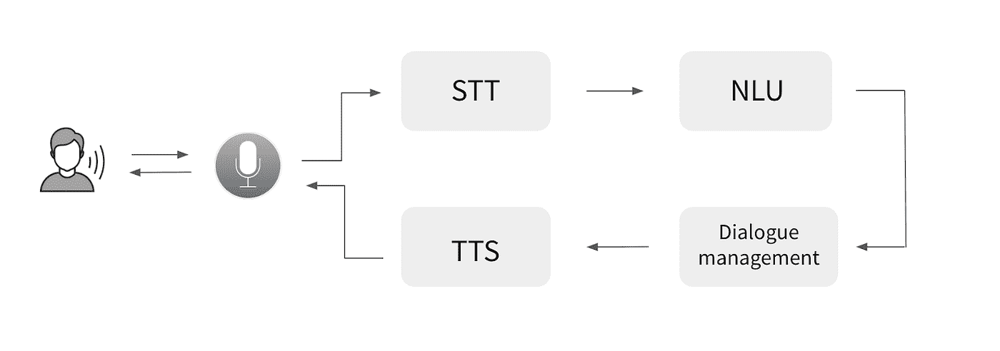
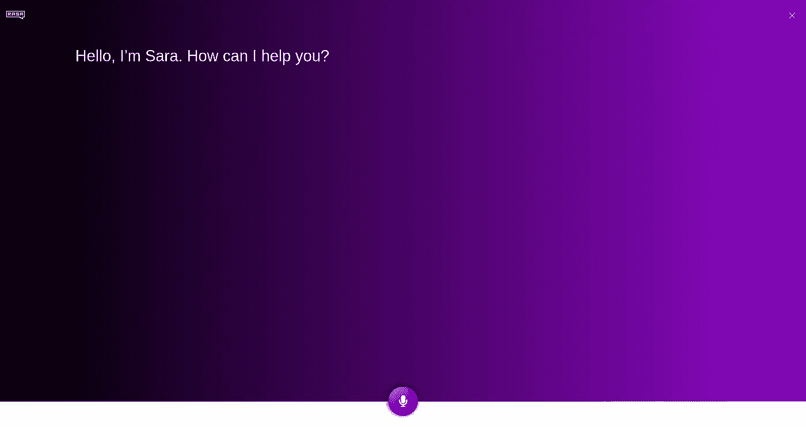

# 用波特姆语给拉莎一个声音

> 原文：<https://medium.com/nerd-for-tech/giving-a-voice-to-rasa-with-botium-speech-1c65a7513bdf?source=collection_archive---------2----------------------->

像 Alexa 和 Google Assistant 这样的语音平台可以轻松构建自己的语音体验，甚至无需深入音频处理——一切都是平台的一部分。但是，如果你想选择一个由你自己托管的解决方案，在你自己的网站上，在你自己的基础设施中运行一个助手呢？

这篇文章的目标是展示如何使用开源工具 [Rasa](https://rasa.com/) 和 [Botium 语音处理](https://github.com/codeforequity-at/botium-speech-processing)构建自己的语音平台。


一个令人敬畏的立体视觉

Rasa 是一个开发人员友好的、可扩展的聊天机器人构建工具，用于自托管。Botium Speech Processing 是一个统一的、开发人员友好的 API，提供最好的免费和开源的语音到文本和文本到语音服务。让我们结合这一点，但首先让我们快速看一下架构。

# 体系结构

1.  用户对着麦克风说话
2.  语音到文本服务翻译成文本**(语音处理)**
3.  NLU 引擎从文本 **(Rasa)** 中提取信息
4.  对话引擎构建文本响应 **(Rasa)**
5.  文本到语音服务翻译成口语文本**(语音处理)**
6.  用户收听音频文件



图片来自[这篇 Rasa 博文](https://blog.rasa.com/how-to-build-a-voice-assistant-with-open-source-rasa-and-mozilla-tools/)

# 安装步骤

所以让我们来看有趣的部分。

## 先决条件

以下是您需要在工作站上提供的内容:

*   Git 客户端
*   Docker 和 Docker-撰写

## 启动 Botium 语音处理服务

Botium 语音处理带有合理的默认配置。

*   [用于文本到语音转换的 MaryTTS](http://mary.dfki.de/)
*   [Kaldi](https://kaldi-asr.org/) 用于语音转文本

> 它们都是免费和开源的，是语音技术入门的好搭档，另一方面，它们无疑是最好的免费语音工具之一。

启动它可以通过几个命令行调用来完成。

```
$ git clone [https://github.com/codeforequity-at/botium-speech-processing.git](https://github.com/codeforequity-at/botium-speech-processing.git)
$ cd botium-speech-processing
$ docker-compose up -d
```

> 根据网络速度和硬件，这一步可能需要一段时间。

将你的浏览器指向 http://localhost 将会显示 Botium 语音处理的 API explorer。

## 设置 Rasa

我们将以 Rasa 演示机器人 Sara 为例。

> 你可以从 [Github 资源库](https://github.com/RasaHQ/rasa-demo)中找到第一手资料

我更喜欢使用 Docker，而不是在本地安装所有东西。因此，您可以使用这些命令行调用来下载 Rasa 演示机器人并运行第一次培训:

```
$ git clone [https://github.com/RasaHQ/rasa-demo.git](https://github.com/RasaHQ/rasa-demo.git)
$ cd rasa-demo
$ docker run --rm -v .:/app rasa/rasa:latest-full train --domain domain.yml --data data/core data/nlu --out models/dialogue --augmentation 0
```

> 根据网络速度和硬件，这一步可能需要一段时间。

将这个 *docker-compose.yml* 文件放到 Rasa 文件夹中:

```
version: '3.0'
services:
  rasa:
    image: rasa/rasa:latest-full
    ports:
      - 5005:5005
    volumes:
      - ./:/app
    environment:
      RASA_DUCKLING_HTTP_URL: http://rasa-duckling:8000
    command: run --model models/dialogue --endpoints endpoints.yml
  rasa-actions:
    build:
      context: .
    ports:
      - 5055:5055
  rasa-duckling:
    image: rasa/duckling
    ports:
      - 8000:8000
```

在文件 *endpoints.yml* 中，将动作端点 url 从*http://localhost:5055/web hook*更改为*http://rasa-actions:5055/web hook*。现在启动 Rasa 服务:

```
$ docker-compose up -d
```

Rasa 服务正在等待连接。

## 为 Rasa 添加语音功能

[这个 Github 库](https://github.com/codeforequity-at/botium-speech-processing/tree/master/connectors/rasa)包括一个基于 Rasa 内置 Socket.io-connector 的[定制连接器](https://rasa.com/docs/rasa/connectors/custom-connectors/)，它为 Rasa 增加了语音到文本和文本到语音的功能。

首先，克隆存储库并将连接器文件夹复制到 Rasa 文件夹:

```
$ git clone [https://github.com/codeforequity-at/botium-speech-processing.git](https://github.com/codeforequity-at/botium-speech-processing.git)
$ cd botium-speech-processing
$ cp -R connectors <rasa-dir>
```

在文件*connectors/rasa/credentials . yml*中，有一个 Rasa 自定义连接器的**示例** **配置**。

> 你可以直接使用这个文件或者复制*僵尸工具的配置。socketivoice input*连接器连接到您现有的 Rasa *凭证. yml*

将文件更改为指向本地工作站进行语音处理(为了方便和其他测试，它还会启动一个 REST 连接器):

```
botium.SocketIOVoiceInput:
  socketio_path: /socket.io
  user_message_evt: user_uttered
  bot_message_evt: bot_uttered
  session_persistence: false
  botium_speech_url: [http://l](https://speech.botiumbox.com)ocalhost
  botium_speech_apikey:
  botium_speech_language: en
  botium_speech_voice: dfki-poppy-hsmmrest:
```

然后，为 Rasa 更改 *docker-compose.yml* 文件以使用该连接器。

```
version: '3.0'
services:
  rasa:
    image: rasa/rasa:latest-full
    ports:
      - 5005:5005
    volumes:
      - ./:/app
    environment:
      PYTHONPATH: "/app/connectors/rasa:/app"
      RASA_DUCKLING_HTTP_URL: http://rasa-duckling:8000
    command: run --cors "*" --credentials /app/connectors/rasa/credentials.yml --enable-api --model models/dialogue --endpoints endpoints.yml
  rasa-actions:
    build:
      context: .
    ports:
      - 5055:5055
  rasa-duckling:
    image: rasa/duckling
    ports:
      - 8000:8000
```

重新启动 Rasa，对 Docker 容器进行修改。

```
$ docker-compose up -d
```

# 测试

Botium 语音处理项目中有一个基于 [Rasa 语音接口](https://github.com/RasaHQ/rasa-voice-interface)的简单测试客户端。

在 *connectors/rasa/client* 目录中，更改 *docker-compose.yml* 文件中的 rasa 端点:

```
version: '3'
services:
  frontend:
    build:
      context: .
      args:
        RASA_ENDPOINT: [http://l](https://demo.botiumbox.com)ocalhost:5005
        RASA_PATH: /socket.io
        PUBLIC_PATH: /
    image: botium/botium-speech-rasa-voice
    restart: always
    ports:
      - 4700:8080
```

然后使用*“docker-compose up-d”*启动网站，并访问位于 [http://localhost:4700](http://localhost:4700) 的 web 界面，与您的 Rasa 聊天机器人聊天。



运行中的语音界面

现在是时候运行您的麦克风和扬声器，并与 Rasa 聊天了！

看到这篇西班牙文的文章[这里](https://planetachatbot.com/dando-voz-a-rasa-con-botium-speech-4b6b67319efd)！🇪🇸