# 给人工智能的眼睛|统一

> 原文：<https://medium.com/nerd-for-tech/giving-eyes-to-the-ai-unity-27acb7f48b12?source=collection_archive---------16----------------------->

## 统一指南

## 关于如何让人工智能识别 Unity 中的玩家的快速指南

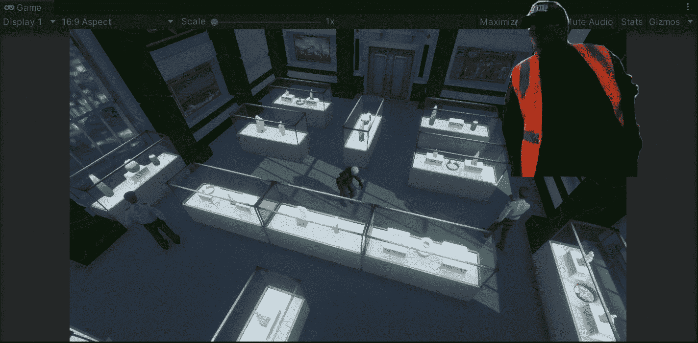

目标:实现一个系统，让 NPC 统一识别玩家。

在上一篇文章中，我介绍了[如何创建一个模块化的路点系统来让 NPC 在一个定义好的路径上移动](/nerd-for-tech/creating-a-modular-waypoint-system-unity-49cf6dc6e430)。现在，是时候实现一个允许 NPC(不可玩角色)用 Unity 识别玩家的系统了。

# 当前场景

在当前场景中，我们有 3 个 NPC 会在陈列柜周围移动。球员的目标是神不知鬼不觉地传到对方。NPC 是保安，玩家是小偷:

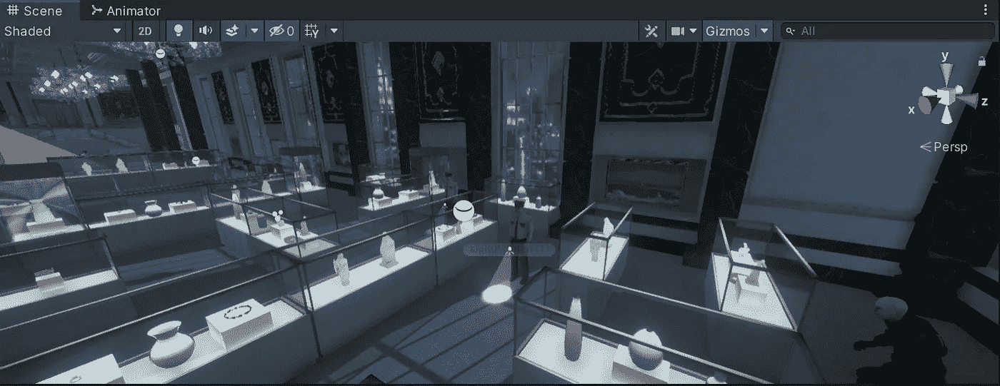

因此，为了启用查看 NPC 的能力，让我们从在各自的模型中创建一个空的子模型开始:

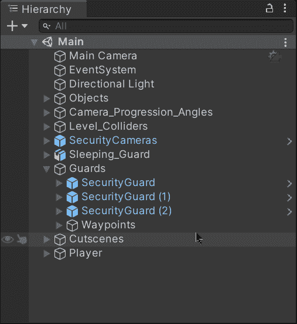

然后，让我们添加一个**碰撞器**(根据你的喜好)和一个**刚体**到空的游戏对象中。不要忘记:

*   启用碰撞器上的 ***是触发*** 属性
*   禁用刚体上的 ***使用重力*** 属性
*   启用刚体上的 ***是运动学*** 属性

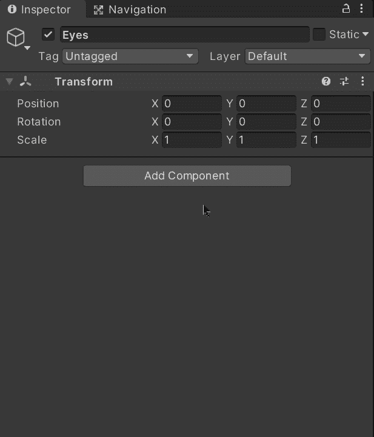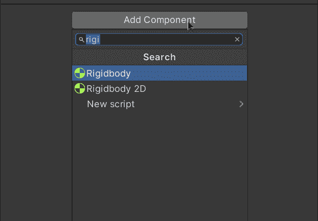

现在，让我们编辑碰撞器来表示 NPC 的视野，它将识别玩家:

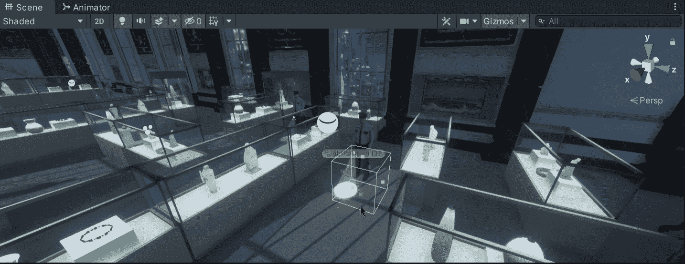

根据你想要的实现，你可以选择使用不同类型的碰撞器。在这种情况下，如果玩家通过每个守卫携带的手电筒的光来识别会更好，所以，我选择使用胶囊碰撞器，然后旋转游戏对象以尽可能匹配光线:

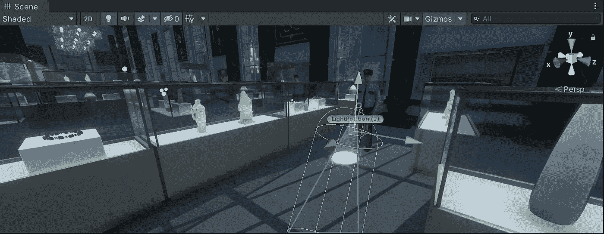

此外，当 NPC 模型边走边移动手电筒时，我用碰撞器拖动空游戏对象，使其成为手电筒游戏对象的子对象:

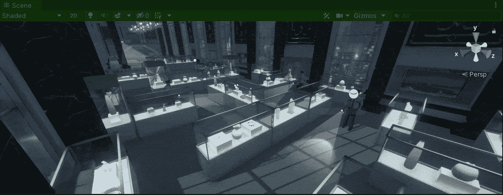

现在，让我们确保播放器也包含一个碰撞器，这样与守卫的光的碰撞就触发了我们需要的识别。别忘了启用 ***也是触发*** 属性:

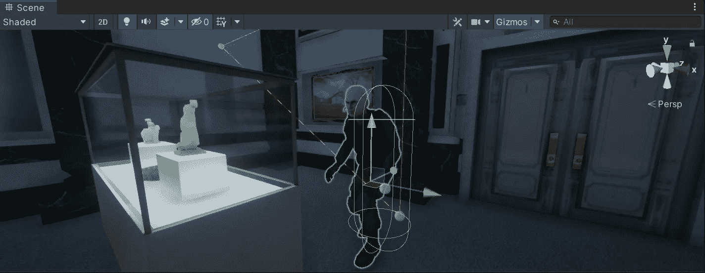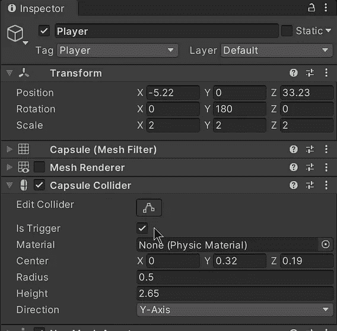

最后，让我们用碰撞器给空的游戏对象添加一个新的脚本，通过代码触发识别:

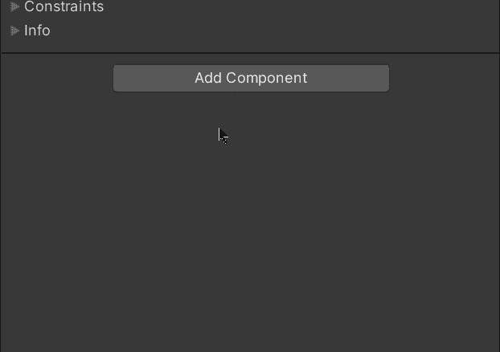

让我们打开脚本，我们只需要使用 **OnTriggerEnter** 方法来识别哪些碰撞器进入了手电筒碰撞器。为了识别玩家，我们需要**比较触发这个方法的碰撞器的标签**。因此，在这种情况下，让我们确保我们的播放器标记有 ***播放器*** 标签，如果是这种情况，让我们在控制台中调试一个简单的消息来验证冲突:

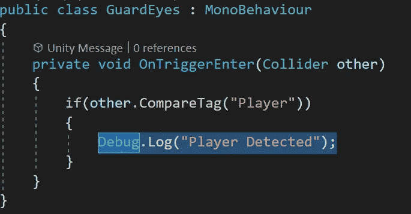

如果我们用 Unity 运行游戏，我们会注意到当光线与玩家碰撞时，我们的信息会显示在控制台上:

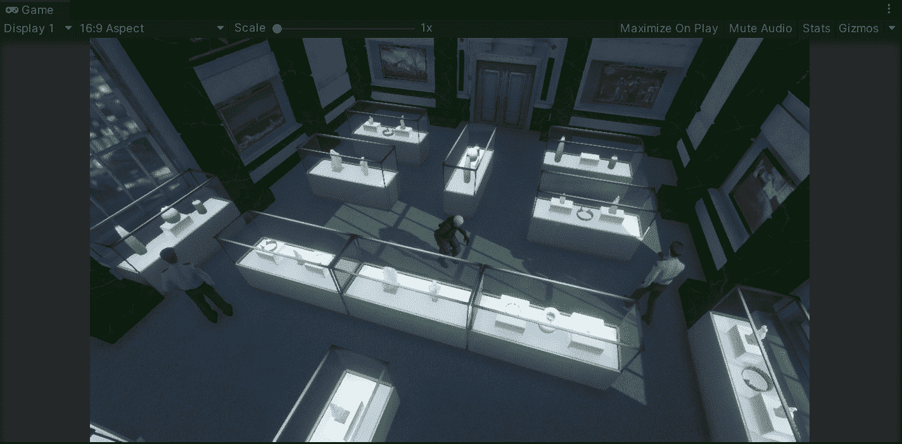

就这样，我们实现了一个系统，让人工智能在 Unity 中识别玩家！:d .下一篇文章再见，我将展示如何用 Unity 分散守卫的注意力。

> *如果你想更多地了解我，欢迎登陆*[***LinkedIn***](https://www.linkedin.com/in/fas444/)**或访问我的* [***网站***](http://fernandoalcasan.com/) *:D**