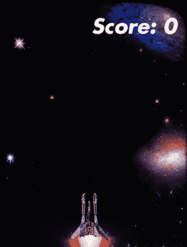
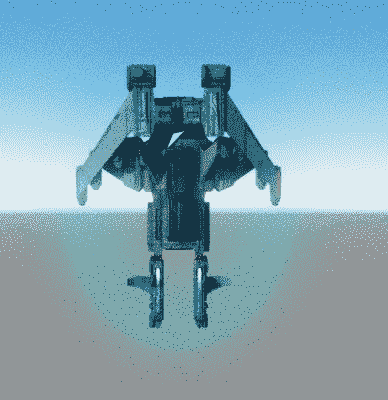
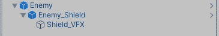
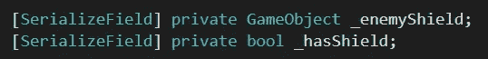
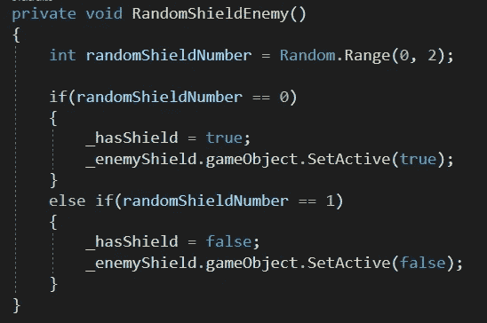
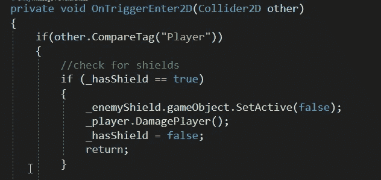
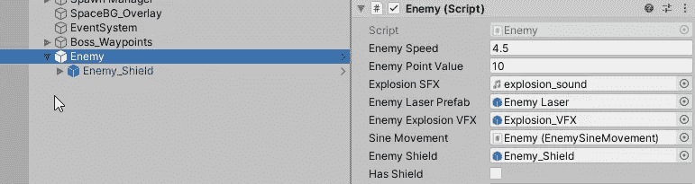

# 给随机的敌人盾牌

> 原文：<https://medium.com/nerd-for-tech/giving-random-enemies-shields-7da0b6131c5e?source=collection_archive---------23----------------------->

眼下，每个敌人都可以用**单发**消灭。虽然它很有趣，并满足了上帝情结，但让游戏变得更难会让它更有价值！尤其是在高压情况下。

在这篇文章中，我们将创建一些代码，让**给**敌人一个**护盾**，类似于我们玩家的护盾，但只能持续 **1 次额外射击**。

快速举例！

# 敌人的盾牌

敌人盾**使用与玩家盾**相同的精灵**，如果你愿意，你甚至可以给它另一种颜色。但是为了保持一致，我让它保持不变，但是把 **Alpha** 调小了一点，以显示它很弱(一击摧毁)。**

将此盾作为子盾附加，如同玩家盾一样。

# 剧本

启用和禁用护盾将会出现在我们的**敌方脚本**中。

首先我们将创建两个**变量**:

接下来，我们将创建一个新的**函数**为 0 或 1。如果是一个 **0** ，那么敌人会得到一个**盾**，如果是一个 **1** ，敌人会**而不是**。

然后在 **Start()** 调用这个函数:

现在我们可以更新我们的 **OnTriggerEnter2D** 逻辑来检查敌人是否有护盾:

当敌人被**激光**击中时也这样做！

并且一定要在**敌人检查员**中**链接**新的敌人盾牌，我们就都准备好了！

这不是一个太复杂的功能，但它增加了游戏，我不认为这是不合理的。像这样的小调整可以增加我们游戏的深度！

在下一篇文章中，我们将教我们的敌人在玩家靠得太近时变得更有侵略性！