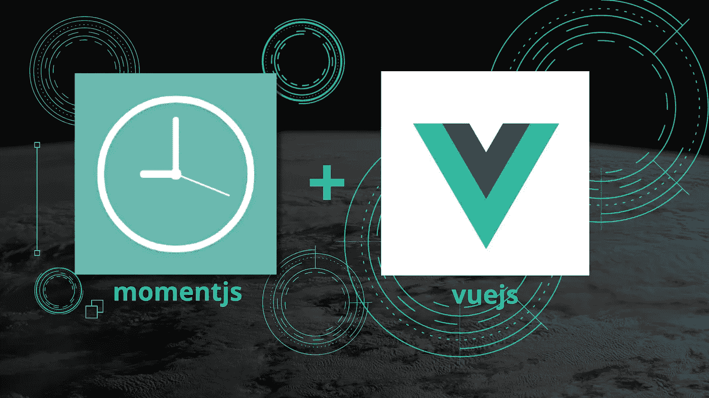

# 在 Vue3 中使用 MomentJs 的全局过滤器

> 原文：<https://medium.com/nerd-for-tech/global-filter-using-momentjs-in-vue3-513077700d5?source=collection_archive---------3----------------------->



本文演示了如何在您的 [**Vue3**](https://v3.vuejs.org/) 应用程序中为[](https://momentjs.com/)****时刻实现一个全局过滤器。本演示使用 Vue3 版本 **3.x******

****首先，我不会讨论如何使用 Vuejs 和 moment 开发您的应用程序。我想你已经知道该怎么做了。如果您不知道，我强烈建议您查看他们的文档。我提供了下面的链接。****

****[**vue js-渐进式 Javascript 框架指南**](https://v3.vuejs.org/guide/introduction.html)****

****也就是说，让我们开始有趣的部分。您应该按照文章中的步骤来实现类似的结果。****

# ****实施步骤****

*   ****将 [**momentjs**](https://momentjs.com/) 安装到你的 **package.json** 中****

```
**npm install moment --save**
```

*   ****将**时刻**导入到您的 **main.js** 文件****

```
**import moment from 'moment'**
```

*   ****检查您的配置是否是这样的，并将其注释掉****

```
**// createApp(App).use(router).use(store).mount(‘#app’)**
```

*   ****添加新配置****

```
**// createApp(App).use(router).use(store).mount('#app') // remember you already commented this out. *const* app = createApp(App)/*** *@params* {date} date to be converted to timeago* *@returns* returns timeAgo*/app.config.globalProperties.$filters = {timeAgo(*date*) {return moment(*date*).fromNow()},}app.use(router).use(store)app.mount('#app')**
```

*   ****新的配置与之前相同，只是添加了过滤器。****
*   ****要测试它，请尝试下面的代码****

```
**<p>{{ $filters.timeAgo(*Date*.now()) }}</p>
<!-- expected output :  a few seconds ago  -->**
```

*   ****请记住，您的过滤器是全球通用的****

****如果你得到同样的输出，恭喜🥳；如果没有，请重新执行您的步骤。****

****另外，我在下面提供了我的代码。****

# ******注******

> ****[时刻处于传统模式，现在处于维护模式。在大多数情况下，您应该选择不同的库。同样的逻辑也适用。](https://momentjs.com/)****

****如果有什么不清楚或者你有疑问，请告诉我。****

****感谢您的阅读。****

# ****了解更多信息****

****[](https://enlear.academy/nodejs-backpressuring-in-streams-52638f505e1b) [## 流中的节点背压

### 如何处理 NodeJS 可写可读流中的反压？

enlear .学院](https://enlear.academy/nodejs-backpressuring-in-streams-52638f505e1b) [](https://enlear.academy/types-of-react-hooks-best-practices-45c275b55b1f) [## React 挂钩的类型和最佳实践

### 不同的 React 挂钩和 React 挂钩最佳实践

enlear .学院](https://enlear.academy/types-of-react-hooks-best-practices-45c275b55b1f) [](https://enlear.academy/where-is-javascript-used-3e2bf02160fe) [## JavaScript 用在哪里？

### JavaScript 的 6 种常见用法

enlear .学院](https://enlear.academy/where-is-javascript-used-3e2bf02160fe)****