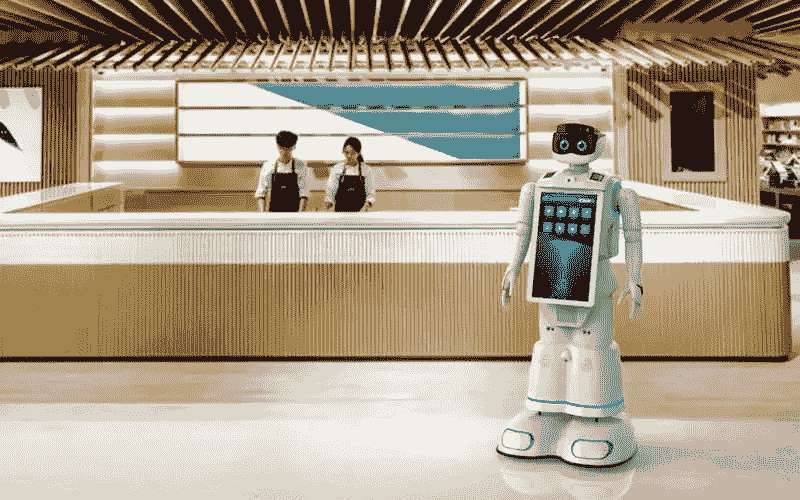

# 全球专业服务机器人市场交易额同比增长 12%

> 原文：<https://medium.com/nerd-for-tech/global-professional-service-robot-market-turnover-increased-by-12-year-on-year-d182ff380993?source=collection_archive---------4----------------------->

https://www.sohu.com/a/472694249_120542198

专业服务机器人市场 2021 年全球成交额达到 67 亿美元(样本法)，比 2020 年增长 12%。与此同时，新型消费服务机器人的营业额增长 16%，达到 44 亿美元。

目前，工业机器人可分为三类:协作型、移动式和特种。生产线上的自动化设备机器人是一个大类:所谓的协作机器人，包括自动化巡检、自动化机械手、与自动化设备的集成。

移动机器人可以从生产到物流进行分类——生产线和仓储的室内移动机器人属于一类，室外园区物流车属于另一类。特种机器人执行巡逻检查和绘图等功能。

**全球疫情的额外需求推动了专业服务机器人的五大应用趋势:**

1.三分之一的专业服务机器人是为货物运输而制造的。自主移动机器人(AMR)和送货机器人的营业额增长了 11%，超过 1 亿美元。销售的专业服务机器人大多在生产和仓库的室内环境下运行。

2.专业清洁机器人的需求增长了 92%，达到 3.44 万台。为了应对新冠肺炎疫情带来的日益增长的卫生要求，超过 50 家服务机器人供应商开发了喷洒消毒剂或使用紫外线灯的消毒机器人。预计 2021-2024 年，专业地面清洁机器人的销量将以年均两位数的速度增长。

3.从价值上看，2020 年医疗机器人销售额占专业服务机器人总营业额的 55%。主要是机器人手术设备推动了这一变化，营业额增长了 11%，达到 36 亿美元。

4.酒店机器人越来越普遍，营业额达到 2.49 亿美元。食品和饮料制备机器人的营业额几乎增加了两倍，达到 3200 万美元(+196%)。未来酒店机器人还有巨大的潜力。

5 用于家务劳动的服务机器人是商业机器人中最大的群体。2020 年，销售了近 1850 万台，价值 43 亿美元。

## 对数据标签的需求持续增长

从人工智能技术的研究方向来看，无论是在传统机器学习领域还是深度学习领域，基于训练数据的**监督学习仍然是一种主要的模型训练方法**。尤其是在深度学习领域，需要更多的标记数据来提高模型的有效性。

## 定制数据集

随着 AI 商业化进程的加快和 AI 技术在各行各业的应用，人们对特殊场景下的数据质量的期望越来越高。高质量的标签数据将是人工智能公司的核心竞争力之一。

如果说之前的算法模型使用的一般数据集是粗粮，那么算法模型目前需要的是定制的营养餐。如果公司想要进一步提高某些模型的商业化，他们必须逐步从通用数据集向前发展，以创建独特的数据集。

# 结束

将您的数据标注任务外包给[字节桥](https://tinyurl.com/54h53br8)，您可以更便宜、更快速地获得高质量的 ML 训练数据集！

*   无需信用卡的免费试用:您可以快速获得样品结果，检查输出，并直接向我们的项目经理反馈。
*   100%人工验证
*   透明标准定价:[有明确定价](https://www.bytebridge.io/#/?module=price)(含人工成本)

为什么不试一试呢？

https://www.robot-china.com/news/202111/09/68202.html