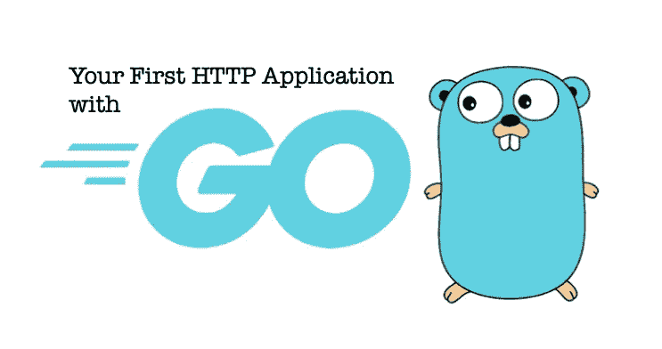

# 跟我来:构建一个简单的 Web 应用程序

> 原文：<https://medium.com/nerd-for-tech/go-with-me-build-a-simple-web-app-92deb1e5d4b9?source=collection_archive---------3----------------------->

## 学习围棋系列文章的第 5 部分！

在本文中，让我们构建一个简单的小型 Go web 应用程序，并应用我们到目前为止所学的所有知识。

# 预热:HTTP 服务器

让我们先构建一个简单的 HTTP 服务器，先预热一下，并向您展示在 Go 中创建一个 HTTP 服务器是多么容易。