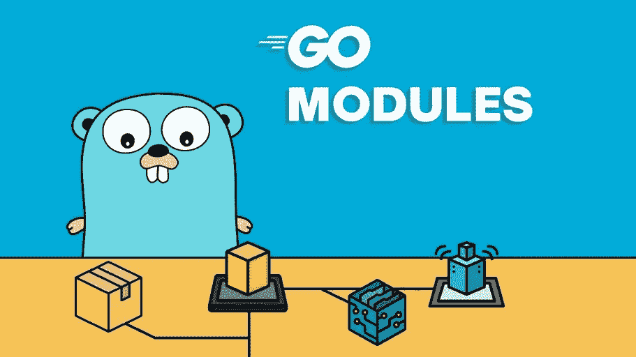

# 跟我走:去模块深潜

> 原文：<https://medium.com/nerd-for-tech/go-with-me-go-module-deep-dive-693deeebae6a?source=collection_archive---------4----------------------->

## 学习围棋系列文章的第 5 部分！

图片来自[阿列克谢·洛扎达](https://www.youtube.com/watch?v=NCAIhepJgr0)

在这篇文章中，让我们探索一下`Go Module`，它的概念，如何使用它以及它背后的原理。

从我之前的文章中，我们知道一个 Go 程序是由 Go 包组成的。构建 Go 程序的过程就是确定包版本，编译包，链接…